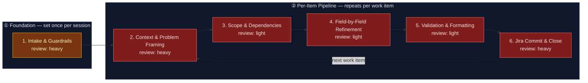

# AI-Augmented Refinement — Jira Work Item Pipeline

This flowspace produces high-quality, Jira-ready work items through disciplined,
step-by-step refinement with explicit confirmation and accountability at every
field boundary. The pipeline enforces the Technical Product / Service Owner
(TPSO) persona — prioritizing business and operational value, identifying risks
and dependencies, challenging incomplete requirements, and enforcing measurable
outcomes across the enterprise network infrastructure domain.

One run = one fully refined work item committed to Jira.

## Stage Flow Diagram

> All per-item stages (2–6) are colored `gap` (rose) because their supporting
> skills do not yet exist in the skill-foundry. Stage 1 is `heavy` (amber)
> because its logic is fully covered by the reference material (guardrails +
> triggers defined in the source doc). Once each skill lands and passes its
> 5-point review gate, the corresponding node reverts to its true review-
> intensity color (heavy = amber, light = blue).

## Stage Table

| # | Stage | Review intensity | Max data-class | Sanctioned engines | Layer-3 status |
|---|---|---|---|---|---|
| 1 | Intake & Guardrails | heavy | internal | Rovo, Copilot | **reference** — guardrails, triggers, responsibility notice defined in source doc |
| 2 | Context & Problem Framing | heavy | internal | Rovo, Copilot | **TBD — brief filed** (`skill-context-elicitation`) |
| 3 | Scope & Dependencies | light | internal | Rovo, Copilot | **TBD — brief filed** (`skill-scope-dependency-mapper`) |
| 4 | Field-by-Field Refinement | light | internal | Rovo, Copilot | **TBD — brief filed** (`skill-field-refinement-cadence`) |
| 5 | Validation & Formatting | light | internal | Rovo, Copilot | **TBD — brief filed** (`skill-workitem-validation`) |
| 6 | Jira Commit & Close | heavy | internal | Rovo, Copilot | **TBD — brief filed** (`skill-jira-commit`) |

## Topology

- **Band ①  Foundation** (Stage 1): Set once per refinement session. The user
  triggers refinement, acknowledges responsibility, confirms data-safety
  guardrails, and selects the work-item type from the hierarchy.
- **Band ②  Per-Item Pipeline** (Stages 2–6): Repeats for each work item in
  the session. A run through this band takes one work item from raw context to
  a committed Jira issue. The loop-back from Stage 6 to Stage 2 fires when the
  user says "refine another item."

## Surface Mapping

- **Primary:** Confluence — `NAE` space (or personal space, TBD at publish)
- **Mirror:** `RafySauce/flow-lab` → `flowspaces/ai-refinement/`

## How a Run Works

1. The user speaks a trigger phrase ("Run AI Refinement", "Start Refinement",
   "I want to refine").
2. Stage 1 activates: guardrails are presented, responsibility is acknowledged,
   and the user picks a work-item type from the hierarchy
   (Portfolio Epic → Solution Epic → Feature → Story | Task | Spike → Sub-Task).
3. Stages 2–5 walk the user through the selected work-item schema one field at
   a time, confirming each before advancing. The TPSO persona challenges
   incomplete requirements and enforces measurable outcomes throughout.
4. Stage 5 validates completeness against the schema and applies formatting
   rules (no bold, no emojis).
5. Stage 6 presents the finished artifact for final human approval, then
   commits it to Jira. The user may loop back to Stage 2 for the next item
   or end the session.

Human inspects at every stage boundary — that's the method, not an
inconvenience.

## Skill Demand (filed from Layer-3 triage)

| Skill primer-brief ID | Target stage | Status |
|---|---|---|
| `skill-context-elicitation` | 2 | draft — to be filed |
| `skill-scope-dependency-mapper` | 3 | draft — to be filed |
| `skill-field-refinement-cadence` | 4 | draft — to be filed |
| `skill-workitem-validation` | 5 | draft — to be filed |
| `skill-jira-commit` | 6 | draft — to be filed |

## Reference Material (Layer-3)

| Artifact | Location | Covers |
|---|---|---|
| AI-Refinement-Hybrid.md | source doc (uploaded) | Guardrails, persona, hierarchy, schemas, workflow cadence, triggers |
| Provenance spec | `methodology/provenance-spec.md` | Frontmatter rules for all artifacts |
| Governance & Audit | `methodology/governance-and-audit.md` | Gate requirements |
