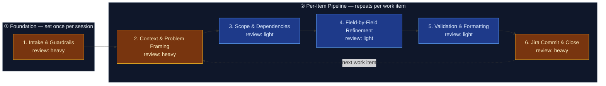

# AI-Augmented Refinement — Jira Work Item Pipeline

This flowspace produces high-quality, Jira-ready work items through disciplined,
step-by-step refinement with explicit confirmation and accountability at every
field boundary. The pipeline enforces the Technical Product / Service Owner
(TPSO) persona — prioritizing business and operational value, identifying risks
and dependencies, challenging incomplete requirements, and enforcing measurable
outcomes across the enterprise network infrastructure domain. Requirements are
grounded in the platform stakeholder register: every work item is tagged with
the stakeholders whose needs define it, the coalition it satisfies, and the
conflict axis it triggers (see `reference/platform-stakeholder-register.md`).

One run = one fully refined work item committed to Jira.

## Stage Flow Diagram

> Stages 2–6 carry their true review-intensity colors: each stage's skill now
> exists as an authored spec in `skill-foundry/backlog-skill-starters/` at
> `truth-level: to-review`. None is `verified` yet — the five-point review gate
> (live test per adapter, trigger check, collision check) and promotion to
> `completed-skills/` remain the operator's call. See Known gaps.

## Stage table

| # | Stage | Review intensity | Max data-class | Sanctioned engines | Layer-3 |
|---|---|---|---|---|---|
| 1 | Intake & Guardrails | heavy | internal | Rovo, Copilot | inline — guardrails, persona, schemas transcribed from `reference/ai-refinement-hybrid.md` |
| 2 | Context & Problem Framing | heavy | internal | Rovo, Copilot | `context-elicitation` (to-review, skill-foundry backlog) |
| 3 | Scope & Dependencies | light | internal | Rovo, Copilot | `scope-dependency-mapper` (to-review, skill-foundry backlog) |
| 4 | Field-by-Field Refinement | light | internal | Rovo, Copilot | `field-refinement-cadence` (to-review, skill-foundry backlog) |
| 5 | Validation & Formatting | light | internal | Rovo, Copilot | `workitem-validation` (to-review, skill-foundry backlog) |
| 6 | Jira Commit & Close | heavy | internal | Rovo, Copilot | `jira-commit` (to-review, skill-foundry backlog) |

## Topology

- **Band ① Foundation** (Stage 1): Set once per refinement session. The user
  triggers refinement, acknowledges responsibility, confirms data-safety
  guardrails, and selects the work-item type from the hierarchy.
- **Band ② Per-Item Pipeline** (Stages 2–6): Repeats for each work item in
  the session. A run through this band takes one work item from raw context to
  a committed Jira issue. The loop-back from Stage 6 to Stage 2 fires when the
  user says "refine another item."

## Surfaces

- **Primary:** Confluence — `<space set at instantiation; confirm the Mermaid
  macro is installed per the setup questionnaire, else the hub page notes
  "diagram: see mirror">`
- **Mirror:** `<internal repo>` → `flowspaces/ai-refinement/`

This public copy is the sanitized *design*; instantiation happens in employer
tenancy per `methodology/mirroring-protocol.md`. At instantiation, add the
per-stage `work/` folders (Layer-4, transient) and the `handoffs/` folder —
they are deliberately absent from this design copy because they only ever hold
per-run content.

## Run procedure

1. The user speaks a trigger phrase ("Run AI Refinement", "Start Refinement",
   "I want to refine").
2. Stage 1 activates: guardrails are presented, responsibility is acknowledged,
   and the user picks a work-item type from the hierarchy
   (Portfolio Epic → Solution Epic → Feature → Story | Task | Spike → Sub-Task).
3. Stages 2–5 walk the user through the selected work-item schema one field at
   a time, confirming each before advancing. The TPSO persona challenges
   incomplete requirements and enforces measurable outcomes throughout; the
   stakeholder register drives whose needs are elicited (Stage 2) and which
   coalition/conflict-axis annotations the item carries (Stage 3).
4. Stage 5 validates completeness against the schema and applies formatting
   rules (no bold, no emojis).
5. Stage 6 presents the finished artifact for final human approval, then
   commits it to Jira. The user may loop back to Stage 2 for the next item
   or end the session.

Human inspects at every stage boundary — that's the method, not an
inconvenience.

## Known gaps

All five skills demanded by this flowspace's Layer-3 triage have been authored
and staged in `skill-foundry/backlog-skill-starters/` at `truth-level:
to-review`. Remaining gap: none is human-promoted — each awaits the skill
foundry's five-point review gate and operator placement in `completed-skills/`.

| Skill (spec + adapters) | Primer brief | Target stage | Status |
|---|---|---|---|
| `context-elicitation` | `sp-context-elicitation` | 2 | built — to-review |
| `scope-dependency-mapper` | `sp-scope-dependency-mapper` | 3 | built — to-review |
| `field-refinement-cadence` | `sp-field-refinement-cadence` | 4 | built — to-review |
| `workitem-validation` | `sp-workitem-validation` | 5 | built — to-review |
| `jira-commit` | `sp-jira-commit` | 6 | built — to-review |

## Reference material (Layer-3)

| Artifact | Location | Covers |
|---|---|---|
| AI Refinement — Hybrid Definition | `reference/ai-refinement-hybrid.md` (claimed clipping) | Guardrails, persona, hierarchy, schemas, workflow cadence, triggers |
| Platform Stakeholder Register | `reference/platform-stakeholder-register.md` (claimed clipping) | Stakeholder role-types, coalitions, conflict axes, escalation routing |
| Provenance spec | `methodology/provenance-spec.md` | Frontmatter rules for all artifacts |
| Governance & Audit | `methodology/governance-and-audit.md` | Gate requirements |
