# Flow Foundry — Architecture

> How a flow-primer-brief (or foreign workflow material) becomes a house-standard flowspace in `../icp-flows/` — and how a stage that needs a skill that doesn't exist yet reaches across to the skill-foundry without blocking. `foundry-spec.md` is the prose method (§1–§7); `CONTEXT.md`'s "queue model" sketches the folder-level motion; this is the first Mermaid rendering of the foundry's own build logic, pulled up from prose into a diagram the way `references/flow-diagram-guide.md` already requires of every flowspace the foundry *produces*.

This isn't a new invention — every step below is named in `foundry-spec.md` §1–§5. What's new here is drawing it: one build sequence, one house palette, gate-checked the same way a flowspace's own Stage Flow Diagram is. The downstream resolution of a filed skill gap — triage, author, adapt, review, promote — is `skill-foundry-architecture.md`'s own diagram to own; this doc points to it rather than redrawing it, so there's one source of truth per foundry.

## The build

```mermaid
flowchart LR
    Start(["Trigger: flow-primer-brief,<br/>foreign workflow material,<br/>or bare conversation"]):::start --> Confirm["Step 0 — Confirm invocation<br/>(operator go-ahead)"]:::process
    Confirm --> Triage{"Triage: primer-brief /<br/>foreign / not-worthy /<br/>bare?"}:::decision

    Triage -->|"Not flowspace-worthy"| Drop["Say so; route to<br/>skill-foundry or drop<br/>(logged)"]:::halt
    Triage -->|"Foreign material"| Vet{"Vet: provenance,<br/>maintenance, license,<br/>security"}:::decision
    Vet -->|"Fail"| DropV["Drop, logged reason —<br/>never laundered"]:::halt
    Vet -->|"Pass"| Setup
    Triage -->|"Clean primer-brief<br/>or bare (backfill)"| Setup["Setup Questionnaire<br/>(9 questions)"]:::process

    Setup --> Scaffold["Scaffold: HUB.md +<br/>numbered stage folders,<br/>each with CONTEXT.md"]:::process
    Scaffold --> L3{"Layer-3 status,<br/>per stage?"}:::decision
    L3 -->|"Existing skill"| Ref["Reference it<br/>(Layer-3: skill-id)"]:::process
    L3 -->|"One-off logic"| Inline["Inline in the stage's<br/>Process field"]:::process
    L3 -->|"Genuine gap"| Brief["Draft skill-primer-brief"]:::process
    Brief --> SFB[/"files into skill-foundry/<br/>backlog-skill-starters/"/]:::process

    Ref --> Stage(["Staged: review-flowspaces/<br/>(to-review)"]):::output
    Inline --> Stage
    Brief --> Stage

    Stage --> Gate{"3 gates pass?<br/>(structural, Layer-3<br/>declared, human dry-run)"}:::decision
    Gate -->|Yes| Done(["Verified flowspace in<br/>../icp-flows/"]):::output
    Gate -.->|No| Revise["Revise & re-stage"]:::process
    Revise -.-> Gate

    SFB -.->|"skill graduates — see<br/>skill-foundry-architecture.md"| Ref

    classDef start fill:#1e293b,stroke:#94a3b8,color:#f1f5f9
    classDef process fill:#1e3a8a,stroke:#60a5fa,color:#dbeafe
    classDef decision fill:#78350f,stroke:#fbbf24,color:#fef3c7
    classDef output fill:#14532d,stroke:#4ade80,color:#dcfce7
    classDef halt fill:#7f1d1d,stroke:#f87171,color:#fee2e2
```

**Legend:** slate = trigger · blue = an ordinary build step (subroutine shape for the two steps that hand off to another folder) · amber = a genuine branch (triage, vetting, per-stage Layer-3 status, the 3-gate check) · rose = a drop path · green = the flowspace's own terminal states. Same house node-role palette as `references/flow-diagram-guide.md` and the sibling `skill-foundry/skill-foundry-architecture.md` — the review-intensity palette (`heavy`/`light`/`gap`) that guide defines is for diagramming a flowspace's *internal* stage sequence once built; this diagram is one level up, showing the foundry's own build logic, so it borrows the node-role shape/color vocabulary (`start`/`process`/`decision`/`output`/`halt`) instead — the same choice `skill-foundry-architecture.md` makes for symmetry between the two.

**Reading the loop:** a stage that needs a skill that doesn't exist doesn't block the flowspace — it drafts a `skill-primer-brief`, files it into `../skill-foundry/backlog-skill-starters/`, and the flowspace still proceeds to `review-flowspaces/` with that stage's Layer-3 slot marked `TBD — brief filed (<brief-id>)`. When the skill later graduates (skill-foundry's own gate, not this one), it gets wired back in as the real `Layer-3: <skill-id>` reference — the dashed edge back to `Ref`. The `Vet` branch is shared machinery: `templates/intake-vetting-checklist.md` is explicit that a failed check means drop, logged — never "build it anyway and clean up later" — and that checklist is the same one `skill-foundry-architecture.md`'s `Vet` node runs.

## Where this connects

| Entry / exit | Is the same node as |
|---|---|
| `SFB` — files into skill-foundry backlog | `skill-foundry-architecture.md`'s `Start` node (the "flow-foundry's Layer-3 gap triage" origin named in `skill-foundry/foundry-spec.md` §1.1) |
| `Ref` (post-graduation) | `skill-foundry-architecture.md`'s `External` node — a promoted skill referenced back as Layer-3 |
| `Vet` | `skill-foundry-architecture.md`'s `Vet` node — same shared checklist, same pass/fail contract |
| `Done` — verified flowspace | `README.md`'s "The two foundries" diagram, and the row the operator adds to `../icp-flows/CONTEXT.md`'s catalog table |

## Sources

`foundry-spec.md` §1–§7 · `CONTEXT.md` (queue model, layout) · `templates/intake-vetting-checklist.md` · `templates/validation-checklist.md` · `references/flow-diagram-guide.md` (palette convention, referenced not redrawn) · `skill-foundry/skill-foundry-architecture.md` (referenced, not redrawn)
