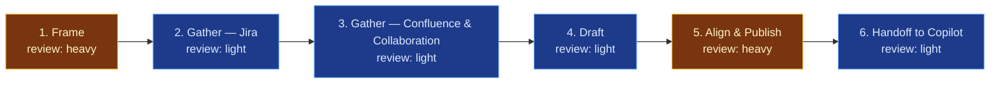

# Accomplishments Digest — Jira & Confluence Performance-Review Prep

This flowspace turns a review period's worth of Jira and Confluence activity into
a single, readable accomplishments document an engineer can hand to their
manager. It exists because the raw material — closed tickets, authored docs,
review comments — is scattered, ticket-shaped, and easy to under-sell; the
flow's job is to gather it faithfully, reframe it in outcome terms grouped by
theme, and carry the engineer's own read on impact rather than substitute an
agent's guess for it. One run = one finished document for one review cycle.

## Stage Flow Diagram

> Stages 2, 3, and 4 are colored by their intended `light` review intensity, not
> `gap` — the skills they lean on are flagged Layer-3 gaps (briefs filed, not yet
> built) rather than missing entirely. See Known gaps. The diagram keeps the
> flat-chain convention (`references/flow-diagram-guide.md` — no branching
> without a documented topology split) even though Stage 6 is optional in
> practice: Stage 5's publish is already the flow's complete, terminal
> artifact, and Stage 6 only runs when the engineer also wants the
> Copilot-produced, stylized Word version. Optionality is documented in the
> Stage table and Stage 6's own `CONTEXT.md`, not encoded as a diagram branch.

## Stage table

| # | Stage | Review intensity | Max data-class | Sanctioned engines | Layer-3 |
|---|---|---|---|---|---|
| 1 | Frame | heavy | internal | Rovo, Copilot | inline — human judgment, no skill |
| 2 | Gather — Jira | light | internal | Rovo | `sp-jira-accomplishments-gatherer` (gap — brief filed) |
| 3 | Gather — Confluence & Collaboration | light | internal | Rovo | `sp-confluence-contribution-gatherer` (gap — brief filed) |
| 4 | Draft | light | internal | Rovo, Copilot | `sp-accomplishments-drafter` (gap — brief filed) |
| 5 | Align & Publish | heavy | internal | Rovo, Copilot | inline — human judgment, no skill |
| 6 | Handoff to Copilot (optional) | light | internal | Rovo | inline — see `reference/handoff-to-copilot-template.md` |

## Surfaces

- **Primary:** `<Confluence space set at instantiation>` — an `Accomplishments`
  page tree, one page per review cycle per engineer. Confirm the Mermaid macro
  is installed in the target space before this diagram ships to the Confluence
  primary; absent that, the page notes "diagram: see mirror."
- **Mirror:** `<internal repo>` → `flows/accomplishments-digest/`.

This public copy is the sanitized *design*; instantiation happens in employer
tenancy per `methodology/mirroring-protocol.md`. At instantiation, add the
per-stage `work/` folders (Layer-4, transient, one set per review cycle) and
the `handoffs/` folder — deliberately absent here since they only ever hold
per-run content.

## Run procedure

The engineer starts a run ahead of a scheduled review. Stage 1 sets the period,
audience, and the engineer's own framing of what mattered — this is the
heaviest-judgment stage and the one place the agent should ask more than it
tells. Stages 2 and 3 gather in parallel or in sequence (no dependency between
them) against the period Stage 1 set, each landing a theme-grouped, outcome-
framed digest rather than a raw activity list. Stage 4 synthesizes the two
digests with Stage 1's narrative into the house document shape. Stage 5 is the
engineer's own edit pass against their Stage 1 framing before anything is
shared — human inspects at every stage boundary, and this boundary in
particular is the one that keeps the document from reading as AI-generated
ticket-listing rather than the engineer's own account of their work. Stage 5's
published document is the flow's complete, terminal artifact. If the engineer
also wants a stylized Word version — for a promo packet, or a manager who
wants a polished document rather than a Confluence page — Stage 6 packages
that same published, approved document as a handoff (never the pre-review
Stage 4 draft) and hands it to the companion `accomplishments-docx-finisher`
flowspace, which enriches presentation only and ends with its own heavy
human-review stage before that version is shared.

## Known gaps

Three skills built from this flowspace's Layer-3 triage, all
`truth-level: to-review` and staged in `skill-foundry/review-skills/`,
awaiting the operator's five-point promotion gate (`skill-foundry/foundry-
spec.md` §5) before they land in `produced-skills/`:

| Skill (gap) | Primer brief | Target stage | Status |
|---|---|---|---|
| Jira accomplishments gatherer | `sp-jira-accomplishments-gatherer` | 2 | built, staged in `review-skills/jira-accomplishments-gatherer/` — awaiting promotion |
| Confluence contribution gatherer | `sp-confluence-contribution-gatherer` | 3 | built, staged in `review-skills/confluence-contribution-gatherer/` — awaiting promotion |
| Accomplishments drafter | `sp-accomplishments-drafter` | 4 | built, staged in `review-skills/accomplishments-drafter/` — awaiting promotion |

Until these are promoted to `produced-skills/`, Stages 2–4 still run as
manual/ungrounded conversation against these contracts in practice — staging
closes the build gap, not the deployment gap. See
`skill-foundry/decision-log/2026-07-14-accomplishments-digest-skill-batch.md`
and its companion gate-pre-run entry for what's built and simulation-tested
so far. Second gap: the primer brief's own open question about per-tenant
activity-history depth (comment/review visibility) is now operationalized as
a one-time-per-tenant probe at
`reference/confluence-activity-history-capability-check.md`, rather than a
standing unknown — Stage 3's contract and the gatherer skill both already
implement all three of that checklist's fallback modes; the checklist just
tells the operator which mode a given tenant is actually in.

Third gap (2026-07-08, 1.0 → 1.1 revision): Stage 6 (Handoff to Copilot) added
on operator instruction — a second output artifact was requested: the
Confluence-published document handed off to a companion, Copilot-primary
flowspace (`accomplishments-docx-finisher`, staged alongside this one in
`review-flowspaces/`) that adds repo/file-context enrichment and produces a
final, stylized Word document. Stage 6 is `Layer-3: inline`, not a skill gap,
per its `CONTEXT.md`; the receiving flowspace carries its own two skill gaps.
Rationale: `decision-log/2026-07-08-copilot-handoff-revision.md`.

## Reference material (Layer-3)

| Artifact | Location | Covers |
|---|---|---|
| Flow Primer Brief | `../../backlog-flow-starters/fp-accomplishments-digest.md` | Original crystallized intent this flowspace was built from |
| Handoff Template | `reference/handoff-to-copilot-template.md` | Flow-specific instantiation of the mirroring-protocol §5 handoff shape, for Stage 6 |
| Confluence Activity-History Capability Check | `reference/confluence-activity-history-capability-check.md` | One-time-per-tenant probe resolving Stage 3's flagged capability check |
| Companion flowspace | `../accomplishments-docx-finisher/HUB.md` | Receives Stage 6's handoff; produces the stylized Word document |
| Provenance spec | `methodology/provenance-spec.md` | Frontmatter rules for all artifacts |
| Governance & Audit | `methodology/governance-and-audit.md` | Gate requirements |
| Mirroring Protocol | `methodology/mirroring-protocol.md` | Handoff artifact shape (§5) this flowspace's Stage 6 follows |
