# STATIK Adoption — Evidence-Grounded Kanban System Design

This flowspace designs a Kanban system *for one named service* by working
through STATIK — the Systems Thinking Approach To Introducing Kanban — with the
service's own Jira board supplying the evidence wherever evidence exists, and
structured conversation supplying it wherever it does not. One run = one
service's Kanban system design, socialized and agreed, ready for a human to
configure.

It replaces the template rollout (copying another team's columns and WIP limits,
producing a system nobody designed for a demand nobody measured) and the unaided
STATIK workshop (answering demand and capability from memory in a room, when the
board already holds the real arrival rates and the real lead-time distribution).

The governing principle, which every stage restates in its own terms: **board
evidence proposes, humans ratify.** A Jira board is an artifact of how a team was
once told to track work — strong evidence about the system, and a poor
description of it. Every board-derived finding arrives as a proposal with its
derivation shown, and a human accepts, amends, or rejects it before it becomes a
design input. Each stage names its own version of the trap this guards against:
issue types are not work item types (Stage 03), statuses are not
knowledge-discovery activities (Stage 05), the priority field is not a class of
service (Stage 06).

**Conversation-only is a supported path, not a failure mode.** STATIK predates
and does not require a ticketing system. A service with no board, a board too
young to carry history, or a team whose board does not reflect how they actually
work all run the full method — Stage 01 declares per STATIK step which are
evidence-grounded and which are conversation-only, and that declaration travels
with the run so no later stage claims empirical support it does not have.

## Stage Flow Diagram

```mermaid
flowchart LR
    S1["1. Service Framing &amp;<br/>Source Binding<br/>review: heavy"]:::heavy
    S2["2. Sources of<br/>Dissatisfaction<br/>review: heavy"]:::gap
    S3["3. Demand Analysis<br/>review: light"]:::gap
    S4["4. Capability Analysis<br/>review: light"]:::gap
    S5["5. Workflow Modeling<br/>review: heavy"]:::gap
    S6["6. Classes of Service<br/>review: light"]:::gap
    S7["7. Kanban System Design<br/>review: light"]:::gap
    S8["8. Socialization &amp;<br/>Rollout<br/>review: heavy"]:::heavy

    S1 --> S2 --> S3 --> S4 --> S5 --> S6 --> S7 --> S8

    classDef heavy fill:#78350f,stroke:#fbbf24,color:#fef3c7
    classDef light fill:#1e3a8a,stroke:#60a5fa,color:#dbeafe
    classDef gap   fill:#7f1d1d,stroke:#f87171,color:#fee2e2
```

> Stages 2–7 carry the `gap` color because their Layer-3 skills are built but
> **not promoted** — all six are staged at `truth-level: to-review` in
> `skill-foundry/review-skills/`, awaiting the five-point gate. Per the
> diagram guide, `gap` overrides the review-intensity color on the diagram
> while the Stage table below carries the real intensity. When the operator
> promotes the six skills, these nodes take their true colors: S2 and S5
> `heavy`, S3/S4/S6/S7 `light`.

## Stage table

| # | Stage | Review intensity | Max data-class | Sanctioned engines | Layer-3 |
|---|---|---|---|---|---|
| 1 | Service Framing & Source Binding | heavy | internal | Rovo, Copilot | `jira-portfolio-ingest` (promoted, `produced-skills/`) for board binding + inline service framing and fitness-criteria elicitation |
| 2 | Sources of Dissatisfaction | heavy¹ | internal | Rovo, Copilot | `fitness-and-dissatisfaction-profiler` (to-review, `skill-foundry/review-skills/`) |
| 3 | Demand Analysis | light | internal | Rovo, Copilot | `demand-profiler` (to-review, `skill-foundry/review-skills/`) |
| 4 | Capability Analysis | light | internal | Rovo, Copilot | `flow-capability-analyzer` (to-review, `skill-foundry/review-skills/`) |
| 5 | Workflow Modeling | heavy² | internal | Rovo, Copilot | `workflow-modeler` (to-review, `skill-foundry/review-skills/`) |
| 6 | Classes of Service | light | internal | Rovo, Copilot | `class-of-service-designer` (to-review, `skill-foundry/review-skills/`) |
| 7 | Kanban System Design | light | internal | Rovo, Copilot | `kanban-system-designer` (to-review, `skill-foundry/review-skills/`) |
| 8 | Socialization & Rollout | heavy | internal | Rovo, Copilot | inline (one-off) — structure in `reference/rollout-and-socialization-guide.md` |

¹ **Breaks the U-curve default with cause.** Every fitness criterion the rest of
the flow measures against originates here. A missed source of dissatisfaction is
not recoverable downstream: Stage 04 will faithfully measure the wrong thing and
report a healthy system.

² **Breaks the U-curve default with cause.** The commitment point is a judgment
call that silently redefines every lead-time number Stage 04 produced, and no
downstream stage can detect that it was set wrong. The board's configured
statuses are one team's historical guess at the workflow, not the workflow.

## Iteration

STATIK is explicitly iterative — later steps routinely invalidate earlier ones,
and that is the method working, not the flow failing. Three loop-backs are
expected often enough to be named rather than discovered:

| From | Back to | Trigger |
|---|---|---|
| 4 | 3 | Capability analysis shows a "type" has two clearly different lead-time distributions — it was really two types |
| 5 | 4 | The ratified commitment point differs from the one Stage 04 assumed, so every lead-time figure needs recomputing from the new start |
| 6 | 2 | A dissatisfaction source has no class of service that would address it — the elicitation missed something, or the source is not about flow at all |

A loop-back re-runs the target stage and every stage after it. It does **not**
silently patch the earlier stage's output in place: the superseded version stays
in the run record with the reason it was superseded, because the Stage 08
conversation routinely turns on "why did this change." Stage 01's mode
declaration and each stage's Verify field are what make a loop-back safe to take.

The diagram shows the forward path only. Loop-backs are conditional and
evidence-driven rather than structural, so per the diagram guide's discipline
they are documented here instead of drawn as edges.

## Source-repo

- **Source-repo:** `<internal GitLab repo>` → `flowspaces/statik-adoption/` —
  set at instantiation, the sole source of truth for the instance.
- **External systems read:** Jira — one board, project, or filter per run,
  read-only, via the engine's native Jira capability (Stage 01 binds it; Stages
  03–05 read the bound set). Confluence read-only where the service already has
  documented SLAs or service definitions that bear on fitness criteria (Stage
  01–02, optional).
- **External systems written:** none. This flow produces a *design*; a human
  configures the board. Publishing the finished design to Confluence at Stage 08
  is a human act, deliberately outside the flow's write boundary.

This public copy is the sanitized *design*; instantiation happens in employer
tenancy per `methodology/mirroring-protocol.md`. At instantiation, add the
per-stage `work/` folders (Layer-4, transient) and the `handoffs/` folder — they
are deliberately absent from this design copy because they only ever hold
per-run content.

## Run procedure

1. A service owner, delivery manager, or coach opens a Kanban design cycle for
   **one named service** and speaks a trigger phrase ("run STATIK," "let's
   design a Kanban system for this service," "I want to introduce Kanban here").
2. **Stage 01** names the service, its customers, and its boundaries; binds the
   run to live Jira, an export, or conversation-only; screens data class; and
   inventories which fields and which history are actually available. It then
   elicits fitness criteria (STATIK step 1) and emits the **mode declaration** —
   per STATIK step, evidence-grounded or conversation-only — which travels with
   the run. Stage 01 halts if the bound board serves more than one service:
   two services are two runs.
3. **Stage 02** elicits dissatisfaction, internal and external kept separate,
   each attributed to a source rather than a person and each connected to the
   fitness criterion it threatens.
4. **Stages 03–04** measure the system: what arrives (demand) and how well it is
   delivered (capability), per work item type, against Stage 02's criteria.
   Board-derived where the mode declaration says so, elicited where it does not.
5. **Stage 05** models the workflow as knowledge-discovery activities, separates
   activities from queues, and sets the commitment and delivery points — the
   flow's highest-judgment boundary.
6. **Stages 06–07** design the system: classes of service with capacity
   allocation and per-class policy, then the board, WIP limits, ticket design,
   explicit policies, cadences, and metrics — every element traced to the
   evidence that motivated it.
7. **Stage 08** socializes the design with each stakeholder group from their own
   point of view, captures objections as design inputs, reworks, and returns for
   agreement. A run ends when the stakeholders agree — not when the design is
   drawn.

Human inspects at every stage boundary — that's the method, not an
inconvenience. Where a stage surfaces something that invalidates an earlier one,
take the loop-back rather than patching forward; see Iteration above.

## Known gaps

**Six Layer-3 skills built, none promoted (2026-08-01).** All six were authored
in the same pass as this flowspace and are staged at `truth-level: to-review` in
`skill-foundry/review-skills/`. None has run on a live engine: the five-point
gate (spec review, live test per adapter, trigger check, boundary/collision
check, evidence recorded) and placement in `produced-skills/` are the operator's
acts. Until then, this flowspace is a complete design whose Layer-3 is unproven.

| Skill (spec + adapters) | Primer brief | Target stage | Status |
|---|---|---|---|
| `fitness-and-dissatisfaction-profiler` | `sp-fitness-and-dissatisfaction-profiler` | 1–2 | to-review — 1.0; gate pending; deployment pending |
| `demand-profiler` | `sp-demand-profiler` | 3 | to-review — 1.0; gate pending; deployment pending |
| `flow-capability-analyzer` | `sp-flow-capability-analyzer` | 4 | to-review — 1.0; gate pending; deployment pending |
| `workflow-modeler` | `sp-workflow-modeler` | 5 | to-review — 1.0; gate pending; deployment pending |
| `class-of-service-designer` | `sp-class-of-service-designer` | 6 | to-review — 1.0; gate pending; deployment pending |
| `kanban-system-designer` | `sp-kanban-system-designer` | 7 | to-review — 1.0; gate pending; deployment pending |

**The ingest history delta (open, operator call).** Stage 01 reuses
`jira-portfolio-ingest`, which emits a *point-in-time* normalized item set.
Stage 04's capability analysis needs status-transition *history* — when each item
entered and left each state — which that skill does not carry. Three options,
none taken here: extend `jira-portfolio-ingest` with an optional history mode
(changes a promoted skill `portfolio-rationalization` also depends on); have
`flow-capability-analyzer` request history itself (splits ingest across two
skills); or accept the degrade path permanently and derive capability from
created/resolved dates only (loses per-state residency, which is what makes a
WIP limit defensible rather than guessed). `flow-capability-analyzer` declares
history as an input requirement with a stated degrade path, so the flow runs
either way. Rationale:
`../../decision-log/2026-08-01-statik-adoption-triage-and-scaffold.md` §7.

**The two operator-supplied source articles were unreachable.** Both
`aktiasolutions.com` and `hjavixcs.medium.com` returned HTTP 403 at the egress
proxy on CONNECT — an organization policy denial, not a paywall or a retryable
fault. The method was reconstructed from reachable sources (named inline in
`reference/statik-method-reference.md`), which agree on the canonical step
sequence, so structural risk is low. Residual risk: the blocked articles may
carry framing, worked examples, or a workshop shape this build does not reflect
— the Aktia piece's title suggests rollout emphasis that would bear on Stage 08
in particular. If the operator supplies the text, it enters as foreign material
through `skill-foundry/templates/intake-vetting-checklist.md`, not silently.

**Evidence-sufficiency floors are reasoned, not calibrated.** The design asserts
that a lead-time distribution needs at least 30 completed items per work item
type before being reported as a distribution rather than as a list of
observations, and that demand analysis needs at least one full arrival cycle.
Both are defensible defaults from general practice, neither is calibrated
against this operator's actual boards, and both are the kind of number that
quietly becomes policy. Operator ratification before the first live run.

**Capacity allocation is deliberately conservative.** Stage 06 proposes starting
allocations only where Stage 03's measured demand mix supports them, cites that
mix, and states conventional figures separately as context rather than as a
recommendation. Whether this is the right balance — versus proposing
conventional numbers as a starting point to be argued down — is open question 3
in the primer brief.

**`produced-skills/CONTEXT.md` has drifted** (flagged, not fixed — the catalog
is operator-owned). The folder holds 25 skills; the "Available skills" table
lists 13. Two of the missing twelve, `jira-portfolio-ingest` and
`portfolio-profiler`, are directly referenced by this flowspace.

## Reference material (Layer-3)

| Artifact | Location | Covers |
|---|---|---|
| STATIK Method Reference | `reference/statik-method-reference.md` (to-review) | The eight steps, what each answers, the iteration rule, sources used, and the explicit note that the two operator-supplied articles were unreachable |
| Board Evidence Requirements | `reference/board-evidence-requirements.md` (to-review) | Which Jira fields and history each stage needs, the live-vs-export-vs-conversation parity contract, sufficiency floors, and the per-stage degrade paths |
| Classes of Service Model | `reference/classes-of-service-model.md` (to-review) | The four classes, their cost-of-delay shapes, capacity-allocation guidance, per-class policy shape, and the work-item-type-vs-class distinction |
| Kanban System Design Canvas | `reference/kanban-system-design-canvas.md` (to-review) | The seven elements of a designed Kanban system and the evidence trace each must carry |
| Rollout and Socialization Guide | `reference/rollout-and-socialization-guide.md` (to-review) | Stage 08's inline structure: stakeholder-group framing, the objection-to-design-change map, and the agreement test |
| Provenance spec | `methodology/provenance-spec.md` | Frontmatter rules for all artifacts |
| Governance & Audit | `methodology/governance-and-audit.md` | Gate requirements |
