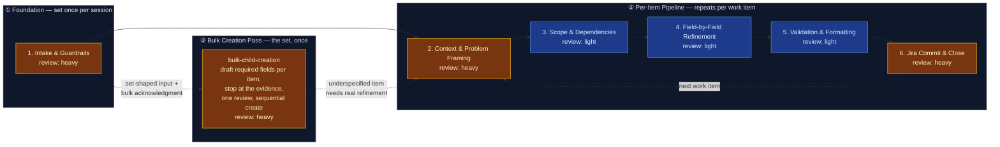

# AI-Augmented Refinement — Jira Work Item Pipeline

This flowspace produces high-quality, Jira-ready work items through disciplined,
step-by-step refinement with explicit confirmation and accountability at every
field boundary. The pipeline enforces the Technical Product / Service Owner
(TPSO) persona — prioritizing business and operational value, identifying risks
and dependencies, challenging incomplete requirements, and enforcing measurable
outcomes across the enterprise network infrastructure domain. Requirements are
grounded in the platform stakeholder register: every work item is tagged with
the stakeholders whose needs define it, the coalition it satisfies, and the
conflict axis it triggers (see `reference/platform-stakeholder-register.md`).

Default run = one fully refined work item committed to Jira. Where the user
already holds the item set — a spreadsheet, an export, a pasted list, vendor
documentation, or an accepted decomposition child set — **bulk creation mode**
(2026-07-31) instead produces that whole set in one reviewed pass, behind a
separate acknowledgment, at required-field depth.

## Stage Flow Diagram

> Stages 2–6 carry their true review-intensity colors: each stage's skill
> lives in `produced-skills/` (repo top level) — originally promoted
> 2026-07-03, evidence in
> `skill-foundry/decision-log/2026-07-03-ai-refinement-skill-promotion.md`;
> re-gated and re-promoted 2026-08-01 on a confirmed Rovo live test across
> the flow and all six ai-refinement-family skills, evidence in
> `decision-log/2026-08-01-rovo-live-test-reverification.md` and
> `skill-foundry/decision-log/2026-08-01-ai-refinement-skill-batch-reverification.md`.
> Copilot-adapter live tests remain outstanding — see Known gaps.
> **2026-08-05:** a content-only revision pass (Thirteenth gap, below) moved
> `jira-commit` and `workitem-validation` back to `truth-level: to-review` —
> the other four skills are unaffected and stay `verified`.

## Stage table

| # | Stage | Review intensity | Max data-class | Sanctioned engines | Layer-3 |
|---|---|---|---|---|---|
| 1 | Intake & Guardrails | heavy¹ | internal | Rovo, Copilot | inline — guardrails, persona from `reference/ai-refinement-hybrid.md`; schemas from `reference/work-item-schemas.md` (registry for all seven refinable types); plus two conditional handoffs — to `value-decomposition` (verified, `produced-skills/`) when the user asks to decompose (or "break down") a selected parent-level item, and to `bulk-child-creation` (verified, `produced-skills/`) when the input is set-shaped and the user accepts bulk creation mode |
| 2 | Context & Problem Framing | heavy¹ | internal | Rovo, Copilot | `context-elicitation` (verified, `produced-skills/`) |
| 3 | Scope & Dependencies | light² | internal | Rovo, Copilot | `scope-dependency-mapper` (verified, `produced-skills/`) |
| 4 | Field-by-Field Refinement | light² | internal | Rovo, Copilot | `field-refinement-cadence` (verified, `produced-skills/`) |
| 5 | Validation & Formatting | light² | internal | Rovo, Copilot | `workitem-validation` (verified, `produced-skills/`) |
| 6 | Jira Commit & Close | heavy¹ | internal | Rovo, Copilot | `jira-commit` (verified, `produced-skills/`) |

¹ Stays independently heavy in every mode, including fast-track and bulk —
never compressed or folded into another stage's review.
² In fast-track mode, Stages 3–5 fold into one consolidated draft-and-review
checkpoint (canonically defined in Stage 05's Review section) instead of
three separate light-review passes. In full-interactive mode, each keeps its
own light-review pass as shown.
³ In **bulk creation mode**, Stages 2–4 fold into a single batch-draft pass
run by `bulk-child-creation`: the stakeholder sweep and coalition/conflict-axis
annotation run once for the batch rather than per item, and per-field
confirmation is replaced by per-item review of the presented set. Stage 5
validates every drafted item and Stage 6 commits the approved set behind one
batch preview and one approval. Bulk is a **separate axis from fast-track, not
a widening of it** — fast-track governs how deeply one item is elicited, bulk
governs how many items one pass produces — and the two compose when the
supplied context is rich enough. Bulk never relaxes what is checked: schemas,
acceptance criteria, formatting, and both mandatory labels apply per item
exactly as in a single-item run. Since 2026-08-05, creation within Stage 6
splits any set larger than ten items into sequential sub-batches of at most
ten, each issued as one consolidated pass, rather than creating the whole set
in a single unbounded pass.

⁴ Since 2026-08-05, every stage boundary (and every bulk-creation sub-batch)
carries a self-reported context-window usage marker (the
`session_budget_checkpoint` house amendment) — informational at 50% used,
an escalating quality-degradation advisory at 60%/70%, and a stop-and-handoff
past 80%, via `reference/session-continuation-handoff.md`.

## Topology

- **Band ① Foundation** (Stage 1): Set once per refinement session. The user
  triggers refinement, acknowledges responsibility, confirms data-safety
  guardrails, and selects the work-item type from the hierarchy (agent-proposed
  with rationale when source material is available, user confirms or
  overrides). Stage 1 also runs the supporting-context research step
  (prompt for held material, infer work focus, user-confirmed Confluence/Jira
  hunt — see "Supporting-context research"), assesses and proposes fast-track
  mode when source material is detailed enough to support it, assesses whether
  the input is set-shaped and proposes bulk creation mode when it is, and checks
  whether a stakeholder register is loaded for this domain — the user always
  controls the final mode choice.
- **Band ② Per-Item Pipeline** (Stages 2–6): Repeats for each work item in
  the session. A run through this band takes one work item from raw context to
  a committed Jira issue. The loop-back from Stage 6 to Stage 2 fires when the
  user says "refine another item."
- **Band ③ Bulk Creation Pass** (`bulk-child-creation`, entered from Stage 1 in
  place of Band ②): Runs once for a set the user has already decided on. It
  ingests and normalizes the set, drafts each item's required fields from the
  provided context, **stops at the edge of the evidence** rather than padding
  thin rows, presents the whole set for one review, and creates it
  sequentially — halting on failure with a running result table, and degrading
  to a Markdown handoff document when no write path works. An item the pass
  reports as underspecified can be routed into an ordinary Band ② run; the two
  bands are alternatives for a given set, not stages of one another.

## Common source inputs

Operator-observed taxonomy (2026-07-03; broadened 2026-07-03; ninth row and
supporting-context research added 2026-07-21; tenth row added 2026-07-31) of
the raw material that most often starts a run. Most types arrive request-shaped or solution-shaped —
they state a task or an action, not a problem — so Stage 1 screens them
against the data-safety guardrail and Stage 2's elicitation recovers the
underlying problem and value rather than transcribing the request. Three of
the ten (incident/problem records, prior completed work records, and the
catch-all) are already problem-shaped, precedent-shaped, or unknown-shaped, and
the tenth (enumerated item set) is set-shaped — it carries many items whose
identity is already settled, and routes to Band ③ rather than through Stage 2's
problem recovery at all. Stage 1's screening still applies to all ten, but
Stage 2's "recover the problem" framing is only literally true of the
request/solution-shaped rows.

| # | Input type | Typical carrier | Handling notes |
|---|---|---|---|
| 1 | Email with a direct request for support | Email thread pasted or summarized into the session | Requester maps to a stakeholder-register entry — start the Stage 2 sweep there. Emails routinely carry names and addresses: strip them before the material enters the session (Stage 1 data-safety screen). |
| 2 | Vendor details on required actions | Vendor bulletin, advisory, or notice | Third-party material — vet before ingesting. Prescribed actions are solution-shaped: elicit the internal problem and value before accepting them as scope. Stated deadlines feed `due_date`. The vendor is not a register entry — tag the internal owning stakeholder. |
| 3 | Meeting minutes, notes, or summaries | Notes pasted into the session | Multi-topic and multi-voice — may yield more than one work item (one run through Band ② each). Separate decisions from discussion; strip attributions per the data-safety screen. |
| 4 | Directly stated requirement from an engineer | Chat message ("I need to go do x, y, z to help ABC") | Task-first: the stated x/y/z are candidate scope, not the problem statement. Map the named stakeholder (ABC) to the register; elicit the problem and value before accepting the task list. |
| 5 | Structured requirements document | SOW, PRD, or BRD pasted or attached | Solution-shaped and often detailed enough to trigger Stage 1's fast-track proposal — elicit the underlying problem before accepting stated requirements as scope; verify stakeholders named in the document against the register rather than assuming coverage. Often carries a stated timeline — surface it as a `due_date` reference point only, per the due-date elicitation rule. |
| 6 | Incident or problem record | Postmortem, problem ticket, or RCA summary | Already problem-shaped — verify it names an affected party and business impact, not only a technical symptom. High PII/confidential risk if it includes customer or user detail: screen closely. |
| 7 | Architecture or design artifact | SAD (systems architecture diagram), HLD/LLD design doc, ADR, data model, network/topology diagram — often carried as a Confluence page, exported Miro board, or PDF | Solution-shaped at a systems level — recover the problem the design was drawn to solve before accepting its structure as scope. May name multiple stakeholders across the design's integration points — sweep broadly; a SAD's integration points seed the Stage 2 stakeholder sweep and Stage 3 dependency sweep as candidates. |
| 8 | Unclassified document | Anything not matching rows 1–7 or 9 | Catch-all: screen for PII/confidential content at the strictest level of the set, determine whether it reads as problem-shaped or solution-shaped, and handle accordingly — get the full Stage 2 question sequence with no shortcuts assumed from its shape. |
| 9 | Prior completed work item or process record | Closed Jira item, runbook/MOP with closure notes, past change record | Precedent-shaped — mine it for scope boundaries, risks encountered, and duration/effort reference, after verifying the precedent actually matches this item's process type and area. Especially valuable for operations-focused items (OS upgrades, hardware refreshes): a prior completed process of the same type in the same area is the strongest available grounding. Never copy its scope forward unexamined — conditions change between runs. |
| 10 | Enumerated item set | Spreadsheet (CSV/XLSX) or Jira export, attached file, pasted table or numbered/bulleted list, vendor documentation listing required actions, or a conversational turn naming several discrete pieces of work | **Set-shaped** — the deciding is already done, so this row routes to bulk creation mode (Band ③) rather than to Stage 2's problem recovery. Apply the set-versus-item test before accepting the reading: would each row stand alone as a work item with its own acceptance criteria? Facets of one outcome are one item's `in_scope`, not many items. Exports are the higher-risk carrier for the data-safety screen — every column comes along, and description columns routinely carry names, customer references, and hostnames. Vendor documentation in this shape is still third-party material (row 2's vetting applies) and the internal owning stakeholder is tagged, not the vendor. |

## Supporting-context research

The taxonomy above classifies material as it arrives; since 2026-07-21 the
pipeline also goes *looking* for grounding material (the
`supporting_context_research` house amendment in
`reference/ai-refinement-hybrid.md`). At Stage 1, after the work-item type is
selected:

1. **Context prompt** — the user is asked for material they already hold:
   Confluence documents, exported Miro content, PDF files, email content,
   meeting notes. Everything supplied is taxonomy-typed and screened like any
   other source input.
2. **Work-focus inference** — the agent classifies the work's focus from the
   user's initial prompt and supplied material, stating its rationale, and
   selects a document-target profile:
   - **Engineering / enhancement** → architecture, data, and topology
     documentation: SAD first, then HLD/LLD, ADRs, data models,
     network/topology diagrams (taxonomy row 7).
   - **Operations** (OS upgrades, hardware refreshes, maintenance) →
     runbooks, MOPs/SOPs, upgrade/refresh guides, and especially prior
     completed processes of the same type in the same areas (taxonomy row 9).
   - **Mixed / unclear** → both sets proposed; the user trims.
3. **Confirm-then-hunt loop** — the agent proposes a concrete research scope
   (Confluence spaces, Jira projects, search terms, document types; read-only,
   via the engine's native Confluence/Jira capabilities — the same access
   class as the team_code and parent-candidate queries). Since 2026-07-31 the
   proposed spaces and projects default to recency — the top 3 most recently
   created/touched Confluence spaces and Jira projects for the requesting
   user, expanded to any spaces/projects tied to a person or team the user
   names or that appears in supplied material — never a blanket sweep. The
   user may supply search terms directly (technology stack, app/system
   codes, team names, team members) alongside the agent's own, additive
   unless the user states an override; documents default to a 6-month
   recency window unless the user states otherwise. Where the host engine is
   Copilot and a live Microsoft Graph/OneDrive connector is present (per
   `START-HERE.md`'s capability probe), an OneDrive/SharePoint proposal —
   same top-3/6-month defaults — folds into this one confirmation; absent
   Copilot or the connector, that surface is skipped and recorded as a gap.
   The user confirms, trims, or redirects the scope before any search runs;
   findings come back as a candidate list the user selects from. A parent
   Confluence page or OneDrive folder entering the session gets a quick
   one-level relevance pass over its children, folded into the same
   candidate list. The user may widen the hunt ("search these other spaces
   too"), each widening explicitly confirmed.
4. **Research record** — what was sought, found, selected, and *not found* —
   plus the surfaces actually searched, the confirmed time window, and any
   child-page/child-folder sweep results — is
   recorded and handed to Stages 2–3. A missing SAD is a recorded gap, not a
   blocker.

## Session budget & handoff checkpoint

Added 2026-08-05, revised in place the same day (`session_budget_checkpoint`,
`reference/ai-refinement-hybrid.md`). Heavy research, a large decomposition,
or a multi-item bulk pass can approach a platform's context window before a
run's work is done. The agent self-reports its estimated context-window
usage at every stage boundary and after every bulk-creation sub-batch —
"Stage `<n>` — context remaining: ~`<percent>`%" — rather than only checking
silently in the background, with the response escalating at three
thresholds:

- **50% used** — the marker itself is the only signal, informational.
- **60% and 70% used** — an explicit advisory that output quality may begin
  to degrade, plus the offer below.
- **Past 80% used** — the agent stops proposing further work and states a
  concrete split of what can still be finished reliably in this session
  versus what should move to a fresh one.

At 60% and above, the agent offers two paths:

1. **Continue in this session** — with the caveat that earlier context may
   be compressed or dropped as the session goes on.
2. **Receive a handoff document now, and resume in a fresh session**, per
   `reference/session-continuation-handoff.md`: stage reached, items already
   completed (with keys/URLs where created), every confirmed field with its
   value, every pending field with its outstanding options, operator
   decisions made so far (mode selections, stakeholder-sweep answers,
   hierarchy choices), research findings summarized rather than carried
   forward as raw tool output, and the agent's recommended priority order
   for the remainder. A fresh session picks up from this document rather
   than re-deriving anything already settled — the same shape of
   degrade-to-Markdown output Stage 06 already produces when no Jira write
   path is available, applied here to context exhaustion instead of a
   missing connector.

This remains advisory at every threshold, including past 80% — the user
always decides whether to continue, finish only what the agent recommends,
or take the handoff immediately.

This is advisory, not a hard stop — the operator decides whether to continue
or hand off, same as every other mode choice in this pipeline — and the 70%
figure is a trigger for the offer, not a ceiling enforced against the
operator. The check applies throughout a run, most usefully checked at each
stage boundary alongside the existing human-inspection gate, and explicitly
at Stage 06's session loop decision (Run procedure step 5) before the
operator chooses "refine another" — starting a second item's Band ② pass
deep into an already-heavy session is exactly where this offer matters most.

## Surfaces

- **Primary:** Confluence — `<space set at instantiation; confirm the Mermaid
  macro is installed per the setup questionnaire, else the hub page notes
  "diagram: see mirror">`
- **Mirror:** `<internal repo>` → `flowspaces/ai-refinement/`

This public copy is the sanitized *design*; instantiation happens in employer
tenancy per `methodology/mirroring-protocol.md`. At instantiation, add the
per-stage `work/` folders (Layer-4, transient) and the `handoffs/` folder —
they are deliberately absent from this design copy because they only ever hold
per-run content.

## Run procedure

1. The user speaks a trigger phrase ("Run AI Refinement", "Start Refinement",
   "I want to refine").
2. Stage 1 activates: guardrails are presented, responsibility is acknowledged,
   and a work-item type is selected from the refinable set — Portfolio Epic,
   Solution Epic, Feature, Story, Task, Spike, or Bug — either agent-proposed
   with rationale (when source material is available) or user-selected
   directly. (The full hierarchy is Portfolio Epic → Solution Epic → Feature →
   Story | Task | Spike | Bug → Sub-Task; only sub-tasks are out of refinement
   scope and get redirected — see `reference/work-item-schemas.md`.) Stage 1 also
   proposes fast-track mode when the source material supports it, proposes
   **bulk creation mode** when the input is set-shaped rather than one item
   (see step 2a), and checks
   stakeholder-register availability; the user always makes the final mode
   and grounding-path call. Between type selection and the fast-track
   assessment, Stage 1 runs the supporting-context research step (see
   "Supporting-context research" above): prompt for held material, infer the
   work focus, propose a Confluence/Jira research scope the user confirms
   before any search runs, hunt with user-confirmed widening, and record the
   sought/found/not-found result for Stages 2–3.

   2a. **Bulk creation branch.** If the input reads as a *set* of
   already-decided items — a spreadsheet or export, an attached file, a pasted
   table or list, vendor documentation enumerating required actions, a
   conversational turn naming several discrete pieces of work, or an accepted
   `value-decomposition` child set — Stage 1 applies the set-versus-item test
   (would each row stand alone as a work item with its own acceptance
   criteria?), states the item count and per-row type reading with its
   reasoning, and proposes bulk creation mode. On acceptance it takes the
   **bulk acknowledgment as a separate act** from the mode choice
   (`bulk_creation_acknowledgment`, `reference/ai-refinement-hybrid.md`) and
   hands control to `bulk-child-creation` (Band ③), which replaces steps 3–5
   below for that set. A declined proposal, or a set the test reads as one
   item, proceeds through Band ② as normal.
3. Stages 2–5 walk the user through the selected work-item schema. In
   full-interactive mode, this is one field at a time with confirmation at
   every step; in fast-track mode, fields the agent can confidently draft from
   the source material are extracted with citation and presented together at
   a consolidated checkpoint, while unextractable fields and the hard
   carve-outs (stakeholder sweep, coalition/conflict-axis annotation, due-date
   elicitation, and Stage 06's parent-mapping confirmation) stay interactive
   regardless of mode. The TPSO persona
   challenges incomplete requirements, enforces measurable outcomes, and
   holds every user-facing output to its communication_style throughout; the
   stakeholder register (where loaded for the domain) drives whose needs are
   elicited (Stage 2) and which coalition/conflict-axis annotations the item
   carries (Stage 3) — absent a register, these run in ungrounded mode.
4. Stage 5 validates completeness against the schema and applies formatting
   rules (no bold, no emojis).
5. Stage 6 presents the finished artifact for final human approval, then
   commits it to Jira. The user may loop back to Stage 2 for the next item
   or end the session.

   In bulk creation mode, steps 3–5 are replaced by Band ③'s single pass:
   `bulk-child-creation` ingests and normalizes the set, drafts each item's
   required fields from the provided context and stops where that context runs
   out (underspecified items are named with their missing fields, never
   padded), optionally offers a clearly-separated set of suggested next items
   with an accuracy warning, presents everything for one review, and creates
   the approved set sequentially — halting on failure with a running result
   table, validating parent linkage at the end of the pass, and degrading to a
   Markdown handoff document when no write path is available.

Human inspects at every stage boundary — that's the method, not an
inconvenience.

## Known gaps

> Per `methodology/governance-and-audit.md` §5a: each entry below is a
> pointer, not an archive — 1–3 sentences plus the decision-log citation
> that carries the full rationale.

**Gate closure (2026-08-01):** the flow and its six directly-built skills
were re-gated and re-promoted to `truth-level: verified` on a confirmed Rovo
run across the flow, closing the Rovo-path re-gate language on gaps seven
through eleven. Copilot-adapter live tests remain outstanding for all six;
`field-refinement-cadence` was never demoted. Evidence:
`decision-log/2026-08-01-rovo-live-test-reverification.md`. **This gate
closure is reopened by the Thirteenth gap below** for `jira-commit` and
`workitem-validation` (content-changed) and the touched stage contracts —
the Rovo path needs a fresh confirmed run before those return to
`verified`; Stages 02–04 and their skills are unaffected and stay at their
2026-08-01 gate status.

Fourteenth gap (2026-08-05): a second operator report on the same
2026-08-04 Rovo session covered two problems the Thirteenth gap below
didn't reach — bulk creation degrading past roughly ten items, and a
request for finer, per-stage context-budget escalation (50%/60%/70%
advisories, a firm stop past 80%) rather than one silent 70% check. Closed
by `bulk-child-creation` 1.0 → 1.1 (sub-batch chunking: sets over ten items
split into sequential sub-batches of ten), a revised
`session_budget_checkpoint` amendment (`reference/ai-refinement-hybrid.md`
1.7 → 1.8) with the escalating-threshold model, a new
`reference/session-continuation-handoff.md` (1.0) spec, and a
context-budget marker added to all six stage `CONTEXT.md` files. A related
repo-wide `export-log` skill build came out of the same conversation but
isn't itself a flowspace artifact. None of this has run on-engine. Raised
by the operator. Rationale:
`decision-log/2026-08-05-bulk-batch-chunking-and-context-budget-awareness.md`.

Thirteenth gap (2026-08-05): an operator retrospective on a live Rovo
session surfaced eight friction points and two resource-consumption
findings — Confluence search returning unreadable-page hits with no
visible degradation, space-name/key confusion, an invalid
Feature-as-child-of-Feature commit attempt, scope/dependency content
landing in the wrong Jira field, guessed API parameters, a state reset
forcing a rebuild, an unconfirmed structural action, and roughly
110,000–140,000 of a 200,000-token window consumed with no surfaced
warning. Closed by three new house amendments in
`reference/ai-refinement-hybrid.md` (1.6 → 1.7): `content_access_verification`
(space-key resolution plus a research-confidence tag),
`commit_boundary_hardening` (API preflight, live hierarchy validation,
field-capability fallback ordering, a post-commit field audit), and
`session_budget_checkpoint` (the ~70%-usage warn-and-offer, superseded by
the Fourteenth gap's escalating model above); a new
`reference/platform-quirks.md` (1.0) records the Rovo-specific evidence
separately from the rule. Stages 01 (1.15 → 1.16), 05 (1.6 → 1.7), and 06
(1.10 → 1.11) carry the changes; `jira-commit` (1.10 → 1.11) and
`workitem-validation` (1.3 → 1.4) — the two skills whose Method actually
changed — move to `truth-level: to-review`. None of this has run on-engine.
Raised via a Rovo session retrospective. Rationale:
`decision-log/2026-08-05-rovo-session-friction-fixes.md`.

Twelfth gap (2026-08-01): `value-decomposition`'s decomposition model
(persona value statements, MVP thinking, vertical-only slicing) doesn't fit
repetitive, procedure-driven work (patch waves, cert rotations,
decommissions, DR drills, migrations). Not closed here — captured as a
skill-primer-brief for a future skill-foundry build grounded in PMI/PMBOK
practice, `skill-foundry/backlog-skill-starters/sp-process-decomposition.md`.
Raised by the operator. Rationale:
`decision-log/2026-08-01-process-decomposition-brief.md`.

Eleventh gap (2026-07-31): the supporting-context research step's search-scope
proposal had no recency signal, as likely to sweep broadly as narrowly.
Closed by revising `supporting_context_research`
(`reference/ai-refinement-hybrid.md` 1.5 → 1.6) to default to the top 3 most
recently touched Confluence spaces/Jira projects plus any the user names, a
conditional OneDrive/SharePoint proposal under Copilot, user-supplied
search-term filters, a 6-month document recency default, and a one-level
child-page/folder relevance pass. Stage 01, `START-HERE.md`, and the two
instantiation/validation reference docs updated to match; none of it has run
on a live engine. Raised by the operator. Rationale:
`decision-log/2026-07-31-supporting-context-research-scope-defaults.md`.

Tenth gap (2026-07-31): the pipeline had no path for a user who already holds
a full item set — forcing N full Band ② runs or hand-creation in Jira.
Closed by **bulk creation mode**: a new `bulk_creation_acknowledgment` house
amendment, a tenth source-input taxonomy row, Band ③, and the
`bulk-child-creation` skill; Stage 01 gains set-shape assessment and the
separate acknowledgment, Stages 02–04 fold into a batch-draft pass (dropping
to `to-review`), Stage 05 validates per item across the batch, and Stage 06
gains batch preview, sequential halt-on-failure commit, and a Markdown
handoff fallback. Load-bearing rule: the pass stops at the edge of the
evidence rather than padding thin rows. None of this has run on-engine.
Raised by the operator. Rationale:
`decision-log/2026-07-31-bulk-creation-mode.md`.

Ninth gap (2026-07-30): `value-decomposition` (built 2026-07-15, fifth gap)
was never wired into this hub's stage table or Stage 01's `CONTEXT.md`,
leaving it orphaned. Closed by adding a decomposition handoff at Stage 01
step 7 (trigger: "decompose," "break down," or equivalent, on a
parent-level type) and listing the skill in the stage table and Layer-3
reference table as a conditional handoff. No skill content changed. None of
this has run on-engine. Raised by the operator. Rationale:
`decision-log/2026-07-30-value-decomposition-wiring-fix.md`.

Eighth gap (2026-07-28): the `mandatory_labels` provenance label changes
from the static `refine-ai-built` to the versioned
`refine-ai-flow-v<version>`, flagging an item as AI-produced and pending
team review — removal signals review completion. Stages 01, 05, and 06,
plus `jira-commit` and `workitem-validation`, updated to match and both
skills' adapters regenerated; Stages 05/06 drop to `to-review` (content
change, no re-gate). New coupling: because the label now carries the
flowspace's own version, a future HUB-only version bump still requires
regenerating `jira-commit`'s adapters. None of this has run on-engine.
Raised by the operator. Rationale:
`decision-log/2026-07-28-provenance-label-versioning.md`.

Seventh gap (2026-07-27): a chat-session entry point (`START-HERE.md`) now
lets this flow run directly against whatever a chat session has access to,
without an employer-side source-repo. Stage 01 gains degrade branches on
the supporting-context research hunt and the team_code query;
`jira-commit`, `jira-accomplishments-gatherer`,
`confluence-contribution-gatherer`, and `repo-context-enricher` each gain
one named degrade branch, and all move to `truth-level: to-review` pending
a gate re-run. None of it has run on-engine. Rationale:
`decision-log/2026-07-27-chat-session-degrade-paths.md`.

The five skills forming the default per-item pipeline (Stages 2–6) were
promoted `verified` 2026-07-03: evidence in
`skill-foundry/decision-log/2026-07-03-ai-refinement-skill-promotion.md`
and `flow-foundry/decision-log/2026-07-03-ai-refinement-promotion.md`.
Remaining gap: no adapter is published to a live engine yet — first
on-engine invocation per adapter happens at deployment, the operator's act,
recorded in each skill card.

| Skill (spec + adapters) | Primer brief | Target stage | Status |
|---|---|---|---|
| `context-elicitation` | `sp-context-elicitation` | 2 | verified — 1.5 (nine-type input taxonomy, supporting-context steering: architecture material seeds the stakeholder sweep, prior completed items seed "tried before"); re-gated and promoted 2026-08-01 on a confirmed Rovo live test; Copilot adapter live test still outstanding |
| `scope-dependency-mapper` | `sp-scope-dependency-mapper` | 3 | verified — 1.3 (SAD/topology integration-seam dependency sweep, prior-process risk seeding); re-gated and promoted 2026-08-01 on a confirmed Rovo live test; Copilot adapter live test still outstanding |
| `field-refinement-cadence` | `sp-field-refinement-cadence` | 4 | verified — 1.3 (conditionally-scoped cadence: fast-track consolidation vs. one-at-a-time, communication_style citation); promoted 2026-07-03; deployment pending |
| `workitem-validation` | `sp-workitem-validation` | 5 | to-review — 1.4 (completeness scan names any excerpt-only/inaccessible research grounding backing a required field); content change 2026-08-05, re-gate owed; previously re-gated and promoted 2026-08-01 on a confirmed Rovo live test |
| `jira-commit` | `sp-jira-commit` | 6 | to-review — 1.11 (API preflight, hierarchy-level validation before parent-link writes, field-capability testing, post-commit field audit); content change 2026-08-05, re-gate owed; previously re-gated and promoted 2026-08-01 on a confirmed Rovo live test |
| `value-decomposition` | `sp-value-decomposition` | 1 (conditional handoff, not the stage's default path) | verified — 1.1 (built 2026-07-15; wired into Stage 01's CONTEXT.md 1.13 and this table 2026-07-30, wording covering "break down" phrasing added same day — see Ninth gap; 1.1 added the bulk-creation branch for a large accepted child set; re-gated and promoted 2026-08-01 on a confirmed Rovo live test); Copilot adapter live test still outstanding |
| `bulk-child-creation` | `sp-bulk-child-creation` | 1 (conditional handoff into Band ③, replacing Band ② for that set) | to-review — 1.1 (built 2026-07-31, gated and promoted 2026-08-01 on a confirmed Rovo live test; 1.1 added ≤10-item sub-batch chunking 2026-08-05, dropping back to `to-review` pending re-gate); Copilot adapter live test still outstanding |

Second gap (2026-07-03): the work-item schema registry originally covered
only `solution_epic`/`feature`; `story`/`task`/`spike` schemas are
house-drafted at `to-review`, pending operator ratification against the
real Jira project configuration at instantiation. The two proposed spike
fields were applied to `jira-commit` ahead of ratification. Rationale:
`decision-log/2026-07-03-work-item-schema-extension.md`; revision evidence:
`skill-foundry/decision-log/2026-07-03-ai-refinement-skill-revision-pass.md`.

Third gap (2026-07-03): the first on-engine invocation (Rovo, NEADD-1827)
surfaced five defects at the commit boundary — raw Markdown reaching Jira
fields, silent parent assignment, a fabricated due date, no
status-transition offer, and missing board-required fields on
`story`/`spike`. All five fixed in `jira-commit` 1.2 → 1.3,
`field-refinement-cadence` 1.1 → 1.2, and the schema registry 1.0 → 1.1.
Rationale: `decision-log/2026-07-03-stage06-feedback-revision.md`; gate
evidence:
`skill-foundry/decision-log/2026-07-03-stage06-feedback-revision-pass.md`.

Gap update (2026-07-03, drift-analysis revision pass): the same five house
amendments backported into `reference/ai-refinement-hybrid.md`, plus
communication_style enforcement, a broadened source-input taxonomy, a
domain-configurable stakeholder register, and fast-track mode — new
spec-only capabilities across Stages 01–06 and four produced skills, none
run on-engine. Two prep artifacts (`reference/confluence-instantiation-guide.md`,
`reference/on-engine-validation-checklist.md`) scope deployment and
validation, prepared but not executed. Rationale:
`decision-log/2026-07-03-fast-track-mode.md`,
`decision-log/2026-07-03-communication-style-enforcement.md`,
`decision-log/2026-07-03-source-input-taxonomy-expansion.md`,
`decision-log/2026-07-03-stakeholder-register-domain-split.md`,
`decision-log/2026-07-03-hybrid-clipping-house-amendments.md`,
`decision-log/2026-07-03-deployment-artifacts-prepared.md`; gate evidence:
`skill-foundry/decision-log/2026-07-03-communication-style-and-fast-track-skill-revision-pass.md`.

Fourth gap (2026-07-07): the refinable set grew by two types —
`portfolio_epic` (new top of the hierarchy) and `bug` (new peer of
`story`/`task`/`spike`) — added at `truth-level: to-review` in the schema
registry, with Stages 01/02/03/06 and four skills updated to route them;
none of it has run on-engine or been re-gated. Same-day feedback simplified
`bug`'s fields to a single `description` field and confirmed
`portfolio_epic`'s field set unchanged. Rationale:
`decision-log/2026-07-07-portfolio-epic-and-bug-type-extension.md` and
`decision-log/2026-07-07-bug-field-simplification-and-portfolio-epic-confirmation.md`.

Fifth gap (2026-07-15): a sixth house amendment, `mandatory_labels`, adds
`refine-ai-built` and a `<team_code>-<yyyy>-q<n>` planning label (exempt for
the two epic types); Stages 01/05/06 resolve, gate, and apply them, with
`jira-commit` and `workitem-validation` updated and dropped to `to-review`.
Raised by the operator. Also records a value-delivery decomposition
capability designed but not built, handed off as
`skill-foundry/backlog-skill-starters/sp-value-decomposition.md`. Rationale:
`decision-log/2026-07-15-provenance-and-planning-labels.md`.

Sixth gap (2026-07-21): a seventh house amendment,
`supporting_context_research`, makes intake active — prompting for held
context, inferring work focus, and proposing a confirmed-before-search
Confluence/Jira research scope. The source-input taxonomy gains a ninth
row; Stage 01 gains the research step; Stages 02/03 and the
`context-elicitation`/`scope-dependency-mapper` skills move to `to-review`.
Raised by the operator; none of it has run on-engine. Rationale:
`decision-log/2026-07-21-supporting-context-research.md`; gate evidence:
`skill-foundry/decision-log/2026-07-21-supporting-context-skill-revision-pass.md`.

## Reference material (Layer-3)

| Artifact | Location | Covers |
|---|---|---|
| AI Refinement — Hybrid Definition | `reference/ai-refinement-hybrid.md` (to-review — clipping + house amendments) | Guardrails, persona (incl. communication_style enforcement), hierarchy, source schemas (solution_epic, feature), workflow cadence, triggers, eleven house amendments (five on-engine-proven, six operator-raised) |
| Bulk Child Creation | `produced-skills/bulk-child-creation/SKILL.md` (to-review — 1.1) | Band ③'s single pass: set recognition and the set-versus-item test, the separate bulk acknowledgment, list/spreadsheet ingest, required-field drafting with the stop-at-the-evidence rule, separated suggested items, sequential creation in ≤10-item sub-batches with halt-on-failure, Markdown handoff degrade path |
| Session-Continuation Handoff | `reference/session-continuation-handoff.md` (to-review) | Document shape for resuming this flow's own progress in a fresh session when `session_budget_checkpoint` stops the current one: stage reached, items completed, items remaining, recommended priority order |
| Work Item Schemas — Refinable Set | `reference/work-item-schemas.md` (to-review, house extension) | Schema registry for all seven refinable types; story/task/spike/portfolio_epic/bug extensions; sub_task out-of-scope declaration; extension field constraints; mandatory-label, hierarchy-level, and field-capability cross-cutting notes |
| Platform Stakeholder Register | `reference/platform-stakeholder-register.md` (claimed clipping — network-engineering instance) | Stakeholder role-types, coalitions, conflict axes, escalation routing |
| Platform Stakeholder Register — Template | `reference/platform-stakeholder-register-template.md` (verified, house extension) | Domain-neutral register structure for instantiating in domains outside network engineering |
| Confluence Instantiation Guide | `reference/confluence-instantiation-guide.md` (verified, house extension) | Page-tree structure, mapping rules, and operator checklist for REC-01/02/10 (Confluence migration, Rovo agent deployment) — prepared, not executed |
| On-Engine Validation Checklist | `reference/on-engine-validation-checklist.md` (verified, house extension) | Per-type, per-check matrix for REC-09 (first on-engine validation run) — prepared, not executed |
| Platform Quirks | `reference/platform-quirks.md` (to-review, house extension) | Rovo/Copilot-specific execution observations — session state volatility, API parameter-naming differences, tool-inventory churn — evidence behind the `commit_boundary_hardening` house amendment, not the rule itself |
| Provenance spec | `methodology/provenance-spec.md` | Frontmatter rules for all artifacts |
| Governance & Audit | `methodology/governance-and-audit.md` | Gate requirements |
