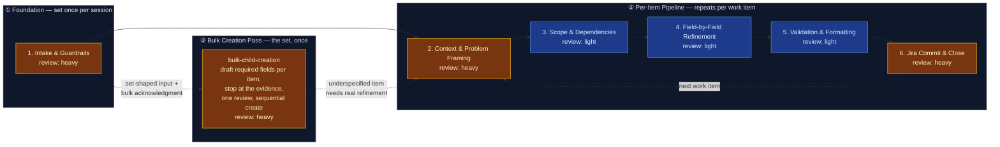

# AI-Augmented Refinement — Jira Work Item Pipeline

This flowspace produces high-quality, Jira-ready work items through disciplined,
step-by-step refinement with explicit confirmation and accountability at every
field boundary. The pipeline enforces the Technical Product / Service Owner
(TPSO) persona — prioritizing business and operational value, identifying risks
and dependencies, challenging incomplete requirements, and enforcing measurable
outcomes across the enterprise network infrastructure domain. Requirements are
grounded in the platform stakeholder register: every work item is tagged with
the stakeholders whose needs define it, the coalition it satisfies, and the
conflict axis it triggers (see `reference/platform-stakeholder-register.md`).

Default run = one fully refined work item committed to Jira. Where the user
already holds the item set — a spreadsheet, an export, a pasted list, vendor
documentation, or an accepted decomposition child set — **bulk creation mode**
(2026-07-31) instead produces that whole set in one reviewed pass, behind a
separate acknowledgment, at required-field depth.

## Stage Flow Diagram

> Stages 2–6 carry their true review-intensity colors: each stage's skill is
> `truth-level: verified` and lives in `produced-skills/` (repo top level) —
> originally promoted 2026-07-03, evidence in
> `skill-foundry/decision-log/2026-07-03-ai-refinement-skill-promotion.md`;
> re-gated and re-promoted 2026-08-01 on a confirmed Rovo live test across
> the flow and all six ai-refinement-family skills, evidence in
> `decision-log/2026-08-01-rovo-live-test-reverification.md` and
> `skill-foundry/decision-log/2026-08-01-ai-refinement-skill-batch-reverification.md`.
> Copilot-adapter live tests remain outstanding — see Known gaps.

## Stage table

| # | Stage | Review intensity | Max data-class | Sanctioned engines | Layer-3 |
|---|---|---|---|---|---|
| 1 | Intake & Guardrails | heavy¹ | internal | Rovo, Copilot | inline — guardrails, persona from `reference/ai-refinement-hybrid.md`; schemas from `reference/work-item-schemas.md` (registry for all seven refinable types); plus two conditional handoffs — to `value-decomposition` (verified, `produced-skills/`) when the user asks to decompose (or "break down") a selected parent-level item, and to `bulk-child-creation` (verified, `produced-skills/`) when the input is set-shaped and the user accepts bulk creation mode |
| 2 | Context & Problem Framing | heavy¹ | internal | Rovo, Copilot | `context-elicitation` (verified, `produced-skills/`) |
| 3 | Scope & Dependencies | light² | internal | Rovo, Copilot | `scope-dependency-mapper` (verified, `produced-skills/`) |
| 4 | Field-by-Field Refinement | light² | internal | Rovo, Copilot | `field-refinement-cadence` (verified, `produced-skills/`) |
| 5 | Validation & Formatting | light² | internal | Rovo, Copilot | `workitem-validation` (verified, `produced-skills/`) |
| 6 | Jira Commit & Close | heavy¹ | internal | Rovo, Copilot | `jira-commit` (verified, `produced-skills/`) |

¹ Stays independently heavy in every mode, including fast-track and bulk —
never compressed or folded into another stage's review.
² In fast-track mode, Stages 3–5 fold into one consolidated draft-and-review
checkpoint (canonically defined in Stage 05's Review section) instead of
three separate light-review passes. In full-interactive mode, each keeps its
own light-review pass as shown.
³ In **bulk creation mode**, Stages 2–4 fold into a single batch-draft pass
run by `bulk-child-creation`: the stakeholder sweep and coalition/conflict-axis
annotation run once for the batch rather than per item, and per-field
confirmation is replaced by per-item review of the presented set. Stage 5
validates every drafted item and Stage 6 commits the approved set behind one
batch preview and one approval. Bulk is a **separate axis from fast-track, not
a widening of it** — fast-track governs how deeply one item is elicited, bulk
governs how many items one pass produces — and the two compose when the
supplied context is rich enough. Bulk never relaxes what is checked: schemas,
acceptance criteria, formatting, and both mandatory labels apply per item
exactly as in a single-item run. Since 2026-08-05, creation within Stage 6
splits any set larger than ten items into sequential sub-batches of at most
ten, each issued as one consolidated pass, rather than creating the whole set
in a single unbounded pass.

⁴ Since 2026-08-05, every stage boundary (and every bulk-creation sub-batch)
carries a self-reported context-window usage marker (the
`context_budget_awareness` house amendment) — informational at 50% used,
an escalating quality-degradation advisory at 60%/70%, and a stop-and-handoff
past 80%, via `reference/session-continuation-handoff.md`.

## Topology

- **Band ① Foundation** (Stage 1): Set once per refinement session. The user
  triggers refinement, acknowledges responsibility, confirms data-safety
  guardrails, and selects the work-item type from the hierarchy (agent-proposed
  with rationale when source material is available, user confirms or
  overrides). Stage 1 also runs the supporting-context research step
  (prompt for held material, infer work focus, user-confirmed Confluence/Jira
  hunt — see "Supporting-context research"), assesses and proposes fast-track
  mode when source material is detailed enough to support it, assesses whether
  the input is set-shaped and proposes bulk creation mode when it is, and checks
  whether a stakeholder register is loaded for this domain — the user always
  controls the final mode choice.
- **Band ② Per-Item Pipeline** (Stages 2–6): Repeats for each work item in
  the session. A run through this band takes one work item from raw context to
  a committed Jira issue. The loop-back from Stage 6 to Stage 2 fires when the
  user says "refine another item."
- **Band ③ Bulk Creation Pass** (`bulk-child-creation`, entered from Stage 1 in
  place of Band ②): Runs once for a set the user has already decided on. It
  ingests and normalizes the set, drafts each item's required fields from the
  provided context, **stops at the edge of the evidence** rather than padding
  thin rows, presents the whole set for one review, and creates it
  sequentially — halting on failure with a running result table, and degrading
  to a Markdown handoff document when no write path works. An item the pass
  reports as underspecified can be routed into an ordinary Band ② run; the two
  bands are alternatives for a given set, not stages of one another.

## Common source inputs

Operator-observed taxonomy (2026-07-03; broadened 2026-07-03; ninth row and
supporting-context research added 2026-07-21; tenth row added 2026-07-31) of
the raw material that most often starts a run. Most types arrive request-shaped or solution-shaped —
they state a task or an action, not a problem — so Stage 1 screens them
against the data-safety guardrail and Stage 2's elicitation recovers the
underlying problem and value rather than transcribing the request. Three of
the ten (incident/problem records, prior completed work records, and the
catch-all) are already problem-shaped, precedent-shaped, or unknown-shaped, and
the tenth (enumerated item set) is set-shaped — it carries many items whose
identity is already settled, and routes to Band ③ rather than through Stage 2's
problem recovery at all. Stage 1's screening still applies to all ten, but
Stage 2's "recover the problem" framing is only literally true of the
request/solution-shaped rows.

| # | Input type | Typical carrier | Handling notes |
|---|---|---|---|
| 1 | Email with a direct request for support | Email thread pasted or summarized into the session | Requester maps to a stakeholder-register entry — start the Stage 2 sweep there. Emails routinely carry names and addresses: strip them before the material enters the session (Stage 1 data-safety screen). |
| 2 | Vendor details on required actions | Vendor bulletin, advisory, or notice | Third-party material — vet before ingesting. Prescribed actions are solution-shaped: elicit the internal problem and value before accepting them as scope. Stated deadlines feed `due_date`. The vendor is not a register entry — tag the internal owning stakeholder. |
| 3 | Meeting minutes, notes, or summaries | Notes pasted into the session | Multi-topic and multi-voice — may yield more than one work item (one run through Band ② each). Separate decisions from discussion; strip attributions per the data-safety screen. |
| 4 | Directly stated requirement from an engineer | Chat message ("I need to go do x, y, z to help ABC") | Task-first: the stated x/y/z are candidate scope, not the problem statement. Map the named stakeholder (ABC) to the register; elicit the problem and value before accepting the task list. |
| 5 | Structured requirements document | SOW, PRD, or BRD pasted or attached | Solution-shaped and often detailed enough to trigger Stage 1's fast-track proposal — elicit the underlying problem before accepting stated requirements as scope; verify stakeholders named in the document against the register rather than assuming coverage. Often carries a stated timeline — surface it as a `due_date` reference point only, per the due-date elicitation rule. |
| 6 | Incident or problem record | Postmortem, problem ticket, or RCA summary | Already problem-shaped — verify it names an affected party and business impact, not only a technical symptom. High PII/confidential risk if it includes customer or user detail: screen closely. |
| 7 | Architecture or design artifact | SAD (systems architecture diagram), HLD/LLD design doc, ADR, data model, network/topology diagram — often carried as a Confluence page, exported Miro board, or PDF | Solution-shaped at a systems level — recover the problem the design was drawn to solve before accepting its structure as scope. May name multiple stakeholders across the design's integration points — sweep broadly; a SAD's integration points seed the Stage 2 stakeholder sweep and Stage 3 dependency sweep as candidates. |
| 8 | Unclassified document | Anything not matching rows 1–7 or 9 | Catch-all: screen for PII/confidential content at the strictest level of the set, determine whether it reads as problem-shaped or solution-shaped, and handle accordingly — get the full Stage 2 question sequence with no shortcuts assumed from its shape. |
| 9 | Prior completed work item or process record | Closed Jira item, runbook/MOP with closure notes, past change record | Precedent-shaped — mine it for scope boundaries, risks encountered, and duration/effort reference, after verifying the precedent actually matches this item's process type and area. Especially valuable for operations-focused items (OS upgrades, hardware refreshes): a prior completed process of the same type in the same area is the strongest available grounding. Never copy its scope forward unexamined — conditions change between runs. |
| 10 | Enumerated item set | Spreadsheet (CSV/XLSX) or Jira export, attached file, pasted table or numbered/bulleted list, vendor documentation listing required actions, or a conversational turn naming several discrete pieces of work | **Set-shaped** — the deciding is already done, so this row routes to bulk creation mode (Band ③) rather than to Stage 2's problem recovery. Apply the set-versus-item test before accepting the reading: would each row stand alone as a work item with its own acceptance criteria? Facets of one outcome are one item's `in_scope`, not many items. Exports are the higher-risk carrier for the data-safety screen — every column comes along, and description columns routinely carry names, customer references, and hostnames. Vendor documentation in this shape is still third-party material (row 2's vetting applies) and the internal owning stakeholder is tagged, not the vendor. |

## Supporting-context research

The taxonomy above classifies material as it arrives; since 2026-07-21 the
pipeline also goes *looking* for grounding material (the
`supporting_context_research` house amendment in
`reference/ai-refinement-hybrid.md`). At Stage 1, after the work-item type is
selected:

1. **Context prompt** — the user is asked for material they already hold:
   Confluence documents, exported Miro content, PDF files, email content,
   meeting notes. Everything supplied is taxonomy-typed and screened like any
   other source input.
2. **Work-focus inference** — the agent classifies the work's focus from the
   user's initial prompt and supplied material, stating its rationale, and
   selects a document-target profile:
   - **Engineering / enhancement** → architecture, data, and topology
     documentation: SAD first, then HLD/LLD, ADRs, data models,
     network/topology diagrams (taxonomy row 7).
   - **Operations** (OS upgrades, hardware refreshes, maintenance) →
     runbooks, MOPs/SOPs, upgrade/refresh guides, and especially prior
     completed processes of the same type in the same areas (taxonomy row 9).
   - **Mixed / unclear** → both sets proposed; the user trims.
3. **Confirm-then-hunt loop** — the agent proposes a concrete research scope
   (Confluence spaces, Jira projects, search terms, document types; read-only,
   via the engine's native Confluence/Jira capabilities — the same access
   class as the team_code and parent-candidate queries). Since 2026-07-31 the
   proposed spaces and projects default to recency — the top 3 most recently
   created/touched Confluence spaces and Jira projects for the requesting
   user, expanded to any spaces/projects tied to a person or team the user
   names or that appears in supplied material — never a blanket sweep. The
   user may supply search terms directly (technology stack, app/system
   codes, team names, team members) alongside the agent's own, additive
   unless the user states an override; documents default to a 6-month
   recency window unless the user states otherwise. Where the host engine is
   Copilot and a live Microsoft Graph/OneDrive connector is present (per
   `START-HERE.md`'s capability probe), an OneDrive/SharePoint proposal —
   same top-3/6-month defaults — folds into this one confirmation; absent
   Copilot or the connector, that surface is skipped and recorded as a gap.
   The user confirms, trims, or redirects the scope before any search runs;
   findings come back as a candidate list the user selects from. A parent
   Confluence page or OneDrive folder entering the session gets a quick
   one-level relevance pass over its children, folded into the same
   candidate list. The user may widen the hunt ("search these other spaces
   too"), each widening explicitly confirmed.
4. **Research record** — what was sought, found, selected, and *not found* —
   plus the surfaces actually searched, the confirmed time window, and any
   child-page/child-folder sweep results — is
   recorded and handed to Stages 2–3. A missing SAD is a recorded gap, not a
   blocker.

## Surfaces

- **Primary:** Confluence — `<space set at instantiation; confirm the Mermaid
  macro is installed per the setup questionnaire, else the hub page notes
  "diagram: see mirror">`
- **Mirror:** `<internal repo>` → `flowspaces/ai-refinement/`

This public copy is the sanitized *design*; instantiation happens in employer
tenancy per `methodology/mirroring-protocol.md`. At instantiation, add the
per-stage `work/` folders (Layer-4, transient) and the `handoffs/` folder —
they are deliberately absent from this design copy because they only ever hold
per-run content.

## Run procedure

1. The user speaks a trigger phrase ("Run AI Refinement", "Start Refinement",
   "I want to refine").
2. Stage 1 activates: guardrails are presented, responsibility is acknowledged,
   and a work-item type is selected from the refinable set — Portfolio Epic,
   Solution Epic, Feature, Story, Task, Spike, or Bug — either agent-proposed
   with rationale (when source material is available) or user-selected
   directly. (The full hierarchy is Portfolio Epic → Solution Epic → Feature →
   Story | Task | Spike | Bug → Sub-Task; only sub-tasks are out of refinement
   scope and get redirected — see `reference/work-item-schemas.md`.) Stage 1 also
   proposes fast-track mode when the source material supports it, proposes
   **bulk creation mode** when the input is set-shaped rather than one item
   (see step 2a), and checks
   stakeholder-register availability; the user always makes the final mode
   and grounding-path call. Between type selection and the fast-track
   assessment, Stage 1 runs the supporting-context research step (see
   "Supporting-context research" above): prompt for held material, infer the
   work focus, propose a Confluence/Jira research scope the user confirms
   before any search runs, hunt with user-confirmed widening, and record the
   sought/found/not-found result for Stages 2–3.

   2a. **Bulk creation branch.** If the input reads as a *set* of
   already-decided items — a spreadsheet or export, an attached file, a pasted
   table or list, vendor documentation enumerating required actions, a
   conversational turn naming several discrete pieces of work, or an accepted
   `value-decomposition` child set — Stage 1 applies the set-versus-item test
   (would each row stand alone as a work item with its own acceptance
   criteria?), states the item count and per-row type reading with its
   reasoning, and proposes bulk creation mode. On acceptance it takes the
   **bulk acknowledgment as a separate act** from the mode choice
   (`bulk_creation_acknowledgment`, `reference/ai-refinement-hybrid.md`) and
   hands control to `bulk-child-creation` (Band ③), which replaces steps 3–5
   below for that set. A declined proposal, or a set the test reads as one
   item, proceeds through Band ② as normal.
3. Stages 2–5 walk the user through the selected work-item schema. In
   full-interactive mode, this is one field at a time with confirmation at
   every step; in fast-track mode, fields the agent can confidently draft from
   the source material are extracted with citation and presented together at
   a consolidated checkpoint, while unextractable fields and the hard
   carve-outs (stakeholder sweep, coalition/conflict-axis annotation, due-date
   elicitation) stay interactive regardless of mode. The TPSO persona
   challenges incomplete requirements, enforces measurable outcomes, and
   holds every user-facing output to its communication_style throughout; the
   stakeholder register (where loaded for the domain) drives whose needs are
   elicited (Stage 2) and which coalition/conflict-axis annotations the item
   carries (Stage 3) — absent a register, these run in ungrounded mode.
4. Stage 5 validates completeness against the schema and applies formatting
   rules (no bold, no emojis).
5. Stage 6 presents the finished artifact for final human approval, then
   commits it to Jira. The user may loop back to Stage 2 for the next item
   or end the session.

   In bulk creation mode, steps 3–5 are replaced by Band ③'s single pass:
   `bulk-child-creation` ingests and normalizes the set, drafts each item's
   required fields from the provided context and stops where that context runs
   out (underspecified items are named with their missing fields, never
   padded), optionally offers a clearly-separated set of suggested next items
   with an accuracy warning, presents everything for one review, and creates
   the approved set sequentially — halting on failure with a running result
   table, validating parent linkage at the end of the pass, and degrading to a
   Markdown handoff document when no write path is available.

Human inspects at every stage boundary — that's the method, not an
inconvenience.

## Known gaps

**Gate closure (2026-08-01):** the flow and its six directly-built skills
(`context-elicitation`, `scope-dependency-mapper`, `workitem-validation`,
`jira-commit`, `value-decomposition`, `bulk-child-creation`) were re-gated
and promoted back to `truth-level: verified` on the operator's confirmation
of a real Rovo run across the flow — "all tested in rovo and worked well."
This closes the re-gate/deployment-pending language attached to the seventh
through eleventh gaps below for the Rovo path specifically. **Not closed by
this:** the Copilot adapter for any of these six skills has not had its own
live invocation — the five-point gate requires one per adapter, and only
Rovo's has run. `field-refinement-cadence` is unaffected (it was never
demoted). Evidence: `decision-log/2026-08-01-rovo-live-test-reverification.md`.

Thirteenth gap (2026-08-05): two problems surfaced from a real Rovo
bulk-creation run. First, batch creation degraded past roughly ten items —
the agent lost track mid-batch and self-corrected by re-reading the approved
set and re-issuing it as a single consolidated block, only completing after
manual trial-and-error chunking. Second, the user had no visibility into
context-window usage building up over a long session and kept loading it past
the point where output quality held; Rovo could self-report usage when asked
directly (a live "140/200" answer), but nothing in the pipeline asked on a
schedule or surfaced it. Closed here: `bulk-child-creation` (1.0 → 1.1) gains
sub-batch chunking in step 10 — sets over ten items split into sequential
sub-batches of at most ten, each issued as one consolidated creation pass,
with the running result table spanning every sub-batch, and both adapters
regenerated; a ninth house amendment, `context_budget_awareness`
(`reference/ai-refinement-hybrid.md` 1.6 → 1.7), has the agent self-report
context-window usage at every stage boundary and bulk sub-batch, escalating
from informational (50%) through quality-degradation advisories (60%/70%) to
a stop-and-handoff (past 80%); and a new reference artifact,
`reference/session-continuation-handoff.md` (1.0), defines the handoff
document shape for resuming this flow's own progress in a fresh session —
distinct from `documentarian`'s `ai-refinement-handoff-contract.md`, which
carries candidate items *between* flows rather than resuming *this* flow's
progress. All six stage `CONTEXT.md` files gain a one-line context-budget
marker step and Verify checklist item, and drop `truth-level: verified` →
`to-review` alongside `bulk-child-creation` and `ai-refinement-hybrid.md`,
pending re-gate — none of this has run on-engine. Raised directly by the
operator. Rationale:
`decision-log/2026-08-05-bulk-batch-chunking-and-context-budget-awareness.md`.

Twelfth gap (2026-08-01): `value-decomposition` (ninth gap below) is the
pipeline's only top-down decomposition path, and it is built entirely around
the value-delivery deck's model — persona value statements, MVP thinking,
vertical-only slicing — which doesn't fit repetitive, sequential,
procedure-driven work (OS/software patch waves, credential/cert rotations,
decommissions, DR drills, infra migrations). That skill's own step 5 already
carries a one-off "technical/project-driven framing" exception for exactly
this category of work, confirming the gap has been visible since
`value-decomposition`'s first build but only ever handled as a per-child
carve-out. Not closed here — captured as a skill primer brief for a future
skill-foundry build,
`skill-foundry/backlog-skill-starters/sp-process-decomposition.md`, grounded
in PMI/PMBOK practice (tailoring, the predictive/adaptive life-cycle
spectrum, WBS decomposition-by-phase/area and its 100% Rule, Sequence
Activities dependency typing, rolling wave planning, risk-response rollback
planning, milestones, and lessons-learned) rather than the value-delivery
deck. No stage table or wiring change in this pass. Raised directly by the
operator. Rationale:
`decision-log/2026-08-01-process-decomposition-brief.md`.

Eleventh gap (2026-07-31): the supporting-context research step (sixth gap
below) proposed a search scope from pure inference, with no recency signal —
in practice as likely to propose a blanket sweep as a narrow one, and the
user had to already know which spaces or projects to name. Closed here by
revising the seventh house amendment, `supporting_context_research`, in
place (`reference/ai-refinement-hybrid.md` 1.5 → 1.6): the default proposed
scope is now the top 3 most recently created/touched Confluence spaces and
Jira projects for the requesting user, expanded to spaces/projects tied to
any person or team the user names or that appears in supplied material (a
transcript, a meeting summary); a new engine-conditioned OneDrive/SharePoint
surface is proposed when the host engine is Copilot and a live Microsoft
Graph/OneDrive connector is present (skipped and recorded as a gap
otherwise); the user may supply search-term filters (tech stack, app/system
codes, team names, team members) as an addition to or explicit override of
agent-proposed terms; documents default to a 6-month recency window unless
the user states otherwise; and a parent Confluence page or OneDrive folder
entering the session gets a one-level relevance pass over its children
rather than being treated as self-contained. Confirm-then-hunt discipline is
unchanged — these are defaults for the proposal only, never an unconfirmed
auto-search. Stage 01 (1.14 → 1.15) carries the procedural detail; `START-HERE.md`
(1.0 → 1.1) gains the OneDrive/SharePoint capability-probe row and degrade
path; `reference/confluence-instantiation-guide.md` (1.0 → 1.1) and
`reference/on-engine-validation-checklist.md` (1.2 → 1.3) are extended to
close the REC-02/REC-09 follow-ups the sixth gap's decision log left open.
`context-elicitation` and `scope-dependency-mapper` are untouched — the
shape of what Stage 01 hands them is unchanged. None of this has run on a
live engine. Raised directly by the operator. Rationale:
`decision-log/2026-07-31-supporting-context-research-scope-defaults.md`.

Tenth gap (2026-07-31): the pipeline had no path for a user who already holds
the item set. Its founding premise ("one run = one fully refined work item")
and `jira-commit`'s "not a bulk-import or migration tool" boundary together
forced either N full Band ② runs or abandoning the flow for hand-creation in
Jira — which loses the schema enforcement, labels, persona, and audit trail the
pipeline exists to provide. Closed here by **bulk creation mode**: an eighth
house amendment (`bulk_creation_acknowledgment` in
`reference/ai-refinement-hybrid.md` 1.4 → 1.5), a tenth source-input taxonomy
row, a new Band ③, and a new skill `bulk-child-creation` (1.0, `to-review`,
staged in `skill-foundry/review-skills/` — **not** promoted; the five-point
gate and placement in `produced-skills/` are the operator's acts). Stage 01
(1.13 → 1.14) gains the set-shape assessment, the separate acknowledgment, list
ingest, and the second conditional handoff; Stages 02 (1.6 → 1.7), 03 (1.5 →
1.6), and 04 (1.4 → 1.5) fold into the batch-draft pass and drop from
`verified` to `to-review`; Stage 05 (1.5 → 1.6) validates per item across the
batch; Stage 06 (1.9 → 1.10) gains the batch preview, sequential commit with
halt-on-failure, end-of-pass parent validation, and the Markdown handoff
fallback. `jira-commit` (1.9 → 1.10) has its bulk boundary split — bulk
import/edit of *existing* issues stays refused; batch commit of an approved
creation set is now delegated to it — and `value-decomposition` (1.0 → 1.1,
`verified` → `to-review`) gains a branch offering bulk creation for a large
accepted child set. Two existing amendments narrow to batch scope within this
mode only, stated explicitly rather than left to erode:
`parent_mapping_confirmation` (one confirmation for the batch, validated at
end of pass — sufficient because a parent link is editable after creation) and
`due_date_elicitation` (the parent's due date is the anchor; a user-supplied
sheet column is user-committed; otherwise one explicit batch elicitation). The
load-bearing quality bar is anti-fabrication: the pass stops at the edge of the
evidence and names underspecified items rather than padding them, because at
batch volume an invented item is indistinguishable from a grounded one at
review time. None of this has run on-engine. Raised directly by the operator.
Rationale: `decision-log/2026-07-31-bulk-creation-mode.md`.

Ninth gap (2026-07-30): the `value-decomposition` skill was built 2026-07-15
(fifth gap below) at `produced-skills/value-decomposition/`, `truth-level:
verified`, but the build never closed the loop on the flowspace side — its
own frontmatter claimed "Invoke from Stage 01," yet neither this hub's
Layer-3 stage table nor Layer-3 reference table nor Stage 01's own
`01-intake-and-guardrails/CONTEXT.md` referenced it, leaving it orphaned
(discoverable only by reading the skill spec directly). Closed here: Stage
01 (1.11 → 1.13) gains a decomposition handoff at step 7 — if the selected
type is parent-level (`portfolio_epic`, `solution_epic`, `feature`) and the
user states a decomposition intent, worded as "decompose," "break down,"
"break this into," "split this up," or equivalent (treated as the same
intent, not distinct triggers, per operator feedback that "break down" is
the more common everyday phrasing), control passes to `value-decomposition`
instead of proceeding to field elicitation for the parent item directly,
with a new Verify checklist item and Outputs row covering the handoff; this
hub's stage table (Stage 1 row) and Layer-3 reference table both now list
the skill, with its target stage marked as a conditional handoff rather
than the stage's default path (unlike Stages 2–6, where the Layer-3 skill
*is* the stage). No skill content changed — `value-decomposition` stays at
its existing spec version 1.0 and `truth-level: verified` (its own
Triggering intent already listed "break this ... into" as an example
phrase; the gap was that Stage 01's wiring hadn't mirrored that breadth) —
only the flowspace-side references were added. None of this has run
on-engine.
Raised by the operator. Rationale:
`decision-log/2026-07-30-value-decomposition-wiring-fix.md`.

Eighth gap (2026-07-28): the `mandatory_labels` provenance label changes from
the static `refine-ai-built` to `refine-ai-flow-v<version>` — this
flowspace's own `artifact-version`, needing no live query — replacing it
outright rather than adding a second label. The rule now states the label's
purpose explicitly: it flags an item as AI-produced and pending team review,
and the team removes it once their review is complete — removal is the
review-completion signal. Stage 01 (1.10 → 1.11) gains two new session-start
items: the flowspace's purpose statement, shown immediately under the
session-start header before anything else, and a provenance-label notice
grouped with the other guardrails, stating the concrete label value and its
purpose up front (no query needed, unlike `team_code`). Stages 05 (1.4 → 1.5)
and 06 (1.8 → 1.9) rename the label in their checks/preview and drop from
`truth-level: verified` to `to-review` (content change, no re-gate).
`ai-refinement-hybrid.md` (1.3 → 1.4) and `work-item-schemas.md` (1.4 → 1.5)
carry the amendment's canonical text. The `jira-commit` (1.8 → 1.9) and
`workitem-validation` (1.2 → 1.3) skills rename the label in their Method and
Review criteria; `workitem-validation`'s frontmatter `truth-level` is also
corrected to `to-review` here, matching what its own 1.2 changelog entry
already claimed happened but the frontmatter never reflected. Both skills'
adapters regenerated. New coupling flagged: because the label now carries the
*flowspace's* version rather than a fixed string, a future `HUB.md`-only
version bump (one that doesn't touch `jira-commit`'s own spec) still requires
regenerating `jira-commit`'s adapters for the label to stay accurate — a
maintenance obligation `jira-commit`'s 1.9 changelog entry states explicitly.
None of this has run on-engine. Raised directly by the operator. Rationale:
`decision-log/2026-07-28-provenance-label-versioning.md`.

Seventh gap (2026-07-27): a chat-session entry point (`START-HERE.md`, repo
root) now lets this flow run directly against whatever a chat session
referencing this repo has access to, without an employer-side source-repo.
Stage 01 (1.9 → 1.10) gains degrade branches on the supporting-context
research hunt and the team_code query (distinct from their existing
"queried, found nothing" branches); the `jira-commit`, `jira-
accomplishments-gatherer`, `confluence-contribution-gatherer`, and
`repo-context-enricher` skills each gain one named degrade branch and move
to `truth-level: to-review` alongside Stage 01 and this flowspace itself,
pending a gate re-run. None of it has run on-engine. Rationale:
`decision-log/2026-07-27-chat-session-degrade-paths.md`.

All five skills forming the default per-item pipeline (Stages 2–6) are
`truth-level: verified` and live in `produced-skills/` — operator promotion
2026-07-03, evidence in
`skill-foundry/decision-log/2026-07-03-ai-refinement-skill-promotion.md`
(accepting the five-point-gate pre-run in
`skill-foundry/decision-log/2026-07-03-ai-refinement-skill-gate-prerun.md`);
the flowspace design's own promotion record is
`flow-foundry/decision-log/2026-07-03-ai-refinement-promotion.md`.
Remaining gap: deployment — no adapter is published to a live engine yet, so
the first on-engine invocation per adapter (the pre-run's simulated live
tests are not engine runs) and the instantiation-time surface checks happen
at deployment, the operator's act, recorded in each skill card.

| Skill (spec + adapters) | Primer brief | Target stage | Status |
|---|---|---|---|
| `context-elicitation` | `sp-context-elicitation` | 2 | verified — 1.5 (nine-type input taxonomy, supporting-context steering: architecture material seeds the stakeholder sweep, prior completed items seed "tried before"); re-gated and promoted 2026-08-01 on a confirmed Rovo live test; Copilot adapter live test still outstanding |
| `scope-dependency-mapper` | `sp-scope-dependency-mapper` | 3 | verified — 1.3 (SAD/topology integration-seam dependency sweep, prior-process risk seeding); re-gated and promoted 2026-08-01 on a confirmed Rovo live test; Copilot adapter live test still outstanding |
| `field-refinement-cadence` | `sp-field-refinement-cadence` | 4 | verified — 1.3 (conditionally-scoped cadence: fast-track consolidation vs. one-at-a-time, communication_style citation); promoted 2026-07-03; deployment pending |
| `workitem-validation` | `sp-workitem-validation` | 5 | verified — 1.3 (mandatory-label check renamed to the versioned provenance label); re-gated and promoted 2026-08-01 on a confirmed Rovo live test; Copilot adapter live test still outstanding |
| `jira-commit` | `sp-jira-commit` | 6 | verified — 1.9 (provenance label renamed to its versioned form); re-gated and promoted 2026-08-01 on a confirmed Rovo live test; Copilot adapter live test still outstanding |
| `value-decomposition` | `sp-value-decomposition` | 1 (conditional handoff, not the stage's default path) | verified — 1.1 (built 2026-07-15; wired into Stage 01's CONTEXT.md 1.13 and this table 2026-07-30, wording covering "break down" phrasing added same day — see Ninth gap; 1.1 added the bulk-creation branch for a large accepted child set; re-gated and promoted 2026-08-01 on a confirmed Rovo live test); Copilot adapter live test still outstanding |
| `bulk-child-creation` | `sp-bulk-child-creation` | 1 (conditional handoff into Band ③, replacing Band ② for that set) | to-review — 1.1 (built 2026-07-31, gated and promoted 2026-08-01 on a confirmed Rovo live test; 1.1 added ≤10-item sub-batch chunking 2026-08-05, dropping back to `to-review` pending re-gate); Copilot adapter live test still outstanding |

Second gap (2026-07-03): the work-item schema registry
(`reference/work-item-schemas.md`) completes type coverage — the source
clipping defined only `solution_epic` and `feature`, leaving three of the five
selectable types unrunnable. The `story`, `task`, and `spike` schemas are
house-drafted at `to-review`: the operator ratifies the field sets (and the
two proposed spike fields, `question_to_answer` and `timebox`) and confirms
them against the real Jira project configuration at instantiation. The logged
follow-up — add the two spike fields to `jira-commit`'s custom-field list as a
1.2 revision — was applied 2026-07-03 at operator instruction, ahead of
ratification: `jira-commit` 1.2 now reads its field set from the registry per
selected type, so the schemas themselves remain the single surface awaiting
ratification. Rationale and assumptions:
`decision-log/2026-07-03-work-item-schema-extension.md`; revision evidence:
`skill-foundry/decision-log/2026-07-03-ai-refinement-skill-revision-pass.md`.

Third gap (2026-07-03): the first on-engine invocation (Rovo, NEADD-1827)
surfaced five operator-observed defects at the commit boundary — raw
Markdown reaching Jira fields, silent parent assignment with no user
confirmation, a fabricated due date, no post-creation status-transition
offer, and `story`/`spike` missing the board-required `type_of_work`/
`work_category` fields. All five are fixed in that revision pass:
`jira-commit` 1.2 → 1.3, `field-refinement-cadence` 1.1 → 1.2, the
`work-item-schemas` registry 1.0 → 1.1 (story/spike field addition — bundled
into the existing to-review ratification, not a separate approval), and
Stages 01/04/06 CONTEXT.md updated to match. Rationale, simulated live-test
re-run, and remaining operator items:
`decision-log/2026-07-03-stage06-feedback-revision.md` (flowspace-side) and
`skill-foundry/decision-log/2026-07-03-stage06-feedback-revision-pass.md`
(gate evidence).

Gap update (2026-07-03, drift-analysis revision pass): the same five house
amendments backported into `reference/ai-refinement-hybrid.md`, plus
communication_style enforcement, a broadened source-input taxonomy, a
domain-configurable stakeholder register, and fast-track mode, are all new
spec-only capabilities across Stages 01–06 and four produced skills
(`context-elicitation` 1.3, `scope-dependency-mapper` 1.1,
`field-refinement-cadence` 1.3, `jira-commit` 1.4) — none of it has run
on-engine. Fast-track mode in particular introduces new behavior (agent-side
extraction, mode selection, consolidated review) that the NEADD-1827 pre-run
never exercised. Two new operator-facing prep artifacts scope what deployment
and validation still require: `reference/confluence-instantiation-guide.md`
(REC-01/02/10) and `reference/on-engine-validation-checklist.md` (REC-09) —
both prepared, neither executed; publishing to Confluence, deploying live
Rovo agents, and running the on-engine validation matrix remain the
operator's acts. Rationale:
`decision-log/2026-07-03-fast-track-mode.md`,
`decision-log/2026-07-03-communication-style-enforcement.md`,
`decision-log/2026-07-03-source-input-taxonomy-expansion.md`,
`decision-log/2026-07-03-stakeholder-register-domain-split.md`,
`decision-log/2026-07-03-hybrid-clipping-house-amendments.md`,
`decision-log/2026-07-03-deployment-artifacts-prepared.md`; gate evidence:
`skill-foundry/decision-log/2026-07-03-communication-style-and-fast-track-skill-revision-pass.md`.

Fourth gap (2026-07-07): the refinable set grew by two types — `portfolio_epic`
(now the top of the hierarchy, parent of `solution_epic`, superseding the
2026-07-03 out-of-scope call) and `bug` (a new peer of `story`/`task`/`spike`
under `feature`). Both are house extensions at `truth-level: to-review` in
`reference/work-item-schemas.md`, same status as `story`/`task`/`spike` before
ratification. Stages 01, 02, 03, and 06, and the `jira-commit`,
`context-elicitation`, `scope-dependency-mapper`, and `field-refinement-cadence`
skill specs were updated to route the two new types (Stage 06's hierarchy
linkage in particular changes shape: `solution_epic` now has a parent to
resolve, `portfolio_epic` is the new no-parent top). None of this has run
on-engine or been re-gated — the four touched skills move to
`truth-level: to-review` until a gate re-run closes that alongside the
existing schema-ratification gap. Rationale and assumptions:
`decision-log/2026-07-07-portfolio-epic-and-bug-type-extension.md`. Same-day
operator feedback then simplified `bug` further: `steps_to_reproduce`/
`expected_result`/`actual_result`/`severity`/`environment` collapsed from
four custom fields into one standard `description` field (still content-
constrained — see the registry's Extension field definitions), and
`portfolio_epic`'s already-matching field set was confirmed rather than
changed. See
`decision-log/2026-07-07-bug-field-simplification-and-portfolio-epic-confirmation.md`.

Fifth gap (2026-07-15): a sixth house amendment, `mandatory_labels`, adds
`refine-ai-built` (every committed item) and a `<team_code>-<yyyy>-q<n>`
planning label (`feature`/`story`/`task`/`spike`/`bug` only —
`portfolio_epic`/`solution_epic` are exempt) to
`ai-refinement-hybrid.md` (1.1 → 1.2). Unlike the first five amendments, this
one was raised directly by the operator, not discovered through on-engine
defect feedback. Stages 01 (1.7 → 1.8), 05 (1.3 → 1.4), and 06 (1.7 → 1.8)
were updated to resolve, gate, and apply the labels respectively; team_code
is resolved via a live Stage 01 query of the target Jira project/space
(mirroring the `parent_mapping_confirmation` query-then-confirm pattern)
rather than fixed config. `work-item-schemas.md` (1.3 → 1.4) gains a
cross-cutting note — no field-set changes. The `jira-commit` skill
(1.6 → 1.7, stays `to-review`) and the `workitem-validation` skill
(1.1 → 1.2, `verified` → `to-review` — its first behavior change since
initial promotion) were updated and both adapters regenerated; neither has
run on-engine with this change, so both carry the re-gate obligation forward
alongside the existing schema-ratification gap. Rationale, the enforcement
tier (Stage 05 treats a missing/malformed label as warn-and-bypass, not a
hard halt — deliberately narrower than the existing auto-correct/halt
split), and the team_code live-inference mechanism:
`decision-log/2026-07-15-provenance-and-planning-labels.md`. That same log
also records a value-delivery decomposition capability — grounded in an
operator-provided value-delivery deck, designed but explicitly **not**
built in this change — handed off as
`skill-foundry/backlog-skill-starters/sp-value-decomposition.md` for a
future skill-foundry build.

Sixth gap (2026-07-21): a seventh house amendment,
`supporting_context_research`, makes intake active instead of passive — the
user is prompted for held context (Confluence documents, exported Miro
content, PDFs, email content), the agent infers the work focus from the
initial prompt (engineering/enhancement → SAD-first architecture/data/
topology set; operations → runbooks/MOPs and especially prior completed
same-type processes in the same areas), proposes a read-only Confluence/Jira
research scope the user confirms before any search runs, and hunts with
every widening explicitly user-confirmed. Like `mandatory_labels`, this was
raised directly by the operator, not discovered on-engine. The source-input
taxonomy grows a ninth row (prior completed work item or process record),
Stage 01 (1.8 → 1.9) gains the research step, Stages 02 (1.5 → 1.6) and 03
(1.4 → 1.5) consume the document set, and the `context-elicitation`
(1.4 → 1.5) and `scope-dependency-mapper` (1.2 → 1.3) skills move to
`truth-level: to-review` with both adapters each regenerated. None of it has
run on-engine, and the Confluence read surface is new — the instantiation
guide and on-engine validation checklist do not yet cover it (operator
follow-up: extend REC-02's knowledge scoping and REC-09's matrix before the
first live run). Rationale:
`decision-log/2026-07-21-supporting-context-research.md`; gate evidence:
`skill-foundry/decision-log/2026-07-21-supporting-context-skill-revision-pass.md`.

## Reference material (Layer-3)

| Artifact | Location | Covers |
|---|---|---|
| AI Refinement — Hybrid Definition | `reference/ai-refinement-hybrid.md` (to-review — clipping + house amendments) | Guardrails, persona (incl. communication_style enforcement), hierarchy, source schemas (solution_epic, feature), workflow cadence, triggers, nine house amendments (five on-engine-proven, four operator-raised) |
| Bulk Child Creation | `produced-skills/bulk-child-creation/SKILL.md` (to-review — 1.1) | Band ③'s single pass: set recognition and the set-versus-item test, the separate bulk acknowledgment, list/spreadsheet ingest, required-field drafting with the stop-at-the-evidence rule, separated suggested items, sequential creation in ≤10-item sub-batches with halt-on-failure, Markdown handoff degrade path |
| Session-Continuation Handoff | `reference/session-continuation-handoff.md` (to-review) | Document shape for resuming this flow's own progress in a fresh session when `context_budget_awareness` stops the current one: stage reached, items completed, items remaining, recommended priority order |
| Work Item Schemas — Refinable Set | `reference/work-item-schemas.md` (verified, house extension) | Schema registry for all seven refinable types; story/task/spike/portfolio_epic/bug extensions; sub_task out-of-scope declaration; extension field constraints; mandatory-label cross-cutting note |
| Platform Stakeholder Register | `reference/platform-stakeholder-register.md` (claimed clipping — network-engineering instance) | Stakeholder role-types, coalitions, conflict axes, escalation routing |
| Platform Stakeholder Register — Template | `reference/platform-stakeholder-register-template.md` (verified, house extension) | Domain-neutral register structure for instantiating in domains outside network engineering |
| Confluence Instantiation Guide | `reference/confluence-instantiation-guide.md` (verified, house extension) | Page-tree structure, mapping rules, and operator checklist for REC-01/02/10 (Confluence migration, Rovo agent deployment) — prepared, not executed |
| On-Engine Validation Checklist | `reference/on-engine-validation-checklist.md` (verified, house extension) | Per-type, per-check matrix for REC-09 (first on-engine validation run) — prepared, not executed |
| Provenance spec | `methodology/provenance-spec.md` | Frontmatter rules for all artifacts |
| Governance & Audit | `methodology/governance-and-audit.md` | Gate requirements |
