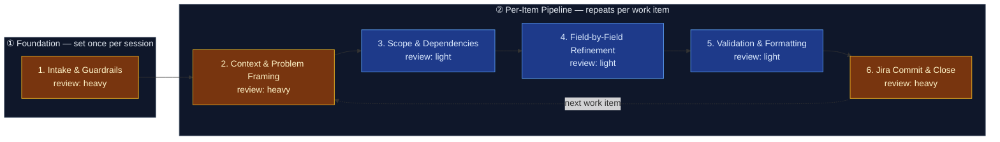

# AI-Augmented Refinement — Jira Work Item Pipeline

This flowspace produces high-quality, Jira-ready work items through disciplined,
step-by-step refinement with explicit confirmation and accountability at every
field boundary. The pipeline enforces the Technical Product / Service Owner
(TPSO) persona — prioritizing business and operational value, identifying risks
and dependencies, challenging incomplete requirements, and enforcing measurable
outcomes across the enterprise network infrastructure domain. Requirements are
grounded in the platform stakeholder register: every work item is tagged with
the stakeholders whose needs define it, the coalition it satisfies, and the
conflict axis it triggers (see `reference/platform-stakeholder-register.md`).

One run = one fully refined work item committed to Jira.

## Stage Flow Diagram

> Stages 2–6 carry their true review-intensity colors: each stage's skill is
> `truth-level: verified` and lives in `produced-skills/` (repo top level) —
> operator promotion 2026-07-03, accepting the agent pre-run of the
> five-point gate (spec review, simulated live test per adapter on synthetic
> data, trigger check, collision check) and the 1.2 revision-pass re-run as
> the review record; evidence in
> `skill-foundry/decision-log/2026-07-03-ai-refinement-skill-promotion.md`.
> The simulated live tests are not engine runs: the first on-engine
> invocation per adapter happens at deployment, which remains the operator's
> act at instantiation. See Known gaps.

## Stage table

| # | Stage | Review intensity | Max data-class | Sanctioned engines | Layer-3 |
|---|---|---|---|---|---|
| 1 | Intake & Guardrails | heavy | internal | Rovo, Copilot | inline — guardrails, persona from `reference/ai-refinement-hybrid.md`; schemas from `reference/work-item-schemas.md` (registry for all five refinable types) |
| 2 | Context & Problem Framing | heavy | internal | Rovo, Copilot | `context-elicitation` (verified, `produced-skills/`) |
| 3 | Scope & Dependencies | light | internal | Rovo, Copilot | `scope-dependency-mapper` (verified, `produced-skills/`) |
| 4 | Field-by-Field Refinement | light | internal | Rovo, Copilot | `field-refinement-cadence` (verified, `produced-skills/`) |
| 5 | Validation & Formatting | light | internal | Rovo, Copilot | `workitem-validation` (verified, `produced-skills/`) |
| 6 | Jira Commit & Close | heavy | internal | Rovo, Copilot | `jira-commit` (verified, `produced-skills/`) |

## Topology

- **Band ① Foundation** (Stage 1): Set once per refinement session. The user
  triggers refinement, acknowledges responsibility, confirms data-safety
  guardrails, and selects the work-item type from the hierarchy.
- **Band ② Per-Item Pipeline** (Stages 2–6): Repeats for each work item in
  the session. A run through this band takes one work item from raw context to
  a committed Jira issue. The loop-back from Stage 6 to Stage 2 fires when the
  user says "refine another item."

## Common source inputs

Operator-observed taxonomy (2026-07-03) of the raw material that most often
starts a run. All four types arrive request-shaped or solution-shaped — they
state a task or an action, not a problem — so Stage 1 screens them against the
data-safety guardrail and Stage 2's elicitation recovers the underlying problem
and value rather than transcribing the request.

| # | Input type | Typical carrier | Handling notes |
|---|---|---|---|
| 1 | Email with a direct request for support | Email thread pasted or summarized into the session | Requester maps to a stakeholder-register entry — start the Stage 2 sweep there. Emails routinely carry names and addresses: strip them before the material enters the session (Stage 1 data-safety screen). |
| 2 | Vendor details on required actions | Vendor bulletin, advisory, or notice | Third-party material — vet before ingesting. Prescribed actions are solution-shaped: elicit the internal problem and value before accepting them as scope. Stated deadlines feed `due_date`. The vendor is not a register entry — tag the internal owning stakeholder. |
| 3 | Meeting minutes, notes, or summaries | Notes pasted into the session | Multi-topic and multi-voice — may yield more than one work item (one run through Band ② each). Separate decisions from discussion; strip attributions per the data-safety screen. |
| 4 | Directly stated requirement from an engineer | Chat message ("I need to go do x, y, z to help ABC") | Task-first: the stated x/y/z are candidate scope, not the problem statement. Map the named stakeholder (ABC) to the register; elicit the problem and value before accepting the task list. |

## Surfaces

- **Primary:** Confluence — `<space set at instantiation; confirm the Mermaid
  macro is installed per the setup questionnaire, else the hub page notes
  "diagram: see mirror">`
- **Mirror:** `<internal repo>` → `flowspaces/ai-refinement/`

This public copy is the sanitized *design*; instantiation happens in employer
tenancy per `methodology/mirroring-protocol.md`. At instantiation, add the
per-stage `work/` folders (Layer-4, transient) and the `handoffs/` folder —
they are deliberately absent from this design copy because they only ever hold
per-run content.

## Run procedure

1. The user speaks a trigger phrase ("Run AI Refinement", "Start Refinement",
   "I want to refine").
2. Stage 1 activates: guardrails are presented, responsibility is acknowledged,
   and the user picks a work-item type from the refinable set — Solution Epic,
   Feature, Story, Task, or Spike. (The full hierarchy is Portfolio Epic →
   Solution Epic → Feature → Story | Task | Spike → Sub-Task; portfolio epics
   and sub-tasks are out of refinement scope and get redirected — see
   `reference/work-item-schemas.md`.)
3. Stages 2–5 walk the user through the selected work-item schema one field at
   a time, confirming each before advancing. The TPSO persona challenges
   incomplete requirements and enforces measurable outcomes throughout; the
   stakeholder register drives whose needs are elicited (Stage 2) and which
   coalition/conflict-axis annotations the item carries (Stage 3).
4. Stage 5 validates completeness against the schema and applies formatting
   rules (no bold, no emojis).
5. Stage 6 presents the finished artifact for final human approval, then
   commits it to Jira. The user may loop back to Stage 2 for the next item
   or end the session.

Human inspects at every stage boundary — that's the method, not an
inconvenience.

## Known gaps

All five skills demanded by this flowspace's Layer-3 triage are
`truth-level: verified` and live in `produced-skills/` — operator promotion
2026-07-03, evidence in
`skill-foundry/decision-log/2026-07-03-ai-refinement-skill-promotion.md`
(accepting the five-point-gate pre-run in
`skill-foundry/decision-log/2026-07-03-ai-refinement-skill-gate-prerun.md`);
the flowspace design's own promotion record is
`flow-foundry/decision-log/2026-07-03-ai-refinement-promotion.md`.
Remaining gap: deployment — no adapter is published to a live engine yet, so
the first on-engine invocation per adapter (the pre-run's simulated live
tests are not engine runs) and the instantiation-time surface checks happen
at deployment, the operator's act, recorded in each skill card.

| Skill (spec + adapters) | Primer brief | Target stage | Status |
|---|---|---|---|
| `context-elicitation` | `sp-context-elicitation` | 2 | verified — 1.2 (input-type steering); promoted 2026-07-03; deployment pending |
| `scope-dependency-mapper` | `sp-scope-dependency-mapper` | 3 | verified — promoted 2026-07-03; deployment pending |
| `field-refinement-cadence` | `sp-field-refinement-cadence` | 4 | verified — 1.2 (elicited due-date cadence); promoted 2026-07-03; deployment pending |
| `workitem-validation` | `sp-workitem-validation` | 5 | verified — promoted 2026-07-03; deployment pending |
| `jira-commit` | `sp-jira-commit` | 6 | verified — 1.3 (format translation, confirmed parent mapping, post-commit transition offer); promoted 2026-07-03; deployment pending |

Second gap (2026-07-03): the work-item schema registry
(`reference/work-item-schemas.md`) completes type coverage — the source
clipping defined only `solution_epic` and `feature`, leaving three of the five
selectable types unrunnable. The `story`, `task`, and `spike` schemas are
house-drafted at `to-review`: the operator ratifies the field sets (and the
two proposed spike fields, `question_to_answer` and `timebox`) and confirms
them against the real Jira project configuration at instantiation. The logged
follow-up — add the two spike fields to `jira-commit`'s custom-field list as a
1.2 revision — was applied 2026-07-03 at operator instruction, ahead of
ratification: `jira-commit` 1.2 now reads its field set from the registry per
selected type, so the schemas themselves remain the single surface awaiting
ratification. Rationale and assumptions:
`decision-log/2026-07-03-work-item-schema-extension.md`; revision evidence:
`skill-foundry/decision-log/2026-07-03-ai-refinement-skill-revision-pass.md`.

Third gap (2026-07-03): the first on-engine invocation (Rovo, NEADD-1827)
surfaced five operator-observed defects at the commit boundary — raw
Markdown reaching Jira fields, silent parent assignment with no user
confirmation, a fabricated due date, no post-creation status-transition
offer, and `story`/`spike` missing the board-required `type_of_work`/
`work_category` fields. All five are fixed in this revision pass:
`jira-commit` 1.2 → 1.3, `field-refinement-cadence` 1.1 → 1.2, the
`work-item-schemas` registry 1.0 → 1.1 (story/spike field addition — bundled
into the existing to-review ratification, not a separate approval), and
Stages 01/04/06 CONTEXT.md updated to match. Rationale, simulated live-test
re-run, and remaining operator items:
`decision-log/2026-07-03-stage06-feedback-revision.md` (flowspace-side) and
`skill-foundry/decision-log/2026-07-03-stage06-feedback-revision-pass.md`
(gate evidence).

## Reference material (Layer-3)

| Artifact | Location | Covers |
|---|---|---|
| AI Refinement — Hybrid Definition | `reference/ai-refinement-hybrid.md` (claimed clipping) | Guardrails, persona, hierarchy, source schemas (solution_epic, feature), workflow cadence, triggers |
| Work Item Schemas — Refinable Set | `reference/work-item-schemas.md` (to-review, house extension) | Schema registry for all five refinable types; story/task/spike extensions; portfolio_epic / sub_task out-of-scope declarations; extension field constraints |
| Platform Stakeholder Register | `reference/platform-stakeholder-register.md` (claimed clipping) | Stakeholder role-types, coalitions, conflict axes, escalation routing |
| Provenance spec | `methodology/provenance-spec.md` | Frontmatter rules for all artifacts |
| Governance & Audit | `methodology/governance-and-audit.md` | Gate requirements |
