# Documentarian — Documentation Production & Custody Pipeline

This flowspace produces, point-in-time updates, and maintains over time the
organization's operational documentation — SOPs, MOPs, runbooks, SADs (system
architecture documents and their diagrams), ServiceNow KB articles, and
meeting pages — from evidence already sitting in Jira, Confluence, meeting
transcripts, and delivered work. It is the companion practice to
`ai-refinement`: that flowspace refines work *items* into Jira; this one turns
finished and discussed work into *documentation*, and hands candidate work
items back to ai-refinement when documentation work surfaces them. Humans
drive it first — the flow builds most of each document and leaves marked-open
sections for the human to fill — and its custody stage is the seam where
agents eventually operate as standing custodians of the documentation
platforms.

One run = one documentation job (a close-out, a modernization pass, a SAD
update, a tree audit, or a meeting write-up), which may yield several
documents — the per-document pipeline loops until the job's work order drains.

## Stage Flow Diagram

```mermaid
flowchart LR
    subgraph F["① Foundation — set once per session"]
        style F fill:#0f172a,stroke:#475569,stroke-width:1px,color:#e2e8f0
        S1["1. Intake &amp; Routing<br/>review: heavy"]:::heavy
    end
    subgraph J["② Job Framing — once per job"]
        style J fill:#0f172a,stroke:#475569,stroke-width:1px,color:#e2e8f0
        S2["2. Evidence Gathering<br/>review: light"]:::gap
        S3["3. Doc Plan &amp; Template Match<br/>review: heavy"]:::gap
    end
    subgraph D["③ Per-Document Pipeline — repeats per document"]
        style D fill:#0f172a,stroke:#475569,stroke-width:1px,color:#e2e8f0
        S4["4. Draft &amp; Update<br/>review: light"]:::gap
        S5["5. Standards Validation<br/>review: light"]:::gap
        S6["6. Commit &amp; Link<br/>review: heavy"]:::gap
    end
    subgraph C["④ Custody &amp; Close — once per job"]
        style C fill:#0f172a,stroke:#475569,stroke-width:1px,color:#e2e8f0
        S7["7. Custody &amp; Close<br/>review: heavy"]:::gap
    end
    S1 --> S2 --> S3 --> S4 --> S5 --> S6
    S6 --> S7
    S6 -.->|"next document in work order"| S4

    classDef heavy fill:#78350f,stroke:#fbbf24,color:#fef3c7
    classDef light fill:#1e3a8a,stroke:#60a5fa,color:#dbeafe
    classDef gap   fill:#7f1d1d,stroke:#f87171,color:#fee2e2
```

> Stages 2–7 are colored `gap`, not by their review intensity: each stage's
> Layer-3 is `TBD — skill-primer-brief filed` (see Known gaps), and the
> diagram guide has `gap` override intensity on the diagram while the Stage
> table keeps the true intensities. Stage 1 is inline Layer-3 and carries its
> real `heavy` color.

## Stage table

| # | Stage | Review intensity | Max data-class | Sanctioned engines | Layer-3 |
|---|---|---|---|---|---|
| 1 | Intake & Routing | heavy¹ | internal | Rovo, Copilot | inline — guardrails, job-type routing, registry pointers (`reference/doc-type-registry.md`, `reference/documentation-standards.md`) |
| 2 | Evidence Gathering | light | internal | Rovo | `doc-evidence-gatherer` (verified, `produced-skills/`) |
| 3 | Doc Plan & Template Match | heavy² | internal | Rovo, Copilot | `doc-planner` (verified, `produced-skills/`) |
| 4 | Draft & Update | light | internal | Rovo, Copilot | `doc-drafter` (verified, `produced-skills/`); `sad-diagram-maintainer` (verified, `produced-skills/`) for the sad-update job type |
| 5 | Standards Validation | light | internal | Rovo, Copilot | `doc-standards-validator` (verified, `produced-skills/`); `provenance-stamper` (verified, `produced-skills/`) referenced for mirror-side artifact stamping |
| 6 | Commit & Link | heavy¹ | internal | Rovo | `confluence-page-commit` (verified, `produced-skills/`); ServiceNow write path deferred (`sp-servicenow-kb-commit`); ai-refinement handoff packaging inline per `reference/ai-refinement-handoff-contract.md` |
| 7 | Custody & Close | heavy³ | internal | Rovo | `doc-custodian` (verified, `produced-skills/`); archive-confirmation dialogue inline |

¹ First stage and commit boundary — heavy per the U-curve default,
unconditionally; never compressed.
² Deviation from the U-curve middle, with reason: Stage 3 decides *what
documentation gets built, updated, or archived* — a framing error here
cascades into every document the job produces, the same rationale as
ai-refinement Stage 02.
³ Last stage — heavy per the U-curve default, and independently justified:
archive and lifecycle calls are judgment, not mechanics.

## Topology

- **Band ① Foundation** (Stage 1): set once per session. The user triggers the
  flow, acknowledges responsibility, passes the data-safety screen, and
  selects the job type — `closeout`, `modernize`, `sad-update`, `tree-audit`,
  or `meeting` — agent-proposed with rationale when source material is
  available, user confirms or overrides. Stage 1 also loads the doc-type
  registry, identifies the target surface, and records grounding status.
- **Band ② Job Framing** (Stages 2–3): once per job. Stage 2 builds the
  job-type-steered evidence dossier; Stage 3 turns dossier + registry into the
  confirmed **doc work order** — the artifact that drives everything after it.
- **Band ③ Per-Document Pipeline** (Stages 4–6): repeats for each document in
  the work order. One pass takes one document from work-order line to
  committed page. The loop-back from Stage 6 to Stage 4 fires while work-order
  lines remain.
- **Band ④ Custody & Close** (Stage 7): once per job, after the document loop
  drains — registry bookkeeping, freshness stamping, confirmed archive moves,
  session close.

**No fast-track analog.** ai-refinement's fast-track compresses field
elicitation; here, Stage 4's open-section protocol is already the
collaboration dial — richer evidence means fewer open sections, thinner
evidence means more of the document is handed to the human. A separate mode
would duplicate that mechanism, so the omission is deliberate.

## Job types

Operator-defined routing set (2026-07-15). Stage 1 selects exactly one per
job; the job type steers Stage 2's gathering mode and shapes Stage 3's work
order. All five converge on the same Bands ③–④.

| Job type | Trigger | Primary evidence | Typical work order |
|---|---|---|---|
| `closeout` | A work item (or item tree) is closing/closed | The closed Jira item(s): fields, comments, linked pages, attachments | New/updated SOP, runbook, or KB article documenting what was built or done, with open sections where evidence runs out |
| `modernize` | An existing Confluence space needs to match house patterns | Page-tree inventory: content, metadata, labels, structure | Per-page update lines re-shaping content into the matched registry template |
| `sad-update` | A feature just delivered changes the architecture | The delivered feature's Jira items, design docs, PR/repo context | Updates to affected SAD sections and diagram sources |
| `tree-audit` | Scheduled or requested doc-hygiene pass over a tree | Full tree inventory + staleness signals + registry conformance scan | An audit report plus a (often large) work order: restructure moves, per-doc remediation lines, archive candidates |
| `meeting` | A meeting transcript or summary exists | The transcript/summary (strictest PII screen of the set) | One meeting page; links to discussed Jira items; candidate work items packaged for ai-refinement |

## Surfaces

- **Primary:** Confluence — `<documentation space set at instantiation;
  confirm the Mermaid macro is installed per the setup questionnaire, else
  the hub page notes "diagram: see mirror">`
- **Designed-for secondary:** ServiceNow KB (`kb_knowledge`) — declared, not
  connected. No sanctioned ServiceNow integration exists yet; until one does,
  ServiceNow-destined documents stop at Stage 6 as Confluence-staged, labeled
  for later transfer. See Known gaps.
- **Mirror:** `<internal repo>` → `flows/documentarian/`.

This public copy is the sanitized *design*; instantiation happens in employer
tenancy per `methodology/mirroring-protocol.md`. At instantiation, add the
per-stage `work/` folders (Layer-4, transient) and the `handoffs/` folder —
deliberately absent from this design copy because they only ever hold per-run
content.

## Run procedure

1. The user speaks a trigger phrase ("Run Documentarian", "Document this
   work", "Start a doc run").
2. Stage 1 activates: guardrails presented, responsibility acknowledged,
   source material screened (data-safety), job type selected — agent-proposed
   with rationale where source material allows, user confirms or overrides —
   the doc-type registry loaded, target surface identified, and grounding
   status recorded (no documentation-owners register exists yet, so ownership
   questions run in ungrounded mode: ask the user).
3. Stage 2 gathers the evidence dossier in the selected job type's mode;
   Stage 3 turns it into the doc work order — per document: create, update,
   or archive; matched doc type and template; the open-section plan; the
   Jira-link plan. The user confirms the work order line by line; this is the
   flow's direction-setting boundary.
4. Stages 4–6 run per document: draft or update against the matched template
   with open sections marked per
   `reference/collaborative-sections-protocol.md`; validate against the
   doc-type schema and `reference/documentation-standards.md`; then present a
   rendered dry-run preview and — on explicit approval — commit to Confluence
   with labels, page properties, position, and Jira remote links. Meeting
   jobs additionally package candidate work items per
   `reference/ai-refinement-handoff-contract.md`. The loop returns to Stage 4
   while work-order lines remain.
5. Stage 7 closes the job: doc-registry index updated, freshness and
   review-by dates stamped per `reference/custody-model.md`, archive moves
   executed only on per-item human confirmation, next custody review
   scheduled, session summary produced.

Human inspects at every stage boundary — that's the method, not an
inconvenience.

## Known gaps

> Per `methodology/governance-and-audit.md` §5a: each entry below is a
> pointer, not an archive — 1–3 sentences plus the decision-log citation
> that carries the full rationale.

**Gap closure (2026-08-01):** all seven skills below were built 2026-07-15
and re-gated/promoted `verified` 2026-08-01 following a simulated live
test per skill against its spec's seeded Review-criteria scenario;
`servicenow-kb-commit` remains deferred. Not closed: none of the seven has
had a true on-engine invocation. Evidence:
`skill-foundry/decision-log/2026-08-01-documentarian-skill-batch-promotion.md`.

| Skill | Primer brief | Target stage | Status |
|---|---|---|---|
| `doc-evidence-gatherer` | `sp-doc-evidence-gatherer` | 2 | verified — built and gated 2026-08-01; on-engine test pending |
| `doc-planner` | `sp-doc-planner` | 3 | verified — built and gated 2026-08-01; on-engine test pending |
| `doc-drafter` | `sp-doc-drafter` | 4 | verified — built and gated 2026-08-01; on-engine test pending |
| `sad-diagram-maintainer` | `sp-sad-diagram-maintainer` | 4 (sad-update jobs) | verified — built standalone (merge into `doc-drafter` declined), gated 2026-08-01; on-engine test pending |
| `doc-standards-validator` | `sp-doc-standards-validator` | 5 | verified — built and gated 2026-08-01; on-engine test pending |
| `confluence-page-commit` | `sp-confluence-page-commit` | 6 | verified — built and gated 2026-08-01; on-engine test pending |
| `doc-custodian` | `sp-doc-custodian` | 7 | verified — built and gated 2026-08-01; on-engine test pending |
| `servicenow-kb-commit` | `sp-servicenow-kb-commit` | 6 (ServiceNow path) | **deferred** — designed-for gap; no sanctioned ServiceNow integration exists; brief filed 2026-07-15 so the gap stays registry-visible |

Second gap: no stakeholder register exists for the documentation domain —
doc-ownership and audience questions run in **ungrounded mode** until one
is instantiated from
`icp-flows/ai-refinement/reference/platform-stakeholder-register-template.md`.
Recorded in `decision-log/2026-07-15-scaffold-triage.md`.

Third gap: deployment. Nothing here has run on-engine; publishing to
Confluence, deploying Rovo agents, and the first on-engine run per skill
happen at instantiation, per `reference/confluence-instantiation-guide.md`
(prepared, not executed).

## Reference material (Layer-3)

| Artifact | Location | Covers |
|---|---|---|
| Doc-Type Registry | `reference/doc-type-registry.md` (verified, house-drafted) | Schema registry for the six governed doc types (sop, mop, runbook, sad, kb-article, meeting-notes): required sections, metadata, surface mapping, default open sections; out-of-scope table |
| Documentation Standards | `reference/documentation-standards.md` (verified, house-drafted) | The Stage 5 baseline: naming, structure, labeling, link hygiene, staleness thresholds, archive criteria |
| Collaborative Sections Protocol | `reference/collaborative-sections-protocol.md` (verified, house-drafted) | Open-section marker syntax, ownership, resolution rules, and the Stage 6 waiver gate |
| AI-Refinement Handoff Contract | `reference/ai-refinement-handoff-contract.md` (verified, house-drafted) | The meeting job type's candidate-work-item output, shaped as ai-refinement Stage 01 input |
| Custody Model | `reference/custody-model.md` (verified, house-drafted) | Doc-registry index shape, freshness signals, archive procedure, standing-custodian operating notes |
| Confluence Instantiation Guide | `reference/confluence-instantiation-guide.md` (verified, house-drafted) | Page-tree structure, property mapping, and operator checklist for Confluence migration and Rovo deployment — prepared, not executed |
| Flow Primer Brief | `flow-foundry/backlog-flow-starters/fp-documentarian.md` | Original crystallized intent this flowspace was built from |
| Provenance spec | `methodology/provenance-spec.md` | Frontmatter rules for all artifacts |
| Governance & Audit | `methodology/governance-and-audit.md` | Gate requirements |
| Mirroring Protocol | `methodology/mirroring-protocol.md` | Confluence⇄git mapping; handoff artifact shape (§5) |
