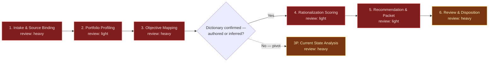

# Jira Portfolio Rationalization — Hygiene & Objective Alignment Review

This flowspace turns a whole Jira project or space into a prioritized,
evidence-carrying portfolio review pack. It profiles the portfolio's shape,
maps every work item to the organization's strategic objective areas through a
transparent keyword dictionary, scores each item for closure risk across five
observable dimensions, and hands the operator a per-item disposition packet
routed to the people who own the work.

It runs against either a **live Jira project/space** or an **export of the same
data** — Stage 01 normalizes both into one canonical item set, and every stage
downstream reads that set rather than the raw source. Because a backlog's
strategic parents often sit on a different board — an ART (Agile Release
Train) board holding the portfolio and solution epics that drive several
feature-delivery team projects is the common shape — Stage 01 also looks for
those connected spaces and, on the operator's say-so, resolves just enough of
them to complete the chain. Stage 02 turns that chain into a Portfolio →
Solution → Feature hierarchy diagram and calls out how many items have no
resolvable parent.

The flow's governing principle: **do not close work simply because it is old.**
Closure pressure comes only when multiple weak signals line up — old age, stale
updates, weak objective alignment, low field completion, non-delivery status,
overdue dates. The close-score model enforces this structurally through its
corroboration rule (`reference/close-score-model.md`), not as advice.

One run = one portfolio review cycle.

**What this flow does not do:** it does not decide what to close. Its terminal
output is a triage recommendation with the evidence behind it, for human
governance review. It writes nothing to Jira at any stage.

## Stage Flow Diagram

> Stages 1–5 carry the `gap` color, not their review-intensity color: each
> one's Layer-3 is `TBD — brief filed`, and the palette convention
> (`flow-foundry/references/flow-diagram-guide.md`) is that `gap` overrides on
> the diagram while the Stage table keeps the real review intensity. Stage 6 is
> an inline one-off with no skill dependency, so it shows its true `heavy`.
> When the five briefs are built and promoted, these nodes take their table
> colors: heavy, light, heavy, light, light.
>
> The diamond after Stage 3 is this flowspace's one genuine topology split,
> per `flow-foundry/references/flow-diagram-guide.md`'s branch allowance —
> reached only when no dictionary (authored or inferred) is confirmed. The
> dashed edge to `3P` marks that branch; the flat chain resumes at Stage 4
> on the normal path. `3P` shows `:::heavy` rather than `:::gap` because its
> Layer-3 is `inline`, not `TBD`.

The chain is flat except for the one documented branch after Stage 3 — no
other bands, no loop-back. A cycle runs Stage 01 through Stage 06 once, over
the whole portfolio, and ends — or, on the pivot branch, ends at Stage 3P
instead. There is no per-item loop: every stage operates on the full item
set, not one item at a time.

## Stage table

| # | Stage | Review intensity | Max data-class | Sanctioned engines | Layer-3 |
|---|---|---|---|---|---|
| 1 | Intake & Source Binding | heavy | internal | Rovo, Copilot | `TBD — skill-primer-brief filed (sp-jira-portfolio-ingest)` |
| 2 | Portfolio Profiling | light | internal | Rovo, Copilot | `TBD — skill-primer-brief filed (sp-portfolio-profiler)` |
| 3 | Objective Mapping | heavy¹ | internal | Rovo, Copilot | `TBD — skill-primer-brief filed (sp-objective-keyword-mapper)` |
| 3P | Current State Analysis (pivot)² | heavy | internal | Rovo, Copilot | inline (one-off) |
| 4 | Rationalization Scoring | light | internal | Rovo, Copilot | `TBD — skill-primer-brief filed (sp-closure-scorer)` |
| 5 | Recommendation & Disposition Packet | light | internal | Rovo, Copilot | `TBD — skill-primer-brief filed (sp-disposition-packet-builder)` |
| 6 | Review & Disposition Capture | heavy | internal | Rovo, Copilot | inline (one-off — the disposition taxonomy and capture protocol are specific to this flowspace) |

¹ Stage 3 breaks the U-curve default (heavy at the ends, light in the middle)
with stated cause: objective mapping is the highest-judgment content in the
flow and feeds 40 of the model's ~100 points. A mis-mapped item arrives at
Stage 4 as a weak-alignment signal worth up to 40 closure points, and no
downstream stage can distinguish "genuinely unaligned" from "badly matched."
The dictionary is also the one input that encodes organizational strategy
rather than observable Jira facts, so it earns human attention every cycle.

² Reached only when Stage 3's tiered resolution
(`03-objective-mapping/CONTEXT.md`, steps 3–5) ends without a confirmed
dictionary — no operator-authored one, and no inferred one the operator
confirmed. A cycle either continues 3 → 4 → 5 → 6, or ends at 3P — never
both. See `03p-current-state-analysis/CONTEXT.md`.

## Source-repo

- **Source-repo:** `<internal GitLab repo>` → `flowspaces/portfolio-rationalization/`
  — set at instantiation; the sole source of truth for the instance
  (`methodology/mirroring-protocol.md`).
- **External systems touched:** **Jira** — one project or space per cycle,
  **read-only**, at Stage 01 only (live-binding path). No Confluence
  dependency. No stage writes to any external system.

This public copy is the sanitized *design*; instantiation happens in employer
tenancy. At instantiation, add the per-stage `work/` folders (Layer-4,
transient — they hold each cycle's actual portfolio data) and the `handoffs/`
folder. Both are deliberately absent here because they only ever hold per-run
content.

**Also set at instantiation:** the objective dictionary. This design copy ships
only the domain-neutral mold
(`reference/objective-dictionary-template.md`) — the real objective areas,
their keyword sets, and their weights are organizational strategy content and
live in the instance, never here.

## Run procedure

1. The operator opens a cycle with a trigger phrase ("Run Portfolio
   Rationalization", "Start a portfolio review", "Rationalize the backlog") and
   names the target Jira project or space.
2. **Stage 01** establishes the source binding — live Jira or an export — runs
   the data-class screen, checks the required-field set against what the source
   actually carries, and emits the normalized item set with a field-availability
   report. Missing fields are recorded as degraded-signal warnings, not
   blockers: the flow runs with fewer signals and says which. It then checks
   whether this backlog's own `Parent key` values point outside the bound
   project — the ART-board pattern, where one board holds the portfolio and
   solution epics driving several feature-delivery team projects — and, if so,
   offers to resolve just those specific parent keys (never a second
   whole-project query) so Stage 02 can draw the full hierarchy.
3. **Stage 02** profiles the portfolio and stops before judgment. It presents
   the distributions, builds a Portfolio Epic → Solution Epic → Feature →
   child hierarchy diagram from `Issue Type`/`Parent key` (folding in
   anything Stage 01 resolved from a connected space) with orphan and
   dangling-reference counts called out by type, and then offers the
   exploration lenses — status, assignee workload, due dates and risk,
   priority, labels, custom fields — so the operator inspects the shape
   before anything is scored. This ordering is deliberate and is the stage's
   whole point.
4. **Stage 03** loads the instance's objective dictionary and maps every item,
   emitting mapped area, confidence, score, matched keywords, and any secondary
   possible match. Items with no clear alignment land in `Needs objective
   review` — a flag that an item needs stronger wording or stakeholder
   confirmation, explicitly **not** a closure verdict. If neither an authored
   nor a confirmed inferred dictionary is available, the cycle does not
   halt: it pivots to a Current State Analysis
   (`03p-current-state-analysis/CONTEXT.md`) and ends there instead of
   continuing to Stage 04.
5. **Stage 04** applies the close-score model and produces a ranked list where
   every score carries its per-dimension breakdown. A score without its
   breakdown is an invalid output.
6. **Stage 05** bands the scores into the recommendation taxonomy, builds a
   per-item disposition packet, and routes packets by assignee into an outreach
   list.
7. **Stage 06** is the human loop: owners validate their items, each reviewed
   item gets a captured disposition (close, merge, rewrite, re-scope, or keep)
   with rationale, and dictionary-revision feedback is recorded for the next
   cycle. The cycle closes with a summary and the decisions recorded in the
   instance's `decision-log/`.

Human inspects at every stage boundary — that's the method, not an
inconvenience. Stage 02's lens offer and Stage 06's owner validation are the
two places where that inspection is the stage's actual work rather than a gate
on it.

## Known gaps

**All five Layer-3 dependencies are built but unpromoted.** Every stage but
Stage 06 still reads `TBD — brief filed` in its contract, and that stays true
until the operator promotes: the five skills were authored on 2026-07-28
(`skill-foundry/decision-log/2026-07-28-portfolio-rationalization-skill-batch.md`)
and are staged in `skill-foundry/review-skills/` at `truth-level: to-review`,
each with a `SKILL.md` plus Rovo and Copilot adapters. **Nothing has run
on-engine** — the five-point gate's live test is open
(`…-skill-gate-prerun.md`). Until the five clear that gate and are promoted to
`produced-skills/`, running this flow still means an agent executing the stage
contracts directly rather than invoking skills.

| Skill | Primer brief | Target stage | Status |
|---|---|---|---|
| `jira-portfolio-ingest` | `sp-jira-portfolio-ingest` | 1 | built — staged in `review-skills/`, not promoted |
| `portfolio-profiler` | `sp-portfolio-profiler` | 2 | built — staged in `review-skills/`, not promoted |
| `objective-keyword-mapper` | `sp-objective-keyword-mapper` | 3 | built — staged in `review-skills/`, not promoted |
| `closure-scorer` | `sp-closure-scorer` | 4 | built — staged in `review-skills/`, not promoted |
| `disposition-packet-builder` | `sp-disposition-packet-builder` | 5 | built — staged in `review-skills/`, not promoted |

**Score calibration is unratified (operator gate).** The close-score model's
ramps in `reference/close-score-model.md` were inferred from five data points
the operator described from an existing analysis workbook, not derived from its
formulas. They reproduce the described top-ranked item closely — 101 against an
observed 102 — but no ramp has been validated against a full cycle of real
data. Calibrating against one real cycle, and confirming the band thresholds
produce a review volume the governance process can actually absorb, is an
operator act before the first live run. Until then every number in that file is
a proposal.

**Recommendation label rename, pending ratification.** The source taxonomy's
top band was `Closed`. This design renames it `Close (recommended)` because
`Closed` reads as a Jira status and invites the reading that the flow already
closed something — which it cannot do, having no write path. Proposed per
`AGENTS.md` rule 7, not minted; the operator ratifies or reverts. Rationale:
`flow-foundry/decision-log/2026-07-28-portfolio-rationalization-triage-and-scaffold.md`.

**Objective dictionary does not exist yet — no longer a run-blocking gap,
still an unresolved input.** The mold is here; the instance's actual
objective areas are not. Stage 03 now attempts to infer a candidate
dictionary from the portfolio's own vocabulary and Component/Label/Epic-Link
structure when none is supplied, and presents it for operator confirmation
(`reference/objective-dictionary-template.md` §9). If the operator cannot
confirm an inferred dictionary and has none of their own, the cycle pivots
to `03p-current-state-analysis/` rather than halting. This closes the
"nothing happens" failure mode but not the underlying gap: a
governance-grade recommendation cycle (Stages 04–06) still requires a
dictionary someone stands behind, authored or inferred-and-confirmed.
Authoring one, or confirming an inference, remains an operator act.

**Field-completion denominator, unresolved.** The design captures the column
count per cycle rather than fixing it, because export column counts vary by
Jira configuration. Whether to further exclude always-empty system columns from
the denominator — making completion percentages comparable across cycles but
not across configurations — is an open question carried from the intake brief.

## Reference material (Layer-3)

| Artifact | Location | Covers |
|---|---|---|
| Objective Dictionary — Template | `reference/objective-dictionary-template.md` (template) | Domain-neutral mold for authoring objective areas, keyword sets and weights, confidence thresholds, tie-break and secondary-match rules, the `Needs objective review` floor, and (§9) the method for inferring a candidate dictionary from the portfolio itself when none is supplied |
| Close-Score Model & Recommendation Taxonomy | `reference/close-score-model.md` (to-review) | The five scoring dimensions with ceilings and ramps, the corroboration rule, the four recommendation bands, worked synthetic examples |
| Export & Field Requirements | `reference/export-and-field-requirements.md` (to-review) | Required field set, live-Jira ⇄ export parity contract, normalization rules, field-completion denominator rule, degraded-signal handling |
| Provenance spec | `methodology/provenance-spec.md` | Frontmatter rules for all artifacts |
| Governance & Audit | `methodology/governance-and-audit.md` | Gate requirements |
| Work Item Schemas | `icp-flows/ai-refinement/reference/work-item-schemas.md` | Jira field names, type hierarchy, and label conventions this flow reads (never writes) |
