# Accomplishments Drafter

Stage 4 of `accomplishments-digest` — the synthesis point where three
separate inputs (a framing brief and two gather digests) become one readable
document. It is pure synthesis: no external query, no new content beyond what
its three inputs already state. It hands off a draft, never a published
document — Stage 5's human edit pass is what makes the result shareable.

## Flow Diagram

```mermaid
flowchart LR
    Start(["Trigger: Stage 1 framing brief +<br/>Stage 2 Jira digest + Stage 3<br/>Confluence digest, all three present"]):::start --> R["Step 1 — Read all three inputs<br/>Framing brief is load-bearing,<br/>not optional context"]:::process
    R --> S["Step 2 — Structure by theme<br/>House shape; never 'Jira'/'Confluence'<br/>as section headers"]:::process
    S --> E["Step 3 — Emphasize Stage 1 items<br/>First placement within their theme,<br/>not folded in anonymously"]:::process
    E --> M["Step 4 — Match audience<br/>Tone/detail per Stage 1's<br/>stated audience"]:::process
    M --> F["Step 5 — Carry forward flags<br/>Every thin-coverage/unavailable-signal<br/>note from Stages 2–3"]:::process
    F --> X{"Excluded item present<br/>anywhere in draft?"}:::decision
    X -->|Yes| H["Halt — remove and re-check<br/>supporting detail, not just headlines"]:::halt
    X -->|No| Output(["Output: draft accomplishments document<br/>(work/04-draft.md)"]):::output
    H --> X

    classDef start fill:#1e293b,stroke:#94a3b8,color:#f1f5f9
    classDef process fill:#1e3a8a,stroke:#60a5fa,color:#dbeafe
    classDef decision fill:#78350f,stroke:#fbbf24,color:#fef3c7
    classDef output fill:#14532d,stroke:#4ade80,color:#dcfce7
    classDef halt fill:#7f1d1d,stroke:#f87171,color:#fee2e2
```

## Triggering intent

- **Fires on:** Stage 4 of `accomplishments-digest`, given all three of Stage
  1's framing brief, Stage 2's Jira digest, and Stage 3's Confluence digest.
- **Does not fire on (near-misses):** gathering the source digests (that's
  the two gatherer skills); the engineer's final review/edit pass (Stage 5
  stays human, inline — this skill produces a draft, not a published
  document); drafting any document that isn't shaped by this flow's specific
  three-input contract.

## Method

1. **Read all three inputs.** Do not draft from only the two gather digests —
   the framing brief carries the engineer's own narrative and audience
   framing; a draft built without it reads as an automated tracker export
   with the engineer's voice missing.
2. **Structure by theme**, per
   `flow-foundry/review-flowspaces/accomplishments-digest/reference/accomplishments-document-shape.md`
   — themes/initiatives as the top-level structure, never "Jira" and
   "Confluence" as section headers. Where the same working area appears in
   both digests under slightly different names, merge under one theme
   heading rather than duplicating it.
3. **Give Stage 1's self-identified top items visible emphasis** — first
   placement within their theme, or an explicit lead sentence, never folded
   in anonymously among tracker-sourced items of lesser weight. Worked
   example: if Stage 1 named "led the vendor migration" as a top item and it
   maps to a theme also containing three smaller tickets, the migration
   opens that theme's bullets, not a mid-list mention.
4. **Match tone and detail to Stage 1's stated audience** — a manager-only
   doc stays terse; a promo-committee doc typically carries more supporting
   detail per theme. The audience answer sets this, not a fixed length.
5. **Carry forward every flag** from Stages 2–3 (thin-coverage themes,
   "not found" trace-check results, "collaboration signal unavailable") as
   an explicit line in the draft's Notes section — never silently smoothed
   over. Omit the Notes section only if there is truly nothing to carry
   forward.
6. **Run the exclusion-list check** against the complete draft, not just
   headline items: confirm nothing from Stage 1's exclusion list appears
   anywhere — including inside supporting detail pulled from a ticket or page
   that mentioned the excluded item in passing. This is the known failure
   mode: an excluded item resurfacing because it was buried in a source
   digest's supporting detail rather than as the section's own headline.
   Remove and re-check until the draft is clean.

## Inputs and grounding

Reads: the three Layer-4 working artifacts from Stages 1–3 of a single run —
`work/01-framing-brief.md`, `work/02-jira-digest.md`,
`work/03-confluence-digest.md`. Grounding rules: every theme and bullet in
the draft must trace to at least one entry in Stage 2's or Stage 3's digest,
or to Stage 1's own narrative directly — no content invented beyond what
these three inputs state; this skill performs no external query of its own.

## Data boundary

- Max data-class: internal (inherits the classification of its three
  inputs; does not independently query any external system).
- Sanctioned engines: Rovo or Copilot, either is fine for `internal` content
  — this stage is pure synthesis, so no Atlassian-native-access constraint
  applies the way it does for the two gatherer skills.

## What this skill is not

- **Not a gatherer** — it consumes already-gathered digests; it never
  queries Jira or Confluence itself.
- **Not the final review** — its output is a draft for the engineer's Stage
  5 edit pass, never treated as ready to publish or share as-is.
- **Not a general drafting tool** — it only produces documents shaped by this
  flow's specific three-input contract.

## Review criteria

A single output of this skill is acceptable when:

1. The draft is structured by theme/initiative; no section is headed "Jira"
   or "Confluence."
2. Every Stage 1 self-identified top item receives first placement or a
   clearly visible lead position within its theme.
3. Overall tone and level of supporting detail matches Stage 1's stated
   audience.
4. Every thin-coverage or signal-unavailable flag from Stages 2–3 appears as
   an explicit Notes-section line — none silently dropped.
5. Zero mentions of any item on Stage 1's exclusion list anywhere in the
   draft, including within supporting detail — not just absent as a headline.
6. Every theme traces to at least one Stage 2 or Stage 3 digest entry, or to
   Stage 1's own narrative — no fabricated content.

## Adapters

| Engine | Artifact | Generated from spec version |
|---|---|---|
| Rovo | adapters/rovo-agent.md | 1.0 |
| Copilot | adapters/copilot-prompt.md | 1.0 |

## Changelog

- **1.0** (2026-07-14) — Initial build from `sp-accomplishments-drafter`.
