# Bulk Child Creation

The volume path into the `ai-refinement` pipeline. Where the Band ② loop takes
one item from raw context to a committed Jira issue through six gates, this
skill takes a set the user has *already decided on* and creates it in one
reviewed pass — drafting each item's required fields to house standard,
enforcing the same schemas, labels, and formatting a single-item run would,
and compressing only the cadence. It replaces hand-creating a list of tasks
directly in Jira, and replaces running Band ② fourteen times for a
fourteen-row spreadsheet.

Its neighbors: `value-decomposition` decides *what* the children should be and
hands this skill a set; the Band ② skills (`context-elicitation` onward) refine
one item deeply; `jira-commit` remains the only skill that writes, and this
skill drives it per item rather than replacing it. The line this skill holds,
and the reason it is a skill rather than a mode flag, is step 5: it stops at
the edge of the evidence instead of padding a thin row into a full-looking
work item.

## Flow Diagram

```mermaid
flowchart LR
    Start(["Trigger: list-shaped input<br/>or accepted child set"]):::start --> R["Step 1 — Recognize and propose<br/>State count, per-row type,<br/>and the reasoning"]:::process
    R --> SC{"Step 2 — One item or<br/>a set?"}:::decision
    SC -->|"one item,<br/>many scope bullets"| RD["Redirect — single-item<br/>Band 2 refinement"]:::halt
    SC -->|"a set"| ACK{"Step 3 — Bulk<br/>acknowledgment given?"}:::decision
    ACK -->|No| H1["Stop — nothing<br/>ingested or created"]:::halt
    ACK -->|Yes| I["Step 4 — Ingest and normalize<br/>Parse, collapse repeats, confirm<br/>count, data-class screen"]:::process
    I --> D["Step 5 — Draft required fields<br/>From provided context only"]:::process
    D --> E{"Step 6 — Detail<br/>exhausted?"}:::decision
    E -->|"row underspecified"| U["Name it underspecified<br/>with its missing fields —<br/>never pad it"]:::halt
    U -.->|"user supplies detail<br/>or drops the row"| D
    E -->|"set grounded"| S["Step 7 — Optionally offer<br/>suggested next items<br/>separate set + accuracy warning"]:::process
    S --> V["Step 8 — Present whole set<br/>accept all / edit / reject some / stop"]:::process
    V --> W{"Step 9 — Write path<br/>available?"}:::decision
    W -->|No| MD["Produce Markdown handoff<br/>document — nothing created"]:::halt
    W -->|Yes| X["Step 10 — Create sequentially<br/>Native Jira tooling first;<br/>halt on failure, running result table"]:::process
    X --> P["Step 11 — Post-creation<br/>parent validation + review notice"]:::process
    P --> Output(["Output: created keys + URLs,<br/>or handoff document"]):::output

    classDef start fill:#1e293b,stroke:#94a3b8,color:#f1f5f9
    classDef process fill:#1e3a8a,stroke:#60a5fa,color:#dbeafe
    classDef decision fill:#78350f,stroke:#fbbf24,color:#fef3c7
    classDef output fill:#14532d,stroke:#4ade80,color:#dcfce7
    classDef halt fill:#7f1d1d,stroke:#f87171,color:#fee2e2
```

## Triggering intent

- **Fires on:** Stage 01 of `ai-refinement`, when the input reads as a *set* of
  items whose identity is already decided — a CSV/XLSX or attached file listing
  work items; a pasted table, numbered list, or bulleted list with one item per
  row; vendor documentation or a URL enumerating required actions; a
  conversational turn naming several discrete pieces of work; or an accepted
  `value-decomposition` child set the user wants created rather than refined one
  at a time. Also on explicit phrasings: "build them all," "create all of
  these," "make these tasks," "go create the features for this epic." The two
  shapes this was built for: a solution epic with its child features, and many
  tasks or stories under one feature.

  Bulk mode is **inferred from the input's shape and proposed**, not waited for
  as a command. The user always makes the final call and may force single-item
  refinement regardless.

- **Does not fire on (near-misses):**
  - **One complex item with many scope bullets** — the most likely misfire, and
    the one to guard hardest. Twelve bullets describing facets of one outcome
    are one item's `in_scope`, not twelve items. See the worked example in
    Method step 2.
  - Two or three items surfacing from meeting minutes — ordinary sequential
    Band ② runs, unchanged.
  - Deciding *what* the children should be — `value-decomposition` owns that,
    including its vertical-slice and MVP rules; this skill takes a set that
    already exists.
  - Bulk editing, closing, labeling, or transitioning **existing** Jira issues —
    this skill only creates. Reading an existing portfolio is
    `jira-portfolio-ingest`, which writes nothing.
  - A single item the user wants refined properly — Band ② is the better path
    and the skill says so rather than absorbing the work.
  - `sub_task` at any volume — out of the pipeline per the schema registry's
    out-of-scope table; sub-tasks are created directly in Jira under a
    committed parent.

## Method

1. **Recognize and propose.** State plainly why the input reads as a set: how
   many items were counted, what type each row appears to be, and what in the
   material carries that reading. Propose bulk creation as a mode. The user
   confirms, corrects the count or the per-row types, or declines to
   single-item refinement. Never select the mode on the user's behalf.

   Bulk composes with fast-track rather than replacing it: where the supplied
   context is rich enough to draft most fields with confidence, the two run
   together, and the mode confirmation says so.

2. **Distinguish a set from one item — the hard test.** Before proposing
   anything, apply it: *would each row stand alone as a work item with its own
   acceptance criteria?* If the rows are facets of one outcome, this is one
   item with a populated `in_scope`, and the answer is a single Band ② run.

   *Worked example.* A document listing "Upgrade the core switches," "Upgrade
   the distribution switches," "Upgrade the access switches," each with its own
   site list and maintenance window, is three items — each stands alone, each
   gets its own acceptance criteria. A document listing "Update firmware,"
   "Validate routing tables," "Confirm monitoring coverage," "Roll back if
   BGP fails" under a heading naming one switch upgrade is **one** item —
   those are scope lines and a rollback condition for a single piece of work.
   When the reading is genuinely ambiguous, say which reading was taken and
   why, and let the user correct it before anything is drafted.

3. **Take the bulk acknowledgment — separate, never bundled.** Per the
   flowspace's `bulk_creation_acknowledgment` house amendment. The user answers
   the mode question, then acknowledges, as two distinct acts; a single "yes"
   never satisfies both. The acknowledgment states the item count, that one
   approval creates all of them, that the items are AI-drafted and may be
   incorrect or mis-scoped, that every item must be reviewed by the team before
   work starts, that the `refine-ai-flow-v<version>` label is the pending-review
   flag whose removal signals review is done, and that creation is not
   reversible by this flow. No ingest and no drafting happens before it.

4. **Ingest and normalize the set.** Accept the carrier the user has:

   - **CSV / XLSX / attached file.** Parse with a real, quote-honoring reader —
     embedded newlines and delimiters inside description fields are routine and
     a naive line-split produces phantom rows. Capture the header row before
     parsing bodies; it is the field map's left-hand side. Collapse repeated
     columns with identical headers into one canonical field. Confirm the
     parsed item count against the user's stated expectation; a mismatch halts,
     because it means the scope, the filter, or the parse is wrong.
   - **Pasted content.** Tables, numbered lists, bulleted lists — same
     normalization, count confirmed the same way.
   - **Vendor URLs and documentation.** Third-party material: vet before
     ingesting and confirm safe at data-class `internal`, per the source-input
     taxonomy's handling of vendor bulletins. Prescribed actions are
     solution-shaped — they name tasks, not problems, which is exactly the
     shape this skill serves, but the internal owning stakeholder is tagged,
     not the vendor.
   - **Conversation.** The user describing several pieces of work in one turn
     is a valid carrier; restate the extracted set for confirmation before
     drafting, since conversational sets are the easiest to miscount.

   Then **run the data-class screen before the rows are typed any further** —
   before drafting, before mapping. Exports are the higher-risk carrier: every
   column comes along, and description and comment columns routinely carry
   personal names, customer references, hostnames, and occasionally credentials
   pasted into a ticket by someone in a hurry. Content above the sanctioned
   ceiling halts the run; it is not redacted and carried forward, because
   redaction at batch volume is not reliably verifiable.

   Map each row to a work-item type and load that type's required field set
   from the flowspace's `reference/work-item-schemas.md`. A mixed-type set is
   permitted (a feature's children may legitimately include stories, tasks, and
   a spike); the per-row type reading from step 1 governs, as corrected by the
   user.

5. **Draft required fields from the provided context only — and stop when it
   runs out.** This is the skill's quality bar and the reason it exists as a
   distinct skill rather than a flag on the existing pipeline.

   For each row, fill the type's required schema fields to the best of the
   available grounding: the row's own content, the parent item's content, the
   supporting-context documents in the session, and the user's stated intent.
   Cite which part of the source each drafted field came from, the same way
   fast-track extraction does.

   When the provided detail runs out, **stop generating and say so.** Do not
   pad a one-line row into a full-looking work item. An item that cannot be
   grounded is reported as **underspecified**, naming the specific fields that
   have no basis, and the user either supplies the detail or drops the row from
   the set. A batch of forty plausible-looking items where fifteen were
   invented is the single most damaging output this skill could produce — worse
   than a batch of twenty-five with fifteen honestly flagged, because the
   fabrications are indistinguishable from the grounded items at review time.

   Acceptance criteria stays a hard schema gate for every item, identical to a
   single-item run. Bulk changes cadence, never standards.

6. **Due dates anchor on the parent.** Where the set is being created beneath a
   parent that carries a due date, that date is the batch's reference point and
   is stated as such — the parent's commitment is what the children serve.
   Where a user-supplied sheet carries a per-row due-date column, those dates
   are **user-committed** and are used as given: the user authored the sheet.
   Where neither exists, elicit one date for the batch explicitly, as the
   flowspace's `due_date_elicitation` amendment requires. A date the agent
   derives from prose is a reference point only and is never used as a
   commitment.

7. **Optionally offer suggested next items — opt-in, separated, warned.**
   Having stopped at the edge of the evidence in step 5, the skill may *offer*
   to suggest likely further work items the set appears to be missing: drawing
   on the value-delivery model's vertical-slice and MVP framing, general domain
   knowledge, and internet sources where the session can reach them.

   Three rules, none of them optional:
   - **Opt-in.** Offered as a question, never produced unasked.
   - **Structurally separate.** Suggested items are presented as their own
     labelled set, never merged into the grounded set, and stay separate
     through review and creation so a reviewer can always tell which is which.
   - **Warned explicitly.** They carry a plain statement that these are
     inferred rather than drawn from the user's material, and that their
     relevance and accuracy need close attention before acceptance — a stronger
     caution than the batch acknowledgment, because these items have no
     grounding in anything the user supplied.

   Internet sources, where used, are read-only, cited, and vetted as
   third-party material on the same terms as vendor documentation in step 4.
   Anything retrieved that cannot be cited is not used.

8. **Present the whole set for one review.** Grounded set first, underspecified
   rows named with their gaps, suggested set last and labelled. The user may
   **accept all, edit some, reject some, or stop entirely** — the same verdict
   vocabulary `value-decomposition` uses, and a stop creates nothing. No item is
   created without an explicit verdict covering it. Restate the item count and
   the review caution here, at the approval point, with the concrete final
   number.

9. **Check the write path before promising anything.** If no Jira write path
   exists — no native engine action, no sanctioned connector — go straight to
   step 12's handoff document rather than attempting creation.

10. **Create sequentially through native tooling first.** On Rovo, the built-in
    Jira MCP create-issue and issue-link actions, with authentication and field
    resolution handled by the platform; on engines without them (Copilot), the
    workspace's sanctioned Jira integration. Each item is created to the same
    standard a single-item run would produce: registry-driven field mapping,
    Markdown translated to the platform's native markup, the
    `refine-ai-flow-v<version>` provenance label on every item, and the
    `<team_code>-<yyyy>-q<n>` planning label on every gated type
    (`feature`, `story`, `task`, `spike`, `bug`).

    Maintain a **running result table** — item, key, URL, status — visible as
    creation proceeds.

    **On any failure, halt the batch.** Do not continue past an error into the
    remaining items. Report precisely what was created and what was not, then
    offer resume-from-failure or abort. There is no rollback; items created
    stay created, and the acknowledgment in step 3 said so before approval. The
    user must never be left uncertain about what landed in Jira.

11. **Validate parents after creation, not per item before it.** Parent linkage
    for a bulk set is confirmed once for the batch — "all N items take parent
    X" as one explicit act — and **validated at the end of the pass**, when the
    created set can be checked against the intended parent together. A parent
    link is editable after creation, which is what makes end-of-pass validation
    sufficient here; an item whose row named a different parent is surfaced
    individually rather than absorbed into the batch default. Close by
    restating that every created item carries the provenance label as a
    pending-review flag and needs team review before work starts.

12. **Degrade to a Markdown handoff document.** When the tools cannot create
    the items — no write path, insufficient permissions, or repeated failures
    mid-batch — offer to produce a human-readable Markdown file carrying the
    full drafted set: one section per item, every drafted field under its
    schema name, the labels that would have been applied, the intended parent,
    the underspecified rows with their named gaps, and the suggested set kept
    separate. Structure it so a fresh session can pick it up and finish the
    job without re-deriving anything, and state plainly at the top that nothing
    was created and why. This is a valid terminal output of the skill, not a
    failure state.

## Inputs and grounding

Reads: the user-supplied item set in whichever carrier it arrives (CSV/XLSX,
attached files, pasted content, vendor URLs and documentation, or the
conversation itself); the parent item's confirmed field values or committed
Jira content, where the set is being created beneath one; the work-item schema
registry (`reference/work-item-schemas.md`) for each type's required field set
and the parent→child map; the flowspace's guardrails, persona contract, and
label amendments (`reference/ai-refinement-hybrid.md`); the session's resolved
`team_code`, planning quarter, and provenance label from Stage 01. For step 7
only: the value-delivery model's concepts and internet sources.

Grounding rules, in force order:

- **Stop over fabricate.** When the provided detail runs out, the item is
  reported underspecified with its missing fields named. Nothing is padded,
  extrapolated, or filled from what a similar item usually says.
- **Cite the source of every drafted field**, the same as fast-track
  extraction.
- **Suggested items are never grounded items.** They stay a separate, labelled,
  warned set from generation through creation.
- **Counts are confirmed, never assumed** — the parsed count against the user's
  stated expectation, and the extracted count restated for conversational sets.
- **Report the platform's actual response**, never a presumed success; a
  partial batch is always reported as partial.
- **Parent content is restated from its source**, never invented — a missing
  parent field is asked for.

## Data boundary

- Max data-class: **internal**, matching the rest of the `ai-refinement`
  pipeline. Exports are the higher-risk carrier and are screened before rows
  are typed further; content above the ceiling halts the run rather than being
  redacted, because redaction at batch volume is not reliably verifiable.
- Internet access, in step 7 only, is read-only and produces cited candidates;
  nothing retrieved is committed without passing through step 8's review.
- The skill never stores, logs, or requests API credentials — authentication is
  the platform's concern.
- Sanctioned engines: Rovo (native Jira MCP actions — the primary target, per
  the operator's stated requirement that native tooling be reached for first)
  and Copilot (via the sanctioned Jira integration), per the employer matrix.

## What this skill is not

- **Not the decomposer** — `value-decomposition` decides what the children
  should be, applying vertical-slice and MVP rules. This skill creates a set
  whose identity is already settled, whether that set came from a
  decomposition, a spreadsheet, or a conversation.
- **Not the per-item refiner** — the Band ② skills (`context-elicitation`
  through `field-refinement-cadence`) elicit one item deeply. This skill drafts
  required fields only, and says so in the acknowledgment.
- **Not a replacement for `jira-commit`** — that skill remains the commit
  boundary and the only writer; this skill drives it per item and inherits its
  field mapping, format translation, and labeling.
- **Not a bulk editor, closer, or transitioner** — it creates. Operations
  against existing issues belong elsewhere, and portfolio *reading* is
  `jira-portfolio-ingest`, which writes nothing.
- **Not a validator** — `workitem-validation` owns the schema gate, run per
  item across the batch.
- **Not a cascade planner** — one hierarchy level per pass, inherited from
  `value-decomposition`. A multi-level breakdown is multiple user-driven
  passes.
- **Not autonomous** — no creation without the separate acknowledgment, the
  presented set, and an explicit verdict covering every item.

## Review criteria

A single output of this skill is acceptable when:

1. Bulk mode was **proposed with a stated count, per-row type reading, and
   reasoning**, and the user's mode choice is explicit — never inferred into
   action without confirmation.
2. Given one complex item with many scope bullets, the skill did **not**
   propose bulk mode, and stated the reasoning for reading it as one item.
3. The bulk acknowledgment was taken as a **separate act** from the mode
   selection, before any ingest or drafting, and stated all five of: the count,
   one-approval-creates-all, AI-drafted items may be wrong, team review is
   required before work starts, and creation is not reversible.
4. For a tabular source, the parsed item count was confirmed against the user's
   stated expectation, and the data-class screen ran before any row was drafted.
5. Where rows were thin, the transcript shows items **named as underspecified
   with their specific missing fields** — and shows no item padded into
   apparent completeness. This is the criterion that fails a run outright if
   violated.
6. Suggested next items, if present at all, were opt-in, kept structurally
   separate from the grounded set through review and creation, and carried the
   explicit relevance-and-accuracy warning.
7. Due dates trace to the parent's date, a user-supplied sheet column, or an
   explicit batch elicitation — never to a date the agent derived from prose.
8. The full set was presented for one review with the count and caution
   restated, and every created item traces to an explicit accept/edit verdict.
9. Every created item carries the same schema compliance, formatting rules, and
   labels a single-item run would produce — `refine-ai-flow-v<version>` on all,
   the planning label on gated types.
10. A mid-batch failure **halted** the run and produced a precise account of
    what was created and what was not, with resume-or-abort offered — no silent
    continuation, no unreported partial state.
11. With no write path available, the run produced the Markdown handoff
    document, stated plainly that nothing was created and why, and structured
    it so a fresh session could finish the job.
12. Parent linkage was confirmed once for the batch and validated at the end of
    the pass, with any differently-parented row surfaced individually.

## Adapters

| Engine | Artifact | Generated from spec version |
|---|---|---|
| Rovo | adapters/rovo-agent.md | 1.0 |
| Copilot | adapters/copilot-prompt.md | 1.0 |

## Changelog

- **1.0** (2026-07-31) — Initial build from `sp-bulk-child-creation`. Staged at
  `truth-level: to-review`; the five-point gate and promotion are the
  operator's. Not run on-engine.
