# Closure Scorer

The scoring step of `portfolio-rationalization` (Stage 04). It takes the
profiled, mapped portfolio and applies one written model — five weighted
dimensions from the flowspace's `reference/close-score-model.md` — producing a
composite triage score per item with the arithmetic exposed. It replaces an
unrecorded, unrepeatable ranking with a model anyone can check and argue with.
It sits between `portfolio-profiler` and `objective-keyword-mapper`, whose
outputs it consumes without recomputing, and `disposition-packet-builder`,
which bands its numbers into recommendations. **This skill produces numbers and
breakdowns. It produces no verdicts.**

## Flow Diagram

```mermaid
flowchart LR
    Start(["Trigger: normalized set, profiler<br/>completion figures, Stage 03 mappings"]):::start --> P1["Step 1 — State calibration status<br/>Unratified ramps mean provisional<br/>numbers and a provisional ranking"]:::process
    P1 --> P2["Step 2 — Load the instance status mapping<br/>Status Category fallback; unmapped<br/>statuses score 0 and are flagged"]:::process
    P2 --> P3["Step 3 — Score the five dimensions<br/>Age, unrelatedness, staleness,<br/>completion, status/overdue"]:::process
    P3 --> P4["Step 4 — Sum unclamped<br/>Negative totals are legitimate<br/>and informative"]:::process
    P4 --> P5["Step 5 — Corroboration count<br/>Dimensions above midpoint, named;<br/>travels with every score"]:::process
    P5 --> P6["Step 6 — Emit breakdown and rank<br/>A total without its breakdown<br/>is an invalid output"]:::process
    P6 --> Check{"Sanity cross-check<br/>against Stage 02 agrees?"}:::decision
    Check -->|No| Fix["Treat as a date-parse or denominator<br/>defect — not a finding"]:::halt
    Check -->|Yes| Output(["Output: ranked portfolio with per-item<br/>score, breakdown, corroboration count,<br/>caveats, calibration status"]):::output

    classDef start fill:#1e293b,stroke:#94a3b8,color:#f1f5f9
    classDef process fill:#1e3a8a,stroke:#60a5fa,color:#dbeafe
    classDef decision fill:#78350f,stroke:#fbbf24,color:#fef3c7
    classDef output fill:#14532d,stroke:#4ade80,color:#dcfce7
    classDef halt fill:#7f1d1d,stroke:#f87171,color:#fee2e2
```

## Triggering intent

- **Fires on:** Stage 04 of `portfolio-rationalization`, with Stage 02's
  completion figures and Stage 03's mapping records in hand. Also standalone on
  "score these items for closure risk," "rank the backlog by staleness and
  alignment," "which items have the weakest signals."
- **Does not fire on (near-misses):**
  - "Close these items" / "recommend dispositions" / "build the review pack" —
    banding into recommendations is `disposition-packet-builder`, and closing
    is nothing in this flow. This skill produces numbers and breakdowns, not
    verdicts.
  - **Estimating business value or priority.** The score is a triage indicator
    over observable ticket data. This skill declines framings that treat it as
    a value measure and says what it is instead — a high score means the data
    around an item is weak, not that the work is worthless.
  - Profiling distributions — that is `portfolio-profiler`, upstream, whose
    completion figures this skill consumes rather than recomputing.
  - Mapping items to objectives — that is `objective-keyword-mapper`, whose
    confidence bands this skill inverts into unrelatedness points.

## Method

1. **State calibration status before presenting any score.** If the model's
   ramps have not been ratified against a real cycle
   (`close-score-model.md` §7), say so up front: these are proposed numbers
   producing a provisional ranking. An unratified model still ranks usefully —
   it just must never be presented as settled.
2. **Load the instance's status→adjustment mapping.** The model's status table
   names one portfolio's statuses; instances differ. Apply the instance
   mapping, falling back to `Status Category` for any status not explicitly
   mapped. **An unmapped status with no category fallback scores 0 and is
   flagged in that item's breakdown** — never silently assigned a value.
3. **Dimension 1 — Age (0–35).** Days since `Created`: 0 at ≤ 90, 35 at ≥ 400,
   linear between — `35 × (days − 90) ÷ 310`, rounded to the nearest integer.
   **Rounding convention: halves round up.** The model says "rounded to the
   nearest integer" without naming a tie-break, but §6's PORT-03 requires it:
   its staleness (`15 × 65 ÷ 150` = 6.5 → 7) and completion (`10 × 26 ÷ 40` =
   6.5 → 7) both land exactly on a half and both round up. Half-up is applied
   consistently across all three ramps, and is **flagged for ratification into
   `close-score-model.md`** rather than left implicit — a half-even
   implementation reproduces PORT-01 and PORT-02 and silently fails PORT-03.
4. **Dimension 2 — Objective unrelatedness (0–40).** Invert Stage 03's
   confidence per §3.2: High 0–5, Medium 10–20, Low/weak 30–35, `Needs
   objective review` 40. Position within a band comes from the mapping score.
   **Subtract 5 for a recorded secondary match, floored at the band minimum** —
   ambiguous alignment is not misalignment. For a Summary-only or otherwise
   degraded mapping, record the degradation beside the score: the reviewer
   needs to know a 35 came from thin text rather than clear misalignment.
5. **Dimension 3 — Staleness (0–15).** Days since `Updated`: 0 at ≤ 30, 15 at
   ≥ 180, linear between — `15 × (days − 30) ÷ 150`, rounded. **Prefer the most
   recent human touch** (comment, status change, field edit) over raw `Updated`
   wherever comment timestamps exist, and record which source was used per
   item. Bulk edits, automation rules, and sprint rollovers all move `Updated`
   without anyone thinking about the work. Where only raw `Updated` is
   available, **flag that item's staleness score low-confidence.**
6. **Dimension 4 — Low field completion (0–10).** From Stage 02's per-item
   percentage: 0 at ≥ 60%, 10 at ≤ 20%, linear between — `10 × (60 − pct) ÷
   40`, rounded. **Use the profiler's figures directly; do not recompute
   against a different denominator.** A second denominator produces plausible
   percentages that mean nothing and cannot be reconciled downstream.
7. **Dimension 5 — Status/overdue adjustment (−10 to +14).** Status component
   per the instance mapping (In Progress −10, Review 0, Ready +2, Analyzing +4,
   Backlog +6, On Hold +8); overdue component +6 when a `Due date` is set and
   has passed. **A missing Due date contributes 0 and is reported as unknown,
   not as "not overdue"** — those are different facts, and incompleteness is
   already counted in dimension 4.
8. **Sum. Do not clamp.** Dimensions 1–4 give a 0–100 base; dimension 5 adjusts
   to a −10..114 range. A negative total is legitimate and informative: it
   means actively delivered, well aligned, recently touched. Clamping hides the
   healthiest items' signal.
9. **Compute the corroboration count** — how many of the five dimensions score
   **strictly above** their midpoint (Age > 17, Unrelatedness > 20, Staleness >
   7, Completion > 5, Status/overdue > +2), and **which ones**. This count
   travels with every score; `disposition-packet-builder` cannot band without
   it.
10. **Emit the breakdown with every total.** A total without its per-dimension
    breakdown is an invalid output of this skill — refuse to emit one. The
    breakdown is what makes the score arguable, and a score nobody can argue
    with will not survive its first governance conversation.
11. **Rank descending, and sanity-check against Stage 02.** Confirm the top of
    the age ranking agrees with the top of the age-dimension scores, and that
    the oldest-and-sparsest cross-cut items land in the upper half of the total
    ranking. **A divergence is a date-parse or denominator mismatch, not an
    interesting finding** — investigate it before presenting the ranking.

**Quality bar:** the arithmetic is reproducible from the breakdown alone. Hand
someone the breakdown and the model file, and they can rederive the total.

**Worked example — PORT-01** (`close-score-model.md` §6, reproduced exactly):
created 434 days ago, updated 212 days ago, 21% of fields populated, Backlog,
no due date, Stage 03 weak match with mapping score 1 and no secondary. Age 35
(≥400 cap) ✓ · Unrelatedness 35 (weak band, no secondary) ✓ · Staleness 15
(≥180 cap) ✓ · Completion 10 ✓ · Status/overdue +6 (Backlog, not overdue) ✓ →
**total 101, corroboration 5 of 5.** Every available signal points the same
direction.

**Worked example — the demotion case.** An item scores 87: Age 35 ✓,
Unrelatedness 40 ✓, Staleness 6, Completion 4, Status +2 (Ready, not overdue).
The last three sit *at or below* their midpoints, and the rule is strictly
greater-than — so the corroboration count is **2 of 5**, and this skill emits
`87, 2 of 5 (Age, Objective unrelatedness)`. It does **not** demote: banding and
demotion are `disposition-packet-builder`'s job. What this skill owes downstream
is the count that forces the demotion.

## Inputs and grounding

Reads: the normalized item set (Created, Updated, Status, Status Category, Due
date, comment timestamps) from `jira-portfolio-ingest`; per-item completion
percentages with their absolute counts and the age ranking from
`portfolio-profiler`; the mapping record — area, confidence band, score,
secondary match, degraded-mapping flags — from `objective-keyword-mapper`; the
model itself, the flowspace's `reference/close-score-model.md` (design copy:
`flow-foundry/review-flowspaces/portfolio-rationalization/reference/close-score-model.md`);
and the instance's status→adjustment mapping plus calibration ratification
status from the instance `decision-log/`.

Grounding rules: every dimension score traces to an input value this skill was
handed — no estimated dates, no inferred statuses, no reconstructed completion
percentages. **A missing signal scores zero, never a penalty:** an item is not
more closeable because its export lacked a column. Where an input is degraded
(raw-`Updated` staleness, Summary-only mapping, unmapped status, unknown due
date), the degradation is recorded as a per-item caveat and travels to Stage 05
with the score.

## Data boundary

- **Max data-class: internal.** Purely computational — no external access, no
  new data enters the cycle here.
- **Comment bodies must not travel into this skill's outputs.** It reads
  comment *timestamps* only, for the human-touch staleness refinement. Comment
  text is the highest-risk content in a Jira export and has no reason to
  propagate past Stage 01's screen.
- **Sanctioned engines:** Rovo and Copilot both. No constraint.

## What this skill is not

- **Not a bander or a recommender** — `Close (recommended)`, `Strong close
  candidate`, `Review for closure`, demotions, and packets all belong to
  `disposition-packet-builder`.
- **Not a value or priority measure** — it declines that framing explicitly and
  says what the score is instead. It also has no view on whether work matters;
  it has a view on whether the data around the work is thin.
- **Not a profiler** — it consumes Stage 02's completion figures and age
  ranking; recomputing them here would break the cross-check that catches
  denominator drift.
- **Not a mapper** — it inverts Stage 03's confidence bands and never re-reads
  the dictionary or re-derives an alignment judgment.
- **Not a writer** — no Jira actions, at this or any stage of the flow.

## Review criteria

A single output of this skill is acceptable when:

1. Calibration status was stated **before** any score was presented.
2. The instance status mapping was applied, with `Status Category` fallback;
   unmapped statuses scored 0 and are flagged, never silently valued.
3. All five dimensions are scored for every item, within their stated ranges.
4. The secondary-match reduction of exactly 5 was applied where recorded, and
   floored at the band minimum.
5. Staleness used the most recent human touch wherever comment timestamps
   existed; raw-`Updated` items are flagged low-confidence.
6. Completion scores came from Stage 02's figures, not recomputed against
   another denominator.
7. A missing Due date contributed 0 and is reported as unknown, not as "not
   overdue."
8. Totals are unclamped — negatives preserved.
9. A corroboration count and the named firing dimensions travel with every
   score.
10. **Every score carries its complete five-dimension breakdown** — and no
    score was emitted without one.
11. The sanity cross-check against Stage 02's age ranking and
    oldest-and-sparsest cross-cut passed, or the divergence was investigated as
    a defect rather than reported as a finding.
12. The three worked synthetic examples in `close-score-model.md` §6 — plus the
    demotion case — reproduce exactly, including the negative-adjustment item.
13. A request to use the score as a value or priority measure was declined,
    with an explanation of what it is instead.

## Adapters

| Engine | Artifact | Generated from spec version |
|---|---|---|
| Rovo | adapters/rovo-agent.md | 1.0 |
| Copilot | adapters/copilot-prompt.md | 1.0 |

## Changelog

- **1.0** (2026-07-28) — Initial build from `sp-closure-scorer`.
