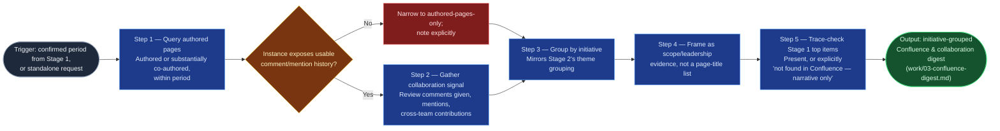

# Confluence Contribution Gatherer

The Confluence-side half of `accomplishments-digest`'s two gather stages
(Stage 3), independent of Stage 2 — either gather stage can run first, or in
parallel. It turns authored docs and whatever collaboration signal the
instance exposes into initiative-grouped scope/leadership evidence, replacing
the manual work of remembering which docs one wrote and digging through page
history. It gathers and frames only; it never drafts the final document.

## Flow Diagram

## Triggering intent

- **Fires on:** Stage 3 of `accomplishments-digest`, given a confirmed period
  from Stage 1; also standalone on "what docs did I write this quarter" or
  "pull my Confluence contributions for <period>."
- **Does not fire on (near-misses):** drafting the final document (that's
  `accomplishments-drafter`); gathering another person's contributions for
  evaluative purposes; general Confluence search or reporting unrelated to
  accomplishments framing.

## Method

1. **Query authored pages.** Search for pages the engineer authored or
   substantially co-authored within the date range — design docs, RFCs,
   postmortems, process docs, runbooks. "Substantially co-authored" means
   the engineer wrote a meaningful share of the content, not a single
   edit on someone else's page. **No live Confluence query path available**
   (running in a chat session with no native connector or sanctioned
   integration, per `START-HERE.md`'s capability probe — distinct from step
   2's "connected but shallow history" case): say so plainly and ask the user
   to paste the relevant pages or a list of what they wrote directly; proceed
   through steps 4–6 against that material, skipping the collaboration-signal
   step (3) since it has no live source to check depth against.
2. **Check activity-history depth before gathering collaboration signal.**
   Before querying comments/mentions, confirm the target Confluence instance
   actually exposes that history at usable granularity (some instances
   retain little comment history, or don't surface cross-page mentions
   searchably). If it doesn't, skip step 3 entirely and narrow to
   authored-pages-only, stating that explicitly in the output — never
   present a thin collaboration slice as if it were comprehensive. This is
   the failure mode this step exists to catch.
3. **Gather collaboration signal** (only if step 2 confirmed usable depth):
   review comments given, page mentions, and cross-team page contributions —
   wherever the platform surfaces them searchably.
4. **Group by initiative,** mirroring Stage 2's theme grouping in
   `jira-accomplishments-gatherer` — the same initiative name should be
   reused across both digests where they overlap, so Stage 4 can merge
   cleanly.
5. **Frame as scope/leadership evidence**, never a page-title list. Worked
   example: a raw result "Authored: 'Checkout Retry Design'" becomes "Drove
   the design for the checkout retry mechanism, later adopted by two other
   teams" — not "Wrote 1 doc." Where collaboration signal exists: "wrote the
   postmortem that changed the on-call team's escalation process," not "left
   3 comments." Never quote a review comment in a way that reads as
   evaluating the comment's recipient rather than the engineer's own
   contribution.
6. **Trace-check Stage 1's top items.** For every self-identified top item
   in Stage 1's framing brief that plausibly maps to a doc or initiative,
   confirm it appears in this digest or mark it explicitly "not found in
   Confluence — narrative only," mirroring Stage 2's trace-check.

## Inputs and grounding

Reads: Stage 1's framing brief (`work/01-framing-brief.md`) for the period
and self-identified top items; the engineer's Confluence identity. Grounding
rules: every scope/leadership framing must trace to an actual page or
collaboration record — never invent adoption, impact, or reach the source
material doesn't support; the activity-history-depth check in step 2 is
mandatory before presenting any collaboration content, not an optional
nicety; a "collaboration signal unavailable" result is a valid, required
output, not a gap to paper over.

## Data boundary

- Max data-class: internal. Pages may name co-authors or reviewers; the
  skill must not quote review comments in ways that read as evaluating a
  colleague rather than the requesting engineer's own work.
- Sanctioned engines: Rovo, native Confluence access, when the employer's
  sanctioned-tool matrix requires Confluence-native access to keep this data
  inside Atlassian. A sanctioned Copilot-side integration is a valid fallback
  where the matrix permits it — confirm at instantiation, per the employer
  matrix.

## What this skill is not

- **Not a drafting tool** — it produces an initiative-grouped digest, not the
  final accomplishments document; that's `accomplishments-drafter`'s job from
  this digest plus Stage 2's.
- **Not an evaluative reporting tool** — it gathers the requesting engineer's
  own contributions only; it declines requests to pull or characterize
  another person's contributions.
- **Not general Confluence search** — ad hoc page queries unrelated to
  accomplishments framing are ordinary Confluence use, not this skill.
- **Not a page-count summarizer** — leading with "wrote N docs" instead of
  scope/leadership framing has failed this skill's method.

## Review criteria

A single output of this skill is acceptable when:

1. Every entry groups by initiative, never presented as a bare page-title
   list.
2. The activity-history-depth check runs before any collaboration content is
   presented; if depth is unusable, the output narrows to authored-pages-only
   with an explicit note, never a silently thin "comprehensive" section.
3. Every entry is framed as scope/leadership evidence, not a title or count.
4. No review comment is quoted in a way that reads as evaluating its
   recipient rather than the requesting engineer's own contribution.
5. Every self-identified top item from Stage 1's framing brief appears under
   an initiative, or is explicitly marked "not found in Confluence —
   narrative only."
6. No content fabricates adoption, reach, or impact beyond what the source
   pages or collaboration records support.
7. If no live Confluence query path was available, the output states that
   plainly and is built from user-supplied pages instead — never a silent,
   unexplained gap in coverage.

## Adapters

| Engine | Artifact | Generated from spec version |
|---|---|---|
| Rovo | adapters/rovo-agent.md | 1.0 |
| Copilot | adapters/copilot-prompt.md | 1.0 |

## Changelog

- **1.1** (2026-07-27) — Method step 1 gains an explicit degrade path for
  running in a chat session referencing this repo directly, per
  `START-HERE.md`: with no live Confluence query path available at all
  (distinct from step 2's shallow-history case), ask the user to paste
  relevant pages directly and proceed against that material, skipping the
  collaboration-signal step for lack of a live source. New review criterion
  7. `truth-level` moves from `verified` to `to-review` pending a gate
  re-run.
- **1.0** (2026-07-14) — Initial build from `sp-confluence-contribution-gatherer`.
