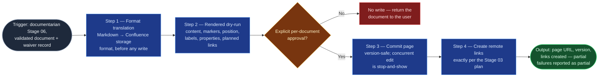

# Confluence Page Commit

The write side the skill portfolio didn't have: every existing Confluence
skill (`confluence-contribution-gatherer`) is read-only. This skill owns the
documentarian Stage 06 commit boundary — one work-order line per pass —
with `jira-commit`'s commit discipline transplanted step for step: format
translation gate, rendered dry-run, explicit per-document approval, honest
reporting. Nothing writes to a shared platform before its preview is
approved, and a partial success is never reported as a success.

## Flow Diagram

## Triggering intent

- **Fires on:** documentarian Stage 06, once per work-order line, after a
  clean (or user-accepted, recorded) Stage 05 report and the open-section
  waiver gate — "commit this document," "publish this line to Confluence."
- **Does not fire on (near-misses):** Jira work-item creation (`jira-commit`
  — different platform, different payload family); ServiceNow writes
  (deferred — `sp-servicenow-kb-commit`; ServiceNow-destined documents
  commit to Confluence labeled `servicenow-pending`, the gap stated);
  drafting or fixing content (upstream stages — a defect found here returns
  the line, it doesn't get patched at the boundary); registry rows and
  custody stamping after commit (`doc-custodian`'s bookkeeping — though
  this skill sets the initial labels and properties at creation); **any
  commit without an explicit, this-document, rendered-preview approval —
  batch approvals fail the contract.**

## Method

1. **Format translation gate** (the `jira-commit` precedent). Convert the
   validated Markdown to Confluence storage format before any write; raw
   Markdown syntax landing on a page is a defect. Open-section markers
   render as the protocol's blockquote form (or the tenant's confirmed
   macro).
2. **Rendered dry-run preview.** Present the document as it will land:
   content with open-section markers visible, page title, target space and
   parent position, labels, page properties (doc type, owner, review-by),
   and every Jira remote link to be created. Obtain explicit approval for
   this document — one document, one approval, recorded. No approval, no
   write: a declined or absent approval returns the document to the user
   with nothing committed.
3. **Commit.** Create or update the page via native Rovo Confluence actions
   first; the sanctioned Atlassian integration is the fallback for engines
   without them. Set labels, properties, and parent position per the
   work-order line. **Update semantics are version-safe:** fetch the
   current version, apply, report the new version; a mid-flight edit by
   someone else is a stop-and-show — present the conflict, never
   force-write over a colleague's change.
4. **Create the remote links exactly per the Stage 03 plan** (page ↔ item,
   both directions where the tenant supports it). Links discovered along
   the way are proposed to the user, never silently added.
5. **Report honestly.** Page URL, new version number, links created. A
   partial commit (page written, one or more links failed) is reported as a
   partial commit with what remains — never as success. Content drift
   between approval and write (anything changed since the previewed
   render) aborts the write and re-previews.

Worked example of the approval rule: five work-order lines are ready and
the user says "commit them all." Each line still gets its own rendered
preview and its own recorded approval — "yes to all five" collected against
five previews shown together is acceptable; one approval collected before
the previews exist is not.

## Inputs and grounding

Receives: the validated document (byte-identical from Stage 05), the
open-section waiver record, and the work-order line's placement/link plan.
Grounding rules: what commits is exactly what was validated and previewed —
no boundary-side edits, no reflowed content; every created link traces to
the plan; version numbers and URLs in the report come from the platform's
response, never assumed.

## Data boundary

- Max data-class: internal. Page URLs and links are internal — shareable
  within the organization. API credentials are the platform's concern,
  never present in flowspace artifacts.
- Sanctioned engines: **Rovo** — native Atlassian actions; content stays in
  Atlassian. Copilot-driven runs hand off at this boundary per
  mirroring-protocol §5; Copilot does not hold Confluence write
  credentials, so no Copilot adapter exists (see Adapters).

## What this skill is not

- **Not `jira-commit`** — work items are a different platform and payload
  family; this skill never creates Jira issues (remote links only, per
  plan).
- **Not the ServiceNow path** — `kb-article` documents destined for
  ServiceNow are staged on Confluence with `servicenow-pending`
  (`sp-servicenow-kb-commit` remains deferred).
- **Not a drafter or fixer** — a defect at the boundary returns the line
  upstream; the boundary never patches content.
- **Not the custodian** — post-commit registry rows, freshness stamping,
  and archive execution are `doc-custodian`'s (this skill sets only the
  initial labels/properties at creation).
- **Not a batch tool** — no approval, no write; no per-document preview, no
  approval.

## Review criteria

On a test space, a run is acceptable when:

1. A `create` line lands a page whose rendered content matches the approved
   preview exactly — no raw Markdown artifacts — with correct parent,
   labels, properties, and both planned remote links.
2. An `update` line against a page edited mid-flight by another account
   stops and surfaces the conflict instead of writing.
3. A simulated link-creation failure after the page write is reported as a
   partial commit naming what failed, not as success.
4. Nothing writes without its recorded per-document approval, and no link
   outside the Stage 03 plan is created.
5. The report's page URL and version come from the platform response and
   resolve.

## Adapters

| Engine | Artifact | Generated from spec version |
|---|---|---|
| Rovo | adapters/rovo-agent.md | 1.0 |

No Copilot adapter: Stage 06's data boundary gives Copilot no Confluence
write path (mirroring-protocol §5 hands off to Rovo or the human), so an
adapter would have no point of use — the `repo-context-enricher` precedent,
inverted (don't build ahead of demand, at adapter granularity).

## Changelog

- **1.0** (2026-07-15) — Initial build from `sp-confluence-page-commit`.
