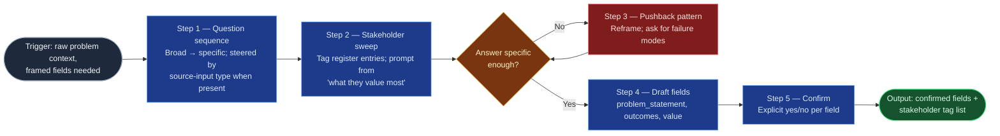

# Context Elicitation

The front half of problem framing for the `ai-refinement` pipeline: it turns a
user's raw, often vague description into confirmed, schema-ready problem and
value statements, grounded in the platform stakeholder register so the item is
framed by *whose needs define it*, not just by the first voice in the room. It
sits upstream of `scope-dependency-mapper` (which consumes its outputs) and
inside the TPSO persona established by the flowspace's Stage 01.

## Flow Diagram

## Triggering intent

- **Fires on:** Stage 02 of `ai-refinement` (a work-item type and schema are
  already selected); "frame this problem," "help me articulate this work item,"
  "I have an idea for an epic but it's fuzzy."
- **Does not fire on (near-misses):** "what's in and out of scope?" or "what
  does this depend on?" (`scope-dependency-mapper`); "walk me through the
  remaining fields" (`field-refinement-cadence`); open discovery interviews
  with no target schema; retro-fitting a problem statement onto an already
  committed Jira issue.

## Method

1. **Question sequence.** Ask, in order, one at a time: what problem is being
   solved; who is affected and how; what is the business/operational value;
   what has been tried before. Narrow from broad to specific — don't ask for a
   problem statement, build one. When screened source material and its
   input-type tag accompany the description (Stage 01 hands over one of rows
   1–9 of the flowspace HUB's "Common source inputs" taxonomy — including
   the Stage 01 supporting-context research set, each document typed the same
   way; row 10, the enumerated item set, is set-shaped and routes to bulk
   creation instead, never reaching this skill), steer the sequence by type: an email request or chat-stated
   requirement names a requester or beneficiary — start the Step 2
   stakeholder sweep there; a vendor action notice, a stated task list, a
   structured requirements document (SOW/PRD/BRD), or an architecture/design
   artifact (SAD, HLD/LLD, ADR, data model, topology diagram) is
   solution-shaped — elicit the underlying problem before accepting the
   actions, requirements, or design as scope; meeting minutes may hold several
   candidate items — split them and frame one per run; an incident/problem
   record is already problem-shaped — verify it names an affected party and a
   business impact, not only a technical symptom, before drafting; a prior
   completed work record is precedent-shaped — it answers "what has been
   tried before" and offers scope/effort reference once its match to this
   item's process type and area is verified; an unclassified document gets
   the full sequence with no shortcuts assumed. Where Stage 01's research
   record notes an expected document was *not found* (e.g., no SAD for an
   engineering-focused item), name that gap to the user when it matters —
   the missing context must be elicited, never invented. In
   **fast-track mode** (Stage 01), draft problem_statement, business_outcomes
   or question_to_answer, and customer_business_value directly from the
   source material with a citation to where each came from, instead of asking
   the four questions one at a time; anything not confidently draftable falls
   back to being asked directly.
2. **Stakeholder sweep.** If a stakeholder register is loaded for this domain
   (Stage 01's grounding check), walk it and tag every entry whose needs or
   limits define this item (note its number and role-type), using each
   tagged entry's "what they value most" column to prompt for requirements
   the user hasn't volunteered. When the supporting-context set holds
   architecture material (a SAD, HLD/LLD, or topology diagram), use its
   integration points and named systems/components as additional candidate
   prompts — each cited to the document; document-seeded candidates propose,
   the register walk and the user's confirmation decide. *Worked example:* a DC fabric-expansion item
   where the user names only Systems/Server — the sweep surfaces Facilities
   (13, Adjacent: power/cooling ceilings) and Cyber (6, Constraint-setter:
   segmentation telemetry) before those arrive as surprises. If Stage 01
   flagged **ungrounded mode** (no register loaded for this domain), ask the
   user directly who is affected and how, instead of walking a register.
   **This step is a hard carve-out — it always runs interactively, in every
   mode, register or no register.** Fast-track mode never extracts or skips
   it: misidentifying who a work item affects costs more downstream than any
   wording a fast-tracked field might get wrong.
3. **Pushback on vagueness.** When an answer is abstract, circular, or overly
   broad — whether elicited or fast-track-drafted from source material —
   apply a pushback pattern instead of accepting it: "it needs to work
   better" → "name the two most recent failures and their cost"; "everyone
   needs this" → "which register entries, specifically?" This is the persona's
   `challenge_incomplete_requirements` behavior, delivered in the persona's
   `communication_style` — precise, analytical, structured, direct, per the
   house amendment in `../../icp-flows/ai-refinement/reference/ai-refinement-hybrid.md`
   — never hedged or softened past the point of being a clear reframe.
4. **Draft the fields.** Synthesize into a problem statement (specific, not
   generic); measurable `business_outcomes` if the type is `solution_epic` or
   `portfolio_epic`; a `customer_business_value` statement that connects the
   problem to what the tagged stakeholders value. Quality bar: a reader who
   wasn't in the conversation can tell what's broken, for whom, and why fixing
   it matters.
5. **Confirm each field.** Present drafts and the stakeholder tag list, in the
   persona's `communication_style` (precise, analytical, structured, direct —
   no narrative padding); obtain an explicit yes/no per field before handing
   off. No batch confirmations — in fast-track mode this presentation is the
   consolidated checkpoint's contribution from this skill, not a batch
   confirmation shortcut: each field still gets its own explicit yes/no.

## Inputs and grounding

Reads: the selected work-item schema (from Stage 01), the platform stakeholder
register (`reference/platform-stakeholder-register.md` or a domain instance of
`platform-stakeholder-register-template.md` in the flowspace, if loaded), the
selected mode (fast-track / full-interactive, from Stage 01), the user's
conversational input, and — when present — the Stage 01-screened source
material with its input-type tag (any of HUB "Common source inputs" rows 1–9;
row 10, the enumerated item set, is set-shaped and routes to bulk creation —
it never reaches this skill, which frames one item's problem at a time), the
Stage 01 supporting-context document set with its research
record (sought/found/not found), and the work-focus classification. Grounding rules: stakeholder tags must resolve to numbered register
entries when grounded, or to the user's direct answer when ungrounded — never
invent a stakeholder; if a relevant party is missing from a loaded register,
say so and flag it rather than fabricating an entry. Do not fabricate prior
attempts, metrics, or outcomes the user didn't state; ask. In fast-track mode,
every extracted field carries a citation to its source location — extraction
without a citation is treated the same as fabrication.

## Data boundary

- Max data-class: internal
- Sanctioned engines: Rovo and Copilot, per the employer matrix. If PII or
  confidential data appears in the conversation, halt and invoke the flowspace's
  Stage 01 data-safety guardrail.

## What this skill is not

- **Not a scope mapper** — in/out-of-scope, dependencies, and risks belong to
  `scope-dependency-mapper`.
- **Not a field-cadence driver** — sequencing and refining the rest of the
  schema belongs to `field-refinement-cadence`.
- **Not a stakeholder-register editor** — it consumes the register read-only;
  register changes are the operator's.
- **Not a prioritizer** — it frames one item; whether the item is worth doing
  routes to Portfolio & Sourcing per the register's escalation rules.

## Review criteria

A single output of this skill is acceptable when:

1. The problem statement names a specific failure/gap and its affected parties —
   no generic "improve X" phrasing.
2. `business_outcomes` (when required) are measurable — each has a number, a
   date, or an observable state change.
3. `customer_business_value` traces to at least one tagged stakeholder's "what
   they value most."
4. Every stakeholder tag resolves to a register entry number and role-type.
5. Each field carries an explicit user confirmation.
6. At least one pushback was applied if any user answer (or fast-track draft)
   was vague (check the transcript) — vague-in, vague-out is a failed run.
7. When source material was provided, the drafted problem statement is an
   elicited or cited problem — not a transcription of the request, action
   list, or minutes it arrived in.
8. Every fast-track-extracted field carries a source citation, and the
   stakeholder sweep (step 2) ran interactively regardless of mode.
9. All user-facing text (questions, pushback, drafts) reads as precise,
   analytical, structured, and direct — no narrative padding, hedging, or
   informal phrasing.
10. Any stakeholder candidate seeded from a supporting-context document (SAD
    integration point, prior-record party) cites its source document and was
    confirmed through the sweep — never silently accepted from the document;
    research-record gaps that matter (e.g., no SAD found) were named to the
    user, not papered over.

## Adapters

| Engine | Artifact | Generated from spec version |
|---|---|---|
| Rovo | adapters/rovo-agent.md | 1.6 |
| Copilot | adapters/copilot-prompt.md | 1.6 |

## Changelog

- **1.6** (2026-07-31) — Reference-only correction: Method step 1 and Inputs
  and grounding both cited "nine" HUB "Common source inputs" types, which went
  stale when the taxonomy gained a tenth row (enumerated item set) with the
  addition of bulk creation mode. Both corrected to rows 1–9, stating why row
  10 is excluded rather than just renumbering — a set-shaped input routes to
  `bulk-child-creation` and never reaches this skill, which frames one item's
  problem at a time. No method, criteria, or behavior change; `truth-level`
  stays `to-review`. Both adapters re-stamped. See
  `../../icp-flows/ai-refinement/decision-log/2026-07-31-bulk-creation-mode.md`.
- **1.5** (2026-07-21) — Supporting-context research consumption, tracking
  the flowspace's `supporting_context_research` house amendment: input-type
  steering broadened from eight to nine types (adds the precedent-shaped
  prior-completed-work record; architecture/design artifacts now name SAD,
  HLD/LLD, ADR, data model, topology diagram explicitly); Method step 2's
  sweep gains document-seeded candidate prompts (SAD integration points,
  cited, propose-not-decide); the skill now reads Stage 01's
  supporting-context document set, research record, and work-focus
  classification, and names not-found gaps to the user instead of inventing
  the missing context. New review criterion 10. `truth-level` moves from
  `verified` to `to-review` pending a gate re-run. Both adapters
  regenerated. See
  `../../icp-flows/ai-refinement/decision-log/2026-07-21-supporting-context-research.md`
  and
  `../../skill-foundry/decision-log/2026-07-21-supporting-context-skill-revision-pass.md`.
- **1.4** (2026-07-07) — Method step 4's `business_outcomes` conditional
  extended from `solution_epic` only to `solution_epic` or `portfolio_epic`,
  tracking the work-item-schemas registry's 1.2 addition of `portfolio_epic`
  to the refinable set. `truth-level` moves from `verified` to `to-review`
  pending a gate re-run. Both adapters regenerated. See
  `../../icp-flows/ai-refinement/decision-log/2026-07-07-portfolio-epic-and-bug-type-extension.md`.
- **1.3** (2026-07-03) — Three changes bundled from the drift-analysis
  revision pass. (a) Question-sequence steering broadened from four to eight
  source-input types (adds structured requirements documents, incident/problem
  records, architecture/design artifacts, and an unclassified catch-all) and
  gains a fast-track extraction path (Method step 1): fields are drafted
  directly from source material with citation instead of asked one at a time,
  falling back to elicitation where confidence is low. (b) Method steps 3 and
  5 (pushback, confirm/present) tie phrasing explicitly to the persona's
  `communication_style`, citing the house amendment in
  `ai-refinement-hybrid.md`. (c) Method step 2 (stakeholder sweep) gains an
  ungrounded-mode conditional (ask directly when no register is loaded) and is
  marked a hard carve-out — always interactive, regardless of mode. Two new
  review criteria (fast-track citation + hard-carve-out check;
  communication_style compliance). Both adapters regenerated. Content change:
  pre-gate evidence re-run required — see
  `../../skill-foundry/decision-log/2026-07-03-communication-style-and-fast-track-skill-revision-pass.md`.
- **1.2** (2026-07-03) — Question sequence steered by the source-input
  taxonomy: when Stage 01 hands over screened material with an input-type tag
  (email request, vendor action notice, meeting minutes/notes, chat-stated
  requirement), the sequence starts the sweep at the named requester, recovers
  the problem behind solution-shaped input, and splits multi-item minutes —
  applying the revision flagged in the flowspace's
  `decision-log/2026-07-03-input-taxonomy.md`. New review criterion: elicited,
  not transcribed. Both adapters regenerated. Content change: pre-gate
  evidence re-run required — see
  `decision-log/2026-07-03-ai-refinement-skill-revision-pass.md`.
- **1.1** (2026-07-03) — Flow Diagram step labels renumbered to match the Method
  prose one-for-one (pre-gate spec-review finding; no behavior change). Adapters
  re-stamped — their content is unchanged by a diagram-only revision.
- **1.0** (2026-07-03) — Initial build from `sp-context-elicitation`.
