# Stage-Contract Reviewer

The warm-up act ahead of the flow-foundry's human dry-run (validation gate 3):
it reads a flowspace's stage contracts and tests each of the six contract
fields against the populated-vs-present standard, so the operator's review
time goes to judgment calls instead of catching placeholder text. It never
substitutes for the dry-run, and it never authors or repairs a contract itself
— it flags, the flow-foundry (with the operator) fixes.

## Flow Diagram

```mermaid
flowchart LR
    Start(["Trigger: flowspace stage<br/>contracts, pre-review needed"]):::start --> Read["Step 1 — Read contracts<br/>Load each stage's six-field CONTEXT.md"]:::process
    Read --> Test["Step 2 — Test six fields<br/>Inputs/Process/Outputs/Verify/<br/>Review/Data boundary"]:::process
    Test --> Draft["Step 3 — Attempt the handoff<br/>Draft next stage's Inputs from<br/>this stage's Outputs"]:::process
    Draft --> Report["Step 4 — Emit findings<br/>Severity-ranked, quoting failing text"]:::process
    Report --> Output(["Output: pre-review findings report<br/>(warm-up only, not gate 3)"]):::output

    classDef start fill:#1e293b,stroke:#94a3b8,color:#f1f5f9
    classDef process fill:#1e3a8a,stroke:#60a5fa,color:#dbeafe
    classDef decision fill:#78350f,stroke:#fbbf24,color:#fef3c7
    classDef output fill:#14532d,stroke:#4ade80,color:#dcfce7
    classDef halt fill:#7f1d1d,stroke:#f87171,color:#fee2e2
```

## Triggering intent

- **Fires on:** "pre-review these contracts," a flowspace reaching
  `to-review`, and re-validation passes after a rework cycle.
- **Does not fire on (near-misses):** the human dry-run itself or promotion
  (gate 3 is explicitly human — this skill's report is the warm-up act, and
  the report must say so); authoring or fixing a weak contract (that's the
  flow-foundry, with the operator); the flow-foundry's own gates 1 and 2
  (structural completeness, Layer-3 status declared) — this skill's six-field
  test is narrower and comes after those pass.

## Method

1. **Read the contracts.** Load every stage's `CONTEXT.md` (the six-field
   stage contract) across the flowspace tree, on whichever surface holds it —
   the internal git mirror or the Confluence page tree — plus the flowspace's
   `HUB.md` stage table for cross-checking.
2. **Test each of the six fields**, per stage:
   - **Inputs** — does it name artifacts and locations? "Whatever the
     previous stage produces" is a flag, not a pass.
   - **Process** — verbs or output-descriptions, not vague intent? Is the
     Layer-3 reference line present and does it resolve to a real file/page?
   - **Outputs** — could the next stage's Inputs section be drafted from this
     one, without a conversation? See step 3 — don't eyeball this, attempt it.
   - **Verify** — does it name two stages, an artifact, and a property?
     "Confirm it's good" is a flag, not a pass.
   - **Review** — a real named human, a stated intensity, and a form the
     evidence takes?
   - **Data boundary** — class and sanctioned engines stated, and consistent
     with `HUB.md`'s stage table (a stage claiming a boundary the hub doesn't
     list is itself a finding)?
3. **Attempt the handoff draft.** For every Outputs field, actually try
   drafting the next stage's Inputs section from it — this is the populated-
   vs-present test in `AGENTS.md` §6, applied mechanically. If the draft
   requires guessing anything, that gap — named specifically — is the finding,
   not "this needs more detail." *Worked example:* an Outputs field reading
   "a validated schema" fails the draft attempt (validated how? which schema
   variant?); an Outputs field reading "the confirmed `work-item-schema.md`
   with `solution_epic` fields validated per Stage 05's checklist" passes it.
4. **Emit the findings report, headed as a pre-review.** One entry per
   failing field, severity-ranked (`blocking` — the six-field test itself
   fails; `advisory` — passes the test but reads weak), every entry quoting
   the exact failing text verbatim — never a paraphrase the operator would
   have to go re-read to verify. The report's header states plainly that this
   is preparation for gate 3, not a substitute for it: a clean report does not
   mean the dry-run is skipped.

Known failure mode to guard: treating "plausible-sounding" as "passes" — a
field can read fluently and still fail the draft-from-it test in step 3; only
the attempted draft is evidence, not a read-through impression.

## Inputs and grounding

Reads: the flowspace's stage `CONTEXT.md` files (git mirror or Confluence page
tree) and its `HUB.md` stage table. Grounding rules: every finding quotes the
actual contract text, never a summary of the flaw; if a Layer-3 reference
doesn't resolve to an existing file or page, report exactly that — do not
guess what it might have meant or invent a plausible target.

## Data boundary

- Max data-class: internal.
- Sanctioned engines: **Copilot** (custom agent on the internal mirror) —
  primary, since flowspace contracts mirror to the internal repo where this
  skill's users work. A Rovo adapter (Confluence-native, for the primary
  surface) is deferred as optional per the brief's demand — build it if a
  Confluence-native reviewer becomes the actual point of use.

## What this skill is not

- **Not the dry-run** — gate 3 is explicitly human (`governance-and-audit.md`
  §4); this skill's report is a warm-up, never a pass/fail verdict on
  promotion.
- **Not a contract author or fixer** — flagging is this skill's job; drafting
  or repairing a weak contract belongs to the flow-foundry, with the operator.
- **Not the flow-foundry's gates 1–2** — structural completeness and Layer-3
  status-declared are separate checklist items the flow-foundry owns; this
  skill's six-field test runs after those pass, not instead of them.

## Review criteria

A single run's output is acceptable when, on a seeded flowspace with one
deliberately weak field of each of the six kinds:

1. All six weak fields are flagged, each quoting the exact failing text.
2. No false "next-stage Inputs" is drafted for a passing stage's Outputs
   (i.e., zero false positives on the fields that actually pass).
3. Every finding names which of the six fields it is and the stage it's in.
4. The report's header states explicitly that this is a pre-review, not gate
   3.

## Adapters

| Engine | Artifact | Generated from spec version |
|---|---|---|
| Copilot | adapters/copilot-agent.md | 1.0 |

Rovo adapter deferred — see "Data boundary" above; re-open when a
Confluence-native reviewer is the actual point of use.

## Changelog

- **1.0** (2026-07-07) — Initial build from `sp-contract-reviewer`.
