# Demand Profiler

STATIK step 3 (`statik-adoption`, Stage 03): the nature of demand. Who asks, what
they ask for, how often, in what pattern, with what expectation.

Work item type discovery is the consequential half. Every downstream step
analyses, models, and designs **per type**, so a bad type set propagates into the
capability analysis, the workflow model, the classes of service, and the board —
and none of those stages can detect that the types were wrong.

It replaces two standard failures: adopting the board's issue-type field as the
type set, and answering arrival rate from memory in a workshop.

Neighbour: `portfolio-profiler` profiles a backlog's *current state* for triage —
unit is the item, point-in-time. This is longitudinal and its unit is the type.

## Flow Diagram

```mermaid
flowchart LR
    Start(["Trigger: bound item set +<br/>service frame;<br/>type set + demand profile needed"]):::start
    P1["1 — Cluster on request<br/>shape, NOT the<br/>issue-type field"]:::process
    P2["2 — Report clusters vs<br/>issue-type<br/>disagreements"]:::process
    P3["3 — Propose level +<br/>show one coarser,<br/>one finer"]:::process
    D1{"4 — Discrimination<br/>test: differs in<br/>workflow, lead time,<br/>or expectation?"}:::decision
    P4["Merge — it's a<br/>label, not a type"]:::process
    P5["5–6 — Arrival rate per unit;<br/>pattern across two<br/>time framings"]:::process
    P6["7 — Capture demand<br/>the board never saw<br/>(mark unmeasured)"]:::process
    P7["8–10 — Attach expectation;<br/>tag measured/estimated;<br/>apply floors"]:::process
    Output(["Output: type set, demand profile,<br/>expectations, abstraction record,<br/>disagreement list"]):::output

    Start --> P1 --> P2 --> P3 --> D1
    D1 -->|"no"| P4 --> P5
    D1 -->|"yes"| P5 --> P6 --> P7 --> Output

    classDef start fill:#1e293b,stroke:#94a3b8,color:#f1f5f9
    classDef process fill:#1e3a8a,stroke:#60a5fa,color:#dbeafe
    classDef decision fill:#78350f,stroke:#fbbf24,color:#fef3c7
    classDef output fill:#14532d,stroke:#4ade80,color:#dcfce7
    classDef halt fill:#7f1d1d,stroke:#f87171,color:#fee2e2
```

## Triggering intent

**Fires on:**

- Stage 03 of `statik-adoption`.
- "What kinds of work actually arrive here?"
- "What are our work item types?"
- "How much demand do we get, and how bumpy is it?"
- "Is our demand steady or spiky?"
- "Are these really two different kinds of work?"

**Does not fire on (near-misses):**

- **"What does our backlog look like?" / "How complete are these tickets?"** →
  `portfolio-profiler`. Unit is the item, purpose is triage, view is
  point-in-time.
- **"Normalize this export" / "pull the whole project into a set"** →
  `jira-portfolio-ingest`. This skill consumes its output and never queries or
  normalizes.
- **"How long does this take?" / "are we predictable?"** →
  `flow-capability-analyzer`. Demand is what arrives; capability is what gets out.
- **"How should we treat urgent work?"** → `class-of-service-designer`. Type is
  what the work *is*, not how urgent it is.
- **Refining or creating a single work item** → `ai-refinement`.

## Method

### 1 — Derive candidate types from the work, not from the issue-type field

The issue-type field is an administrative artifact: often a project template
nobody chose, often three types doing the work of eight, occasionally eight doing
the work of two. Starting there guarantees a Kanban system designed around Jira's
configuration rather than around the actual demand.

Cluster instead on **what the request is and what it takes to serve it**: summary
and description text, requesting group, and the shape of the work.

### 2 — Compare clusters against the issue-type field and report disagreements

With item counts. Disagreements are **findings for the reviewer**, never
reconciled silently — a cluster spanning three issue types, or an issue type
splitting cleanly into two clusters, is exactly the information the reviewer
needs and exactly what silent reconciliation destroys.

### 3 — Propose an abstraction level, and show one coarser and one finer

Each with the type count it yields. Type discovery is acknowledged in the
literature as the hard part of this step, and the failure runs in both directions:

- **Too abstract** ("requests") — every type gets the same policy and the system
  distinguishes nothing.
- **Too granular** (one type per menu item) — types carry three items a year and
  no measurable distribution.

Showing three levels makes the reviewer **choose against real alternatives**
rather than approve the only option offered. A run presenting only the chosen
level has converted a decision into a rubber stamp.

### 4 — Apply the discrimination test to every proposed type

A work item type earns its place only if it is expected to differ from its
siblings in **at least one** of:

| Dimension | Test |
|---|---|
| Workflow | Does it pass through different states? |
| Lead-time distribution | Is it expected to take a materially different time? |
| Customer expectation | Do customers expect something different of it? |

A candidate differing in **none** of these is a *label*, not a type — merge it,
and state the merge. This test is what keeps type discovery from drifting back
into mirroring the issue-type field under a different name.

**Worked example.** A board carries `Service Request` and `Access Request` as
separate issue types. Clustering shows they arrive from the same groups, pass
through identical states, complete in indistinguishable times, and carry the same
stated expectation. They differ in none of the three dimensions → **one type**,
with the merge and its evidence stated. Meanwhile a single issue type `Change`
splits into two clusters — routine pre-approved changes and changes requiring
CAB review — which differ in workflow *and* lead time *and* expectation → **two
types**, from one issue-type value.

### 5 — Measure arrival rate per type

Always **a number per stated unit over a stated window**. Never "a lot," "steady,"
or "several a week" as the recorded value. Where the mode is conversation-only,
elicit a number and tag it `estimated`.

### 6 — Measure the arrival pattern across at least two time framings

The same average hides very different systems: smooth arrival, weekly or monthly
spikes, quarter-end clustering, burst arrival tied to an external event. Report
per type across at least two granularities (e.g. weekly and monthly) — **a
pattern invisible at one granularity is usually obvious at another.**

Characterize **variability** explicitly. This is what drives WIP limits and
capacity allocation downstream; an average alone supports neither.

### 7 — Record demand the board never saw

Requests taken by chat, by corridor conversation, or through a queue this service
does not track are still demand on the system and are systematically invisible to
an evidence-grounded analysis. Ask for them explicitly. Record as a named type
where they form one, marked `unmeasured`.

An unmeasured type is a finding **about the board** as much as about the demand,
and it is frequently the largest single omission in a run.

### 8 — Attach customer expectation per type

From the fitness criteria and external dissatisfaction sets: what does the
requesting group expect of *this* type — how fast, how predictable, by when. A
type with no attached expectation produces a class of service nobody asked for.

### 9 — Tag every figure `measured` or `estimated`

In every mode, **including runs where every figure carries the same tag** — a tag
that only appears in mixed runs is a tag nobody reads. Measured and estimated
figures never share a column.

### 10 — Apply the sufficiency floors

Check each type's item count against the floor and mark those below it, **before**
the capability analysis begins, so it reports observations rather than a
distribution. A type below the floor may still be a perfectly valid type — it
simply cannot carry a measured rate.

## Inputs and grounding

**Reads:** the normalized item set and field-availability report from
`jira-portfolio-ingest`; the service frame with customer groups; the fitness
criteria and external dissatisfaction sets; the mode declaration.

**Grounding rules:**

- Every type carries its item count and the evidence for its cluster.
- Every rate carries its unit, its window, and its `measured`/`estimated` tag.
- Cluster labels are house-authored abstractions and **must not quote identifying
  content** from the items behind them.
- Unmeasured demand is recorded as such, never estimated into a measured column.
- Where the issue-type field is absent entirely, say so — clustering still works,
  but the disagreement analysis is unavailable, not empty.

## Data boundary

- **Max data-class:** `internal`
- **Sanctioned engines:** Rovo, Copilot — per the employer matrix.
- Clustering reads summary and description text carrying customer references and
  hostnames. Cluster labels are abstractions and never quote them.
- **Assignee data is used in aggregate only**, and only where it bears on demand
  routing. This skill produces **no per-person figure of any kind** and declines
  that framing explicitly when asked.

## What this skill is not

- **Not `portfolio-profiler`.** That answers "what is in the backlog now, and how
  well-formed is it" — status/assignee/priority distributions, age ranking, field
  completion, for triage, point-in-time. This answers "what kinds of work arrive,
  how often, how evenly" — for system design, longitudinally. Neither substitutes
  for the other.
- **Not an ingest skill.** `jira-portfolio-ingest` binds and normalizes; this
  consumes. No queries, no field maps, no halts on truncation — those are that
  skill's.
- **Not a capability analyzer.** Delivery performance is
  `flow-capability-analyzer`.
- **Not a class-of-service designer.** Type is what the work is; class is how
  urgent it is. Independent axes.
- **Not a writer.** No Jira or Confluence writes, including no relabelling of
  issue types to match discovered types.

## Review criteria

A human judges one output acceptable when:

1. Types are **derived**, with an explicit disagreement list against the
   issue-type field where that field exists — not a mirror of it.
2. **Three abstraction levels** are shown with their type counts; the chosen level
   carries the reviewer's rationale.
3. Every type passes the discrimination test, naming which dimension(s) it
   discriminates on; any merge is stated with its evidence.
4. Every arrival rate is a number with its unit and window; no qualitative phrase
   appears as a recorded value.
5. Pattern is reported across **at least two** time framings, with variability
   characterized.
6. Unmeasured demand raised in conversation appears in the type set, marked.
7. Every type carries an item count checked against the floor, with `below floor`
   marks applied.
8. `measured` and `estimated` never share a column, in any mode.
9. Every type carries a customer expectation, or the absence is stated.
10. No per-person figure appears anywhere.

## Adapters

| Engine | Artifact | Generated from spec version |
|---|---|---|
| Rovo | adapters/rovo-agent.md | 1.0 |
| Copilot | adapters/copilot-prompt.md | 1.0 |

## Changelog

- **1.0** (2026-08-01) — Initial build from `sp-demand-profiler`.
