# Disposition Packet Builder

The recommendation step of `portfolio-rationalization` (Stage 05) — the step
the source analysis never had. Scoring ranks items; this skill turns a rank
into something a named person can act on: a recommendation framed as a
recommendation, the evidence behind it, and a question worth asking the owner
of the work. It is what converts a ranking nobody reviews into four items each
person will actually look at. It bands and packages `closure-scorer`'s output;
it never rescores, and it never acts.

## Flow Diagram

```mermaid
flowchart LR
    Start(["Trigger: ranked portfolio with scores,<br/>breakdowns, corroboration counts"]):::start --> P1["Step 1 — Band each item<br/>95 / 80 / 65 thresholds from<br/>the recommendation taxonomy"]:::process
    P1 --> Corr{"Top-two band with fewer<br/>than 3 firing dimensions?"}:::decision
    Corr -->|Yes| Dem["Demote to Review for closure<br/>and state the demotion<br/>in plain language"]:::halt
    Corr -->|No| P2["Step 3 — Build the packets<br/>Identity, recommendation, signals in words,<br/>evidence trail, caveats, question"]:::process
    Dem --> P2
    P2 --> P3["Step 4 — Alignment-frame the review bucket<br/>Needs objective review items ask about<br/>alignment, never closure"]:::process
    P3 --> P4["Step 5 — Merge candidates<br/>Shared parents, overlapping summaries<br/>and keywords; noted in both packets"]:::process
    P4 --> P5["Step 6 — Route by assignee<br/>One section each, score-ordered;<br/>unassigned to the operator"]:::process
    P5 --> Output(["Output: assignee-routed outreach pack,<br/>demotion record, merge pairs,<br/>cycle summary, framing statement"]):::output

    classDef start fill:#1e293b,stroke:#94a3b8,color:#f1f5f9
    classDef process fill:#1e3a8a,stroke:#60a5fa,color:#dbeafe
    classDef decision fill:#78350f,stroke:#fbbf24,color:#fef3c7
    classDef output fill:#14532d,stroke:#4ade80,color:#dcfce7
    classDef halt fill:#7f1d1d,stroke:#f87171,color:#fee2e2
```

## Triggering intent

- **Fires on:** Stage 05 of `portfolio-rationalization`, with Stage 04's
  scores, breakdowns, and corroboration counts in hand. Also standalone on
  "build the review pack," "turn these scores into recommendations," "who needs
  to look at what," "route these findings to owners."
- **Does not fire on (near-misses):**
  - Computing or adjusting scores — that is `closure-scorer`, upstream. This
    skill bands and packages; it **never rescores**, and a request to "bump
    this item's score" goes back to the model, not to the packet.
  - **Closing, merging, labeling, or commenting on Jira items.** There is no
    write path anywhere in this flow. This skill declines rather than routing
    such a request — including to `jira-commit`, whose job is creating refined
    items, not bulk portfolio actions.
  - Capturing what humans decided — dispositions, rationales, divergences, and
    dictionary feedback belong to Stage 06's inline capture protocol.
  - Profiling or mapping — `portfolio-profiler` and `objective-keyword-mapper`
    upstream; this skill consumes their outputs as packet evidence.

## Method

1. **Band each item** per the flowspace's `reference/close-score-model.md` §4:
   `Close (recommended)` ≥ 95, `Strong close candidate` 80–94, `Review for
   closure` 65–79, `Keep / not closure-priority` < 65.
2. **Enforce the corroboration rule.** Any item banded `Close (recommended)` or
   `Strong close candidate` with **fewer than three firing dimensions is
   demoted to `Review for closure`** — and the demotion is stated in the packet
   in plain language, not footnoted: "scored 88 but only 2 of 5 dimensions
   corroborate: reviewing, not recommending closure." This is the flow's
   governing principle made operational. Computing the rule upstream and then
   not enforcing it here produces exactly the outcome the flow exists to
   prevent — an old item recommended for closure on age and one other signal —
   and a silent demotion teaches nobody anything.
3. **Build a packet per item** in the three review-worthy bands. (`Keep / not
   closure-priority` items get a line in the cycle summary, not a packet.) Each
   packet carries:
   - **Identity** — key, summary, status, assignee, age, last human touch.
   - **Recommendation** — the band, stated as a recommendation *for review*,
     never as a decision. `Close (recommended)` means recommend closure to the
     owner; nothing in this flow closes anything.
   - **Why — the signals that fired, in plain language.** The named dimensions
     above midpoint with their points, written as sentences: "434 days old, no
     update in 212 days, 21% of fields populated, sits in Backlog, weak
     objective alignment." Not a bare number.
   - **The evidence trail** — the full dimension breakdown, the mapped
     objective area with its matched keywords, and the dictionary version used.
     This is what lets an owner disagree *specifically* rather than generally.
   - **Caveats** — every applicable scoring caveat from Stage 04: degraded or
     Summary-only mapping, low-confidence staleness, unmapped status, unknown
     due date. **A packet that hides its own weak evidence is worse than no
     packet.**
   - **A suggested question for the owner** — one specific question this
     item's signal pattern actually raises. An old, sparse, unaligned Backlog
     item asks "is this still needed, and if so what changed since it was
     written?" A `Needs objective review` item asks "which objective does this
     support, and does its wording say so?" A high-scoring item with a parent
     asks "should this merge into its parent?" **Generic questions produce
     generic answers and waste the owner's time** — "is this still needed?" on
     every packet is a defect, not a template.
4. **Handle the `Needs objective review` bucket as alignment questions, not
   closure questions** — whatever the item's score. The bucket covers three
   situations the mapping cannot distinguish (poorly worded real work, a
   dictionary gap, genuine misalignment), and collapsing them into a closure
   framing is the single most likely way this flow produces a wrong
   recommendation.
5. **Identify merge candidates.** Where two high-scoring items share a parent,
   or their summaries and matched keywords overlap heavily, note them as
   possible merges **in both packets of the pair**. Merge is often the right
   disposition for work that is real but fragmented, and it is invisible to a
   per-item score.
6. **Route packets by assignee** into an outreach list — one section per
   assignee, their items score-ordered. Unassigned items route to the operator
   as their own section. This is what makes the pack usable: nobody reviews a
   36-item ranked list, but everybody will look at their own four.
7. **Build the cycle summary** — total items reviewed, counts per band, the
   demotion count, the `Needs objective review` count, merge candidates
   identified, and the calibration status carried forward from Stage 04.
8. **Head the pack with the framing statement.** These are triage
   recommendations based on observable signals — age, staleness, field
   completion, objective alignment, workflow status. They do not prove an item
   lacks business value; they identify work whose *data* suggests it needs
   governance attention. Nothing has been or will be closed by this process.
   Every reader sees this before they see a single recommendation.
9. **Present to the operator before it goes to owners.** The operator can pull
   items, adjust framing, or send the cycle back to Stage 03 if the mapping
   distribution looks wrong.

**Quality bar:** an owner reading their own section can tell, without asking
anyone, why each item is in front of them and what specifically they are being
asked.

## Inputs and grounding

Reads: per-item scores, dimension breakdowns, **corroboration counts** (banding
cannot run without them), the ranked portfolio, per-item caveats, and the
calibration status from `closure-scorer`; the per-item mapping record, the
`Needs objective review` bucket, matched keywords, and the dictionary version
from `objective-keyword-mapper`; the assignee distribution and the
oldest-and-sparsest cross-cut from `portfolio-profiler`; parent keys from the
normalized item set; the cycle scope record from `jira-portfolio-ingest`; and
band thresholds, the corroboration rule, and label semantics from
`close-score-model.md` §4–5.

Grounding rules: every claim in a packet traces to an upstream output — no
invented signals, no inferred business context, no recomputed numbers. If the
corroboration count is missing for an item, **stop and ask for it** rather than
banding without it. Where evidence is thin, the packet says so in its caveats
rather than reading as confident. The suggested question is derived from the
item's own signal pattern, never from a template list.

## Data boundary

- **Max data-class: internal.** The outreach list pairs **named individuals
  with recommendations about their work** — a combination more sensitive than
  either part alone, and the most sensitive artifact this flow produces.
- **Per-assignee distribution is a data-handling constraint, not a courtesy.**
  Each owner receives their own section; the whole pack is not circulated
  broadly.
- The pack contains no closure actions and no Jira writes. It is a review
  document.
- **Sanctioned engines:** Rovo and Copilot both. No constraint.

## What this skill is not

- **Not a scorer** — it never computes, adjusts, or overrides a score. Score
  disputes go back to `closure-scorer` and the model.
- **Not an actor** — it does not close, merge, label, comment, or transition,
  and it does not route such requests to a write-capable skill. `jira-commit`
  creates refined items; it is not a bulk portfolio tool, and pointing there
  would be wrong.
- **Not the capture step** — dispositions, rationales, divergences, deferrals,
  and dictionary-revision notes are Stage 06's, recorded from a human
  conversation.
- **Not a mass mailer** — it produces per-assignee sections precisely so the
  pack is not circulated whole.
- **Not a decider** — a band is a recommendation. Stage 06 records what people
  actually decided, which is frequently different, and that difference is the
  cycle's most valuable output.

## Review criteria

A single output of this skill is acceptable when:

1. Every item is banded per the §4 thresholds exactly.
2. **No item in the top two bands has a corroboration count below 3** — checked
   in both directions against the demotion record: no undemoted item below the
   threshold, no demoted item above it.
3. Every demotion is stated in its packet in plain language, not footnoted.
4. Packets exist for all three review-worthy bands; keep-band items appear as
   summary lines.
5. Every packet carries the signals that fired in plain language, the full
   evidence trail (dimension breakdown, mapped area, matched keywords,
   dictionary version), and every applicable Stage 04 caveat.
6. **Every packet's suggested question is item-specific** — a reviewer sampling
   ten packets finds ten different questions.
7. `Needs objective review` items are framed as alignment questions, never as
   closure candidates, regardless of score.
8. Merge candidates are identified and noted in **both** packets of each pair.
9. Packets are routed by assignee, with unassigned items routed to the
   operator, and each owner's section stands alone — self-explanatory without
   the rest of the pack.
10. The cycle summary carries band counts, demotions, needs-review count, merge
    candidates, and the calibration status.
11. The framing statement heads the pack, before any recommendation.
12. The operator reviewed the pack before it went to owners.
13. Any request to act on Jira was declined, with a statement of what this skill
    produces instead.

## Adapters

| Engine | Artifact | Generated from spec version |
|---|---|---|
| Rovo | adapters/rovo-agent.md | 1.0 |
| Copilot | adapters/copilot-prompt.md | 1.0 |

## Changelog

- **1.0** (2026-07-28) — Initial build from `sp-disposition-packet-builder`.
