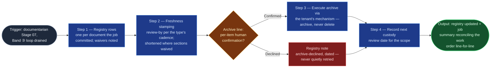

# Doc Custodian

The bookkeeping half of "maintain over time," at documentarian Stage 07 —
and the seam the "agents as custodians of the documentation platforms" end
state grows from, which is exactly why its authority is bounded now: it
executes only what a human confirmed, per item, and its future standing-run
mode proposes rather than acts (the custody model's operating notes are its
constraints). Its core promise is the one this flowspace exists to keep: no
committed document falls outside custody — every page the job touched gets
a registry row and a review-by date.

## Flow Diagram

## Triggering intent

- **Fires on:** documentarian Stage 07, once per job, after the Band ③
  per-document loop drains — "close out the job," "run custody"; and
  (future) as the executing skill of a scheduled `tree-audit` custodial
  run's close.
- **Does not fire on (near-misses):** deciding what to archive (audit
  findings nominate, Stage 03 plans, the human confirms per item — this
  skill executes and records); committing document content
  (`confluence-page-commit`); provenance frontmatter on mirror artifacts
  (`provenance-stamper`, referenced separately by the stage); shortcutting
  a scheduled custodial run straight into Stage 07 (custodial runs enter at
  Stage 01 as `tree-audit` jobs, per the custody model); deleting anything,
  ever.

## Method

1. **Registry bookkeeping.** Update the doc-registry index per the
   custody-model row shape — `id`, `doc-type`, `surface`, `owner`,
   `last-verified`, `review-by`, `status`, `notes` — one row touched per
   document the job committed. New documents get rows; updated documents
   get refreshed `last-verified` and `review-by`; waived open sections are
   noted on the row (with owners) until resolved. The failure this step
   exists to prevent: a committed page with no registry row — untracked
   documentation.
2. **Freshness stamping.** Set each committed page's review-by page
   property per its doc type's cadence in `documentation-standards.md`
   (sop/sad 12 months, runbook/kb-article 6, mop at window close,
   meeting-notes none). A document with waived open sections gets a
   **shortened** review-by, so the open sections resurface on a clock
   instead of fossilizing.
3. **Archive execution — per-item human confirmation, no exception.** For
   each archive line in the work order: present the page, its staleness
   evidence from the audit/dossier, and the inbound-link check (pages other
   active documents link to get re-pointed first, or the archive is
   declined); obtain an explicit per-item confirmation — each item is its
   own yes, batch approvals fail the contract; execute via the tenant's
   confirmed mechanism (archive space, archive label, or native archiving —
   fixed at instantiation). **Archive, never delete.** A declined
   confirmation converts the line to a dated `archive-declined` registry
   note — and a later run never "cleans up" a declined candidate without a
   fresh confirmation.
4. **Custody scheduling.** Record the next custody review date for the
   touched tree/space per the custody model's cadence (default quarterly) —
   the trigger for the next scheduled `tree-audit` job.
5. **Job summary.** Reconcile the work order line-for-line: committed /
   waived / struck / archived / declined, registry rows touched, open
   sections outstanding with owners, handoff packages produced. Zero
   unaccounted lines; the summary is the run's decision-log record.

Standing-run constraints (future mode, from the custody model's operating
notes): read everything, propose everything, execute only what a human
confirmed; a run that finds nothing actionable still leaves its one-line
decision-log entry and re-arms the next review date; registry drift,
departed owners, and systematic staleness are escalated as findings, never
fixed unilaterally.

## Inputs and grounding

Receives: Stage 06's committed-page list (URLs, labels, properties), the
confirmed work order including archive-proposal and struck lines, recorded
open-section waivers, and the doc-registry index's current state. Grounding
rules: registry rows record what the platform confirms (URLs, versions,
dates), never assumptions; archive confirmations are quoted in the record;
counts must reconcile — committed pages = touched rows, archives executed =
confirmations recorded.

## Data boundary

- Max data-class: internal. Archive actions move content within the tenant;
  nothing leaves the platform, and nothing is destroyed.
- Sanctioned engines: **Rovo** — registry rows, page properties, and
  archive actions are all Atlassian-side writes. No Copilot adapter (see
  Adapters).

## What this skill is not

- **Not the archive judge** — signals nominate, humans confirm; this skill
  executes confirmed items and records declined ones.
- **Not a deleter** — archive, never delete; there is no code path to
  destruction.
- **Not the committer** — document content writes are
  `confluence-page-commit`'s; this skill touches registry rows and custody
  properties only.
- **Not the provenance stamper** — mirror-artifact frontmatter is
  `provenance-stamper`'s.
- **Not yet the standing custodian** — until the operator schedules
  custodial runs, this skill runs only inside a Stage 07 close; the
  standing mode inherits these contracts, not new authority.

## Review criteria

On a seeded job close (two committed pages, one archive line confirmed, one
archive line declined), a run is acceptable when:

1. Both committed pages get registry rows with correct review-by dates —
   one shortened for a waived open section.
2. The confirmed archive executes via the configured mechanism with its
   per-item confirmation quoted in the record.
3. The declined line becomes a dated `archive-declined` registry note, and
   nothing is deleted anywhere.
4. The next custody review date is recorded for the touched scope.
5. The job summary reconciles all work-order lines (committed / waived /
   struck / archived / declined) with zero unaccounted entries.

## Adapters

| Engine | Artifact | Generated from spec version |
|---|---|---|
| Rovo | adapters/rovo-agent.md | 1.0 |

No Copilot adapter: every write this skill makes (registry rows, page
properties, archive moves) is Atlassian-side, per Stage 07's data boundary
— an adapter without a write path has no point of use (the
`confluence-page-commit` call, same batch).

## Changelog

- **1.0** (2026-07-15) — Initial build from `sp-doc-custodian`.
