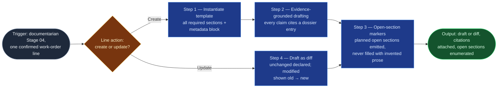

# Doc Drafter

The documentarian flowspace's Stage 04 authoring skill: one pass = one
confirmed work-order line, drafting a governed document against its
registry template with the collaborative open-section discipline that is
this flow's whole point. It writes what the evidence supports, marks what it
cannot, and never papers over a gap with fluent prose. It serves all five
job types; on `sad-update` lines it owns the prose sections while
`sad-diagram-maintainer` owns the diagram sources (built standalone — see
that spec's boundary).

## Flow Diagram

## Triggering intent

- **Fires on:** documentarian Stage 04, once per work-order line — `create`
  lines ("draft the runbook line") and `update` lines ("apply this line's
  changes to the existing SOP").
- **Does not fire on (near-misses):** deciding *what* to draft (that's
  `doc-planner`'s confirmed work order — an unconfirmed line never enters);
  validating the draft (`doc-standards-validator`); committing it
  (`confluence-page-commit`); accomplishments narrative drafting
  (`accomplishments-drafter` — different document family, different voice
  contract); diagram-source edits on `sad-update` lines
  (`sad-diagram-maintainer` — this skill drafts the SAD's prose sections
  only and hands diagram sources sideways).

## Method

1. **Instantiate the registry template (create lines).** All of the matched
   doc type's required sections, in the registry's order, plus the common
   metadata block populated: owner, doc type, source-evidence links,
   review-by per the type's cadence.
2. **Draft only what the evidence supports.** Fill each section only from
   the line's cited dossier entries; every substantive claim traces to a
   citation. Indirect evidence is drafted as indirect ("the close-out
   comments indicate…"), never asserted confidently.
3. **Open sections, never guesses.** Sections the line's open-section plan
   assigns to a human are emitted as protocol markers —
   `> [OPEN — <owner>: <what's needed>]` per
   `reference/collaborative-sections-protocol.md` — with enough surrounding
   scaffold that the owner can fill them without re-deriving context. **The
   defining failure mode: a planned open section quietly filled with
   plausible prose.** One such instance fails the run outright; treat it as
   a gate failure, not a style issue.
4. **Updates are diffs (update lines).** Read the existing page and present
   changes section by section: unchanged sections declared unchanged,
   modifications shown old → new, additions marked. Existing content the
   evidence doesn't contradict is preserved — no style rewrites outside a
   `modernize`-scoped line.
5. **Voice per the standards baseline.** Instructional, second person,
   present tense for procedures; no bold-as-structure, no emojis; numbered
   procedures with one action per step (`documentation-standards.md`).
6. **Present per document.** The draft (or diff) with its open sections
   enumerated; the user may fill open sections now, defer them, or adjust
   the draft. Deferred sections stay marked and travel to Stage 05.

Worked example of the discipline: a runbook line whose evidence covers
diagnosis and remediation but whose escalation path is a planned open
section gets a complete Diagnosis and Remediation draft (every claim cited)
and, under Escalation path, only the section frame plus
`> [OPEN — on-call lead: the sev-1 escalation rotation and pager handoff]` —
not a plausible-sounding rotation invented from adjacent teams' patterns.

## Inputs and grounding

Reads: one confirmed work-order line, the dossier entries it cites, the
registry template for the matched type, the open-section marker protocol,
and (update lines) the existing page content. Grounding rules: no claim
without a citation; quote the evidence where wording matters; when a section
has neither evidence nor a planned open marker, raise it to the user as a
plan gap (back to Stage 03) rather than inventing content or an unplanned
marker.

## Data boundary

- Max data-class: internal. Drafts contain only content already screened at
  Stages 01–02.
- Sanctioned engines: **Rovo or Copilot** — Copilot for repo-adjacent
  `sad-update` content, Rovo for Confluence-native material.

## What this skill is not

- **Not the planner** — it drafts exactly what the confirmed work-order line
  says; scope changes re-enter Stage 03.
- **Not a validator** — `doc-standards-validator` checks the draft; this
  skill doesn't self-certify.
- **Not a committer** — nothing it produces touches a platform;
  `confluence-page-commit` owns the write.
- **Not the accomplishments drafter** — performance-review narratives are
  `accomplishments-drafter`'s family and voice.
- **Not the diagram maintainer** — text-editable diagram sources on
  `sad-update` lines belong to `sad-diagram-maintainer`; this skill flags
  the handoff, drafts the prose.

## Review criteria

On a seeded runbook `create` line (evidence covering diagnosis and
remediation; escalation path planned open) and a seeded SOP `update` line
(evidence touching two of six sections), a run is acceptable when:

1. The runbook draft's section set matches the registry template exactly,
   with the metadata block complete.
2. Every diagnosis/remediation claim carries a citation to a dossier entry.
3. The draft carries exactly one open-section marker — owned, specific,
   protocol-conformant — and invents nothing for escalation.
4. The SOP diff modifies only the two evidenced sections, declares the other
   four unchanged, and preserves their content byte-for-byte.
5. Voice and formatting pass the standards baseline (instructional second
   person; no bold-as-structure, no emojis, no bare TODO/TBD).

## Adapters

| Engine | Artifact | Generated from spec version |
|---|---|---|
| Rovo | adapters/rovo-agent.md | 1.0 |
| Copilot | adapters/copilot-prompt.md | 1.0 |

## Changelog

- **1.0** (2026-07-15) — Initial build from `sp-doc-drafter`. Diagram-source
  editing kept out: `sp-sad-diagram-maintainer` built standalone (see the
  batch decision-log entry) — this spec's boundary names the handoff.
