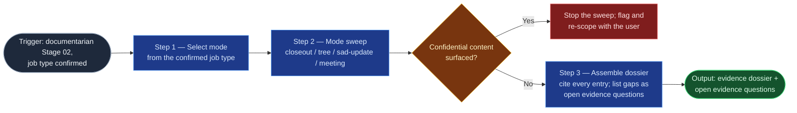

# Doc Evidence Gatherer

The documentarian flowspace's Stage 02: replaces the manual "open twenty
tabs and reconstruct what happened" pass with a mode-conditioned sweep that
downstream doc planning (`doc-planner`) and drafting (`doc-drafter`) can
trace every claim to. One skill, mode-steered — the `context-elicitation`
taxonomy precedent: the gathering discipline is shared (read-only, cite
everything, flag confidence), only the sweep differs by job type. It sits
strictly upstream of judgment: it reports what the sources say and what
they are silent on; it never proposes documents.

## Flow Diagram

## Triggering intent

- **Fires on:** documentarian Stage 02, once per job, in the mode the Stage
  01 confirmed job type selects — "gather the evidence for this closeout,"
  "inventory this page tree," "pull the delivered feature's context,"
  "distill this screened transcript."
- **Does not fire on (near-misses):** gathering one engineer's
  accomplishments evidence (`jira-accomplishments-gatherer` /
  `confluence-contribution-gatherer` — different scope and quality bars;
  reusing them here would violate their declared boundaries); eliciting
  requirements from a human (`context-elicitation`, bound to the
  ai-refinement persona); proposing documents or work-order lines
  (`doc-planner`, on this skill's output); drafting content (`doc-drafter`);
  any request that involves writing to a platform — this skill is read-only,
  full stop.

## Method

1. **Select the mode from the confirmed job type.** The Stage 01
   confirmation is the input, not a guess: `closeout`, `modernize`,
   `tree-audit`, `sad-update`, or `meeting`. The dossier header records the
   job type and the sources swept.
2. **`closeout` mode** — walk the closed work item(s): all fields, the full
   comment thread, linked Confluence pages, linked issues (blocks/relates),
   and attachments' names (not contents, unless the user opens them).
   Distinguish **outcome statements from plan statements** — a comment
   saying "we will" is not evidence that "we did"; record plan statements
   as plans, with the distinction visible in the entry.
3. **`modernize` / `tree-audit` mode** — inventory the target page tree:
   per page, title, parent, labels, last-updated date, contributors count,
   and a structure sketch (headings). Collect the staleness signals
   `documentation-standards.md` defines: review-by lapses per the type's
   cadence, dead links past the >20% threshold, orphaned position (no
   parent, no inbound links), departed owner. `tree-audit` sweeps the full
   tree; `modernize` sweeps only the pages the user scoped.
4. **`sad-update` mode** — gather the delivered feature's evidence: the
   feature's Jira items, linked design docs or ADRs, and (where a repo is in
   scope and Copilot is the engine) the delivering change's repo context via
   a mirroring-protocol §5 handoff. Identify which existing SAD pages and
   diagram sources reference the touched components.
5. **`meeting` mode** — distill the screened transcript/summary into
   decisions made, actions agreed, topics discussed, and Jira items
   explicitly mentioned. Resolve every mentioned Jira key against Jira and
   confirm it exists — a key that doesn't resolve is flagged, never listed
   as if real. Separate decisions from discussion. Carry **no attributions
   the Stage 01 screen did not approve**.
6. **Assemble the dossier.** Every entry carries its source link (Jira key,
   page URL, transcript line reference) and a confidence note where the
   evidence is indirect ("the close-out comments indicate…"). Gaps the
   evidence cannot answer are emitted as explicit **open evidence
   questions** — each stating what's missing and why it matters — the input
   to Stage 03's open-section plan. The defining failure mode: silently
   absorbing a gap into fluent prose; an uncited entry is treated as an
   open evidence question, not evidence.

Throughout every mode's sweep: if the material surfaces `confidential`
content, stop the sweep, flag it, and re-scope with the user before
continuing (the Data boundary's halt).

Worked example of the closeout distinction: a comment reading "we'll add
retry logic after the freeze" enters the dossier as a *plan statement*
(cited); if no later evidence shows the retry logic landed, "did the retry
logic ship?" becomes an open evidence question — the dossier never records
the plan as an outcome.

## Inputs and grounding

Reads: the Stage 01 outputs (confirmed job type + rationale, screened source
material references, acknowledged responsibility flag) and the Jira
project(s) / Confluence space(s) the user confirmed for the sweep, plus
user-provided transcripts. Grounding rules: every dossier entry cites a
resolvable source; quote before paraphrase where wording matters (outcome
vs. plan); when the sources are silent, say so as an open evidence question
rather than inferring. Nothing outside the Stage 01-screened scope is swept.

## Data boundary

- Max data-class: internal. If the sweep surfaces `confidential` content
  (customer detail in an incident record, credentials in a comment), stop,
  flag it, and re-scope with the user before continuing.
- Sanctioned engines: **Rovo** for the Jira/Confluence sweep (the gathered
  content stays in Atlassian); **Copilot** contributes repo context for
  `sad-update` jobs via a mirroring-protocol §5 handoff — it does not run
  the Atlassian sweep.

## What this skill is not

- **Not an accomplishments gatherer** — engineer-scoped brag-sheet evidence
  belongs to `jira-accomplishments-gatherer` and
  `confluence-contribution-gatherer`, whose boundaries exclude this job and
  vice versa.
- **Not an elicitor** — asking a human structured questions is
  `context-elicitation`, bound to the ai-refinement persona.
- **Not a planner or drafter** — it stops at the dossier; proposing
  documents is `doc-planner`, writing them is `doc-drafter`.
- **Not a writer of anything, anywhere** — read-only on every platform it
  touches; a run that wrote something has failed regardless of output
  quality.

## Review criteria

Against a seeded test set (one closed item with a mixed will-do/did comment
thread, one small page tree with two stale pages, one synthetic transcript
naming two real and one nonexistent Jira key), a run is acceptable when:

1. Every dossier entry's source link resolves.
2. The will-do statement is recorded as a plan statement, not an outcome.
3. Both stale pages carry the right staleness signals per the standards
   baseline.
4. The nonexistent Jira key is flagged as unresolvable, not listed.
5. At least one open evidence question is emitted where the material is
   silent — none silently absorbed into prose.
6. Nothing was written to any platform, and the dossier header names Stage
   01's confirmed job type.

## Adapters

| Engine | Artifact | Generated from spec version |
|---|---|---|
| Rovo | adapters/rovo-agent.md | 1.0 |
| Copilot | adapters/copilot-prompt.md | 1.0 |

## Changelog

- **1.0** (2026-07-15) — Initial build from `sp-doc-evidence-gatherer`.
