# Doc Planner

The judgment core of the documentarian flowspace, at Stage 03: it decides
nothing, but it makes every decision inspectable. From the Stage 02 dossier
and the doc-type registry it proposes the set of documents a job should
produce, update, or archive — each with the evidence that justifies it, the
matched registry type with rationale, the open-section plan, and the
Jira-link plan — and puts the whole work order in front of the human for
line-by-line confirmation. Nothing enters the work order unconfirmed; the
confirmed work order fixes downstream scope for Stages 04–07.

## Flow Diagram

```mermaid
flowchart LR
    Start(["Trigger: documentarian Stage 03,<br/>Stage 02 dossier in hand"]):::start --> Propose["Step 1 — Propose documents<br/>only from citing evidence"]:::process
    Propose --> Match["Step 2 — Match registry types<br/>with rationale; redirect<br/>out-of-scope intents"]:::process
    Match --> OpenPlan["Step 3 — Open-section plan<br/>every open evidence question<br/>mapped, with owner"]:::process
    OpenPlan --> Links["Step 4 — Jira-link plan +<br/>job-type extras (audit preamble,<br/>ai-refinement candidates)"]:::process
    Links --> Confirm{"User confirms /<br/>edits / strikes<br/>each line"}:::decision
    Confirm -->|Line struck| Record["Strike recorded;<br/>line leaves the order"]:::halt
    Confirm -->|Confirmed| Output(["Output: confirmed doc work order,<br/>every decision captured"]):::output

    classDef start fill:#1e293b,stroke:#94a3b8,color:#f1f5f9
    classDef process fill:#1e3a8a,stroke:#60a5fa,color:#dbeafe
    classDef decision fill:#78350f,stroke:#fbbf24,color:#fef3c7
    classDef output fill:#14532d,stroke:#4ade80,color:#dcfce7
    classDef halt fill:#7f1d1d,stroke:#f87171,color:#fee2e2
```

## Triggering intent

- **Fires on:** documentarian Stage 03, once per job, on a completed Stage
  02 dossier — "turn this dossier into a work order," "what documentation
  does this closeout need?" Also produces the audit-report preamble for
  `tree-audit` jobs and the candidate work items for `meeting` jobs (shaped
  per `reference/ai-refinement-handoff-contract.md`).
- **Does not fire on (near-misses):** drafting document content
  (`doc-drafter` — this skill plans; it never writes prose into documents);
  refining or creating work items (candidates go to ai-refinement via the
  handoff contract; this skill never targets Jira creation); re-gathering
  evidence (a thin dossier is returned to Stage 02, not padded); executing
  archives (archive lines are proposals only — Stage 07 executes behind
  per-item confirmation).

## Method

1. **Propose documents only from citing evidence.** From the dossier,
   propose the documents this job should create, update, or archive. Per
   proposed document, state the dossier entries that justify it — a
   document with no citing evidence doesn't get proposed. The registry's
   out-of-scope table and this rule are the brake on over-proposing:
   documentation for its own sake is the failure this step guards.
2. **Match each document to a registry type, with rationale.** One of the
   six types (`sop`, `mop`, `runbook`, `sad`, `kb-article`,
   `meeting-notes`), stating which evidence reads as procedure vs.
   maintenance operation vs. incident response vs. architecture vs.
   knowledge answer vs. meeting record. Intents matching the registry's
   out-of-scope table are redirected per that table (e.g. a BRD-shaped ask
   routes to ai-refinement), not planned. For `update` lines, identify the
   existing page and which of its sections the evidence touches.
3. **Map every open evidence question onto the open-section plan.** Per
   `reference/collaborative-sections-protocol.md`: which sections the
   evidence can fill, which the human must, and who owns each open section
   (ungrounded mode: ask the user who owns what). One question silently
   dropped is the defining defect — the Stage verify checks
   question-to-plan one-for-one (or an explicit user strike). If more than
   half a document would be open sections, the evidence isn't ready:
   report that as a finding (gather more, or defer the document) rather
   than hedging with markers.
4. **Jira-link plan per document.** Closeout: the closed items; sad-update:
   the delivering feature; meeting: the discussed items Stage 02 confirmed
   exist. Links are planned here so Stage 06 creates exactly these and
   nothing discovered-along-the-way.
5. **Job-type extras.** `tree-audit`: assemble the audit report (structure
   findings, standards deviations, archive candidates with staleness
   evidence) as the work order's preamble; every remediation and archive
   candidate becomes a work-order line, archive lines marked as proposals.
   `meeting`: shape candidate work items per
   `reference/ai-refinement-handoff-contract.md`; candidates ride the work
   order for Stage 06 to package — never targeted at Jira creation.
6. **Present for line-by-line confirmation.** The full work order with
   per-line rationale; the user confirms, edits, or strikes each line, and
   every decision is recorded on the line. The confirmed work order fixes
   Band ③ scope — adding a document later means re-entering Stage 03.

Worked example of the brake: a closeout dossier mentions in passing that a
neighboring team "should really document their failover" — no dossier entry
evidences that system. No line is proposed; the miss is noted in the run
decision log, not padded into the order.

## Inputs and grounding

Reads: the Stage 02 dossier and open evidence questions list, the doc-type
registry (the version Stage 01 loaded — cite it), the Stage 01 grounding
status, and (update lines) target page metadata. Grounding rules: every
proposed line cites dossier entries by reference; registry rationale quotes
the type's purpose line where the match is non-obvious; when ownership of an
open section is unknown, ask — never assign a guessed owner.

## Data boundary

- Max data-class: internal. The work order references evidence by link; it
  does not duplicate confidential content. A proposed document that would
  require content above `internal` is flagged and re-scoped, not planned.
- Sanctioned engines: **Rovo or Copilot** — planning works from
  already-gathered material; no platform writes.

## What this skill is not

- **Not a drafter** — it plans documents; `doc-drafter` writes them.
- **Not a work-item pipeline** — meeting-job candidates are shaped for the
  ai-refinement handoff; this skill never creates or refines Jira items.
- **Not an evidence gatherer** — a thin dossier goes back to Stage 02
  (`doc-evidence-gatherer`), never padded from memory.
- **Not an archive executor** — archive lines are proposals with evidence;
  execution is Stage 07's (`doc-custodian`), behind per-item confirmation.
- **Not the decision-maker** — the human confirms, edits, or strikes every
  line; an unconfirmed line never binds downstream stages.

## Review criteria

On a seeded closeout dossier (rich evidence for one runbook, partial
evidence for one SOP, one out-of-scope BRD-shaped ask, two open evidence
questions), a run is acceptable when:

1. Exactly the two in-scope documents are proposed, each with type rationale
   and cited dossier entries — no document proposed without citations.
2. The BRD-shaped ask is redirected to ai-refinement per the registry's
   out-of-scope table, not planned.
3. Both open evidence questions map to owned open sections in the plan
   (or carry an explicit user strike) — none silently dropped.
4. The presented work order supports per-line confirm/edit/strike with every
   decision captured on the line.
5. The registry version cited equals the version Stage 01 loaded, and no
   platform write occurred.

## Adapters

| Engine | Artifact | Generated from spec version |
|---|---|---|
| Rovo | adapters/rovo-agent.md | 1.0 |
| Copilot | adapters/copilot-prompt.md | 1.0 |

## Changelog

- **1.0** (2026-07-15) — Initial build from `sp-doc-planner`.
