# Doc Standards Validator

The documentarian analog of `workitem-validation`, at Stage 05: a
read-and-report pass over one draft or diff against two written specs — the
registry type's schema and the `documentation-standards.md` baseline. Its
most load-bearing output is the open-section enumeration: the list Stage
06's waiver gate puts in front of the user, which must match the
in-document markers one-for-one. It checks shape, standards, and the
honesty of the open-section accounting — content quality and evidence
fidelity are Stage 04's citation discipline, not re-judged here.

## Flow Diagram

```mermaid
flowchart LR
    Start(["Trigger: documentarian Stage 05,<br/>Stage 04 draft/diff in hand"]):::start --> Schema["Step 1 — Schema completeness<br/>required sections + metadata<br/>per the registry type"]:::process
    Schema --> Enumerate["Step 2 — Open-section enumeration<br/>every deferred marker listed,<br/>one-for-one"]:::process
    Enumerate --> Standards["Step 3 — Standards pass<br/>naming, structure, labels,<br/>links, voice"]:::process
    Standards --> DiffSafe["Step 4 — Diff safety<br/>update lines touch only<br/>work-order-scoped sections"]:::process
    DiffSafe --> Output(["Output: findings report,<br/>pass/fail per check —<br/>document unchanged"]):::output

    classDef start fill:#1e293b,stroke:#94a3b8,color:#f1f5f9
    classDef process fill:#1e3a8a,stroke:#60a5fa,color:#dbeafe
    classDef decision fill:#78350f,stroke:#fbbf24,color:#fef3c7
    classDef output fill:#14532d,stroke:#4ade80,color:#dcfce7
    classDef halt fill:#7f1d1d,stroke:#f87171,color:#fee2e2
```

## Triggering intent

- **Fires on:** documentarian Stage 05, once per work-order line, on the
  Stage 04 draft or diff — "validate this draft," "is this ready for the
  commit gate?"
- **Does not fire on (near-misses):** work-item validation
  (`workitem-validation` — Jira payloads, a different schema family);
  fixing what it finds (failures return the line to Stage 04); provenance
  frontmatter checks on mirror artifacts (`provenance-stamper`, referenced
  separately by the stage); judging content quality or evidence fidelity —
  that is Stage 04's citation discipline; resolving, softening, or hiding
  an open-section marker, ever.

## Method

1. **Schema completeness.** Every required section of the line's registry
   type is present and non-empty — a protocol-conformant open-section
   marker counts as present-by-design, not missing. The common metadata
   block is complete: `doc-type`, `owner`, `source-evidence`,
   `last-verified`, `review-by` per the type's cadence, `status`.
2. **Open-section enumeration.** List every deferred marker with its owner
   and what's-needed. The list must match the in-document markers
   one-for-one — under-reporting starves Stage 06's waiver gate, the
   check that matters most; over-reporting sends the user waiving ghosts.
   Markers are never resolved, softened, or hidden at this stage.
3. **Standards pass** per `documentation-standards.md`: page-title pattern
   (`<System/Area> — <Doc Type Label> — <Specific subject>`; dates only in
   `meeting-notes` titles); heading nesting without skips; numbered
   procedures with one action per step (expected results mandatory per step
   for MOPs); the doc-type label set; link hygiene — every internal link
   resolves, Jira keys well-formed and existing (Stage 02 confirmed, this
   pass re-checks), no bare-text keys in prose; voice and formatting
   (instructional second person, no bold-as-structure, no emojis); no
   names, attributions, or PII beyond the Stage 01 screen; no bare
   TODO/TBD or empty heading outside protocol marker syntax.
4. **Diff safety (update lines).** The diff touches only the sections the
   work-order line scoped; out-of-scope drift is a finding, not a silent
   fix.
5. **Findings report.** Pass/fail per check, one-line finding per failure,
   each quoting or precisely locating the offending content. Failures
   return the line to Stage 04; the loop repeats until the report is clean
   or the user explicitly accepts a listed finding — accepted findings are
   recorded as accepted, never deleted from the report.

Known failure mode to guard: "helpfully" normalizing while checking — the
document handed to Stage 06 must be byte-identical to what Stage 04
produced; a validator that edits has become a second drafter with no
citation discipline.

## Inputs and grounding

Reads: the Stage 04 draft/diff and open-section marker list, the doc-type
registry schema for the line's type, and the standards baseline. Grounding
rules: every finding quotes or precisely locates the offending content —
never a paraphrase; checks run against the two written specs as they stand,
not against taste; a check the specs don't define isn't a finding, it's a
suggestion clearly labeled as such (or a flagged gap in the baseline for
the operator).

## Data boundary

- Max data-class: internal. Validation reads the draft and the two
  reference specs; it introduces no new content and touches no platform.
- Sanctioned engines: **Rovo or Copilot** — pure read-and-report against
  written specs.

## What this skill is not

- **Not a fixer** — failures return to Stage 04; this skill changes
  nothing, not even typos.
- **Not `workitem-validation`** — Jira work-item payloads are that skill's
  schema family; governed documents are this one's.
- **Not the provenance checker** — frontmatter/page-property compliance on
  mirror artifacts is `provenance-stamper`.
- **Not a content judge** — evidence fidelity and citation discipline are
  Stage 04's contract; this skill checks shape, standards, and open-section
  accounting.
- **Not a waiver gate** — it enumerates open sections; the waiver decision
  is Stage 06's, in front of the user.

## Review criteria

On a seeded draft carrying five planted defects (one missing required
section, one dead link, one bare TODO, one heading skip, one marker missing
from a doctored enumeration list), a run is acceptable when:

1. All five planted defects appear as findings with correct one-line
   descriptions, each quoting or locating the offense.
2. Zero false positives on the clean sections.
3. The document content is byte-identical after the run.
4. The corrected enumeration matches in-document markers one-for-one.
5. A user-accepted finding is recorded as accepted in the report, not
   deleted.

## Adapters

| Engine | Artifact | Generated from spec version |
|---|---|---|
| Rovo | adapters/rovo-agent.md | 1.0 |
| Copilot | adapters/copilot-prompt.md | 1.0 |

## Changelog

- **1.0** (2026-07-15) — Initial build from `sp-doc-standards-validator`.
