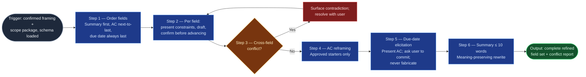

# Field Refinement Cadence

The disciplined middle of the `ai-refinement` pipeline: it takes the confirmed
framing and scope package from Stages 02–03 and refines the remaining schema
fields — each drafted, constrained, and individually confirmed — so the ticket
is built from accountable field-level decisions rather than reviewed as an
undifferentiated blob. **Cadence is conditionally scoped, not one fixed mode:**
in full-interactive mode, every field is walked one at a time; in fast-track
mode (selected at Stage 01), fields the agent can confidently draft from
source material are extracted with citation and grouped for the Stage 03–05
consolidated checkpoint, while fields it can't confidently draft — plus
`due_date`, always, without exception — still walk the one-at-a-time queue
below. The accountability mechanism (an individual, explicit confirmation per
field) never disappears; fast-track changes only where that confirmation
happens, not whether it happens. It hands a complete field set to
`workitem-validation`, which gates; this skill drafts.

## Flow Diagram

## Triggering intent

- **Fires on:** Stage 04 of `ai-refinement` (framing and scope confirmed);
  "walk me through the remaining fields," "let's finish the ticket fields."
- **Does not fire on (near-misses):** "what is this item actually about?"
  (`context-elicitation`); "what's in scope / what does it depend on?"
  (`scope-dependency-mapper`); "is this Jira-ready?" (`workitem-validation`);
  bulk-editing fields across many existing issues.

## Method

1. **Order the fields.** Summary first — it anchors everything. Acceptance
   criteria next-to-last — they depend on scope, value, and dependencies. Due
   date always last: it is elicited only after acceptance criteria exist, so
   the user has something concrete to size a commitment against (spike:
   timebox is elicited alongside due date, at the same point, and validated
   against it). Remaining required fields, between summary and acceptance
   criteria, in schema dependency order. Never ask the user to choose an
   order; the ordering is the skill's job. **In fast-track mode**, this
   ordering governs presentation grouping, not elicitation sequence: fields
   drafted with confidence from source material are grouped, with citations,
   for the Stage 03–05 consolidated checkpoint; only fields not confidently
   draftable — plus `due_date`, always — enter the one-at-a-time queue in
   Method step 2, in the stated order.
2. **One field at a time, for whichever fields reach this step.** In
   full-interactive mode, every field reaches it. In fast-track mode, only
   fields that couldn't be confidently drafted from source material, plus
   `due_date` (a hard carve-out, see step 5), reach it — confidently-drafted
   fields are presented at the consolidated checkpoint instead (with their
   citations, so the user can verify the source). For each field that does
   reach this step: present its name, constraints (e.g., summary ≤ 10 words),
   and any pre-filled content from Stages 02–03; draft or refine the value;
   obtain explicit confirmation before advancing. `confirm_each_step: true` is
   non-negotiable for these fields — batching their confirmations to save
   turns defeats the accountability mechanism; fast-track's consolidated
   checkpoint is a different, still-individual confirmation per field, not a
   batching of this step. Content confirmed upstream is placed, not rewritten;
   propose changes to it only as a flagged deviation.
3. **Cross-field conflict detection.** After each draft, check for
   contradictions: due date earlier than a blocking dependency's resolution;
   in-scope claims with no corresponding acceptance criterion; type-of-work /
   work-category inconsistency (every type that carries both fields per the
   work-item-schemas registry — feature, task, story, spike, and bug); a
   conflict axis triggered in Stage 03 with no decision-owner recorded. For
   `bug`, this is a within-field check rather than a cross-field one:
   `description` must state an actual result that contradicts its own stated
   expected result — a description that only restates the expected behavior,
   with no observed failure, means no bug. Surface conflicts immediately —
   don't defer them to validation.
4. **Acceptance-criteria reframing.** Every criterion begins "Must be able to"
   or "We will know this is done when." *Worked example:* "the dashboard
   should be faster" → "We will know this is done when the capacity dashboard
   loads in under 3 seconds for the 95th percentile request." Preserve the
   user's meaning; change the form. Present reframed criteria in the persona's
   `communication_style` (precise, analytical, structured, direct) regardless
   of mode.
5. **Due-date elicitation — hard carve-out, every mode, no exception.** Never
   auto-generate or infer a due date, in full-interactive or fast-track — it
   is always a user commitment, obtained, not derived. Present the confirmed
   acceptance criteria back to the user as an effort reference, then ask
   directly: "When can you commit to completing this work?" If the source
   material states a deadline (e.g., a vendor advisory's expiration, or a
   date in a structured requirements document), surface it as a reference
   point, not an answer — the user still confirms the date explicitly; a date
   being present in the source is extraction of a reference, never a
   substitute for the user's commitment. For spikes, obtain the timebox at the
   same time and validate it closes on or before the confirmed due date; a
   timebox that doesn't close in time is a conflict, surfaced and resolved
   before advancing (step 3). A date the user never explicitly confirmed does
   not leave this step, regardless of mode. This is the flowspace's
   `due_date_elicitation` house amendment
   (`../../icp-flows/ai-refinement/reference/ai-refinement-hybrid.md`).
6. **Summary enforcement.** Validate ≤ 10 words; if exceeded, propose a
   meaning-preserving rewrite and confirm it.

## Inputs and grounding

Reads: confirmed outputs of Stages 02–03, the work-item schema from Stage 01,
the selected mode (fast-track / full-interactive) from Stage 01, and the field
definitions (summary limit, AC starters) and house amendments in the
flowspace's `reference/ai-refinement-hybrid.md`. Grounding rules: never invent
field content the user hasn't supplied, confirmed upstream, or cited from
source material — draft from what exists and ask for what's missing; never
silently alter a confirmed upstream value; a due date is elicited from the
user, never derived or defaulted, even when source material states a
candidate deadline, and even in fast-track mode; every fast-track-extracted
field carries a citation to where it came from — extraction without a
citation is treated the same as fabrication.

## Data boundary

- Max data-class: internal (field values may reference internal systems; no
  credentials, tokens, or PII in any field value).
- Sanctioned engines: Rovo and Copilot, per the employer matrix.

## What this skill is not

- **Not an elicitor** — missing problem context routes back to
  `context-elicitation`.
- **Not a scope mapper** — scope disputes reopen Stage 03 via
  `scope-dependency-mapper`.
- **Not the validation gate** — `workitem-validation` owns the final
  completeness/formatting verdict; this skill aims to arrive there clean, but
  it does not issue the pass/fail report.
- **Not a Jira writer** — nothing here touches the Jira API; that's
  `jira-commit`.

## Review criteria

A single output of this skill is acceptable when:

1. Every required field for the selected type has a value; no placeholder text.
2. Fields were presented in the stated order (summary first, AC next-to-last,
   due date always last) — check the transcript; in fast-track mode,
   extracted fields were grouped for the consolidated checkpoint and only
   fallback/carve-out fields entered the one-at-a-time queue.
3. Each field carries an individual explicit confirmation — inline (step 2)
   or at the consolidated checkpoint (fast-track extracted fields); either
   way, no field lacks its own confirmation.
4. All acceptance criteria use an approved starter; the summary is ≤ 10 words.
5. All four conflict categories were checked, with any hits surfaced and
   resolved (or carried into the conflict report), not deferred silently.
6. No upstream-confirmed value was altered without a flagged, confirmed
   deviation.
7. The due date in the transcript traces to an explicit user commitment made
   after acceptance criteria were presented — never a value the skill
   generated or defaulted, in any mode; for spikes, the timebox closes on or
   before it.
8. Every fast-track-extracted field carries a source citation in the
   transcript.
9. All user-facing presentation (field constraints, AC reframing, due-date
   ask) reads as precise, analytical, structured, and direct.

## Adapters

| Engine | Artifact | Generated from spec version |
|---|---|---|
| Rovo | adapters/rovo-agent.md | 1.5 |
| Copilot | adapters/copilot-prompt.md | 1.5 |

## Changelog

- **1.5** (2026-07-07) — Method step 3's bug-specific conflict check rewritten
  from a cross-field comparison (expected_result vs. actual_result) to a
  within-field check on `description` — tracks the work-item-schemas
  registry's 1.3 simplification, which folded those two fields into
  `description`'s content. Both adapters regenerated to match. See
  `../../icp-flows/ai-refinement/decision-log/2026-07-07-bug-field-simplification-and-portfolio-epic-confirmation.md`.
- **1.4** (2026-07-07) — Method step 3's type-of-work/work-category
  consistency check list extended from feature/task/story/spike to include
  `bug` (tracks the work-item-schemas registry's 1.2 addition), plus a new
  bug-specific conflict check (expected_result must contradict actual_result,
  superseded by 1.5 above). `truth-level` moves from `verified` to `to-review`
  pending a gate re-run. Both adapters regenerated to match (they enumerate
  the type list explicitly). See
  `../../icp-flows/ai-refinement/decision-log/2026-07-07-portfolio-epic-and-bug-type-extension.md`.
- **1.3** (2026-07-03) — Two changes bundled from the drift-analysis revision
  pass. (a) Cadence made conditionally scoped instead of a single fixed mode:
  Method steps 1–2 now describe fast-track mode's extraction-with-citation
  path (grouped for the Stage 03–05 consolidated checkpoint) alongside the
  existing full-interactive one-at-a-time path — the accountability mechanism
  (an explicit per-field confirmation) is unchanged, only where it happens
  moves. Due-date elicitation (step 5) is explicitly marked a hard carve-out
  that fast-track cannot relax. (b) Method steps 4 and 5 (AC reframing,
  due-date ask) tie presentation phrasing to the persona's
  `communication_style`, citing the house amendment in
  `ai-refinement-hybrid.md`. Three new review criteria (citation tracking,
  mode-aware confirmation, communication_style compliance). Both adapters
  regenerated. Content change: pre-gate evidence re-run required — see
  `../../skill-foundry/decision-log/2026-07-03-communication-style-and-fast-track-skill-revision-pass.md`.
- **1.2** (2026-07-03) — Operator-observed defect fix (Stage 06 feedback,
  NEADD-1827): due date is now an explicit, elicited Method step (new step 5)
  instead of an unspecified part of "one field at a time" — the skill never
  auto-generates or infers it, presents the confirmed acceptance criteria as
  an effort reference first, and validates a spike's timebox against the
  confirmed date. Field ordering rule revised: acceptance criteria moved from
  "last" to "next-to-last" so due date can always be elicited after them.
  Cross-field conflict check 3 broadened from "feature only" to every type
  that carries `type_of_work`/`work_category` (feature, task, story, spike —
  tracks the 1.1 work-item-schemas revision). Both adapters regenerated. See
  `decision-log/2026-07-03-stage06-feedback-revision.md`.
- **1.1** (2026-07-03) — Flow Diagram brought to one-for-one with the Method
  prose: AC reframing and summary enforcement split into their own numbered
  nodes; conflict-detection diamond numbered (pre-gate spec-review finding; no
  behavior change). Adapters re-stamped — content unchanged by a diagram-only
  revision.
- **1.0** (2026-07-03) — Initial build from `sp-field-refinement-cadence`.
