# Fitness and Dissatisfaction Profiler

The opening move of a STATIK pass (`statik-adoption`, Stages 01–02) and the
source of every criterion the rest of the method measures against. It answers two
questions about one service: **what do its customers judge it on**, and **what is
wrong with it today** — asked of the customers and of the delivery organisation
separately, because they are dissatisfied by different things.

It replaces the workshop's most commonly botched opening: a single round-the-room
"what's not working?" that merges customer and delivery perspectives, produces
complaints about named colleagues, and yields a list nothing downstream can
measure against.

Neighbours: `context-elicitation` frames one *work item*'s problem context for
refinement; this frames one *service*'s standing fitness for system design. Same
technique family, different unit of analysis.

## Flow Diagram

```mermaid
flowchart LR
    Start(["Trigger: named service +<br/>customer groups;<br/>criteria + dissatisfaction needed"]):::start
    P1["1 — State the<br/>attribution rule<br/>before any question"]:::process
    P2["2 — Split groups:<br/>recipients vs<br/>dependants"]:::process
    P3["3 — Elicit fitness<br/>criteria per group"]:::process
    P4["4 — Elicit EXTERNAL<br/>dissatisfaction"]:::process
    P5["5 — Elicit INTERNAL<br/>dissatisfaction<br/>(different questions)"]:::process
    D1{"6 — Matches a<br/>criterion?"}:::decision
    P6["Amend criteria<br/>or route<br/>out-of-scope"]:::process
    P7["7 — Corroborate with<br/>board signal;<br/>label as corroboration"]:::process
    Output(["Output: external set, internal set,<br/>criteria amendments,<br/>out-of-scope + discrepancy lists"]):::output

    Start --> P1 --> P2 --> P3 --> P4 --> P5 --> D1
    D1 -->|"no"| P6 --> P7
    D1 -->|"yes"| P7 --> Output

    classDef start fill:#1e293b,stroke:#94a3b8,color:#f1f5f9
    classDef process fill:#1e3a8a,stroke:#60a5fa,color:#dbeafe
    classDef decision fill:#78350f,stroke:#fbbf24,color:#fef3c7
    classDef output fill:#14532d,stroke:#4ade80,color:#dcfce7
    classDef halt fill:#7f1d1d,stroke:#f87171,color:#fee2e2
```

## Triggering intent

**Fires on:**

- Stages 01–02 of `statik-adoption`.
- "What do our customers actually judge this service on?"
- "Run a dissatisfaction analysis for this service."
- "Why are people unhappy with how we deliver X?"
- "We need fitness criteria before we can measure anything."
- "What's frustrating about our intake process?" — where the unit is a service.

**Does not fire on (near-misses):**

- **Framing one work item's problem context** → `context-elicitation`. The tell
  is the unit: a single request, ticket, or idea being refined into schema fields.
- **Authoring or maintaining a stakeholder register** → `ai-refinement`'s register
  material. This skill *reads* a register where one exists; it never writes one.
- **A team retrospective** — examines a team's recent work; this examines a
  service's standing fitness.
- **"What should we do about it?"** — remedy is the rest of the flowspace. This
  skill surfaces and structures only.
- **Gathering an individual's accomplishments** → `jira-accomplishments-gatherer`.

## Method

### 1 — State the attribution rule first, out loud

Before asking a single question, tell participants: dissatisfaction will be
recorded against a **source group** ("upstream requesters", "the on-call
engineers"), never against a named person, and no written artifact will carry
individual attributions.

Say it first, every time. This is not politeness — an unstated attribution rule
reliably produces one of two useless outcomes: a sanitized set of non-answers, or
a set of complaints about colleagues. The second is worse than nothing, because
it cannot be published and cannot be acted on.

### 2 — Split customer groups into recipients and dependants

- **Recipients** ask the service for its output.
- **Dependants** are affected by it without asking — downstream teams, on-call
  engineers, auditors, whoever inherits the consequences.

Both hold fitness criteria. Only recipients usually get asked, and dependants
routinely have the sharpest complaints precisely because nobody has ever asked
them. A run that surfaces criteria only from recipients is incomplete and says so.

### 3 — Elicit fitness criteria per group

Ask what makes this service fit for *their* purpose — what they judge it on.
Drive toward the standard axes without leading with them:

| Axis | The question behind it |
|---|---|
| Lead time | How fast does this need to be? |
| Predictability | Does it matter more that it's fast, or that you can rely on when? |
| Quality | What does "done properly" mean for you? |
| Safety | What must never happen? |
| Regulatory | What are you obliged to be able to show? |

Each criterion ends stated as something **measurable in principle**, with the
group holding it. A criterion nobody can name any conceivable measure for is
recorded `unmeasurable` with the reason — **not dropped**. In practice the
unmeasurable ones are often the real ones, and the capability analysis needs to
know it cannot verdict on them rather than finding them simply absent.

**Do not invent criteria from the axis list because a group was hard to reach.**
A criterion nobody stated is one the team assumed, and it will drive design
decisions that address nothing. An unreached group is recorded as unreached.

### 4 — Elicit external dissatisfaction

Ask each customer group — recipients and dependants:

- What about this service frustrates you?
- What do you work around?
- **What do you not ask us for any more, because it isn't worth it?**

The third question is the highest-yield one in the whole method. It surfaces
demand that has *stopped arriving* — which no board can show, because the board
only records what was asked for. A service whose hardest requests have quietly
migrated elsewhere looks healthy in every metric.

### 5 — Elicit internal dissatisfaction, separately and in different words

Ask the delivery organisation:

- What prevents you from doing a good, professional job here?
- Where does work sit?
- What do you get interrupted for?
- What do you have to do twice?

This is **not the same question pointed inward**. People delivering a service are
dissatisfied by different things than people receiving it, and one merged
question loses that difference entirely.

**Keep the two sets separate through to the output.** Do not merge them into one
ranked list. The distinction is load-bearing at socialization: external
dissatisfaction is what justifies the change to stakeholders, internal
dissatisfaction is what the team will judge the change by, and a design resolving
only one of them fails for reasons nobody can articulate if the two were merged.

### 6 — Attribute and connect

Every recorded item names its **source group** and the **fitness criterion it
threatens**. Two exceptions get explicit paths rather than being forced:

- **No matching criterion** → step 3 missed one. Add it, record it as an
  amendment, and say so. This is a normal and valuable outcome, not a defect.
- **Not about flow at all** (tooling, staffing, interpersonal, a wrong product
  decision) → a clearly separate out-of-scope list, handed back for routing. A
  Kanban system will not fix it, and carrying it forward silently means
  socialization promises something the design cannot deliver.

**Worked example.** A dependant team says: *"We never know when a change is
actually going live, so we staff the bridge for a four-hour window every time."*

- Source group: `downstream operations` (dependant) — not the individual who said it.
- Threatened criterion: **predictability** of delivery timing. If step 3 recorded
  only "lead time" for this group, emit a criteria amendment adding predictability.
- Not out-of-scope: it is directly about flow.
- Corroboration to look for: variance in the gap between a scheduled and an actual
  delivery date. Present or absent, the statement stands.

### 7 — Corroborate with board signal, and label it corroboration

Where a board is bound, aged items, high blocked counts, reopen rates, and long
queue residency can **support** a stated dissatisfaction. They can never
**discover** one — a board records the work that arrived, never the frustration of
the person who stopped sending it.

Board signal that **contradicts** a stated dissatisfaction is reported as a
discrepancy for a human to resolve. It is never used to overrule the person who
said it. The board being wrong about the work is one of the findings this whole
exercise exists to surface.

### 8 — Emit and stop

Four artifacts, separately: external set, internal set, criteria amendments,
out-of-scope list — plus the discrepancy list where one exists. Then stop. Remedy
is not this skill's job.

## Inputs and grounding

**Reads:** the service frame (service name, customer groups with recipient/
dependant tags); an existing stakeholder register where one is loaded; SLA/OLA or
service-definition documents where they exist; and, for corroboration only, a
bound Jira item set.

**Grounding rules:**

- Every criterion and every dissatisfaction traces to a group that stated it.
  Nothing is inferred from the standard axis list to fill a gap.
- An unreached group is recorded as unreached, with what is therefore unknown.
- Board signal is always labelled as corroboration and never presented as the
  origin of a finding.
- Quote the substance of what was said before paraphrasing it into a criterion —
  the paraphrase is where meaning is most often lost.
- "Not found" and "not asked" are different, and both are stated.

## Data boundary

- **Max data-class:** `internal`
- **Sanctioned engines:** Rovo, Copilot — per the employer matrix.
- This is the most sensitive conversational surface in the flowspace. Elicitation
  routinely surfaces named individuals and inter-team friction. **Individual names
  are removed at the point of recording, not at the point of publishing**, so no
  artifact in the run ever carries them.
- Raw elicitation notes, if kept at all, stay in the run's transient `work/`
  folder and never enter the run record.

## What this skill is not

- **Not `context-elicitation`.** That frames one work item's problem context into
  schema-ready fields for `ai-refinement`. This profiles a service. The boundary
  is the unit of analysis, and neither skill substitutes for the other.
- **Not a stakeholder-register author.** It reads a register; `ai-refinement`'s
  register material owns authoring and maintenance.
- **Not a retrospective facilitator.** A retrospective examines a team's recent
  work; this examines a service's standing fitness.
- **Not a remedy proposer.** No design suggestions, no "you should try." The
  classes-of-service and system-design skills own that, downstream.
- **Not a measurement skill.** It records what criteria *could* be measured by;
  `flow-capability-analyzer` does the measuring.
- **Not a writer to any external system.** No Jira or Confluence writes.

## Review criteria

A human judges one output acceptable when:

1. Fitness criteria are present from **both** recipient and dependant groups, or
   any unreached group is explicitly recorded as unreached with what is unknown.
2. Internal and external dissatisfaction are emitted as **separate artifacts** —
   not merged, even when one has few items.
3. Every dissatisfaction names a source group **and** a fitness criterion, or
   appears on the out-of-scope list with a reason. Nothing is unattributed.
4. **No individual is named** anywhere in the output, including in quoted material.
5. Dissatisfaction with no matching criterion produced a criteria amendment rather
   than being dropped or force-fitted into the nearest existing criterion.
6. Unmeasurable criteria survive into the output, marked, with their reason.
7. Board signal appears only as labelled corroboration; any contradiction appears
   as a discrepancy for a human, not as an overruled statement.
8. No remedy, design suggestion, or prioritisation appears anywhere in the output.

## Adapters

| Engine | Artifact | Generated from spec version |
|---|---|---|
| Rovo | adapters/rovo-agent.md | 1.0 |
| Copilot | adapters/copilot-prompt.md | 1.0 |

## Changelog

- **1.0** (2026-08-01) — Initial build from `sp-fitness-and-dissatisfaction-profiler`.
