# Flow Capability Analyzer

STATIK step 4 (`statik-adoption`, Stage 04): what the service is actually capable
of delivering, from the record. It replaces "we usually turn those around in a
couple of weeks."

It exists because flow metrics are the one part of STATIK where a board can answer
definitively, and where getting the arithmetic wrong is both easy and invisible —
an average lead time looks like an answer, is computed correctly, and describes no
item that ever existed.

## Flow Diagram

```mermaid
flowchart LR
    Start(["Trigger: type set + bound item set;<br/>capability profile needed"]):::start
    P1["1 — Fix and DECLARE the<br/>measurement start point"]:::process
    D1{"2 — Type above the<br/>completed-item floor?"}:::decision
    P2["Report labelled<br/>observations,<br/>not percentiles"]:::process
    P3["Lead time: 50/85/95<br/>percentiles"]:::process
    P4["3–4 — Throughput vs arrival;<br/>predictability as 95/50 spread"]:::process
    D2{"6 — Transition<br/>history available?"}:::decision
    P5["Per-state residency,<br/>working vs waiting,<br/>flow efficiency"]:::process
    P6["Explicit UNAVAILABLE<br/>block naming what<br/>was lost"]:::halt
    P7["8–9 — Verdict every fitness<br/>criterion; surface<br/>bimodal split candidates"]:::process
    Output(["Output: capability profile, residency,<br/>fitness verdicts, measurement basis,<br/>split candidates"]):::output

    Start --> P1 --> D1
    D1 -->|"no"| P2 --> P4
    D1 -->|"yes"| P3 --> P4 --> D2
    D2 -->|"yes"| P5 --> P7
    D2 -->|"no"| P6 --> P7 --> Output

    classDef start fill:#1e293b,stroke:#94a3b8,color:#f1f5f9
    classDef process fill:#1e3a8a,stroke:#60a5fa,color:#dbeafe
    classDef decision fill:#78350f,stroke:#fbbf24,color:#fef3c7
    classDef output fill:#14532d,stroke:#4ade80,color:#dcfce7
    classDef halt fill:#7f1d1d,stroke:#f87171,color:#fee2e2
```

## Triggering intent

**Fires on:**

- Stage 04 of `statik-adoption`.
- "How long does this kind of work actually take?"
- "What's our lead time distribution?"
- "Are we predictable?"
- "Do we hit our due dates?"
- "Where does the time actually go in this workflow?"

**Does not fire on (near-misses):**

- **"What kinds of work arrive, and how often?"** → `demand-profiler`. Demand is
  arrival; capability is delivery. This skill consumes that skill's type set and
  never derives its own.
- **"How fast is <person>?" / individual cycle time** → refused outright, with a
  stated reason. Not reframed, not silently aggregated into an answer.
- **"Which items should we close?"** → `closure-scorer`. That measures the worth
  of individual items; this measures the system.
- **"Pull my closed work for the quarter"** → `jira-accomplishments-gatherer`.
  Different unit (person), different intent (review evidence).
- **"What should our WIP limits be?"** → `kanban-system-designer`, which consumes
  this skill's residency output.

## Method

### 1 — Fix the measurement start point and declare it

Lead time is measured from a stated point, and which point is chosen changes every
number. When invoked before the commitment point is ratified (the normal case at
Stage 04), **measure from item creation, declare that you did, and emit a
recomputation flag** for when the commitment point lands.

This declaration is the artifact that makes the flow's most consequential
loop-back safe. Without it, a commitment point ratified three weeks after creation
leaves every percentile, every predictability ratio, and every WIP limit derived
from them describing a system that does not exist — with nothing downstream able
to detect it.

### 2 — Report lead time as a distribution, never as an average

**Percentiles: 50th, 85th, 95th**, per type, with the observation count and window.

This is the load-bearing quality rule. Knowledge-work lead times are right-skewed:
the mean sits above the median and describes no actual item, and a customer
commitment made against an average is missed roughly half the time *by
construction*. When someone asks for "the average," return the distribution and
say why.

**Below the per-type floor** (see `board-evidence-requirements.md` §3): report
individual observations as a labelled list. **Never percentiles over a handful of
items** — a "95th percentile" of seven observations is an arithmetic operation
performed on noise, and it will be quoted as though it were a service level.

### 3 — Report throughput, and compare it to arrival explicitly

Items completed per unit time, **in the same unit as the arrival rate** so the two
are directly comparable — then make the comparison, per type, in the output.

A type whose arrival rate exceeds its throughput has a queue growing without
bound. That comparison is frequently the single most actionable finding in an
entire run, and it is invisible unless the two numbers are placed side by side.

### 4 — Report predictability as spread

The **95th/50th ratio** per type. Not a separate composite score.

A type delivering in 3 days at the median and 40 at the 95th is unpredictable
however good the median looks. Predictability is usually what customers actually
mean when they say they want things faster, and separating it from raw speed is
often the finding that reframes the whole socialization conversation.

### 5 — Report due-date performance where due dates exist

Proportion met, and the lateness distribution for those missed.

Where the field is absent or unpopulated, report **`unavailable`** — never "no due
dates," which is a different and much stronger claim about the service.

### 6 — Report per-state residency where history allows

Time in each state per type, split **working vs waiting** (using the activity/queue
distinction where it is available, and state names as a labelled provisional guess
where it is not). Flow efficiency — working time over total lead time — where
computable.

This is the input that makes a WIP limit defensible rather than guessed.

### 7 — Take the degrade path explicitly when history is absent

With Created and Resolved only:

| Still computable | Lost |
|---|---|
| End-to-end lead time | Per-state residency |
| Throughput and the arrival comparison | Working/waiting split |
| Due-date performance | Flow efficiency |
| Predictability spread | Blocked-time analysis |

**Emit an explicit `unavailable` block naming what was lost and why. Do not omit
the sections** — a missing section reads as "nothing to report," which is a
different claim from "not measurable here," and the difference lands directly on
whether a downstream WIP limit is derived or guessed.

### 8 — Verdict every fitness criterion, per type

`meets` / `misses` / `unmeasurable`, with the figure behind it. Every
`unmeasurable` **names the specific absent data** — the field, or the history —
rather than being left blank.

This table is the evidentiary core of the socialization conversation.
`unmeasurable` is an honest and acceptable verdict; **absence is not**, because a
criterion that mattered enough for a customer to state it must not silently drop
out for want of a convenient metric.

### 9 — Surface bimodal distributions as split candidates

A type whose lead-time distribution is clearly bimodal is usually two types that
demand analysis merged. Report it as a **candidate loop-back** with the evidence.
Do not split it here — type discovery is not this skill's job.

**Worked example.** Type `Change` shows a median of 4 days, an 85th of 9, and a
95th of 62 — with the observations clustering around 3–10 days and again around
55–70. That is not one unpredictable type; it is almost certainly routine changes
and CAB-reviewed changes sharing a label. Report the bimodality, the two clusters
with their counts, and the loop-back recommendation. Do not report a 95th
percentile of 62 as this type's capability, because no downstream stage will be
able to tell it describes two populations.

## Inputs and grounding

**Reads:** the work item type set with its floor marks; the demand profile (for
the arrival comparison); the fitness criteria and per-type customer expectations;
the history-availability finding; the normalized item set; the mode declaration.

**Named input gap:** `jira-portfolio-ingest` emits a *point-in-time* item set and
does not carry status-transition history. History is declared here as an input
requirement with the §7 degrade path, so the skill runs either way — but per-state
residency depends on an unresolved operator decision (extend that skill, request
history here, or accept the degrade permanently). State which applies in every
run.

**Grounding rules:**

- Every figure carries its observation count and window.
- Every `unavailable` names the specific missing field or history.
- No figure is estimated or interpolated. A gap is reported as a gap.
- Where the mode is conversation-only, every figure is tagged `estimated` and no
  percentile is reported at all — elicited memory does not produce a distribution.

## Data boundary

- **Max data-class:** `internal`
- **Sanctioned engines:** Rovo, Copilot — per the employer matrix.
- **No per-person metric at any point.** Lead time, throughput, and residency are
  reported per type and per state, never per assignee. A direct request for
  individual cycle time is **declined with a stated reason**, not silently
  reframed or aggregated into a near-answer.
- This is a data-handling constraint, not a presentation preference: individual
  flow metrics turn a Kanban rollout into an instrument of performance management,
  which ends the honest reporting the rest of the method depends on — the
  dissatisfaction elicitation cannot survive it, and that is where every fitness
  criterion is corrected.

## What this skill is not

- **Not `demand-profiler`.** Arrival is that skill's; delivery is this one's. This
  skill never derives or amends the type set — it reports split candidates and
  hands back.
- **Not `closure-scorer`.** That scores individual items for triage in
  `portfolio-rationalization`. This measures the system.
- **Not `jira-accomplishments-gatherer`.** That gathers one engineer's own closed
  work as review evidence. Different unit, different intent, and this skill's
  per-person refusal is precisely the boundary.
- **Not a WIP-limit setter.** `kanban-system-designer` consumes the residency
  output and sets limits.
- **Not a workflow modeler.** It reports residency by state; `workflow-modeler`
  decides what the states actually are and which are queues.
- **Not a writer.** No Jira or Confluence writes.

## Review criteria

A human judges one output acceptable when:

1. Lead time is reported as **percentiles** in every sufficient case; a request
   for "the average" returns the distribution with a stated reason.
2. Types below the completed-item floor yield **labelled observations**, never
   percentiles.
3. **Arrival and throughput are compared explicitly** per type, and any type where
   arrival exceeds throughput is called out.
4. Predictability appears as the 95/50 spread, and a good-median/bad-tail type is
   correctly identified as unpredictable.
5. The measurement start point is **declared**, with a recomputation flag where
   the commitment point is not yet ratified.
6. An absent due-date field yields `unavailable`, never "no due dates."
7. The no-history case produces an **explicit `unavailable` block naming what was
   lost** — not missing sections.
8. **Every** fitness criterion carries a verdict, and every `unmeasurable` names
   the specific missing data.
9. A bimodal type is surfaced as a split candidate with its evidence, and is not
   split by this skill.
10. **No per-person figure appears anywhere**, and a direct request for one is
    declined with a stated reason.

## Adapters

| Engine | Artifact | Generated from spec version |
|---|---|---|
| Rovo | adapters/rovo-agent.md | 1.0 |
| Copilot | adapters/copilot-prompt.md | 1.0 |

## Changelog

- **1.0** (2026-08-01) — Initial build from `sp-flow-capability-analyzer`.
