# Jira Accomplishments Gatherer

The Jira-side half of `accomplishments-digest`'s two gather stages (Stage 2).
It turns a scattered activity trail — closed tickets, resolved bugs, driven
initiatives — into a theme-grouped, outcome-framed digest ready for Stage 4's
draft, replacing the manual work of scrolling an activity view and rewriting
ticket titles as achievements by hand. It gathers and reframes only; it never
drafts the final document and never characterizes anyone but the requesting
engineer.

## Flow Diagram

```mermaid
flowchart LR
    Start(["Trigger: confirmed period + Jira identity<br/>from Stage 1, or standalone request"]):::start --> Q["Step 1 — Query Jira<br/>Closed/resolved/primary-driver items,<br/>within period, across known projects"]:::process
    Q --> C["Step 2 — Cluster by theme<br/>Feature area, initiative, or problem<br/>domain — never issue type or sprint"]:::process
    C --> R["Step 3 — Reframe to outcomes<br/>Ticket titles → outcome language;<br/>keys kept as citations, not display text"]:::process
    R --> F["Step 4 — Flag thin themes<br/>Signal for Stage 4's narrative,<br/>never smoothed over silently"]:::process
    F --> T["Step 5 — Trace-check Stage 1 top items<br/>Present in the digest, or explicitly<br/>'not found in Jira — narrative only'"]:::process
    T --> Output(["Output: theme-grouped Jira digest<br/>(work/02-jira-digest.md)"]):::output

    classDef start fill:#1e293b,stroke:#94a3b8,color:#f1f5f9
    classDef process fill:#1e3a8a,stroke:#60a5fa,color:#dbeafe
    classDef decision fill:#78350f,stroke:#fbbf24,color:#fef3c7
    classDef output fill:#14532d,stroke:#4ade80,color:#dcfce7
    classDef halt fill:#7f1d1d,stroke:#f87171,color:#fee2e2
```

## Triggering intent

- **Fires on:** Stage 2 of `accomplishments-digest`, given a confirmed period
  and self-identified top items from Stage 1's framing brief; also standalone
  on "pull my closed work for <period>" or "summarize what I shipped this
  quarter."
- **Does not fire on (near-misses):** drafting the final document (that's
  `accomplishments-drafter`); pulling another person's activity for
  evaluative purposes — this skill gathers one's own record, not material for
  a manager to build a review from someone else's tickets without their
  involvement; open-ended Jira reporting or JQL work unrelated to
  accomplishments framing.

## Method

1. **Query.** Search for work items where the engineer was assignee or
   primary driver, closed or resolved within the stated date range, across
   their known project(s)/board(s). Pull the fields needed to reframe later:
   summary, resolution, linked epics/initiatives, and any description text
   that names impact. Do not pre-filter by Stage 1's self-identified top
   items — the query is comprehensive first; the trace-check in step 5 is a
   separate, later pass against that list. **No live Jira query path
   available** (running in a chat session with no native connector or
   sanctioned integration, per `START-HERE.md`'s capability probe): say so
   plainly and ask the user to paste the relevant closed tickets, summaries,
   or an export directly; proceed through steps 2–5 against whatever material
   the user supplies, same as a live query's results. This is a valid,
   reduced-input path, not a blocker.
2. **Cluster by theme.** Group results by feature area, initiative, or
   problem domain — never by issue type (bug/story/task) or by sprint. A
   theme is a working area a manager would recognize by name ("checkout
   latency," "onboarding redesign"), not a tracker artifact. An item that
   plausibly fits two themes goes to the one the ticket's own content weighs
   toward; note the runner-up theme only if genuinely ambiguous.
3. **Reframe to outcomes.** For each theme, write 2–5 bullets in outcome
   language, not ticket-title copy. Ticket keys travel as trailing citations
   for traceability, never as the reader-facing line. Worked example: a raw
   ticket "PROJ-482: Fix checkout timeout on high-latency networks (Resolved)"
   becomes "Resolved a checkout timeout affecting high-latency connections,
   removing a drop-off point in the purchase flow (PROJ-482)" — not "Closed
   PROJ-482." Ticket/PR counts may appear as supporting evidence but never as
   the headline metric; "closed 14 tickets" is a defect, not a compact
   summary.
4. **Flag thin themes.** If a theme's tracker evidence looks thin relative to
   what Stage 1's framing implied it should be (e.g., the engineer named it
   as a top item but only one small ticket surfaces), flag it explicitly in
   the output rather than either padding it artificially or dropping it
   silently. The flag is a signal for Stage 4 to lean on narrative for that
   theme, not a verdict that the work didn't happen.
5. **Trace-check Stage 1's top items.** For every self-identified top item in
   Stage 1's framing brief, confirm it appears somewhere in this digest
   (under whichever theme it landed in) or mark it explicitly "not found in
   Jira — narrative only." Worked example: Stage 1 names "led the Q2 vendor
   migration" as a top item; if no matching ticket surfaces in step 1's
   query, the digest states the item is not found in Jira rather than
   silently omitting it — the drafter downstream still needs to know it
   exists and must be carried from Stage 1's narrative alone.

## Inputs and grounding

Reads: Stage 1's framing brief (`work/01-framing-brief.md`) for the period
and self-identified top items; the engineer's Jira account identity; the
project(s)/board(s) they work in. Grounding rules: every outcome-framed
bullet must trace to an actual queried ticket's content (summary, resolution,
or description) — never invent an outcome the ticket data doesn't support;
where ticket content is too sparse to frame confidently, say so in the flag
rather than embellishing; a "not found" trace-check result is a valid,
required output, not a failure to hide.

## Data boundary

- Max data-class: internal. Ticket content may name other engineers as
  collaborators; the skill must not expand scope to characterizing their
  individual performance — collaborator names may appear only as context for
  the requesting engineer's own contribution.
- Sanctioned engines: Rovo, native Jira access, when the employer's
  sanctioned-tool matrix requires Jira-native access to keep this data inside
  Atlassian. A sanctioned Copilot-side Jira integration is a valid fallback
  where the matrix permits it — confirm at instantiation, per the employer
  matrix.

## What this skill is not

- **Not a drafting tool** — it produces a theme-grouped digest, not the final
  accomplishments document; that's `accomplishments-drafter`'s job from this
  digest plus Stage 3's.
- **Not an evaluative reporting tool** — it gathers the requesting engineer's
  own record only; it declines requests to pull or characterize another
  person's activity.
- **Not general Jira/JQL reporting** — ad hoc ticket queries unrelated to
  accomplishments framing are ordinary Jira use, not this skill.
- **Not a ticket-count summarizer** — a digest that leads with counts instead
  of outcomes has failed this skill's method, not produced a valid variant.

## Review criteria

A single output of this skill is acceptable when:

1. Every theme groups by feature area/initiative/problem domain, never by
   issue type or sprint.
2. Every bullet is written in outcome language with the underlying ticket
   key cited, not led with — no bullet is a bare ticket title or a ticket
   count used as the headline.
3. Any theme with tracker evidence thin relative to Stage 1's framing carries
   an explicit flag, not a silent gap or artificial padding.
4. Every self-identified top item from Stage 1's framing brief appears in the
   digest under its theme, or is explicitly marked "not found in Jira —
   narrative only" — no top item is silently dropped.
5. No content in the digest fabricates an outcome beyond what the queried
   ticket data supports.
6. If no live Jira query path was available, the output states that plainly
   and the digest is built from user-supplied material instead — never a
   silent, unexplained gap in coverage.

## Adapters

| Engine | Artifact | Generated from spec version |
|---|---|---|
| Rovo | adapters/rovo-agent.md | 1.0 |
| Copilot | adapters/copilot-prompt.md | 1.0 |

## Changelog

- **1.1** (2026-07-27) — Method step 1 gains an explicit degrade path for
  running in a chat session referencing this repo directly, per
  `START-HERE.md`: with no live Jira query path available, ask the user to
  paste closed tickets/an export directly and proceed against that material
  instead of stalling. New review criterion 6. `truth-level` moves from
  `verified` to `to-review` pending a gate re-run.
- **1.0** (2026-07-14) — Initial build from `sp-jira-accomplishments-gatherer`.
