# Jira Commit

The commit boundary of the `ai-refinement` pipeline — the only skill in the
family that writes to an external system. It translates the signed-off payload
into a Jira create/update — field set driven by the selected type's schema in
the work-item-schemas registry — with hierarchy, dependency links, and
stakeholder labels resolved, always behind a dry-run preview and explicit
approval, then closes the loop: next item or session summary. The commit rides
the engine's native Jira capabilities first (Rovo's built-in Jira actions);
a sanctioned Jira connector is the fallback for engines without them.
Everything upstream drafts and gates; this skill acts.

## Flow Diagram

```mermaid
flowchart LR
    Start(["Trigger: signed-off payload<br/>from Stage 05"]):::start --> M["Step 1 — Map fields<br/>Registry schema for the type →<br/>standard + discovered custom IDs;<br/>Markdown → native platform markup"]:::process
    M --> L["Step 2 — Resolve links<br/>Query + present parent candidates<br/>for confirmation; blocking deps;<br/>stakeholder labels"]:::process
    L --> PC{"Parent confirmed,<br/>skipped, or new<br/>parent requested?"}:::decision
    PC -->|"New parent"| NP["Halt — spawn a new<br/>Band 2 run for the parent"]:::halt
    PC -->|"Confirmed / Skipped"| P{"Parent + fields resolve<br/>in target instance?"}:::decision
    P -->|No| H["Halt — report unmapped<br/>field / missing parent"]:::halt
    P -->|Yes| DR["Step 3 — Dry-run preview<br/>Faithful rendered form,<br/>not raw source markup"]:::process
    DR --> A{"User approves?"}:::decision
    A -->|No| H2["Stop — return payload<br/>for revision"]:::halt
    A -->|Yes| X["Step 4 — Commit<br/>Native Jira actions (or sanctioned<br/>connector); confirm key + URL"]:::process
    X --> T{"Step 5 — Offer transition<br/>to In Progress?"}:::decision
    T -->|Yes| TX["Execute transition<br/>via native Jira action"]:::process
    T -->|No| SL
    TX --> SL["Step 6 — Session loop<br/>Refine another / done"]:::process
    SL --> Output(["Output: issue key + URL<br/>(+ session summary on close)"]):::output

    classDef start fill:#1e293b,stroke:#94a3b8,color:#f1f5f9
    classDef process fill:#1e3a8a,stroke:#60a5fa,color:#dbeafe
    classDef decision fill:#78350f,stroke:#fbbf24,color:#fef3c7
    classDef output fill:#14532d,stroke:#4ade80,color:#dcfce7
    classDef halt fill:#7f1d1d,stroke:#f87171,color:#fee2e2
```



## Triggering intent

- **Fires on:** Stage 06 of `ai-refinement`, with a Stage 05 signed-off payload
  in hand; "commit this item to Jira."
- **Does not fire on (near-misses):** validating or formatting the payload
  (`workitem-validation`); creating issues from unrefined text ("just make a
  ticket that says…" — route through the pipeline); bulk imports, migrations,
  or edits to existing issues outside a refinement run.

## Method

1. **Field mapping, registry-driven, format-translated.** Load the selected
   type's schema from the flowspace's `reference/work-item-schemas.md` — the
   registry is the authoritative required-field set per type; the payload's
   completeness was gated upstream against it. Map standard fields
   (`summary`, `description`, `duedate`, `issuetype`) directly. Map every
   remaining registry field for the type — problem_statement,
   business_outcomes, customer_business_value, in_scope, out_of_scope,
   type_of_work, work_category, acceptance_criteria, and for spikes
   question_to_answer and timebox — via per-instance custom-field-ID
   discovery, seeded by the registry's field names. A field the target
   instance lacks is a halt with a named field, never a silent drop.
   **Format-translation gate:** the Stage 05 payload is clean of bold/emoji
   but may still carry Markdown structure (headings, bullet lists, code
   blocks) from drafting — detect the target platform's accepted markup and
   convert before mapping. For Jira Cloud, translate to Atlassian Document
   Format (ADF) node structures (headings, bulleted/numbered lists, code
   blocks) via the engine's native rendering; where only a plain-text field is
   available, translate Markdown heading/list syntax into a plain readable
   layout instead of passing `#`/`*`/`` ``` `` characters through literally.
   Passing Markdown source syntax into a Jira field verbatim is a defect, not
   an acceptable degradation.
2. **Linkage resolution.** Parent mapping is default behavior for every
   committed type except `portfolio_epic` (out of pipeline scope) and
   `solution_epic` (top of the refinable set — no parent within scope):
   query the target instance, via the engine's native Jira lookup, for
   existing candidates of the appropriate parent type for the item's
   hierarchy level (features under the selected solution epic; the epic's
   existing features for a story/task/spike). Present the candidates to the
   user with enough context to choose — key, summary, status — and obtain one
   of: confirm a specific parent, skip (a backlog-level item with no parent
   yet), or request a new parent be created (which halts this commit and
   starts a new Band 2 run for that parent type; this commit resumes once the
   new parent exists). Set the epic link or parent link only after that
   explicit confirmation — a hierarchy position recorded at Stage 01 is
   context for the candidate list, never a substitute for the user's choice
   at commit time. Queue blocks / is-blocked-by links for every Stage 03
   blocking dependency. Apply Stage 02/03 stakeholder tags and
   coalition/conflict-axis annotations as Jira labels (or the instance's
   designated fields).
3. **Dry-run preview.** Present the complete payload — fields, links, labels —
   rendered as it will actually appear in Jira: headings, lists, and other
   structured content shown in their translated, target-platform form, never
   echoed back as raw Markdown source. Present it in the persona's
   `communication_style` (precise, analytical, structured, direct) — a
   preview is a decision point, not a place for narrative padding. Commit
   only on explicit approval; "looks fine, go" from an earlier stage does not
   carry forward.
4. **Commit and confirm.** Execute the commit through the engine's native
   Jira capabilities first: on Rovo, the built-in create issue / update issue
   / create issue link actions, with authentication and field resolution
   handled by the platform. On engines without native Jira actions (Copilot),
   fall back to the workspace's sanctioned Jira integration (e.g., Atlassian
   MCP/connector). Return the issue key and URL. On error (field not found,
   parent not found, permission denied): report precisely, roll nothing
   forward, and never leave a partial commit unreported.
5. **Post-commit transition offer.** After confirming the commit succeeded,
   ask the user directly and plainly: "Would you like to move this item to In
   Progress?" (or the board's equivalent active status) — one clear question,
   per the persona's `communication_style`, not a hedged suggestion. On
   confirmation, execute the transition through the engine's native Jira
   capabilities (Rovo's transition-issue action; the sanctioned connector's
   equivalent on Copilot). On decline, leave the item in its default
   post-creation status. Offer once per item — no re-prompting, and no
   transition without the user's explicit "yes."
6. **Session loop.** "Refine another" → retain session context (guardrails,
   persona, schemas) and return to Stage 02. "Done" → produce the session
   summary listing every created key/URL.

## Inputs and grounding

Reads: the Stage 05 signed-off payload, Stage 03's classified dependency list,
Stage 02's stakeholder tags, the hierarchy position from Stage 01, and the
selected type's schema from the flowspace's `reference/work-item-schemas.md`
(the authoritative required-field registry — for `solution_epic` and `feature`
the source clipping remains authoritative on divergence). Grounding rules:
commit exactly the signed-off payload — any mutation after sign-off invalidates
the run, except the format translation this skill itself applies at the commit
boundary (markup only, never content); the field set comes from the registry
per type, never from memory; discover custom-field IDs from the live instance
rather than assuming them, seeded by the registry's field names; parent
candidates come from a live query of the target instance, never assumed or
carried forward silently from Stage 01's hierarchy position; report the
platform's actual response, never a presumed success.

## Data boundary

- Max data-class: internal. Payloads travel only over the platform's
  authenticated, encrypted channels; issue keys/URLs are internal-shareable.
- The skill never stores, logs, or requests API credentials — authentication
  is the platform's (Rovo/Copilot integration) concern.
- Sanctioned engines: Rovo (native Atlassian actions) and Copilot (via the
  sanctioned Jira integration), per the employer matrix.

## What this skill is not

- **Not a validator** — it assumes a signed-off payload; unvalidated input is
  refused and routed to `workitem-validation`.
- **Not a drafting tool** — content questions reopen the upstream stages.
- **Not a bulk-import or migration tool** — one signed-off item per commit.
- **Not autonomous** — no commit without the dry-run preview and explicit
  approval, ever; this mirrors the flowspace's human-at-every-boundary method.

## Review criteria

A single output of this skill is acceptable when:

1. Every field in the selected type's registry schema maps to a resolved Jira
   field ID (spike runs include question_to_answer and timebox), or the run
   halted naming the unmapped field.
2. No Markdown source syntax (heading markers, bullet/list markers, code
   fences) appears in any committed field — fetched-back content shows
   platform-native structure, not literal `#`/`*`/`` ``` `` characters.
3. For any type except `portfolio_epic`/`solution_epic`, the transcript shows
   candidate parents presented to the user and one of confirm/skip/create-new
   explicitly chosen before the parent link was set; the parent was validated
   to exist before commit.
4. Every Stage 03 blocking dependency appears as an issue link; stakeholder
   tags appear as labels.
5. The transcript shows the dry-run preview (in rendered, native-markup form)
   and the user's explicit approval *after* it.
6. The transcript shows the post-commit transition offer and the user's
   explicit response (accept or decline) before the session loop question.
7. The committed issue (fetched back by key) matches the signed-off payload
   field-for-field (formatting translation and any accepted status transition
   are the only allowed differences from the pre-commit payload).
8. Any API error was reported verbatim with no partial state left silent.
9. The dry-run preview and the transition-offer question read as precise,
   analytical, structured, and direct — no hedged phrasing on either.

## Adapters

| Engine | Artifact | Generated from spec version |
|---|---|---|
| Rovo | adapters/rovo-agent.md | 1.4 |
| Copilot | adapters/copilot-prompt.md | 1.4 |

## Changelog

- **1.4** (2026-07-03) — Method steps 3 (dry-run preview) and 5 (post-commit
  transition offer) tie presentation phrasing explicitly to the persona's
  `communication_style` (precise, analytical, structured, direct), citing the
  house amendment in `ai-refinement-hybrid.md`. New review criterion
  (communication_style compliance on both steps). No behavior change to
  parent-mapping or format translation — mode (fast-track/full-interactive)
  has no bearing on this skill, since parent mapping is already always
  interactive by design. Both adapters regenerated. Content change: pre-gate
  evidence re-run required — see
  `../../skill-foundry/decision-log/2026-07-03-communication-style-and-fast-track-skill-revision-pass.md`.
- **1.3** (2026-07-03) — Operator-observed defect fixes from the first
  on-engine run (Stage 06 feedback, NEADD-1827):
  - **Format-translation gate** added to Method step 1 (and reflected in
    step 3's dry-run rendering): the payload's Markdown structure is now
    translated into the target platform's native markup (ADF for Jira Cloud)
    at the commit boundary instead of passed through verbatim — 1.2's
    field-mapping step never translated formatting, only content.
  - **Parent mapping made an explicit, confirmed default** in Method step 2
    for every committed type except `portfolio_epic`/`solution_epic`:
    candidate parents are queried and presented, and the user confirms,
    skips, or requests a new parent be created — 1.2 validated an
    already-assigned parent existed but never prompted the user to choose
    one, so a Stage 01 epic link could reach commit unconfirmed.
  - **Post-commit transition offer** added as new Method step 5 (session loop
    renumbered to step 6): after a successful commit, the user is asked
    whether to move the item to In Progress — 1.2 went straight from commit
    confirmation to the loop/close decision with no transition offered.
  Both adapters regenerated; Flow Diagram and review criteria updated to
  match. See `decision-log/2026-07-03-stage06-feedback-revision-pass.md`.
- **1.2** (2026-07-03) — Field mapping grounded in the work-item-schemas
  registry: the required-field set is read per selected type (adding the spike
  fields `question_to_answer` and `timebox` the 1.1 list omitted), with
  per-instance ID discovery retained as the mechanism, seeded by registry
  names. Commit path made engine-native-first: Rovo's built-in Jira actions
  are the primary path, sanctioned connector the fallback (operator
  instruction, 2026-07-03 — supersedes the "after ratification" deferral in
  the flowspace's work-item-schema-extension log; the schemas themselves
  remain `to-review`). Both adapters regenerated. Content change: pre-gate
  evidence re-run required — see
  `decision-log/2026-07-03-ai-refinement-skill-revision-pass.md`.
- **1.1** (2026-07-03) — Flow Diagram brought to one-for-one with the Method
  prose: the session-loop decision (Method step 5) added as its own node instead
  of being folded into the terminal output (pre-gate spec-review finding; no
  behavior change). Adapters re-stamped — content unchanged by a diagram-only
  revision.
- **1.0** (2026-07-03) — Initial build from `sp-jira-commit`.
