# Jira Commit

The commit boundary of the `ai-refinement` pipeline — the only skill in the
family that writes to an external system. It translates the signed-off payload
into a Jira create/update — field set driven by the selected type's schema in
the work-item-schemas registry — with hierarchy, dependency links, and
stakeholder labels resolved, always behind a dry-run preview and explicit
approval, then closes the loop: next item or session summary. The commit rides
the engine's native Jira capabilities first (Rovo's built-in Jira actions);
a sanctioned Jira connector is the fallback for engines without them.
Everything upstream drafts and gates; this skill acts.

## Flow Diagram

```mermaid
flowchart LR
    Start(["Trigger: signed-off payload<br/>from Stage 05"]):::start --> PF["Step 0 — API preflight<br/>Read write-API stubs before<br/>the first call this session"]:::process
    PF --> M["Step 1 — Map fields<br/>Registry schema for the type →<br/>standard + discovered custom IDs;<br/>field-capability test (ADF → plain<br/>text → description); Markdown →<br/>native platform markup"]:::process
    M --> L["Step 2 — Resolve links<br/>Validate hierarchy level live;<br/>query + present parent candidates<br/>for confirmation; blocking deps;<br/>stakeholder labels"]:::process
    L --> HV{"Hierarchy level<br/>valid for target<br/>project?"}:::decision
    HV -->|No| HALT["Halt — present alternatives:<br/>top-level + link, change type,<br/>or restructure"]:::halt
    HV -->|Yes| PC{"Parent confirmed,<br/>skipped, or new<br/>parent requested?"}:::decision
    PC -->|"New parent"| NP["Halt — spawn a new<br/>Band 2 run for the parent"]:::halt
    PC -->|"Confirmed / Skipped"| P{"Parent + fields resolve<br/>in target instance?"}:::decision
    P -->|No| H["Halt — report unmapped<br/>field / missing parent"]:::halt
    P -->|Yes| DR["Step 3 — Dry-run preview<br/>Faithful rendered form,<br/>not raw source markup"]:::process
    DR --> A{"User approves?"}:::decision
    A -->|No| H2["Stop — return payload<br/>for revision"]:::halt
    A -->|Yes| X["Step 4 — Commit<br/>Native Jira actions (or sanctioned<br/>connector); confirm key + URL"]:::process
    X --> AU["Step 4a — Post-commit field audit<br/>Re-fetch; verify every required<br/>field, label, and date landed"]:::process
    AU --> T{"Step 5 — Offer transition<br/>to In Progress?"}:::decision
    T -->|Yes| TX["Execute transition<br/>via native Jira action"]:::process
    T -->|No| SL
    TX --> SL["Step 6 — Session loop<br/>Refine another / done"]:::process
    SL --> Output(["Output: issue key + URL<br/>(+ session summary on close)"]):::output

    Start -.->|"approved bulk set"| B7["Step 7 — Batch execution<br/>One batch preview + caution at final count;<br/>parent confirmed once, validated end-of-pass;<br/>sequential create, running result table"]:::process
    B7 --> BF{"Any item fails?"}:::decision
    BF -->|Yes| BH["Halt the batch — report created<br/>vs. not created; resume or abort"]:::halt
    BF -->|"No write path"| BMD["Markdown handoff document —<br/>nothing created, reason stated"]:::halt
    BF -->|No| Output

    classDef start fill:#1e293b,stroke:#94a3b8,color:#f1f5f9
    classDef process fill:#1e3a8a,stroke:#60a5fa,color:#dbeafe
    classDef decision fill:#78350f,stroke:#fbbf24,color:#fef3c7
    classDef output fill:#14532d,stroke:#4ade80,color:#dcfce7
    classDef halt fill:#7f1d1d,stroke:#f87171,color:#fee2e2
```



## Triggering intent

- **Fires on:** Stage 06 of `ai-refinement`, with a Stage 05 signed-off payload
  in hand; "commit this item to Jira."
- **Also fires on:** the commit phase of an approved bulk-creation set, driven
  per item by `bulk-child-creation` after Stage 05's per-item validation and
  the batch approval — see Method step 7.
- **Does not fire on (near-misses):** validating or formatting the payload
  (`workitem-validation`); creating issues from unrefined text ("just make a
  ticket that says…" — route through the pipeline); bulk imports, migrations,
  or edits to issues that already exist — bulk-closing, bulk-labeling,
  bulk-transitioning, or loading a backlog into existing records. Creating a
  newly drafted set is bulk *creation* and is in scope via step 7; operating on
  a set that already exists is not, at any volume.

## Method

0. **API preflight.** Before the first write call of the session (create
   issue, update issue, transition issue, create issue link, add comment),
   read that action's actual function signature or stub rather than guessing
   parameter names from convention — parameter naming for the same
   underlying Jira REST operation varies by platform and engine integration,
   and a guessed name costs a wasted round-trip. This is the flowspace's
   `commit_boundary_hardening` house amendment.
1. **Field mapping, registry-driven, format-translated, capability-tested.**
   Load the selected type's schema from the flowspace's
   `reference/work-item-schemas.md` — the registry is the authoritative
   required-field set per type; the payload's completeness was gated
   upstream against it. Map standard fields (`summary`, `description`,
   `duedate`, `issuetype`) directly — for `bug`, `description` is where
   reproduction steps, expected/actual result, and (where known)
   severity/environment live, per the registry's content rule for that
   field; no bug-specific custom fields to discover. For every remaining
   registry field for the type — problem_statement, business_outcomes,
   customer_business_value, in_scope, out_of_scope, type_of_work,
   work_category, acceptance_criteria, and for spikes question_to_answer and
   timebox — discover the per-instance custom-field ID, seeded by the
   registry's field names, then **test the field's actual accepted format**
   in a defined fallback order: rich ADF payload first, then plain text,
   then folding the content into `description` with the gap explicitly
   named. Defaulting straight to the `description` fallback because a
   field's metadata looked ambiguous (e.g. typed `string` rather than `doc`)
   is the defect this replaces — the fallback is a tested, last-resort
   outcome per field, never an assumed "safe" default. A field the target
   instance lacks entirely (no ID discoverable at any tier) is a halt with a
   named field, never a silent drop. **Format-translation gate:** the Stage
   05 payload is clean of bold/emoji but may still carry Markdown structure
   (headings, bullet lists, code blocks) from drafting — detect the target
   platform's accepted markup and convert before mapping. For Jira Cloud,
   translate to Atlassian Document Format (ADF) node structures (headings,
   bulleted/numbered lists, code blocks) via the engine's native rendering;
   where only a plain-text field is available, translate Markdown
   heading/list syntax into a plain readable layout instead of passing
   `#`/`*`/`` ``` `` characters through literally. Passing Markdown source
   syntax into a Jira field verbatim is a defect, not an acceptable
   degradation.
2. **Linkage resolution.** Parent mapping is default behavior for every
   committed type except `portfolio_epic` (top of the refinable set — no
   parent within scope). **Hierarchy validation, before any parent-link
   write:** validate the proposed relationship against the target project's
   actual, live-queried issue-type hierarchy levels —
   `parent.hierarchyLevel == child.hierarchyLevel + 1` — rather than relying
   on the registry's type-level candidate query alone; a project's real
   hierarchy configuration can diverge from the registry's design intent,
   and attempting the write before checking turns a preventable mismatch
   into a failed API call. On a validation failure, halt before attempting
   the write and present structurally valid alternatives — create as
   top-level and link to the intended parent instead, change the item's
   type to one that fits the hierarchy, or ask the user how to restructure
   — rather than surfacing only the raw API error. This is also part of the
   `commit_boundary_hardening` house amendment. Once the level is valid,
   query the target instance, via the engine's native
   Jira lookup, for existing candidates of the appropriate parent type for
   the item's hierarchy level (portfolio epics for a solution epic; solution
   epics for a feature; the epic's existing features for a
   story/task/spike/bug). Present the candidates to the
   user with enough context to choose — key, summary, status — and obtain one
   of: confirm a specific parent, skip (a backlog-level item with no parent
   yet), or request a new parent be created (which halts this commit and
   starts a new Band 2 run for that parent type; this commit resumes once the
   new parent exists). Set the epic link or parent link only after that
   explicit confirmation — a hierarchy position recorded at Stage 01 is
   context for the candidate list, never a substitute for the user's choice
   at commit time. Queue blocks / is-blocked-by links for every Stage 03
   blocking dependency. Apply Stage 02/03 stakeholder tags and
   coalition/conflict-axis annotations as Jira labels (or the instance's
   designated fields), plus the flowspace's `mandatory_labels` house
   amendment: `refine-ai-flow-v<version>` on every item — `<version>` is the
   `ai-refinement` flowspace's own `artifact-version`, stated by Stage 01 at
   session start, no query needed — and, for `feature`, `story`,
   `task`, `spike`, `bug` only, the session's `<team_code>-<yyyy>-q<n>`
   planning label resolved at Stage 01 (`portfolio_epic`/`solution_epic` are
   exempt). If Stage 05 recorded an explicit bypass of a missing or malformed
   label, carry that exception forward into the preview rather than
   fabricating a compliant-looking value.
3. **Dry-run preview.** Present the complete payload — fields, links, labels —
   rendered as it will actually appear in Jira: headings, lists, and other
   structured content shown in their translated, target-platform form, never
   echoed back as raw Markdown source. Surface the provenance label
   (`refine-ai-flow-v<version>`) alongside its purpose — a pending-review
   flag the team removes once their review is complete — so the preview is
   where the user last sees why it's there before commit. For a gated type,
   also surface the resolved planning label (and any Stage 05 bypass,
   plainly) and offer a per-item
   quarter override for the item that targets a different quarter than the
   session default. Present it in the persona's `communication_style`
   (precise, analytical, structured, direct) — a preview is a decision
   point, not a place for narrative padding. Commit only on explicit
   approval; "looks fine, go" from an earlier stage does not carry forward.
4. **Commit and confirm.** Execute the commit through the engine's native
   Jira capabilities first: on Rovo, the built-in create issue / update issue
   / create issue link actions, with authentication and field resolution
   handled by the platform. On engines without native Jira actions (Copilot),
   fall back to the workspace's sanctioned Jira integration (e.g., Atlassian
   MCP/connector). Return the issue key and URL. On error (field not found,
   parent not found, permission denied): report precisely, roll nothing
   forward, and never leave a partial commit unreported. **No Jira write path
   available at all** (neither a native engine action nor a sanctioned
   connector is present in this session): stop short of committing and
   present the dry-run preview from step 3 as the run's terminal output,
   stating plainly that this is a preview only — no ticket was created — and
   naming the reason (no Jira connection detected in this session). This is a
   valid, complete output of this skill, not a failure state; it lets the
   user copy the finished payload into Jira by hand or resume later once a
   connection exists.
4a. **Post-commit field audit.** Re-fetch every issue this run created — the
   single item in a single-item commit, every created item in a batch — and
   verify each schema-required field for its type, per
   `reference/work-item-schemas.md`, is actually populated, alongside the
   mandatory labels and the due date. This catches the gap between "the
   field was built upstream" and "the field was actually included in the
   create call" — content constructed in drafting but never mapped in step
   1 (e.g. folded into `description` by an untested fallback, or dropped
   silently). Report any gap to the user before declaring the commit
   complete; a gap found here is a defect to fix with a follow-up update
   call, not a note for later. Also part of `commit_boundary_hardening`.
5. **Post-commit transition offer.** After confirming the commit succeeded,
   ask the user directly and plainly: "Would you like to move this item to In
   Progress?" (or the board's equivalent active status) — one clear question,
   per the persona's `communication_style`, not a hedged suggestion. On
   confirmation, execute the transition through the engine's native Jira
   capabilities (Rovo's transition-issue action; the sanctioned connector's
   equivalent on Copilot). On decline, leave the item in its default
   post-creation status. Offer once per item — no re-prompting, and no
   transition without the user's explicit "yes."
6. **Session loop.** "Refine another" → retain session context (guardrails,
   persona, schemas) and return to Stage 02. "Done" → produce the session
   summary listing every created key/URL.
7. **Batch execution (bulk creation mode only).** When driven by
   `bulk-child-creation` with an approved set, steps 1–2 run per item and steps
   3–6 change shape:
   - **One batch preview, not N.** Present the whole approved set in rendered
     form with the labels every item carries, the confirmed batch parent, and
     the fallout list (validation failures and underspecified items, so the
     user sees what is *not* being created). Restate the bulk caution with the
     concrete final count — one approval creates all N, the items are
     AI-drafted and need team review before work starts, and creation is not
     reversible. One approval covers the set; there is no per-item approval in
     this mode.
   - **Parent confirmed once, validated at the end.** The user confirms "all N
     items take parent X" as one explicit act at step 2, and the created set is
     validated against that parent after creation completes rather than before
     each create. This narrowing applies in bulk mode and nowhere else, and it
     holds because a parent link is editable after creation. A row naming a
     different parent falls out of the batch default and gets its own
     confirmation.
   - **Create sequentially, halt on failure.** Maintain a running result table
     — item, key, URL, status — visible as creation proceeds. On any failure,
     stop rather than continuing into the remaining items; report precisely
     what was created and what was not; offer resume-from-failure or abort.
     There is no rollback, and the acknowledgment said so before approval. A
     partial batch is always reported as partial.
   - **One transition offer for the batch**, not one per item — still offered
     once, still no transition without an explicit "yes."
   - **No write path: produce the handoff document.** Instead of step 4's
     single preview-only terminal output, emit a Markdown handoff document
     carrying the full drafted set — one section per item with every field
     under its schema name, the labels that would have applied, the intended
     parent, underspecified rows with their named gaps, and the suggested set
     kept separate — structured so a fresh session can finish the job without
     re-deriving anything, stating plainly at the top that nothing was created
     and why. A valid terminal output, not a failure state.

   Everything else is unchanged: each item is mapped from the registry,
   format-translated, and labeled exactly as a single-item commit, and answers
   to the same review criteria.

## Inputs and grounding

Reads: the Stage 05 signed-off payload, Stage 03's classified dependency list,
Stage 02's stakeholder tags, the hierarchy position from Stage 01, and the
selected type's schema from the flowspace's `reference/work-item-schemas.md`
(the authoritative required-field registry — for `solution_epic` and `feature`
the source clipping remains authoritative on divergence). Grounding rules:
commit exactly the signed-off payload — any mutation after sign-off invalidates
the run, except the format translation this skill itself applies at the commit
boundary (markup only, never content); the field set comes from the registry
per type, never from memory; discover custom-field IDs from the live instance
rather than assuming them, seeded by the registry's field names, and test
each field's actual accepted format rather than assuming it from metadata;
parent candidates come from a live query of the target instance, never
assumed or carried forward silently from Stage 01's hierarchy position;
validate hierarchy levels against the target project's live configuration
rather than trusting the registry's design-intent hierarchy alone; report
the platform's actual response, never a presumed success.

## Data boundary

- Max data-class: internal. Payloads travel only over the platform's
  authenticated, encrypted channels; issue keys/URLs are internal-shareable.
- The skill never stores, logs, or requests API credentials — authentication
  is the platform's (Rovo/Copilot integration) concern.
- Sanctioned engines: Rovo (native Atlassian actions) and Copilot (via the
  sanctioned Jira integration), per the employer matrix.

## What this skill is not

- **Not a validator** — it assumes a signed-off payload; unvalidated input is
  refused and routed to `workitem-validation`.
- **Not a drafting tool** — content questions reopen the upstream stages.
- **Not a bulk-import or migration tool** — and the distinction matters, since
  1.10 made this skill the executor for bulk creation. What stays refused:
  importing, migrating, or editing issues that **already exist** — bulk-closing,
  bulk-labeling, bulk-transitioning, or loading a backlog from a spreadsheet
  into existing records. What is now delegated to this skill: the per-item
  commits of a **newly drafted** set that passed Stage 05's per-item validation
  and one batch approval, driven by `bulk-child-creation`. The test is whether
  the items exist yet. Each commit in a batch is still a full commit — mapped,
  translated, labeled, and answerable to the same review criteria — not a
  reduced import path.
- **Not autonomous** — no commit without the dry-run preview and explicit
  approval, ever; this mirrors the flowspace's human-at-every-boundary method.

## Review criteria

A single output of this skill is acceptable when:

1. Every field in the selected type's registry schema maps to a resolved Jira
   field ID (spike runs include question_to_answer and timebox; bug runs map
   `description` directly, no custom-field discovery needed), or the run
   halted naming the unmapped field.
2. No Markdown source syntax (heading markers, bullet/list markers, code
   fences) appears in any committed field — fetched-back content shows
   platform-native structure, not literal `#`/`*`/`` ``` `` characters.
3. For any type except `portfolio_epic`, the transcript shows candidate
   parents presented to the user and one of confirm/skip/create-new
   explicitly chosen before the parent link was set; the parent was validated
   to exist before commit.
4. Every Stage 03 blocking dependency appears as an issue link; stakeholder
   tags appear as labels; `refine-ai-flow-v<version>` and, for gated types, a
   well-formed planning label appear as labels — or an explicit Stage 05
   bypass is shown plainly in the dry-run preview, never fabricated.
5. The transcript shows the dry-run preview (in rendered, native-markup form)
   and the user's explicit approval *after* it.
6. The transcript shows the post-commit transition offer and the user's
   explicit response (accept or decline) before the session loop question.
7. The committed issue (fetched back by key) matches the signed-off payload
   field-for-field (formatting translation and any accepted status transition
   are the only allowed differences from the pre-commit payload) — or, if no
   Jira write path was available, the run terminated at the labeled
   preview-only output instead of a fetched-back issue, with the reason
   stated plainly.
8. Any API error was reported verbatim with no partial state left silent.
9. The dry-run preview and the transition-offer question read as precise,
   analytical, structured, and direct — no hedged phrasing on either.
10. In bulk creation mode: one batch preview restated the caution with the
    concrete final count and showed the fallout list; the parent was confirmed
    once as an explicit act and validated against the created set at the end of
    the pass; creation ran sequentially with a running result table; and any
    failure halted the batch with a precise account of what was and was not
    created plus a resume-or-abort offer — never a silent continuation or an
    unreported partial state. With no write path, the Markdown handoff document
    was produced instead, stating plainly that nothing was created.
11. A request to bulk-import, migrate, bulk-close, bulk-label, or
    bulk-transition issues that **already exist** was refused at any volume —
    the delegation in criterion 10 covers newly drafted sets only.
12. Before the first write call of the session, the transcript shows the
    agent read the write-API's function signature or stub rather than
    guessing a parameter name from convention.
13. Before any parent-link write, the transcript shows a hierarchy-level
    validation against the target project's live-queried configuration; a
    mismatch halted the write and offered structurally valid alternatives
    (top-level + link, type change, restructure) instead of surfacing a raw
    API error.
14. Each custom field's format was tested in the ADF → plain-text →
    description-with-gap-named fallback order; no field was defaulted
    straight to the description fallback without a documented test.
15. Every created item (single item, or each item in a bulk set) was
    re-fetched post-commit and its schema-required fields, labels, and due
    date were confirmed populated before the commit was declared complete;
    any gap found was reported and fixed, not left for later discovery.

## Adapters

| Engine | Artifact | Generated from spec version |
|---|---|---|
| Rovo | adapters/rovo-agent.md | 1.11 |
| Copilot | adapters/copilot-prompt.md | 1.11 |

## Changelog

- **1.11** (2026-08-05) — Four commit-boundary hardening additions, all
  citing the new `commit_boundary_hardening` house amendment
  (`../../icp-flows/ai-refinement/reference/ai-refinement-hybrid.md`), drawn
  from a Rovo session retrospective: new Method step 0, API preflight —
  read write-API stubs before the first call of the session, since parameter
  naming for the same Jira REST operation varies by platform; Method step 1
  gains field-capability testing (ADF → plain text →
  description-with-gap-named, tested per custom field) in place of the
  implicit "map or halt" framing, replacing the practice of defaulting
  straight to the description fallback on ambiguous field metadata; Method
  step 2 gains hierarchy-level validation against the target project's
  live-queried configuration before any parent-link write, halting with
  structurally valid alternatives on a mismatch instead of reaching the API
  as a failed call; and new Method step 4a, a post-commit field audit that
  re-fetches every created item (single or batch) and reports any
  schema-required field, label, or date that didn't actually land. Flow
  Diagram gains nodes for the preflight step, the hierarchy-validation
  branch, and the audit step. Four new Review criteria (12–15) added,
  appended rather than inserted, to keep prior changelog entries' criterion
  citations stable. `truth-level` stays `to-review` — content change, gate
  re-run still owed. Both adapters regenerated. See
  `../../icp-flows/ai-refinement/decision-log/2026-08-05-rovo-session-friction-fixes.md`.
- **1.10** (2026-07-31) — Bulk creation support. The "not a bulk-import or
  migration tool" boundary is **split rather than dropped**: importing,
  migrating, or editing issues that *already exist* stays refused at any
  volume, while the per-item commits of a *newly drafted* set that passed
  Stage 05 per-item validation and one batch approval are now delegated to
  this skill by `bulk-child-creation`. The test is whether the items exist
  yet. New Method step 7 defines batch execution: one batch preview with the
  caution restated at the concrete final count and the fallout list shown;
  the parent confirmed once for the batch and validated against the created
  set at the end of the pass (a narrowing of `parent_mapping_confirmation`
  that applies in this mode only, and holds because parent links are editable
  after creation); sequential creation with a running result table, halting on
  first failure with a resume-or-abort offer and no rollback; one transition
  offer for the batch; and a Markdown handoff document as the no-write-path
  terminal output in place of the single-item preview-only path. Triggering
  intent gains a "also fires on" clause and a sharpened near-miss. Review
  criteria 10 and 11 added. `truth-level` stays `to-review` — content change,
  gate re-run still owed. Both adapters regenerated (also required
  independently: `HUB.md` 1.17 → 1.18 changes the provenance label value to
  `refine-ai-flow-v1.18`, per the maintenance coupling flagged in 1.9). See
  `../../icp-flows/ai-refinement/decision-log/2026-07-31-bulk-creation-mode.md`.

- **1.9** (2026-07-28) — The `mandatory_labels` provenance label renamed:
  Method step 2's labeling now applies `refine-ai-flow-v<version>` (the
  `ai-refinement` flowspace's own `artifact-version`, stated by Stage 01 at
  session start — no query, no per-run resolution) in place of the static
  `refine-ai-built`, replacing it outright. Method step 3's dry-run preview
  now surfaces the label's purpose alongside its value — a pending-review
  flag the team removes once their review is complete — not just the value.
  Review criterion 4 updated to match. `truth-level` stays `to-review`,
  content change, gate re-run still owed. Both adapters regenerated. **New
  maintenance coupling, flagged here rather than left implicit:** because the
  label now carries the *flowspace's* version rather than a fixed string, a
  future `HUB.md`-only version bump (one that doesn't touch this skill's own
  spec) still requires regenerating this skill's adapters for the label to
  stay accurate — previously adapters only needed regeneration when this
  skill's own spec changed. See
  `../../icp-flows/ai-refinement/decision-log/2026-07-28-provenance-label-versioning.md`.
- **1.8** (2026-07-27) — Method step 4 gains an explicit third branch for
  running in a chat session referencing this repo directly, per
  `START-HERE.md`: if no Jira write path (native engine action or sanctioned
  connector) is available at all, the run terminates at the step 3 dry-run
  preview as its labeled, valid terminal output — no ticket created, reason
  stated plainly — instead of stalling or assuming a write will succeed.
  Review criterion 7 updated to accept this as a valid outcome alongside a
  fetched-back committed issue. `truth-level` moves from `verified` to
  `to-review` pending a gate re-run — a content change to a previously-gated
  skill, logged rather than assumed clean.
- **1.7** (2026-07-15) — Method step 2's labeling now applies the flowspace's
  `mandatory_labels` house amendment: `refine-ai-built` on every item, and
  the session's `<team_code>-<yyyy>-q<n>` planning label (from Stage 01) on
  `feature`/`story`/`task`/`spike`/`bug`, carrying forward any explicit
  Stage 05 label bypass rather than fabricating a value. Method step 3's
  dry-run preview surfaces the resolved planning label and a per-item
  quarter override for gated types. Review criterion 4 updated to match.
  `truth-level` stays `to-review` — content change, gate re-run still owed.
  Both adapters regenerated. See
  `../../icp-flows/ai-refinement/decision-log/2026-07-15-provenance-and-planning-labels.md`.
- **1.6** (2026-07-07) — Operator feedback simplified `bug`'s field mapping:
  Method step 1 and Review criterion 1 no longer enumerate
  steps_to_reproduce/expected_result/actual_result/severity/environment as
  custom fields to discover — `bug` maps `description` directly, same as
  every other type's standard-field mapping, since 1.5's four bug-specific
  custom fields were folded into that one standard field per the
  work-item-schemas registry's 1.3 revision. No change to Method step 2
  (parent-mapping exception list, already `portfolio_epic` only as of 1.5).
  Both adapters regenerated. See
  `../../icp-flows/ai-refinement/decision-log/2026-07-07-bug-field-simplification-and-portfolio-epic-confirmation.md`.
- **1.5** (2026-07-07) — Type-coverage extension: `portfolio_epic` moves from
  "excluded, no parent within scope" to "top of the refinable set, still no
  parent within scope" in Method step 2's linkage exception list (`solution_epic`
  now resolves a parent — portfolio epics — like every other non-top type);
  Method step 1's custom-field enumeration gains the `bug` fields
  (steps_to_reproduce, expected_result, actual_result, severity, environment);
  Review criteria 1 and 3 updated to match. `truth-level` moves from `verified`
  to `to-review` pending a gate re-run — this is a content change without a
  simulated pre-gate pass, logged honestly rather than assumed clean. Both
  adapters regenerated. See
  `../../icp-flows/ai-refinement/decision-log/2026-07-07-portfolio-epic-and-bug-type-extension.md`.
- **1.4** (2026-07-03) — Method steps 3 (dry-run preview) and 5 (post-commit
  transition offer) tie presentation phrasing explicitly to the persona's
  `communication_style` (precise, analytical, structured, direct), citing the
  house amendment in `ai-refinement-hybrid.md`. New review criterion
  (communication_style compliance on both steps). No behavior change to
  parent-mapping or format translation — mode (fast-track/full-interactive)
  has no bearing on this skill, since parent mapping is already always
  interactive by design. Both adapters regenerated. Content change: pre-gate
  evidence re-run required — see
  `../../skill-foundry/decision-log/2026-07-03-communication-style-and-fast-track-skill-revision-pass.md`.
- **1.3** (2026-07-03) — Operator-observed defect fixes from the first
  on-engine run (Stage 06 feedback, NEADD-1827):
  - **Format-translation gate** added to Method step 1 (and reflected in
    step 3's dry-run rendering): the payload's Markdown structure is now
    translated into the target platform's native markup (ADF for Jira Cloud)
    at the commit boundary instead of passed through verbatim — 1.2's
    field-mapping step never translated formatting, only content.
  - **Parent mapping made an explicit, confirmed default** in Method step 2
    for every committed type except `portfolio_epic`/`solution_epic`:
    candidate parents are queried and presented, and the user confirms,
    skips, or requests a new parent be created — 1.2 validated an
    already-assigned parent existed but never prompted the user to choose
    one, so a Stage 01 epic link could reach commit unconfirmed.
  - **Post-commit transition offer** added as new Method step 5 (session loop
    renumbered to step 6): after a successful commit, the user is asked
    whether to move the item to In Progress — 1.2 went straight from commit
    confirmation to the loop/close decision with no transition offered.
  Both adapters regenerated; Flow Diagram and review criteria updated to
  match. See `decision-log/2026-07-03-stage06-feedback-revision-pass.md`.
- **1.2** (2026-07-03) — Field mapping grounded in the work-item-schemas
  registry: the required-field set is read per selected type (adding the spike
  fields `question_to_answer` and `timebox` the 1.1 list omitted), with
  per-instance ID discovery retained as the mechanism, seeded by registry
  names. Commit path made engine-native-first: Rovo's built-in Jira actions
  are the primary path, sanctioned connector the fallback (operator
  instruction, 2026-07-03 — supersedes the "after ratification" deferral in
  the flowspace's work-item-schema-extension log; the schemas themselves
  remain `to-review`). Both adapters regenerated. Content change: pre-gate
  evidence re-run required — see
  `decision-log/2026-07-03-ai-refinement-skill-revision-pass.md`.
- **1.1** (2026-07-03) — Flow Diagram brought to one-for-one with the Method
  prose: the session-loop decision (Method step 5) added as its own node instead
  of being folded into the terminal output (pre-gate spec-review finding; no
  behavior change). Adapters re-stamped — content unchanged by a diagram-only
  revision.
- **1.0** (2026-07-03) — Initial build from `sp-jira-commit`.
