# Jira Portfolio Ingest

The source-binding step of `portfolio-rationalization` (Stage 01), and the
flow's trust boundary. It takes whatever the operator has — a live Jira
project, an issue-navigator export, or a pasted item list — and produces the
one canonical shape every stage downstream reads: a normalized item set, a
field-availability report, this cycle's completion denominator, and an explicit
list of what is degraded and what that degrades. It replaces the manual
export-and-clean step that starts each analysis by hand and produces a
different column layout every time. It reads; it never writes. Everything it
hands forward, Stages 02–05 inherit — including anything it got wrong, which is
why it halts rather than warns.

## Flow Diagram

```mermaid
flowchart LR
    Start(["Trigger: portfolio review cycle opened,<br/>or an export arrives with analysis intent"]):::start --> P1["Step 1 — Scope and framing<br/>Project/space, JQL, mode, expected count;<br/>state read-only, recommendation-not-decision"]:::process
    P1 --> Mode{"Source mode?"}:::decision
    Mode -->|Live| L["Step 2a — Query read-only<br/>Page to completion; halt on truncation"]:::process
    Mode -->|Export| E["Step 2b — Parse CSV/XLSX<br/>Quote-honoring reader; collapse<br/>repeated same-header columns"]:::process
    Mode -->|"Neither"| D["Step 2c — Degrade path<br/>Operator pastes the set; state<br/>which fields the shape lacks"]:::process
    L --> Screen{"Within the sanctioned<br/>data-class ceiling?"}:::decision
    E --> Screen
    D --> Screen
    Screen -->|No| Halt["Halt the run — not redacted,<br/>not carried forward"]:::halt
    Screen -->|Yes| P3["Step 4 — Count and field map<br/>Confirm count against expectation;<br/>present the map, never auto-accept"]:::process
    P3 --> P4["Step 5 — Requirements and report<br/>Hard fields present or halt;<br/>availability report + denominator"]:::process
    P4 --> Discover{"Parent keys point<br/>outside this project?"}:::decision
    Discover -->|No| Output(["Output: normalized item set,<br/>field-availability report, denominator,<br/>scope record, degraded-signal list,<br/>connected-space hierarchy context"]):::output
    Discover -->|"Yes — operator declines"| Output
    Discover -->|"Yes — operator resolves"| Resolve["Step 6 — Connected-space discovery<br/>Targeted parent-key lookup only,<br/>read-only, never a second whole-project query"]:::process
    Resolve --> Output

    classDef start fill:#1e293b,stroke:#94a3b8,color:#f1f5f9
    classDef process fill:#1e3a8a,stroke:#60a5fa,color:#dbeafe
    classDef decision fill:#78350f,stroke:#fbbf24,color:#fef3c7
    classDef output fill:#14532d,stroke:#4ade80,color:#dcfce7
    classDef halt fill:#7f1d1d,stroke:#f87171,color:#fee2e2
```

## Triggering intent

- **Fires on:** Stage 01 of `portfolio-rationalization` — the trigger phrases
  "Run Portfolio Rationalization," "Start a portfolio review," "Rationalize the
  backlog." Also standalone on "pull the whole `<project>` into a normalized
  set," "normalize this Jira export," "bind this export for portfolio
  analysis," or a portfolio-wide export/CSV arriving with an analysis intent
  attached.
- **Does not fire on (near-misses):**
  - Refining or creating a **single** work item — that is `ai-refinement`'s
    pipeline (`context-elicitation`, `field-refinement-cadence`) and
    `jira-commit`'s job. This skill is portfolio-scoped and read-only.
  - Querying **one engineer's own closed work** for a review period — that is
    `jira-accomplishments-gatherer`. Different unit of analysis (person, not
    portfolio) and different intent (evidence, not triage). This skill borrows
    that skill's live-query-with-paste-degrade *pattern*; the scope is
    unrelated.
  - Any request that implies **writing** to Jira — bulk-closing, labeling,
    commenting, transitioning. Decline; do not route to a write-capable skill.

## Method

1. **Take the scope, and record it verbatim.** Ask for: target project or
   space; source mode (live / export); any JQL narrowing filter; the expected
   item count. Record the filter word-for-word — a scope change between cycles
   invalidates cycle-over-cycle comparison, and the verbatim record is what
   lets a later reviewer see that it changed.
2. **Announce what this cycle will and will not do, before any data moves.**
   This flow reads Jira and writes nothing; its output is a triage
   recommendation for human review, not a closure decision. Say it here so no
   participant downstream is surprised by a packet labeled `Close
   (recommended)`.
3. **Bind the source.** One of three paths, chosen explicitly and stated:
   - **Live mode.** Query the named project/space read-only through the
     engine's native Jira capability, applying the JQL filter if given. **Page
     through to completion** and confirm the returned record count matches the
     query's own reported total. **Halt on mismatch** — a silently truncated
     result profiles perfectly cleanly in Stage 02 and describes a portfolio
     that is not the one under review.
   - **Export mode.** Parse the CSV/XLSX with a real, quote-honoring reader.
     Embedded newlines and delimiters inside description and comment fields are
     routine in Jira exports; a naive line-split produces phantom rows and a
     corrupted item count. **Capture the header row before parsing bodies** —
     it is the left-hand side of the field map (the denominator itself comes
     from §2's canonical field set, not the header row — see step 9). Jira
     exports repeated fields (labels, comments, links) as repeated columns with
     identical headers: **collapse each repeat group into one canonical
     field** before mapping, so a repeated column resolves to the same single
     canonical field the live-mode path would produce.
   - **Degrade path.** The session capability probe (`START-HERE.md` Step 1)
     found no Jira connector and the operator has no export file: ask the
     operator to paste the item set directly, in whatever shape they have it,
     and normalize from that. **State plainly which fields the pasted shape
     lacks and what each absence degrades** — a pasted set typically carries
     Summary and Status and little else, which degrades objective mapping
     heavily. Record the degradation and run anyway. This is a valid reduced
     path, never a silent one and never a blocker.
4. **Run the data-class screen — before the data is typed any further.**
   Before profiling, before mapping, before anything else. Exports are the
   higher-risk carrier: every column comes along, and comments and custom
   fields routinely carry personal names, customer references, hostnames, and
   occasionally credentials pasted into a ticket by someone in a hurry.
   Content above the instance's sanctioned ceiling (`internal` by default)
   **halts the run.** It is not redacted and carried forward — redaction at
   portfolio volume is not reliably verifiable. Assignee names are expected and
   permitted at `internal`.
5. **Confirm the item count** against the operator's stated expectation. A
   mismatch halts: it means the scope, the filter, or the parse is wrong, and
   every count in Stage 02 would be wrong with it.
6. **Map the source's fields onto the canonical set** in the flowspace's
   `reference/export-and-field-requirements.md` §2 (design copy:
   `flow-foundry/review-flowspaces/portfolio-rationalization/reference/export-and-field-requirements.md`).
   Jira field names vary by configuration; this mapping is what makes live and
   export modes produce identical downstream shapes. **Present the map for
   confirmation — never auto-accept it.** Worked example of the failure: an
   instance carries a custom field named `Outcome` that its teams use for
   release-train outcome, and the map auto-binds it to the canonical
   `Business Outcome`. Nothing downstream can detect this. Stage 03 then maps
   the whole portfolio against objective language drawn from the wrong field,
   at full confidence. Present the pair, say what you inferred and why, and let
   the operator reject it.
7. **Check the hard requirements** — Issue key, Summary, Status, Created,
   Updated. Any absent → **halt, naming which**. The flow cannot run without
   them.
8. **Build the field-availability report.** For every canonical field: present
   or absent, and for present fields, how many items actually populate it.
   This is what tells Stage 03 whether it is mapping on rich text or on
   summaries alone, and what tells Stage 04 whether staleness can use comment
   timestamps rather than raw `Updated`.
9. **Capture the completion denominator** — the count of §2's canonical fields
   that resolved in *this cycle's* field map (step 6), per §4 of the
   requirements file. This is **not** the source's raw column count: a raw
   export or live project routinely carries fields this flow never reads, and
   counting those would make completion percentages incomparable across Jira
   configurations. Do not hardcode the denominator and do not carry a prior
   cycle's forward — a canonical field genuinely unavailable this cycle (step
   8) lowers it, and that has to show up, not get papered over. Record it, and
   which canonical fields (if any) were unavailable, alongside the item count.
10. **Emit the normalized item set.** One record per work item, canonical field
    names, dates to ISO, empty-equivalents resolved — Jira's `None`, `-`, and
    empty rich-text containers that serialize as markup with no text all count
    as genuinely empty. **A missing field is unavailable, never zero:** an item
    is not more complete or less complete because its export lacked a column.
11. **Discover connected spaces — the ART-board pattern.** A backlog's
    portfolio and solution epics often live on a different board than the one
    just bound — commonly an ART (Agile Release Train) board spanning several
    feature-delivery team projects. Group the normalized set's populated
    `Parent key` values by issue-key project prefix; any prefix that differs
    from the bound project is a **candidate connected space**.
    - No off-project prefixes found → say so plainly and move on; nothing to
      discover this cycle.
    - Otherwise, present the candidates (prefix, reference count, and level
      where `Issue Type` is available) and offer explicitly: **resolve** the
      specific referenced keys, or **decline** and leave them unresolved.
    - **If resolving:** look up only the named keys, read-only, through the
      engine's native Jira capability (or ask the operator to paste them if
      none exists) — a **targeted lookup, never a second whole-project or
      JQL query.** Walk each resolved item's own `Parent key` upward the same
      way, deduping, until an item has no `Parent key` or a lookup fails; the
      hierarchy is four levels deep at most, so this always terminates. Run
      the same data-class screen (step 4) against anything resolved.
    - Record what resolves — key, Issue Type, Summary, Parent key, Status
      only — as a separate **connected-space hierarchy context**. **Never add
      it to the normalized item set or its count** — no distribution, no
      mapping, no score, no packet; its only job is completing parent chains
      for `portfolio-profiler`'s hierarchy view.
    - Record the outcome (no candidates / resolved / declined) in the scope
      record.
12. **Confirm setup with the operator** — scope, source mode, item count,
    denominator, field map, degraded-signal list, and the connected-space
    discovery outcome — and obtain an explicit "proceed" before anything
    advances.

**Quality bar:** a live-bound cycle and an export-bound cycle over the same
portfolio produce **identical** normalized sets. That is checkable, and it is
this skill's definition of correct.

## Inputs and grounding

Reads: the operator's scope declaration; a live Jira project/space (read-only)
or an export file or pasted content; the session capability-probe result
carried in from `START-HERE.md` Step 1; the field requirements, parity
contract, degraded-signal table, denominator rule, and hierarchy-linkage
conventions in the flowspace's `reference/export-and-field-requirements.md`
§8; Jira field names and hierarchy from
`icp-flows/ai-refinement/reference/work-item-schemas.md` (read, never
written); the prior cycle's field-availability report and denominator from the
instance `decision-log/`, if this is not the first cycle. When connected-space
discovery resolves candidates, also reads specific named issues in a
different project/space than the one bound — read-only, and only the exact
keys the normalized set already references (never a second whole-project
query).

Grounding rules: every value in the normalized set traces to the source record
it came from — no inferred statuses, no reconstructed dates, no filled-in
summaries. Where a field is absent, say "unavailable" rather than emitting a
default. Where a parse is ambiguous (a date format that could read two ways, a
column whose meaning is unclear), say so and ask rather than choosing
silently. A halt is a valid, complete output of this skill.

## Data boundary

- **Max data-class: internal.** This skill is the flow's classification gate —
  it screens before anything else touches the data, and content above the
  instance's sanctioned ceiling halts the run rather than being redacted and
  carried forward.
- Assignee names enter the cycle here and persist through Stage 06. They are
  permitted at `internal` and are the flow's only sustained personal-data
  surface.
- Real portfolio content never enters this public design repo — instance data
  lives in employer tenancy per `methodology/mirroring-protocol.md`.
- **Sanctioned engines:** Rovo and Copilot both. Not a constraint — Rovo's
  native Jira actions suit live mode, Copilot suits export mode, and the
  degrade path needs neither.
- **No write scope is requested or needed**, at this skill or anywhere in this
  flow.
- **Connected-space discovery is the one narrow exception to single-project
  scope.** It reads specific named issues in a different project/space than
  the one bound — never a second whole-project or JQL query — and only after
  the operator explicitly elects to resolve. Anything it reads passes the
  same data-class screen as the primary source before joining the cycle.

## What this skill is not

- **Not a single-item refiner** — turning one idea into one well-formed work
  item is `ai-refinement`'s pipeline; committing it is `jira-commit`.
- **Not a personal-activity gatherer** — one engineer's own closed work for a
  review period is `jira-accomplishments-gatherer`. Same query pattern,
  different unit of analysis and different purpose.
- **Not a profiler** — it emits the normalized set and stops. Distributions,
  age rankings, and completion percentages are `portfolio-profiler`'s job, and
  computing them here would put judgment ahead of the operator's first look at
  the data.
- **Not a writer.** No create, update, transition, comment, or bulk action, at
  any point. Asked to act on Jira, it declines and says what it produces
  instead — it does not route the request onward.
- **Not a redactor.** Content above the ceiling halts the cycle; this skill
  does not sanitize a portfolio into compliance.
- **Not a multi-project binder.** Connected-space discovery resolves the
  specific named parent keys a backlog already references — it never pages
  through, profiles, or otherwise binds a second project's own backlog as
  part of this cycle. Analyzing that other board in its own right is a
  separate run of this skill, not a side-effect of this one.

## Review criteria

A single output of this skill is acceptable when:

1. The read-only, recommendation-not-decision framing was stated **before** any
   data moved.
2. Source mode is declared explicitly and the JQL filter, if any, is recorded
   verbatim.
3. Live mode: pagination ran to completion and the returned count matches the
   query's reported total. Export mode: a quote-honoring reader was used, the
   header row was captured before body parse, and repeated same-header columns
   were collapsed. Degrade path: taken explicitly, with the resulting field
   gaps stated.
4. The data-class screen ran **before** any further processing and its result
   is recorded.
5. The parsed item count was confirmed against the operator's stated
   expectation — and a mismatch halted rather than warned.
6. The field map was **presented to and confirmed by** the operator, not
   auto-accepted.
7. All five hard requirements (Issue key, Summary, Status, Created, Updated)
   are present, or the run halted naming the missing one.
8. The field-availability report lists every canonical field with its
   populated-item count — complete enough that Stage 03 can tell whether it is
   mapping on rich text or summaries alone without asking.
9. The denominator was computed from this cycle's resolved canonical-field
   set (§2), not the source's raw column count, not carried forward from a
   prior cycle, and is recorded with the item count.
10. The normalized set uses canonical field names and ISO dates with
    empty-equivalents resolved, and no missing field was rendered as a zero.
11. Connected-space discovery ran against `Parent key`/`Issue Type`; any
    candidates were presented with reference counts, and the resolve/decline
    choice — or the no-candidates finding — is recorded. Anything resolved
    passed the same data-class screen as the primary source and was kept out
    of the normalized item set and its count.
12. The operator confirmed "proceed."

**The parity test, run once at instantiation:** bind the same portfolio in both
live and export mode and diff the normalized sets. They must match. A
difference is a normalization defect, not a source difference to work around
downstream.

## Adapters

| Engine | Artifact | Generated from spec version |
|---|---|---|
| Rovo | adapters/rovo-agent.md | 1.2 |
| Copilot | adapters/copilot-prompt.md | 1.2 |

## Changelog

- **1.2** (2026-08-01) — Field-completion denominator redesigned: now the
  count of `export-and-field-requirements.md` §2's canonical fields resolved
  in this cycle's field map, not the source's raw column count. Closes the
  denominator open question — comparable across cycles *and* Jira
  configurations. Rationale:
  `flow-foundry/decision-log/2026-08-01-portfolio-rationalization-gap-ratifications.md`.
- **1.1** (2026-08-01) — Added connected-space discovery (the ART-board
  pattern): groups `Parent key` by project prefix, offers the operator a
  targeted read-only resolve of off-project parent keys, and emits the result
  as a separate connected-space hierarchy context that never joins the
  normalized item set or its count. Feeds `portfolio-profiler`'s new
  hierarchy view.
- **1.0** (2026-07-28) — Initial build from `sp-jira-portfolio-ingest`.
