# Kanban System Designer

STATIK step 7 (`statik-adoption`, Stage 07): the actual system. **Seven elements,
not one** — board, limits, cards, policies, classes, cadences, metrics.

It replaces the board-only rollout, which is the most common failure mode of
Kanban adoption and the quietest: the board looks right for months while nothing
about how work flows has changed, because the limits are decorative, the policies
were never written down, and no cadence exists to tune anything.

The mold is `kanban-system-design-canvas.md`, carried with the flowspace.

## Flow Diagram

```mermaid
flowchart LR
    Start(["Trigger: workflow model + classes +<br/>demand and capability;<br/>system design needed"]):::start
    D0{"Upstream analysis<br/>present?"}:::decision
    P0["DECLINE — name the<br/>missing inputs"]:::halt
    P1["1 — Columns from the<br/>modelled states;<br/>queues made explicit"]:::process
    P2["2–3 — WIP limits with<br/>derivation shown;<br/>set them to be felt"]:::process
    P3["4 — Ticket design from<br/>the per-state pull<br/>decision"]:::process
    P4["5–6 — Explicit policies;<br/>cadences with<br/>decision rights"]:::process
    P5["7 — Metrics tied to fitness<br/>criteria; per-person<br/>excluded in the set"]:::process
    P6["8–9 — Evidence trace table;<br/>check both dissatisfaction<br/>sets"]:::process
    Output(["Output: seven-element design,<br/>evidence trace table,<br/>unaddressed list"]):::output

    Start --> D0
    D0 -->|"no"| P0
    D0 -->|"yes"| P1 --> P2 --> P3 --> P4 --> P5 --> P6 --> Output

    classDef start fill:#1e293b,stroke:#94a3b8,color:#f1f5f9
    classDef process fill:#1e3a8a,stroke:#60a5fa,color:#dbeafe
    classDef decision fill:#78350f,stroke:#fbbf24,color:#fef3c7
    classDef output fill:#14532d,stroke:#4ade80,color:#dcfce7
    classDef halt fill:#7f1d1d,stroke:#f87171,color:#fee2e2
```

## Triggering intent

**Fires on:**

- Stage 07 of `statik-adoption`.
- "Design the board for this service."
- "What should our WIP limits be?"
- "We have classes of service — now build the system."
- "What should be on the card?"
- "What cadences do we need?"

**Does not fire on (near-misses):**

- **"Model how work actually flows"** → `workflow-modeler`, whose output this
  consumes. Modelling says what is true; design says what to build. Keeping them
  separate is what stops the design quietly rewriting the model to suit itself.
- **"What classes of service do we need?"** → `class-of-service-designer`. Classes
  carry through here unchanged; re-deriving them means the upstream output was
  unusable, which calls for a loop-back.
- **"Set up this Jira board"** → no write path, ever. This produces a design; a
  human configures the tool.
- **"Walk the stakeholders through it"** → the flowspace's socialization stage.
- **"Just make me a Kanban board"** with no upstream analysis → **declined**, with
  the missing inputs named. Producing a template board on request is exactly the
  failure this skill exists to prevent.

## Method

Full element-by-element detail and the completeness checklist live in
`kanban-system-design-canvas.md`.

### 1 — Columns from the workflow model, not the current board

Columns follow the ratified activity states. **Queue states become explicit
waiting or buffer columns** rather than being folded into the adjacent activity —
a queue hidden inside an activity column is invisible waiting time, which is
precisely what the residency analysis exists to expose.

Mark the **commitment point** and the **delivery point** on the board itself.
Everything upstream of commitment is an options queue and is drawn as one.

### 2 — WIP limits from measured residency and arrival variability, derivation shown

Per column: the limit, plus the figures behind it — current concurrency,
residency, and the arrival variability feeding that state.

Where residency was unavailable (the capability analysis's degrade path), propose
from currently observed concurrency and label it **`starting point — to be tuned
at the operations review`**. **Never present an underived limit as computed.** The
distinction decides whether a stakeholder challenging the limit at socialization
gets an evidence answer or an honest "we start here and adjust."

### 3 — Set the limits to be felt

A limit at or above current concurrency changes nothing and teaches the team that
limits are decorative. **The limit should bind sometimes** — that is the mechanism
by which a pull system creates the slack that shortens lead time.

Say this explicitly in the design, because the first instinct at review is always
to raise the limits until nothing blocks. A proposed limit at or above observed
concurrency is flagged as non-binding, with the reason.

### 4 — Ticket design from the pull decision

Per state, ask: **what does a person need to know here to decide which item to
pull next?** That is what the card carries.

Baseline: work item type, class of service, commitment date, due date where the
class requires one, blocked status. Add elapsed-time or blocked-time markers where
class policies depend on them, and per-state signals the workflow model calls for.

A card that does not support the pull decision forces people back into the ticket,
and the board stops functioning as a board.

### 5 — Write the explicit policies

Per-column definition of done and pull criteria; the blocked-item policy (what
marks it, who escalates, when); the class policies carried from Stage 06; the
capacity allocation.

Making policies explicit is one of the Kanban Method's core practices and the one
most often skipped. **A policy that lives in someone's head is not a policy — it
is a habit**, and it does not survive that person's absence.

### 6 — Design cadences with decision rights

At minimum:

| Cadence | Purpose |
|---|---|
| **Replenishment** | How items pass the commitment point, how often, who decides — this is what makes the commitment point real rather than notional |
| **Operations / flow review** | Where metrics are read and limits and allocations tuned — where the system evolves |
| **Delivery** | Where the delivery point requires one |

Each names its purpose, frequency, attending roles, and **the decision it is
empowered to make**. A cadence with no decision rights is a status meeting and
will be cancelled within a quarter — taking the system's feedback loop with it.

### 7 — Metrics tied to fitness criteria

Default set: cumulative flow, lead-time distribution, throughput, flow efficiency
where measurable, due-date performance where a fixed-date class exists.

**Each metric names the fitness criterion it tracks. A metric tracking none is
dropped** — it will be reported, misread, and eventually acted on.

**Per-person throughput, lead time, and cycle time are excluded by design, and the
exclusion is written into the metric set itself** — not left as commentary — so
whoever configures the board inherits the constraint rather than re-deciding it.

### 8 — Produce the evidence trace table

Every design element, and the specific finding that motivated it.

**Untraced elements are flagged, not removed.** Some are legitimate conventions,
and the point is that socialization knows which elements it will have to defend on
grounds other than evidence.

**Worked example.** A design proposes a `Ready for Deploy` buffer column with a
limit of 5.

- **Traced:** the workflow model marked the state a `queue` with median residency
  of 9 days; internal dissatisfaction reported "everything piles up waiting for a
  window"; observed concurrency averaged 11. The limit of 5 is derived — it binds,
  which is the point.
- **Untraced, flagged:** a proposed `Blocked` swimlane. No dissatisfaction
  mentioned blocking, no blocked-flag data existed, and the workflow model has no
  blocked state. It is a reasonable convention — and it is flagged so socialization
  defends it as a convention rather than claiming evidence it does not have.

### 9 — Check the design against both dissatisfaction sets

For each recorded dissatisfaction: which design element addresses it? Anything
unaddressed is stated plainly. A design that silently drops a complaint fails at
socialization in a way nobody can articulate, which is the worst kind of failure
to debug.

## Inputs and grounding

**Reads:** the workflow model with activity/queue marks and commitment/delivery
points; classes of service and their policies; the capacity allocation proposal;
the capability profile and per-state residency; the demand profile including
arrival variability; both dissatisfaction sets; the fitness verdicts.

**Refuses to run on a subset.** Without a workflow model and classes of service it
declines and names what is missing.

**Grounding rules:**

- Every element carries its evidence trace, or is flagged as an untraced
  convention.
- Every WIP limit carries its derivation figures and its `derived` /
  `starting point` mark.
- Classes and policies are carried through from upstream verbatim — never
  re-derived here.
- Residency and demand figures are quoted, never recomputed.

## Data boundary

- **Max data-class:** `internal`
- **Sanctioned engines:** Rovo, Copilot — per the employer matrix.
- **The metric set is a data-boundary artifact, not only a design one.** It
  specifies what the operating system will report on an ongoing basis, and the
  per-person exclusion is written into it so it propagates to whoever configures
  the board.
- **No write path.** The flow's authority ends at a design people have agreed to;
  board configuration is a human act.

## What this skill is not

- **Not `workflow-modeler`.** That says what is true; this says what to build. It
  never amends the model — a model that cannot be built from is a loop-back, not a
  thing to quietly adjust.
- **Not `class-of-service-designer`.** Classes carry through unchanged.
- **Not a Jira configurer.** No write path, ever — deliberately.
- **Not a socializer.** The negotiation is the flowspace's next stage; this
  produces the artifact that stage negotiates over.
- **Not a template dispenser.** A "just give me a Kanban board" request with no
  upstream analysis is declined with the missing inputs named.

## Review criteria

A human judges one output acceptable when:

1. **All seven canvas elements** are present; a board-only result fails.
2. Every column maps to a modelled state or is flagged `convention — no evidence
   trace`; every modelled state appears as a column, buffer, or explicitly merged
   element with a reason.
3. Every WIP limit is marked `derived` or `starting point`, and a no-residency run
   produces **only** the latter, correctly labelled.
4. A proposed limit at or above observed concurrency is **flagged as non-binding**
   with the reason.
5. Every card field names the per-state pull decision it supports.
6. Every cadence names **the decision it is empowered to make**; one without
   decision rights fails.
7. Every metric names its fitness criterion, and the **per-person exclusion appears
   in the metric set itself**, not only in commentary.
8. The evidence trace table covers every element; untraced elements are **flagged
   rather than dropped**.
9. Every recorded dissatisfaction is traced, listed as unaddressed with a reason,
   or already out of scope — nothing simply absent.
10. A bare "design me a Kanban board" request with no upstream analysis is
    **declined**, with the missing inputs named.

## Adapters

| Engine | Artifact | Generated from spec version |
|---|---|---|
| Rovo | adapters/rovo-agent.md | 1.0 |
| Copilot | adapters/copilot-prompt.md | 1.0 |

## Changelog

- **1.0** (2026-08-01) — Initial build from `sp-kanban-system-designer`.
