# Objective Keyword Mapper

The alignment step of `portfolio-rationalization` (Stage 03), and the flow's
highest-judgment content. It replaces the unrecorded human judgment that
decides whether a ticket "supports the strategy" with a transparent, versioned
dictionary and an evidence trail: every mapping is explainable by pointing at
the keywords that fired and the fields they fired in, which is what makes it
arguable in a governance meeting. It produces **alignment evidence, never a
closure verdict** — `closure-scorer` downstream converts its confidence bands
into unrelatedness points, and that conversion is why this skill's output has
to agree exactly with the scoring model's points table.

## Flow Diagram

```mermaid
flowchart LR
    Start(["Trigger: normalized item set plus<br/>the instance objective dictionary"]):::start --> P1["Step 1 — Load and confirm the dictionary<br/>Echo areas, term counts, weights,<br/>version, last-updated"]:::process
    P1 --> Dict{"Dictionary present and<br/>confirmed current?"}:::decision
    Dict -->|No| Halt["Halt — objective areas cannot be<br/>inferred from the portfolio"]:::halt
    Dict -->|Yes| P2["Step 2 — Apply revision notes as proposals<br/>Accepted or rejected individually,<br/>never folded in silently"]:::process
    P2 --> P3["Step 3 — Declare the searchable field set<br/>From the availability report;<br/>call out an absent Business Outcome"]:::process
    P3 --> P4["Step 4 — Match every item against every area<br/>Distinct terms, summed weights,<br/>source field of every hit recorded"]:::process
    P4 --> P5["Step 5 — Confidence, primary, secondary, ties<br/>High needs a weight-3 term; ties flagged,<br/>never auto-assigned"]:::process
    P5 --> P6["Step 6 — Bucket the unmatched<br/>Needs objective review, with the<br/>three-cases framing attached"]:::process
    P6 --> P7["Step 7 — Present the distribution<br/>Operator spot-checks, adjudicates,<br/>overrides recorded with reasons"]:::process
    P7 --> Output(["Output: per-item mapping record,<br/>review bucket, flags, overrides,<br/>distribution, dictionary version"]):::output

    classDef start fill:#1e293b,stroke:#94a3b8,color:#f1f5f9
    classDef process fill:#1e3a8a,stroke:#60a5fa,color:#dbeafe
    classDef decision fill:#78350f,stroke:#fbbf24,color:#fef3c7
    classDef output fill:#14532d,stroke:#4ade80,color:#dcfce7
    classDef halt fill:#7f1d1d,stroke:#f87171,color:#fee2e2
```

## Triggering intent

- **Fires on:** Stage 03 of `portfolio-rationalization`, with Stage 01's
  normalized set and the instance's dictionary in hand. Also standalone on
  "map these items to our objectives," "which objective does this work
  support," "how much of the portfolio is aligned to `<area>`," "find the
  unaligned work."
- **Does not fire on (near-misses):**
  - "Should we close this" — that is `closure-scorer` and
    `disposition-packet-builder`, downstream. This skill produces alignment
    evidence, and `Needs objective review` must **never** be presented as a
    closure signal.
  - Refining a single item's business-outcome wording — that is
    `context-elicitation` in the `ai-refinement` flow. Mapping reads wording;
    it does not improve it.
  - **Authoring the dictionary.** The dictionary is a human artifact owned by a
    named person. This skill consumes it and proposes term additions from
    Stage 06 feedback, but never invents objective areas.
  - Profiling distributions of status, assignee, or age — that is
    `portfolio-profiler`, upstream.

## Method

1. **Load the dictionary and echo it back.** State its objective areas by name,
   the term count and weight distribution per area, its `artifact-version`, and
   its last-updated date. **The operator confirms it is current for this
   planning cycle before any matching runs.** A dictionary that lags an
   objective-area change maps the whole portfolio against strategy that no
   longer exists, and nothing downstream can detect it — there is no symptom,
   only confident wrong answers.
2. **Apply the prior cycle's revision notes as proposals.** Stage 06 records
   terms a human identified as missing when resolving a `Needs objective
   review` item. Present each as a proposed addition; the operator accepts or
   rejects individually. **Never fold them in silently** — a dictionary change
   alters every score in the cycle, and the change has to be visible in the
   record.
3. **Halt if no dictionary exists.** This is the one hard dependency the flow
   cannot degrade around. Objective areas are organizational strategy content
   and cannot be inferred from the portfolio itself; an agent that invents them
   produces confident, plausible, worthless mappings that then carry 40 of the
   model's ~100 points. Say so plainly and stop.
4. **Declare the searchable field set for this cycle.** From Stage 01's
   field-availability report, state which of the seven mapping fields (Summary,
   Description, Business Outcome, Scope, Acceptance Criteria, Dependencies,
   Risks) exist and are populated. **If Business Outcome is absent, say so
   here** — it is the highest-value mapping field, written in objective
   language by construction, and every mapping this cycle is weaker without it.
5. **Match each item against every area.** For each item, for each area: find
   the **distinct** terms that match, sum their weights, and record which field
   each hit came from. Distinct means a term appearing six times counts once —
   repetition is a writing style, not evidence, and counting it inflates
   verbose tickets over terse ones.
6. **Assign confidence** per the dictionary's thresholds (default: High ≥ 8
   **and at least one weight-3 term**; Medium 4–7; Low/weak 1–3; `Needs
   objective review` 0). Worked example of the trap: an item scores 8 from
   eight weight-1 generic terms — "platform," "service," "uptime," and the
   like. Score alone says High. It caps at **Medium**, because eight generic
   words are a coincidence, not a match. The bands emitted here must have a
   corresponding row in the flowspace's `reference/close-score-model.md` §3.2
   confidence-to-points table; **emitting a band that table has no row for is a
   build failure, not a warning** — the scorer would read it as zero
   unrelatedness and turn an unmappable item into an apparently well-aligned
   one.
7. **Assign primary and secondary.** Primary is the highest-scoring area.
   Record a **secondary possible match** when the runner-up scores ≥ 60% of the
   primary — an item that plausibly supports two objectives is ambiguously
   aligned, which is different from unaligned and is worth 5 points less
   unrelatedness downstream. On a **true tie** between two areas both above the
   Low threshold, **flag for human assignment; never auto-assign.**
8. **Bucket the unmatched as `Needs objective review`** — items where no term
   in any area matched. Attach the three-cases framing **in the output
   itself**, not in a covering note: this means "a human must look at this," and
   it covers three situations the mapping cannot tell apart — poorly worded
   real work, a gap in the dictionary, or genuinely unaligned work. It is not a
   closure verdict, and any framing that treats it as one is a defect in this
   skill's output.
9. **Degrade rather than fail on thin items.** An item carrying only a Summary
   can still map — at correspondingly lower confidence, flagged as a
   Summary-only mapping in its output row, and **capped below High regardless
   of score.**
10. **Present the mapping distribution for operator review** — how many items
    per area, per confidence band, how many need objective review, how many
    carry secondary matches, how many are flagged for human assignment. A
    distribution that looks wrong (everything in one area, or half the
    portfolio needing review) is a dictionary problem, and this is where it
    gets caught.
11. **Support adjudication.** The operator resolves human-assignment flags,
    spot-checks mappings by reading the matched-keyword evidence, and overrides
    any mapping they judge wrong. **Every override is recorded with its
    reason** — overrides are the richest source of dictionary improvements for
    the next cycle. Obtain explicit sign-off on the mapping set before
    advancing.

**Quality bar:** every mapping is explainable by pointing at the keywords that
fired and the fields they fired in. A mapping nobody can argue with will not
survive its first governance meeting.

## Inputs and grounding

Reads: the normalized item set and field-availability report from
`jira-portfolio-ingest`; the **instance's objective dictionary** (authored from
the flowspace's `reference/objective-dictionary-template.md`, and living in the
instance, never in this public design repo); the dictionary structure, scoring,
tie-break and secondary-match rules from that template; the confidence-to-points
table in the flowspace's `reference/close-score-model.md` §3.2, which this
skill's output must agree with; the prior cycle's dictionary-revision notes
from Stage 06.

Grounding rules: **never invent an objective area, a term, or a weight.** Every
match cites its term and its source field; a mapping without its matched
keywords is an invalid output. Where the dictionary is missing, stale, or
unconfirmed, say so and stop rather than proceeding on a guess. Where a term
match is arguable (a substring hit, an abbreviation, a term inside a quoted
error message), record it as it is and let the operator judge — do not resolve
it silently in either direction.

## Data boundary

- **Max data-class: internal** for the item set — **but the dictionary itself
  may be higher.** Objective-area statements are often `internal` or
  `confidential` strategy content.
- **Confirm the dictionary's own `data-class` at instantiation and route this
  skill to engines sanctioned for *that* class**, not merely for the
  portfolio's. This is a real constraint and the main reason this skill's
  engine routing may end up narrower than the rest of the flow's.
- No external queries — reads the normalized set and the dictionary only.
- Real dictionaries and real portfolio content never enter this public design
  repo (`AGENTS.md` rule 8); it carries only the mold.
- **Sanctioned engines:** Rovo and Copilot both, **subject to the dictionary's
  classification.**

## What this skill is not

- **Not a closure judgment** — no verdicts, no rankings, no scores against the
  close-score model. `closure-scorer` owns that, and reads this skill's
  confidence bands as one of its five dimensions.
- **Not a dictionary author** — it consumes a human-owned artifact and proposes
  additions from recorded feedback. Inventing areas is the failure mode it
  halts to avoid.
- **Not a wording improver** — `context-elicitation` (in `ai-refinement`)
  helps a person write a better business outcome. This skill reads what is
  there.
- **Not a profiler** — status, assignee, age, and completion distributions are
  `portfolio-profiler`'s.
- **Not a silent adjudicator** — ties and overrides go to the human, always.

## Review criteria

A single output of this skill is acceptable when:

1. The dictionary was loaded, its version and last-updated date echoed, and the
   operator confirmed it is current **before** matching ran.
2. Prior-cycle revision notes were presented as proposals and individually
   accepted or rejected — never folded in silently.
3. The run halted cleanly, with an explanation, if no dictionary was present —
   and no objective area was inferred.
4. The searchable field set for this cycle was declared, with Business
   Outcome's absence called out where applicable.
5. Distinct-term counting was applied — repeats counted once.
6. Every match records the source field of each keyword hit.
7. High confidence required a weight-3 term, not score alone; Summary-only
   mappings are flagged and capped below High.
8. Every item maps to **exactly one** primary area or the review bucket — never
   both, never neither.
9. Secondary matches were recorded at the ≥ 60% threshold; true ties were
   flagged for human assignment rather than auto-assigned.
10. Every confidence band emitted has a corresponding row in
    `close-score-model.md` §3.2 — a mismatch is a build failure.
11. The `Needs objective review` bucket carries the three-cases,
    not-a-closure-verdict framing in the output itself.
12. The mapping distribution was presented for review before advancing, and
    every operator override is recorded with its reason.

**Instantiation test:** run against a dictionary of at least three areas and
30+ terms and confirm the operator recognizes the resulting distribution as
plausible.

## Adapters

| Engine | Artifact | Generated from spec version |
|---|---|---|
| Rovo | adapters/rovo-agent.md | 1.0 |
| Copilot | adapters/copilot-prompt.md | 1.0 |

## Changelog

- **1.0** (2026-07-28) — Initial build from `sp-objective-keyword-mapper`.
