# Portfolio Profiler

The diagnostic layer of `portfolio-rationalization` (Stage 02). It answers
"what are we even looking at?" — from several angles, in counts the operator
can check by arithmetic — and then deliberately stops short of judgment,
handing the operator a set of exploration lenses instead of a verdict. It
replaces the hand-built pivot tables that answer this question once, in a
spreadsheet nobody can re-run. It sits between `jira-portfolio-ingest`, which
hands it the normalized set, and `objective-keyword-mapper`, which begins the
judgment the profiler refuses to start.

## Flow Diagram

```mermaid
flowchart LR
    Start(["Trigger: normalized item set,<br/>denominator, availability report"]):::start --> P1["Step 1 — State the frame<br/>Item count and denominator together,<br/>with the cycle scope"]:::process
    P1 --> P2["Step 2 — Distributions<br/>Status, assignee (unassigned counted),<br/>priority, due-date buckets"]:::process
    P2 --> P3["Step 3 — Age and completion<br/>Age ranking by Created, oldest 10;<br/>per-item completion, one denominator"]:::process
    P3 --> P4["Step 4 — Oldest-and-sparsest cross-cut<br/>Intersect the two rankings"]:::process
    P4 --> P5{"Issue Type and<br/>Parent key available?"}:::decision
    P5 -->|No| Skip["Hierarchy view marked unavailable,<br/>naming the missing field"]:::process
    P5 -->|Yes| Hier["Step 5 — Hierarchy view<br/>Portfolio→Solution→Feature→child Mermaid<br/>diagram by summary; orphan +<br/>dangling-reference counts by type"]:::process
    Skip --> Lens{"Lens offer made<br/>and answered?"}:::decision
    Hier --> Lens
    Lens -->|No| Wait["Stop and wait for the operator —<br/>never advance past the offer"]:::halt
    Lens -->|Yes| Explore["Step 7 — Explore the chosen lens<br/>to the depth asked"]:::process
    Explore -.->|"operator asks for another lens"| Lens
    Explore --> Output(["Output: portfolio profile, age ranking,<br/>completion figures, cross-cut, hierarchy<br/>view, lens exploration record"]):::output

    classDef start fill:#1e293b,stroke:#94a3b8,color:#f1f5f9
    classDef process fill:#1e3a8a,stroke:#60a5fa,color:#dbeafe
    classDef decision fill:#78350f,stroke:#fbbf24,color:#fef3c7
    classDef output fill:#14532d,stroke:#4ade80,color:#dcfce7
    classDef halt fill:#7f1d1d,stroke:#f87171,color:#fee2e2
```

## Triggering intent

- **Fires on:** Stage 02 of `portfolio-rationalization`, with Stage 01's
  normalized set in hand. Also standalone on "profile this portfolio," "what
  does our backlog look like," "show me the shape of this project," "how
  complete are these tickets."
- **Does not fire on (near-misses):**
  - "Which of these should we close" / "score these for closure risk" — that is
    `closure-scorer`, downstream. This skill stops short of judgment on
    purpose; blurring that line destroys its whole value.
  - Mapping items to strategic objectives — that is
    `objective-keyword-mapper`.
  - Individual performance questions — "who is behind on their tickets," "rank
    the team by open items." The assignee output is a **workload
    distribution**; it must not be repurposed into a named ranking, and this
    skill declines that framing explicitly rather than quietly reshaping the
    output.
  - Binding or normalizing the source — that is `jira-portfolio-ingest`,
    upstream. This skill computes over what it is handed and performs no
    external queries.

## Method

1. **State the frame.** Open with the portfolio's size *and* the completion
   denominator, together, with the cycle scope: "216 items across 90 columns,
   scope `project = NE AND type != Sub-task`." Both numbers always travel
   together — a completion percentage without its denominator hides the thing
   that gives it meaning.
2. **Distribution by status.** Count items per status, and per `Status
   Category` where available. Report **counts, not percentages alone**: "14
   In Progress, 12 Backlog, 5 Analyzing, 3 Review, 1 On Hold, 1 Ready" is
   legible; "39% In Progress" is not.
3. **Distribution by assignee.** Count items per assignee, and report the
   **unassigned count separately and explicitly** — unassigned work is a
   finding, not a blank row. Output a distribution, never a sorted ranking of
   humans by ticket count: this stage profiles workload, it does not evaluate
   people, and the sorted form invites exactly that reading.
4. **Distribution by priority.** Count per priority level. A portfolio where
   every item carries the same priority — all Medium, say — is itself a
   finding: priority is not being used as a signal and no downstream stage
   should treat it as one. **Say so when it happens.**
5. **Due-date categorization.** Four buckets: overdue, due within 30 days,
   future (beyond 30 days), no due date. Report all four counts. Where the
   Due date field is **absent from the source entirely**, report the category
   as unavailable rather than reporting every item as "no due date" — those are
   different facts, and the second one is a fabrication.
6. **Age ranking.** Order every item oldest to newest by `Created`, with age in
   days. Surface the oldest 10 with key, summary, and age.
7. **Per-item field completion.** Populated fields ÷ this cycle's denominator,
   per §4 of the flowspace's `reference/export-and-field-requirements.md`.
   **Same denominator for every item in the cycle** — per-item denominators
   make completion figures incomparable within the cycle, which is the one
   comparison this stage actually needs. **Report every percentage with its
   absolute counts:** `44 of 216 — 20.4%`.
8. **The oldest-and-sparsest cross-cut.** Intersect the age ranking with the
   completion ranking: items that are both old and thinly populated. This is
   the highest-value view this skill produces and the one no single-axis read
   surfaces — it is a *shape that corroborates*, which is what the flow's
   governing principle is built on. It is a first-class output, not something
   derivable on request.
9. **Build the hierarchy view — Portfolio Epic → Solution Epic → Feature →
   child.** Using `Issue Type` and `Parent key` (plus any connected-space
   hierarchy context `jira-portfolio-ingest` resolved), trace each item's
   parent chain against the hierarchy `work-item-schemas.md` defines. Render
   a Mermaid `flowchart TD`, one node per item, **labeled with its Summary**
   (truncate past ~60 characters and say so; full text stays in a companion
   table). Give connected-space nodes a visibly distinct style. **Call out
   orphans — two counts, never one:** items with no `Parent key` populated at
   all, and items whose `Parent key` is populated but does not resolve within
   this cycle's scope (a dangling reference — a different fact from "no
   parent stated"). Break both out by `Issue Type` and list the affected
   items. If `Issue Type` or `Parent key` is absent from the source entirely,
   say the view cannot be built, name the missing field, and skip it — do not
   fabricate a hierarchy from partial data. Required output, like the
   cross-cut, whenever the fields support it.
10. **Offer the exploration lenses, and stop.** Present the angles available for
    deeper inspection — status, assignee workload, due dates and risk, priority,
    labels, custom fields, or something else — and ask which the operator wants
    to explore first. **Do not advance until the operator has answered.**
    Jumping from distributions straight to objective mapping is the single most
    likely way this flow degrades into a scoring machine nobody trusts, because
    nobody looked at the data first.
11. **Explore the chosen lens** to whatever depth is asked, then repeat the
    offer. **The operator ends the exploration and advances, not this skill.**
12. **Annotate degraded signals in place.** If Due date is absent, the due-date
    section says so *where the counts would be*; if Assignee is absent, the
    workload section says so; if the hierarchy view could not be built, step 9
    already said so in place. A missing section reads as "nothing to report,"
    which is a different claim from "this field does not exist in the source."
    Footnotes are not enough.

**Quality bar:** every distribution's categories sum to the confirmed item
count. An item with a null status or an unparseable date appears in an explicit
"uncategorized" count — it never falls silently out of every bucket, leaving
distributions that look complete and describe a smaller portfolio than the one
under review.

## Inputs and grounding

Reads, all from `jira-portfolio-ingest`: the normalized item set, the confirmed
item count, this cycle's completion denominator, the field-availability report,
the degraded-signal list, the cycle scope record, the connected-space
discovery outcome, and — when discovery resolved candidates — the
connected-space hierarchy context (key, Issue Type, Summary, Parent key,
Status only; never counted into the item set above). Rules for the
denominator and for degraded signals come from the flowspace's
`reference/export-and-field-requirements.md` §3–4, §8 (hierarchy linkage) —
design copy:
`flow-foundry/review-flowspaces/portfolio-rationalization/reference/export-and-field-requirements.md`.
The hierarchy itself — Portfolio Epic → Solution Epic → Feature →
Story/Task/Spike/Bug — comes from
`icp-flows/ai-refinement/reference/work-item-schemas.md` (read, never
written). The prior cycle's profile, from the instance `decision-log/`, is
optional context.

Grounding rules: this skill performs **no external queries** — no new data
enters the cycle here. Every number is computed from the handed set and is
reproducible from it. Where the availability report says a field is absent, the
profile says "unavailable," never a count of zero. Where an item cannot be
categorized, it appears in an explicit uncategorized bucket rather than being
dropped to make the arithmetic tidy.

## Data boundary

- **Max data-class: internal** — this skill handles assignee names for the
  workload distribution.
- **The distribution-not-ranking rule is a data-handling constraint, not a
  presentation preference.** Named individuals paired with a performance
  reading is a different and more sensitive artifact than a workload count, and
  this skill does not produce it.
- No external access; computes over Stage 01's output only — including any
  connected-space hierarchy context, which Stage 01 already resolved and
  screened before handing it forward. This skill does not itself reach
  outside the primary scope.
- **Sanctioned engines:** Rovo and Copilot both. No constraint.

## What this skill is not

- **Not a scorer** — closure risk, rankings, and the close-score model belong
  to `closure-scorer` (Stage 04). This skill produces no verdicts and no
  composite indicators.
- **Not an objective mapper** — alignment to strategy is
  `objective-keyword-mapper` (Stage 03).
- **Not a performance-review instrument** — it declines to produce a named
  ranking of people from the assignee distribution, and says why rather than
  quietly producing a softer version of the same thing.
- **Not an ingester** — it does not query Jira, parse exports, or renormalize.
  That is `jira-portfolio-ingest`, and recomputing a denominator here would
  break the one comparison Stage 04 depends on.
- **Not the operator's judgment** — it offers lenses and reports what it is
  asked to look at; deciding what the shape means is the human's work.
- **Not a hierarchy resolver.** It draws the diagram from whatever parent
  links `jira-portfolio-ingest` already resolved; it does not itself look up
  a `Parent key` or discover a connected space. An unresolved off-project
  reference shows up as a dangling reference here, not as a fresh lookup.

## Review criteria

A single output of this skill is acceptable when:

1. The item count and denominator are stated together, up front, with the
   cycle scope.
2. Status distribution counts sum to the confirmed item count.
3. The assignee distribution reports unassigned separately, and the output is a
   distribution rather than a named ranking.
4. The priority distribution is reported, with single-value uniformity called
   out as a finding where present.
5. All four due-date buckets are reported and sum to the total — or the
   category is marked unavailable where the field is absent from the source.
6. The age ranking covers every item, with the oldest 10 shown as key,
   summary, age.
7. Every completion percentage carries its absolute counts, and the same
   denominator was applied to every item.
8. The oldest-and-sparsest cross-cut was produced as a first-class output.
9. The hierarchy view was built from `Issue Type`/`Parent key` when both were
   available, with orphan and dangling-reference counts reported separately
   and broken out by type — or explicitly marked unavailable, naming the
   missing field, when they were not.
10. Diagram nodes are labeled with Summary (truncated past the stated limit,
    full text in the companion table), and connected-space nodes are visually
    distinguished from primary-scope nodes.
11. The exploration-lens offer was made and the operator answered **before**
    anything advanced to Stage 03.
12. Degraded signals are annotated in the affected profile sections themselves,
    not only footnoted.
13. Every item is accounted for in every dimension — uncategorized items appear
    in an explicit uncategorized count rather than vanishing.

## Adapters

| Engine | Artifact | Generated from spec version |
|---|---|---|
| Rovo | adapters/rovo-agent.md | 1.1 |
| Copilot | adapters/copilot-prompt.md | 1.1 |

## Changelog

- **1.1** (2026-08-01) — Added the Portfolio Epic → Solution Epic → Feature →
  child hierarchy view: a Mermaid `flowchart TD` labeled by item summary,
  built from `Issue Type`/`Parent key` and any connected-space context
  `jira-portfolio-ingest` resolved, plus orphan (no parent stated) and
  dangling-reference (parent stated but unresolved) counts broken out by
  type. Degrades explicitly, without fabricating a hierarchy, when either
  field is absent.
- **1.0** (2026-07-28) — Initial build from `sp-portfolio-profiler`.
