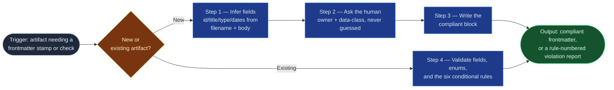

# Provenance Stamper

The mechanical-but-critical work behind "stamp and stage," the last step of
every foundry build: filling a schema-compliant frontmatter block on a new
artifact, and checking an existing one against `provenance-spec.md` including
its six conditional rules. It reads and writes the frontmatter block only —
never the document body, and never the `verified` truth-level, which stays a
human-only call.

## Flow Diagram

## Triggering intent

- **Fires on:** "stamp this," "is this schema-compliant," creating any new
  ICP artifact, and a batch check across a folder or Confluence page tree.
- **Does not fire on (near-misses):** promoting `truth-level` to `verified`
  (validation reports *invalid* or *compliant*, never *verified* — that
  promotion is evidence-bound and human, per `governance-and-audit.md` §4);
  editing document body content beyond the frontmatter/properties block;
  proposing schema changes (foundries never extend the schema — flag a gap for
  the operator to ratify in `provenance-spec.md` itself).

## Method

1. **New artifact — infer what's inferable.** Derive `id` (kebab-case, from
   the filename or the document's first H1), `title` (the first H1, verbatim),
   and `type` (from the Type enum, inferred from the filename pattern and
   location — e.g. `sp-<slug>.md` in a skill-foundry backlog is
   `skill-primer-brief`; `YYYY-MM-DD-<slug>.md` in a `decision-log/` folder is
   `decision-log`). Set `artifact-version: "1.0"`, `created`/`updated` to
   today, `status: living`, and `source: human+ai` unless the human states
   otherwise. Apply each type's default `truth-level` from the enum table
   unless the artifact is visibly incomplete (then `draft`).
2. **New artifact — ask, never guess.** `owner` and `data-class` are always
   asked of the human, on every run, with no default and no inference from
   content — data classification is a judgment call the spec explicitly
   reserves for a person (`governance-and-audit.md` §2). If `generated-by` is
   set, `generated-by-version` must be asked or supplied alongside it — never
   one without the other.
3. **New artifact — write the compliant block.** Assemble the inferred and
   asked fields into the frontmatter (or, on Confluence, the page properties
   and labels, per the mapping table in `methodology/mirroring-protocol.md`)
   and write it. Never write `truth-level: verified` at this step regardless
   of what's asked — a freshly stamped artifact is never born verified.
4. **Existing artifact — validate.** Check every required field is present,
   every enum value is one of the schema's allowed values (`status`,
   `truth-level`, `source`, `data-class`, `type`), and then check all six
   conditional rules in order: (1) `status: replaced` requires
   `superseded-by`; (2) `type: clipping` implies `truth-level: claimed` and
   `source: ai` or external; (3) `generated-by` and `generated-by-version`
   travel together; (4) `truth-level: claimed` never pairs with
   `source: human`; (5) `truth-level: verified` requires review evidence (a
   decision-log entry or Confluence sign-off naming reviewer and date); (6)
   `data-class` above `public` is invalid in this repository. Report every
   violation naming its rule number and quoting the offending field verbatim
   — never a paraphrase. Applies identically to Confluence page
   properties/labels, per the same mapping table. If asked directly to
   upgrade a passing check to `truth-level: verified`, decline and say why
   (rule 5, the human-only gate) — compliant is not the same claim as
   verified.

Known failure mode to guard: inferring `data-class` from a plausible read of
content sensitivity instead of asking — the spec is explicit that this field
is never guessed, because misclassifying it (too low) is a data-boundary
failure, not a cosmetic one.

## Inputs and grounding

Reads: the target artifact's frontmatter and enough of the filename/path/body
to infer `id`, `title`, and `type` — never more of the body than needed for
that inference. Grounding rules: every validation finding quotes the actual
offending field value, never a summary; when a field's correct value can't be
inferred with confidence, ask rather than filling a plausible guess — a wrong
stamp is worse than an unstamped field because it looks done.

## Data boundary

- Max data-class: internal (it reads document bodies far enough to infer
  `type`, which may expose internal content in the process).
- Sanctioned engines: **both** — Copilot (prompt file, for the internal
  mirror and this public repo) and Rovo (agent, for the Confluence
  page-properties side), per the employer matrix.

## What this skill is not

- **Not a truth-level promoter** — never sets `verified`, even on direct
  request; that promotion is the human-only gate
  (`governance-and-audit.md` §4).
- **Not a content editor** — touches the frontmatter/properties block only;
  document body content is out of scope entirely.
- **Not a data-classifier** — `data-class` is always asked of the human,
  never inferred from the sensitivity of what it reads.
- **Not a schema author** — schema violations are reported against
  `provenance-spec.md` as it currently stands; proposing a schema change is
  the operator's call, not this skill's.

## Review criteria

A single run's output is acceptable when:

1. A fresh artifact of each type in the enum is stamped correctly — `id`,
   `title`, `type`, dates, `status`, `source`, and the `generated-by` /
   `generated-by-version` pairing are all present and correctly inferred.
2. `owner` and `data-class` are asked of the human on every new-artifact run —
   never defaulted, never guessed.
3. All six conditional-rule violations are caught in a seeded invalid set,
   each report line naming the rule number and quoting the offending field.
4. The skill refuses to set `truth-level: verified` even when directly asked,
   and states why.
5. Document body content is unchanged in every check run.

## Adapters

| Engine | Artifact | Generated from spec version |
|---|---|---|
| Copilot | adapters/copilot-prompt.md | 1.0 |
| Rovo | adapters/rovo-agent.md | 1.0 |

## Changelog

- **1.0** (2026-07-07) — Initial build from `sp-provenance-stamper`.
