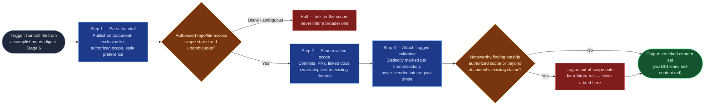

# Repo Context Enricher

Stage 1 of `accomplishments-docx-finisher`, the reason this companion
flowspace is Copilot-side at all — it needs repository/file access Rovo
doesn't have in this pairing. It adds supporting evidence to an
already-approved document; it never adds new accomplishments. Every addition
is a distinctly flagged, traceable supplement to content that already
exists, not a second drafting pass.

## Flow Diagram

## Triggering intent

- **Fires on:** Stage 1 of `accomplishments-docx-finisher`, given a handoff
  file with a stated authorized repo/file-access scope.
- **Does not fire on (near-misses):** a handoff with a blank or ambiguous
  scope (treat as no access — ask, don't infer); gathering the original
  accomplishments content (that's the two gatherer skills upstream in
  `accomplishments-digest`); adding any claim not already present in the
  handed-off document — that's scope creep this skill must refuse, not a
  variant of its normal operation.

## Method

1. **Parse the handoff.** Read the published document content/link, the
   exclusion list carried forward from `accomplishments-digest` Stage 1, the
   authorized repo/file-access scope, and any stated style preference, per
   `flow-foundry/review-flowspaces/accomplishments-digest/reference/handoff-to-copilot-template.md`.
2. **Confirm the authorized scope before touching anything.** A blank or
   ambiguous scope means zero access, per the handoff template's rule —
   surface a direct question rather than guessing at a broader scope.
   Worked example: a scope reading "may reference PRs in the checkout
   service repo" authorizes exactly that repo, not the organization's
   monorepo generally, and not adjacent repos the checkout service happens
   to depend on.
3. **Search within scope only** for evidence tied to themes or sections
   already present in the source document — commits, PRs, linked design
   docs, code ownership records. This is enrichment of presentation and
   evidence, never new accomplishments: every piece of evidence must
   reinforce a claim the document already makes. **No repo/file access
   available in this session** (running in a chat session with no connected
   repo, per `START-HERE.md`'s capability probe — distinct from step 2's
   blank/ambiguous-scope halt, which applies when access exists but its
   bounds aren't stated): say so plainly and ask the user to paste the
   relevant commits, PRs, or ownership notes directly, within the
   handoff's authorized scope; proceed through steps 4–5 against that
   material.
4. **Attach found evidence to its matching theme/section, each item
   distinctly flagged** — an inline marker or a separate "Added by Stage 1"
   list — never blended silently into the original prose, so Stage 3 can
   scrutinize exactly what changed.
5. **Route noteworthy-but-out-of-scope findings to a separate note, never
   into the document.** If the repo context surfaces something genuinely
   noteworthy that isn't already claimed in the source document — even if it
   looks like something the engineer would want credit for — it does not get
   added here. It becomes a distinct "out-of-scope finding" note for the
   engineer to consider for a *future* `accomplishments-digest` run. This is
   the known failure mode this step exists to catch: finding something real
   and adding it anyway instead of routing it correctly.

## Inputs and grounding

Reads: the handoff file's stated authorized scope, plus whatever repo/file
access that scope grants — bounded explicitly, never inferred from what
looks relevant or adjacent. Grounding rules: every flagged addition must
trace to a specific item within the authorized scope; content outside the
scope is never searched, let alone added; the exclusion list travels with
the handoff and applies to this stage's additions exactly as it applied
upstream — an addition must not reintroduce an excluded item under a
different framing.

## Data boundary

- Max data-class: internal, and never higher than the handoff's own
  classification — repo/file content pulled stays within the same or lower
  classification; this skill never escalates by pulling something more
  sensitive than the handoff authorized.
- Sanctioned engine: Copilot only. This is the reason Stage 1 of
  `accomplishments-docx-finisher` is Copilot-side at all — it needs
  repository/file access Rovo doesn't have in this pairing. No Rovo adapter
  is built for this skill.

## What this skill is not

- **Not a gatherer of original content** — the accomplishments themselves
  come from `accomplishments-digest`'s upstream gatherer skills; this skill
  only reinforces what's already there.
- **Not a second drafting pass** — it never rewrites, reframes, or adds a
  claim the source document doesn't already make.
- **Not a scope-inference tool** — a blank or ambiguous authorized scope is
  always treated as zero access, never as an invitation to use judgment
  about what's probably fine.
- **Not the final review** — Stage 3's human review, not this skill,
  determines whether the enrichment actually belongs.

## Review criteria

A single output of this skill is acceptable when:

1. Every flagged addition traces to a specific item within the authorized
   repo/file-access scope from the handoff — no addition traces outside it.
2. Every addition is distinctly flagged (inline marker or separate list),
   never blended into the original prose.
3. Any genuinely noteworthy but out-of-scope or beyond-the-document finding
   appears as a separate note, never as an addition to this run's content.
4. Tested against a handoff with a blank or ambiguous scope field, the skill
   asks a direct question rather than guessing at or assuming a scope.
5. No item on the handoff's exclusion list appears in any addition.
6. If no repo/file access was available in this session, the output states
   that plainly and any additions trace to user-supplied material — never a
   silent, unexplained gap in coverage.

## Adapters

| Engine | Artifact | Generated from spec version |
|---|---|---|
| Copilot | adapters/copilot-prompt.md | 1.0 |

No Rovo adapter is built: this skill's whole reason for existing is
repository/file access, which Rovo does not have in this flow pairing — see
`../../decision-log/2026-07-14-accomplishments-digest-skill-batch.md`.

## Changelog

- **1.1** (2026-07-27) — Method step 3 gains an explicit degrade path for
  running in a chat session referencing this repo directly, per
  `START-HERE.md`: with no repo/file access available at all (distinct from
  step 2's blank/ambiguous-scope halt), ask the user to paste relevant
  commits/PRs directly, within the handoff's authorized scope, and proceed
  against that material. New review criterion 6. `truth-level` moves from
  `verified` to `to-review` pending a gate re-run.
- **1.0** (2026-07-14) — Initial build from `sp-repo-context-enricher`.
