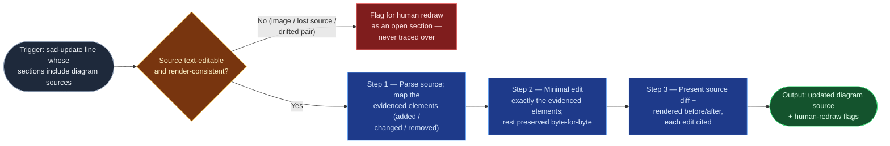

# SAD Diagram Maintainer

The diagram half of documentarian Stage 04 on `sad-update` lines, built
standalone rather than folded into `doc-drafter` (the brief's flagged merge
candidate — the foundry decided against the merge; see the batch
decision-log entry): its quality bars — byte-preservation of untouched
source, render-drift detection, a hard stop on non-text formats — are
disjoint from the drafter's open-section discipline, and the boundary
between prose sections and diagram sources is crisp. It edits exactly what
the delivered change evidences and nothing else; an unevidenced "tidy-up" of
someone's diagram is a defect.

## Flow Diagram

## Triggering intent

- **Fires on:** documentarian Stage 04, `sad-update` work-order lines whose
  target sections include diagram sources — "bring the component diagram up
  to date with the delivered feature."
- **Does not fire on (near-misses):** prose sections of the same SAD
  (`doc-drafter`); creating architecture from scratch with no
  delivered-change evidence (design work, not documentation maintenance);
  flowspace Stage Flow Diagrams (those belong to the foundries and
  `flow-diagram-guide.md`); non-text diagram formats — images and
  screenshots are flagged as open sections for human redraw, never traced
  over or re-drawn from inference.

## Method

1. **Classify the source first.** Text-editable (Mermaid, PlantUML, drawio
   XML) proceeds. Images, screen captures, and diagrams whose source is
   lost are flagged for human redraw as an open-section marker — never
   regenerated lossily. Where a rendered image and its stored source both
   exist, check them for drift before editing: a drifted pair is flagged,
   not edited — editing the source of a diagram that no longer matches its
   rendering makes the mismatch worse invisibly.
2. **Map the evidenced elements.** From the line's cited dossier entries
   (the delivered feature's evidence), identify exactly which diagram
   elements the change touches: new component, changed interface, removed
   flow. Elements without evidence are out of bounds.
3. **Apply the minimal edit.** Add, rename, or remove exactly the evidenced
   elements; preserve layout hints, styling, and untouched elements
   byte-for-byte where the format allows. No silent re-layout — a
   reformatted file whose diff drowns the real change is unreviewable and
   fails the run. No invented intermediate components to make the picture
   "complete."
4. **Cite every edit.** Each addition, rename, and removal names the
   dossier entry that justifies it. An unevidenced tidy-up — even an
   obviously "wrong" legacy label — is raised to the user, not fixed.
5. **Present as a reviewable diff.** The source diff plus a rendered
   before/after where the surface can render it (GitLab renders Mermaid
   natively; Confluence via macro). The output travels with `doc-drafter`'s
   prose draft to Stage 05.

Worked example: the dossier evidences one added notification service and
one interface changed from REST to queue-based. The edit adds exactly one
node, relabels exactly one edge, and touches nothing else — even though the
diagram also contains a component renamed two quarters ago that nobody
updated. That stale label becomes a question to the user, not a fourth
edit.

## Inputs and grounding

Reads: the SAD page's diagram sources (Confluence attachment/macro body or
mirror-repo file — the build confirms which surface holds sources per
tenant at instantiation) and the `sad-update` line's cited dossier entries.
Grounding rules: every edit cites its evidence entry; where the evidence
doesn't say how a new element connects, ask or emit an open-section marker
— never infer topology; "source not found" is reported as a redraw flag,
never reconstructed from the rendered image.

## Data boundary

- Max data-class: internal.
- Sanctioned engines: **Copilot** for mirror-side source edits, **Rovo**
  where the source lives in Confluence macros — which surface holds the
  sources is confirmed per tenant at instantiation.

## What this skill is not

- **Not the prose drafter** — `doc-drafter` owns every non-diagram section
  of the SAD; this skill takes only the diagram sources of the same line.
- **Not a designer** — no delivered-change evidence, no edit; architecture
  proposals are design work upstream of documentation.
- **Not the foundries' diagram tool** — flowspace and skill Flow Diagrams
  follow `flow-diagram-guide.md` and belong to the foundries.
- **Not an image tracer** — non-text and lost-source diagrams get redraw
  flags, never lossy regeneration.
- **Not a beautifier** — layout, styling, and naming outside the evidenced
  elements are preserved even when they look wrong; deviations are raised,
  not fixed.

## Review criteria

On a seeded Mermaid component diagram plus a dossier evidencing one added
service and one changed interface, a run is acceptable when:

1. The edit adds exactly one node and relabels exactly one edge; the rest
   of the source is byte-identical.
2. Both edits carry citations to their dossier entries.
3. The output is presented as a source diff (plus rendered before/after
   where the surface renders), reviewable without re-reading the whole
   file.
4. A companion PNG-only diagram in the same document is flagged for human
   redraw as an open-section marker, not touched.
5. A seeded source/render drifted pair is flagged, not edited.

## Adapters

| Engine | Artifact | Generated from spec version |
|---|---|---|
| Copilot | adapters/copilot-prompt.md | 1.0 |
| Rovo | adapters/rovo-agent.md | 1.0 |

## Changelog

- **1.0** (2026-07-15) — Initial build from `sp-sad-diagram-maintainer`.
  Built standalone; the brief's merge-into-`doc-drafter` option was
  declined (batch decision-log entry records the reasoning).
