# Scope & Dependency Mapper

The boundary-drawing step of the `ai-refinement` pipeline: given a confirmed
problem statement and stakeholder tag list from `context-elicitation`, it
produces the scope package — in/out-of-scope, classified dependencies, risks —
and annotates the item with the register coalition it satisfies and the
conflict axis it triggers, so tradeoffs surface at refinement time instead of
detonating mid-build. Downstream, `field-refinement-cadence` consumes the
package as pre-filled field content.

## Flow Diagram

```mermaid
flowchart LR
    Start(["Trigger: confirmed problem<br/>statement + stakeholder tags"]):::start --> S1["Step 1 — Scope boundaries<br/>Derive in-scope / out-of-scope"]:::process
    S1 --> S2["Step 2 — Dependencies<br/>Classify blocking / informational;<br/>sweep adjacents &amp; constraint-setters"]:::process
    S2 --> S3["Step 3 — Coalition &amp;<br/>conflict-axis annotation"]:::process
    S3 --> G{"Triggered axis has a<br/>decision-owner?"}:::decision
    G -->|No| E["Escalation advisory<br/>IT Leadership / Portfolio &amp; Sourcing"]:::halt
    E --> S4
    G -->|Yes| S4["Step 4 — Split detection<br/>+ risk identification"]:::process
    S4 --> C["Step 5 — Confirm<br/>scope package with user"]:::process
    C --> Output(["Output: confirmed scope package<br/>+ annotations + advisories"]):::output

    classDef start fill:#1e293b,stroke:#94a3b8,color:#f1f5f9
    classDef process fill:#1e3a8a,stroke:#60a5fa,color:#dbeafe
    classDef decision fill:#78350f,stroke:#fbbf24,color:#fef3c7
    classDef output fill:#14532d,stroke:#4ade80,color:#dcfce7
    classDef halt fill:#7f1d1d,stroke:#f87171,color:#fee2e2
```

## Triggering intent

- **Fires on:** Stage 03 of `ai-refinement` (a confirmed problem statement
  exists); "map the scope and dependencies," "what's in and out for this item?"
- **Does not fire on (near-misses):** framing the problem itself
  (`context-elicitation`); drafting summary/AC/dates
  (`field-refinement-cadence`); portfolio ranking or roadmap sequencing;
  dependency mapping for items outside a refinement run.

## Method

1. **Scope boundaries.** From the confirmed problem statement, enumerate what
   the item explicitly covers (in-scope) and explicitly excludes and why
   (out-of-scope — at least one named exclusion; "everything else" fails).
   No scope element may lack a corresponding problem element.
2. **Dependency identification and classification.** Every dependency is
   **blocking** (cannot proceed without resolution) or **informational**
   (awareness only) — the taxonomy forces the call; neither all-blocking nor
   none-blocking is credible. Then sweep the tagged stakeholders' *Adjacent*
   and *Constraint-setter* register entries for dependencies the user hasn't
   named — integration seams and guardrails are where unstated dependencies
   live. *Worked example:* a badging-platform item tagged with Corporate
   Services (5) must be checked against IAM (7) and HR/HRIS (14) — the Identity
   Backbone coalition — for lifecycle-feed dependencies.
3. **Coalition and conflict-axis annotation.** If a stakeholder register is
   loaded for this domain: per its usage rules, name the coalition the item
   satisfies (batch those stakeholders' input; expect fast consensus) and the
   conflict axis it triggers. A triggered axis requires a named decision-owner
   and recorded rationale; if unresolved, emit an escalation advisory —
   producer ⟷ constraint-setter conflicts to IT Leadership (16), "worth doing
   at all" conflicts to Portfolio & Sourcing (17). If Stage 01 flagged
   **ungrounded mode** (no register loaded for this domain), ask the user
   directly whether any parties or priorities are in tension over this item,
   and record what they say in the same shape — a named tension plus a
   decision-owner — without inventing a coalition or axis name the register
   doesn't provide. **This step is a hard carve-out: it always runs
   interactively, in every mode, register or no register.** The skill routes;
   it never decides the conflict.
4. **Split detection and risks.** If in-scope covers multiple distinct
   deliverables, recommend decomposition per the work-item hierarchy. Flag
   technical, operational, and timeline risks (optional for `solution_epic`);
   treat register hard constraints (e.g., Growth vs. Physical Limits) as
   non-negotiable risks, not tradeoffs.
5. **Confirm the package.** Present in-scope, out-of-scope, dependencies,
   annotations, risks, and any advisories; obtain explicit user confirmation.

## Inputs and grounding

Reads: Stage 02 outputs (confirmed problem statement, value, stakeholder tag
list), the work-item schema from Stage 01, the stakeholder-register grounding
status from Stage 01, and the platform stakeholder register (or its domain
instance), if loaded. Grounding rules: in grounded mode, coalition and
conflict-axis names must be quoted from the register — never invent a
coalition; in ungrounded mode, name the tension in the user's own terms rather
than forcing a register vocabulary that doesn't exist for this domain.
Dependencies must name real systems/teams the user or register surfaced, not
plausible-sounding ones; say "none identified" rather than pad the risk list.

## Data boundary

- Max data-class: internal (dependency lists may name internal systems and
  teams; never credentials or connection strings).
- Sanctioned engines: Rovo and Copilot, per the employer matrix.

## What this skill is not

- **Not a problem framer** — vague context goes back to `context-elicitation`.
- **Not a field drafter** — the scope package is content for
  `field-refinement-cadence` to place, not a finished ticket.
- **Not a decision-maker** — it surfaces conflict axes and routes escalations;
  humans own every tradeoff decision.
- **Not a portfolio tool** — one item per run; ranking the backlog belongs to
  Portfolio & Sourcing processes.

## Review criteria

A single output of this skill is acceptable when:

1. In-scope is bounded and every element traces to the problem statement.
2. Out-of-scope names at least one real exclusion with a reason.
3. Every dependency carries exactly one classification (blocking /
   informational), and at least the tagged Adjacent/Constraint-setter entries
   were swept (check the transcript).
4. Coalition and conflict-axis annotations quote register entries (grounded)
   or the user's direct answer (ungrounded); every triggered axis has a
   decision-owner or an escalation advisory naming the correct escalation
   target.
5. Split detection was evaluated with a stated result (recommended or not, and
   why).
6. Step 3 (coalition/conflict-axis annotation) ran interactively regardless of
   mode — never fast-track-extracted or skipped.
7. The user explicitly confirmed the package.

## Adapters

| Engine | Artifact | Generated from spec version |
|---|---|---|
| Rovo | adapters/rovo-agent.md | 1.1 |
| Copilot | adapters/copilot-prompt.md | 1.1 |

## Changelog

- **1.1** (2026-07-03) — Method step 3 (coalition/conflict-axis annotation)
  gains an ungrounded-mode conditional: absent a loaded stakeholder register
  for this domain, ask the user directly and record the tension/decision-owner
  in the same shape rather than forcing register vocabulary. Marked a hard
  carve-out — always interactive, in every mode. New review criterion (step 3
  ran interactively regardless of mode). Both adapters regenerated. Content
  change: pre-gate evidence re-run required — see
  `../../skill-foundry/decision-log/2026-07-03-communication-style-and-fast-track-skill-revision-pass.md`.
- **1.0** (2026-07-03) — Initial build from `sp-scope-dependency-mapper`.
