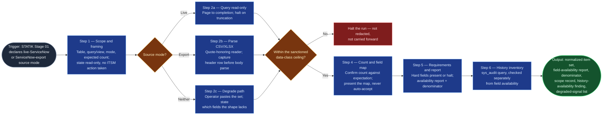

# ServiceNow Ticket Ingest

The ServiceNow half of `statik-adoption`'s Stage 01 source binding, built to
the same trust-boundary discipline as `jira-portfolio-ingest`: it takes
whatever the operator has — a live ServiceNow table, an export, or a pasted
item list — and produces the identical canonical shape Stage 01 already
expects from the Jira path, so Stages 03–05 never need to branch on which
ticketing system a service actually uses. It replaces the manual ServiceNow
export-and-clean step, and gives services that track work in ServiceNow
rather than Jira (or in both) an evidence-grounded path instead of a forced
drop to conversation-only. It reads; it never writes. Everything it hands
forward, Stages 03–05 inherit — including anything it got wrong, which is why
it halts rather than warns.

## Flow Diagram

## Triggering intent

- **Fires on:** Stage 01 of `statik-adoption`, when the operator declares the
  service's source mode as live ServiceNow or a ServiceNow export — the same
  point at which `jira-portfolio-ingest` fires for a Jira-tracked service.
  Also standalone on "pull this ServiceNow table into a normalized set,"
  "normalize this ServiceNow export," "bind this incident queue for demand
  analysis."
- **Does not fire on (near-misses):**
  - Publishing or committing content *to* ServiceNow (KB articles, ITSM
    records) — that is the deferred `sp-servicenow-kb-commit` write path, a
    different direction entirely. This skill has no write path and declines
    rather than routing.
  - A Jira-tracked service — that is `jira-portfolio-ingest`. A service that
    genuinely runs both is recorded at Stage 01 as two bound sets with the
    split stated explicitly, never silently merged by this skill.
  - Any request implying a write — closing, resolving, reassigning,
    commenting. Decline.

## Method

1. **Take the scope, and record it verbatim.** Ask for: the table
   (`incident`, `sc_request`/`sc_req_item`, or a named custom table); source
   mode (live / export); any encoded query or view narrowing it; the
   expected record count. Record the query/view word-for-word — a scope
   change between runs invalidates comparison, and the verbatim record is
   what lets a later reviewer see that it changed.
2. **Announce what this run will and will not do, before any data moves.**
   This skill reads ServiceNow and writes nothing — its output is normalized
   evidence for the flow's demand and capability analysis, not an incident,
   request, or change action of any kind. Say it here so no participant
   downstream mistakes a normalized item set for an ITSM record being acted
   on.
3. **Bind the source.** One of three paths, chosen explicitly and stated:
   - **Live mode.** Query the named table read-only through the engine's
     sanctioned ServiceNow capability, applying the encoded query/view if
     given. **Page through to completion** and confirm the returned record
     count matches the query's own reported total. **Halt on mismatch** — a
     silently truncated result profiles perfectly cleanly downstream and
     describes a service that is not the one under review.
   - **Export mode.** Parse the CSV/XLSX with a real, quote-honoring reader.
     Embedded newlines and delimiters inside work-notes and description
     fields are routine in ServiceNow exports; a naive line-split produces
     phantom rows and a corrupted record count. **Capture the header row
     before parsing bodies** — it is the left-hand side of the field map,
     not the denominator source (the denominator comes from the canonical
     field set — see step 9).
   - **Degrade path.** The session capability probe found no ServiceNow
     connector and the operator has no export file: ask the operator to
     paste the item set directly, in whatever shape they have it, and
     normalize from that. **State plainly which fields the pasted shape
     lacks and what each absence degrades** — a pasted set typically carries
     Summary and Status and little else. Record the degradation and run
     anyway. This is a valid reduced path, never a silent one and never a
     blocker.
4. **Run the data-class screen — before the data is typed any further.**
   Before mapping, before anything else. Exports are the higher-risk
   carrier: every column comes along, and work notes and custom fields
   routinely carry personal names, customer references, hostnames, and
   occasionally credentials pasted into a ticket by someone in a hurry.
   Content above the instance's sanctioned ceiling (`internal` by default)
   **halts the run.** It is not redacted and carried forward — redaction at
   volume is not reliably verifiable. `assignment_group` values are expected
   and permitted at `internal` — they name a group, never a person (§5's
   aggregate-only constraint applies from this skill forward, same as
   `jira-portfolio-ingest`'s Assignee handling).
5. **Confirm the record count** against the operator's stated expectation. A
   mismatch halts: it means the scope, the query, or the parse is wrong, and
   every count downstream would be wrong with it.
6. **Map the source's fields onto the canonical set** in
   `icp-flows/statik-adoption/reference/board-evidence-requirements.md` §7.
   The representative `incident`-table mapping: `number` → Issue key,
   `short_description` → Summary, `state`/`incident_state` → Status,
   `opened_at` → Created, `resolved_at` (falling back to `closed_at`) →
   Resolved / completed date, `sys_updated_on` → Updated, `category`/
   `subcategory` → Issue type candidate, `assignment_group` → Reporter /
   requesting-group proxy, `priority` → Priority. A request/catalog table
   (`sc_request`, `sc_req_item`) maps analogously with `requested_for` in
   place of `assignment_group` and its own state model. **Present the map
   for confirmation — never auto-accept it**, exactly as
   `jira-portfolio-ingest` does for Jira's custom fields: instance
   taxonomies vary as much in ServiceNow as they do in Jira. **`state`/
   `incident_state` is numeric in the underlying field and label-mapped per
   instance** — resolve through the instance's label map before mapping;
   the raw integer is never the canonical status.
7. **Check the hard requirements** — Issue key, Summary, Status, Created,
   Updated. Any absent → **halt, naming which**. The flow cannot run without
   them.
8. **Build the field-availability report.** For every canonical field:
   present or absent, and for present fields, how many items actually
   populate it. Any canonical field with no representative ServiceNow
   mapping in §7 (Due date, Priority-adjacent fields the operator's instance
   does carry, blocked-time fields, and so on) is checked against whatever
   the operator's field map actually resolves — the §7 table is a
   representative starting point, not a closed set.
9. **Capture the completion denominator** — the count of the canonical
   fields that resolved in *this run's* field map (step 6), mirroring
   `jira-portfolio-ingest`'s rule (`export-and-field-requirements.md` §4):
   not the source's raw column count, not hardcoded, not carried forward
   from a prior run. Record it, and which canonical fields (if any) were
   unavailable, alongside the item count. **Note:** statik-adoption's own
   stages do not currently score on this denominator the way
   `portfolio-rationalization`'s close-score model does — it is emitted for
   output-shape parity with `jira-portfolio-ingest`, per the primer brief,
   and is available to a future consumer rather than load-bearing today.
10. **Emit the normalized item set.** One record per work item, canonical
    field names, dates to ISO, empty-equivalents resolved. **A missing field
    is unavailable, never zero:** an item is not more complete or less
    complete because its export lacked a column.
11. **Inventory transition history — separately from field availability.**
    A complete field-availability report says nothing about whether
    per-state timestamps exist. Check: is `sys_audit` (or the table's
    state-transition history) retrievable for this scope, giving per-item
    state-entry and state-exit timestamps, or are only `opened_at` and
    `resolved_at`/`closed_at` available? Record one of: `full transition
    history` / `created and resolved only` / `not checked`. **Known failure
    mode:** a closed incident can be reopened, which the point-in-time base
    record alone will not show — record this as a known limitation
    alongside the history-availability finding whenever ServiceNow is the
    bound source.
12. **Confirm setup with the operator** — scope, source mode, record count,
    denominator, field map, degraded-signal list, and the history-inventory
    finding — and obtain an explicit "proceed" before anything advances.

**Quality bar:** a live-bound run and an export-bound run over the same
ServiceNow table produce **identical** normalized sets — the same parity
test `jira-portfolio-ingest` holds itself to, and the property that lets
Stage 01 treat both ticketing systems as interchangeable inputs.

## Inputs and grounding

Reads: the operator's scope declaration; a live ServiceNow table (read-only)
via the engine's sanctioned ServiceNow capability, or an export file, or
pasted content; the session capability-probe result; the ServiceNow field
mapping, parity contract, and history-question discipline in
`icp-flows/statik-adoption/reference/board-evidence-requirements.md` §4 and
§7; the prior run's field-availability report and denominator from the
instance `decision-log/`, if this is not the first run for the service.

Grounding rules: every value in the normalized set traces to the source
record it came from — no inferred statuses, no reconstructed dates, no
filled-in summaries. Where a field is absent, say "unavailable" rather than
emitting a default. Where a parse is ambiguous (a `state` integer with no
resolvable label map, a column whose meaning is unclear), say so and ask
rather than choosing silently. A halt is a valid, complete output of this
skill.

## Data boundary

- **Max data-class: internal.** This skill is the ServiceNow half of Stage
  01's classification gate — it screens before anything else touches the
  data, and content above the instance's sanctioned ceiling halts the run
  rather than being redacted and carried forward.
- `assignment_group` (or `requested_for` on a request/catalog table) enters
  the run here. It names a group, never a person, and is the flow's
  aggregate-only personal-data surface, consistent with
  `board-evidence-requirements.md` §5.
- Real ServiceNow content never enters this public design repo — instance
  data lives in employer tenancy per `methodology/mirroring-protocol.md`.
- **Sanctioned engine:** whichever of Rovo or Copilot carries the sanctioned
  ServiceNow read connector at build time, per the employer's sanctioned-tool
  matrix — per `methodology/mirroring-protocol.md` §2, ServiceNow is already
  sanctioned as a *read* target in principle. Record the confirmed engine on
  this skill's adapters once known; until then, both adapters ship and the
  live-mode path states plainly that it depends on that confirmation.
- **No write scope is requested or needed**, at this skill or anywhere in
  this flow.

## What this skill is not

- **Not a write path.** No create, update, transition, comment, or bulk
  action on any ServiceNow record, at any point. Asked to act on
  ServiceNow, it declines and says what it produces instead — it does not
  route the request onward. Publishing content *to* ServiceNow is the
  deferred `sp-servicenow-kb-commit` brief, a different direction entirely.
- **Not the Jira path.** A Jira-tracked service is `jira-portfolio-ingest`'s
  job. A service tracked in both systems binds both explicitly and records
  the split; this skill never silently merges a Jira set into a ServiceNow
  one or vice versa.
- **Not a profiler, demand analyzer, or capability analyzer.** It emits the
  normalized set, the field-availability report, and the history-inventory
  finding, and stops. `fitness-and-dissatisfaction-profiler`,
  `demand-profiler`, and `flow-capability-analyzer` are what read this
  skill's output next — computing any of their findings here would put
  judgment ahead of the operator's first look at the data.
- **Not a redactor.** Content above the ceiling halts the run; this skill
  does not sanitize a queue into compliance.
- **Not a history resolver.** It inventories whether transition history is
  retrievable and records the finding; it does not itself decide how Stage
  04 should handle a missing history (that is `flow-capability-analyzer`'s
  declared degrade path, per
  `flow-foundry/decision-log/2026-08-01-statik-adoption-gap-ratifications.md`).

## Review criteria

A single output of this skill is acceptable when:

1. The read-only, no-ITSM-action framing was stated **before** any data
   moved.
2. Source mode is declared explicitly and the encoded query/view, if any,
   is recorded verbatim.
3. Live mode: pagination ran to completion and the returned count matches
   the query's reported total. Export mode: a quote-honoring reader was
   used and the header row was captured before body parse. Degrade path:
   taken explicitly, with the resulting field gaps stated.
4. The data-class screen ran **before** any further processing and its
   result is recorded.
5. The parsed record count was confirmed against the operator's stated
   expectation — and a mismatch halted rather than warned.
6. The field map was **presented to and confirmed by** the operator, not
   auto-accepted, including the `state`/`incident_state` numeric-to-label
   resolution where live-mode or export data carries a raw integer.
7. All five hard requirements (Issue key, Summary, Status, Created, Updated)
   are present, or the run halted naming the missing one.
8. The field-availability report lists every canonical field with its
   populated-item count.
9. The denominator was computed from this run's resolved canonical-field
   set, not the source's raw column count, not carried forward from a prior
   run, and is recorded with the item count.
10. The normalized set uses canonical field names and ISO dates with
    empty-equivalents resolved, and no missing field was rendered as a
    zero.
11. The history-inventory finding is one of the three named states (`full
    transition history` / `created and resolved only` / `not checked`), and
    the reopened-incident limitation is recorded whenever ServiceNow is the
    bound source.
12. The operator confirmed "proceed."

**The parity test, run once at instantiation:** bind the same table in both
live and export mode and diff the normalized sets. They must match. A
difference is a normalization defect, not a source difference to work
around downstream. **The cross-system parity test, run once at
instantiation:** compare this skill's output shape against
`jira-portfolio-ingest`'s on a synthetic set — same field names, same
report structure, same denominator rule — so Stage 01 truly never needs to
branch on source system.

## Adapters

| Engine | Artifact | Generated from spec version |
|---|---|---|
| Rovo | adapters/rovo-agent.md | 1.0 |
| Copilot | adapters/copilot-prompt.md | 1.0 |

## Changelog

- **1.0** (2026-08-01) — Initial build from `sp-servicenow-ticket-ingest`,
  mirroring `jira-portfolio-ingest`'s trust-boundary discipline and output
  shape (normalized item set, field-availability report, completion
  denominator) with ServiceNow's field mapping and a separate
  history-inventory step in place of Jira's changelog check. Does not carry
  `jira-portfolio-ingest` v1.1's connected-space/ART-board discovery — no
  ServiceNow analog to a Jira ART-board portfolio/solution-epic hierarchy is
  established in `board-evidence-requirements.md`, and the primer brief did
  not scope one.
