# Value Decomposition

The top-down entry into the `ai-refinement` pipeline's hierarchy: given a
parent-level work item (`portfolio_epic`, `solution_epic`, or `feature`)
selected or already committed, it proposes candidate children one level down —
framed as vertical slices of stakeholder value per the operator-provided
"Value Delivery — Key Concepts, a 30,000ft View" deck — for user review, then
hands each accepted child onward: into its own Band 2 refinement run, or, for
a large accepted set, into a single bulk creation pass. It replaces the
manual practice of decomposing an epic into features (or a feature into
stories) by memory or spreadsheet. Its neighbors refine single items
(`context-elicitation` onward), build already-decided sets
(`bulk-child-creation`), and link hierarchy bottom-up (Stage 06's
`parent_mapping_confirmation`); this skill only proposes the child set.

## Flow Diagram

```mermaid
flowchart LR
    Start(["Trigger: Stage 01 parent-level item,<br/>decomposition requested"]):::start --> P1["Step 1 — Confirm grounding<br/>Restate parent content as<br/>the decomposition context"]:::process
    P1 --> P2["Step 2 — Propose children<br/>One level down only,<br/>discussed with the user"]:::process
    P2 --> C{"Step 3 — Every child a<br/>vertical slice?"}:::decision
    C -->|"horizontal split"| RJ["Reject the draft —<br/>re-slice by stakeholder value"]:::halt
    RJ -.->|"re-propose"| P2
    C -->|"vertical"| P4["Step 4 — MVP-bound the set<br/>Smallest set delivering<br/>incremental value"]:::process
    P4 --> P5["Step 5 — Persona value statement<br/>per child, or a named<br/>technical-framing exception"]:::process
    P5 --> P6["Step 6 — Quarter-testable AC<br/>guidance for feature children"]:::process
    P6 --> P7["Step 7 — Present full set<br/>for user review"]:::process
    P7 --> D{"User verdict?"}:::decision
    D -->|"not ready / stop"| H["Stop cleanly —<br/>no children created"]:::halt
    D -->|"accept all / edit /<br/>reject some"| P8["Step 8 — Hand off accepted children<br/>Pre-seed each Band 2 run with parent<br/>context + drafted value statement"]:::process
    P8 --> DEST{"Set large enough for<br/>a bulk pass?"}:::decision
    DEST -->|"few children /<br/>need real refinement"| Output(["Output: accepted children,<br/>each its own Band 2 run<br/>(Stage 02 onward)"]):::output
    DEST -->|"many children,<br/>user accepts the offer"| OutputB(["Output: accepted set handed to<br/>bulk-child-creation (Band ③)<br/>— acknowledgment taken there"]):::output

    classDef start fill:#1e293b,stroke:#94a3b8,color:#f1f5f9
    classDef process fill:#1e3a8a,stroke:#60a5fa,color:#dbeafe
    classDef decision fill:#78350f,stroke:#fbbf24,color:#fef3c7
    classDef output fill:#14532d,stroke:#4ade80,color:#dcfce7
    classDef halt fill:#7f1d1d,stroke:#f87171,color:#fee2e2
```

## Triggering intent

- **Fires on:** Stage 01 of `ai-refinement`, when the user has selected a
  parent-level type (`portfolio_epic`, `solution_epic`, `feature`) and states
  a desire to decompose it into its children — "help me break this solution
  epic into features," "decompose this feature into stories," "what should
  the children of this epic be?"
- **Does not fire on (near-misses):** ordinary single-item refinement (the
  default Band 2 loop — unaffected by this skill); bottom-up parent-linking
  (Stage 06's `parent_mapping_confirmation` — still the only path that sets a
  parent link, and the only hierarchy mechanism when the user isn't asking
  for a decomposition); refining one already-known child directly (a normal
  run that happens to have a parent link, not a decomposition);
  `story`/`task`/`spike`/`bug` as the *parent* of a decomposition pass — the
  value-delivery deck's lifecycle table stops applying at Feature, so
  decomposing below Feature is out of this skill's model (redirect: sub-tasks
  are created directly in Jira per the schema registry's out-of-scope table).

## Method

1. **Confirm the grounding context.** Restate the parent item and its
   content — problem statement, business/customer value, in and out of
   scope — as the decomposition's grounding: from the parent's confirmed
   Stage 02–04 field values (an item refined this session) or its committed
   Jira content (a live item). Missing content is asked for, never invented.
   At any point from here through step 7 the user may say they aren't ready
   to decompose this level yet — stop cleanly with nothing created, exactly
   as in step 7's stop verdict.
2. **Propose one level down only, discussed with the user.**
   `portfolio_epic` → solution epics; `solution_epic` → features; `feature` →
   stories (and, only where a proposed child genuinely is one, the registry's
   other feature-child types — `task`, `spike`, `bug`). Never cascade levels
   unprompted: even if the user asks to "break this portfolio epic down into
   stories," propose solution epics only and note that each accepted child
   can be decomposed in its own later pass. Discuss the proposed set — this
   is a conversation, not a dump.
3. **Vertical-slice check.** Frame every proposed child as an end-to-end
   unit of stakeholder value — the deck's Hamburger Method: each slice is a
   bite through every layer, not a single layer. A technical-layer split is
   rejected and re-sliced, never passed through. *Worked example:* for a
   feature "Self-service DNS record management," a draft child set of
   "Build the DNS API layer" / "Build the web UI" / "Design the records
   database schema" is horizontal — reject it and re-propose vertical
   slices such as "Request a new A record end-to-end" and "Track the status
   of my pending DNS requests," each of which touches UI, API, and data to
   deliver one stakeholder-visible outcome.
4. **MVP-bound the set.** Apply MVP thinking: propose the smallest set of
   children that deliver meaningful, incremental value — not a maximal
   upfront decomposition. Candidates beyond that set are named as possible
   future children, not drafted.
5. **Persona value statement per child**, in the deck's literal format:
   "As a [persona], I value [outcome] because it helps me [goal/pain
   point]." Two exceptions, and only these:
   - `bug` and `task` children are already accepted as technically worded —
     no format expectation applies to them.
   - The user may explicitly elect a technical/project-driven framing
     instead, for work that is inherently sequencing-heavy or
     infrastructural (software/OS upgrades, hardware design breakdowns)
     where the persona-statement format doesn't fit the work's nature. The
     election is recorded as an explicit, named exception per item — never
     silently substituted, and never applied to a child (including a
     `feature`-level child) the user hasn't elected it for.
6. **Quarter-testable guidance for `feature` children.** When the proposed
   children are features, surface the deck's expectation that each feature's
   acceptance criteria be achievable and testable within a quarter — as
   advisory guidance during review, not a validation rule (promotion of the
   deck's concepts into Stage 05 validation is a deliberately open operator
   item; see the primer brief). Acceptance criteria itself stays a hard
   schema gate for every child in its own Band 2 run, identical to every
   other item — decomposition never relaxes it.
7. **Present the full candidate set together for user review.** The user
   may accept all, edit some, reject some, or stop entirely ("not ready to
   decompose this level yet") — a stop creates nothing. No child proceeds
   without an explicit verdict on it.
8. **Hand each accepted child onward**, pre-seeded with the parent's grounding
   context and the drafted value statement (or its named technical-framing
   exception). Two destinations, and the user chooses between them:
   - **Its own Band 2 run** (Stage 02 onward) — the default, and the right
     path when the children need real refinement or when there are few enough
     that N sequential runs are proportionate.
   - **A single bulk creation pass** (`bulk-child-creation`, Band ③) — offered
     when the accepted set is large enough that N sequential runs would be
     disproportionate ceremony for children the user has already reviewed and
     accepted here. Offer it; never select it. If the user accepts, the bulk
     acknowledgment is taken there as its own act before anything is drafted,
     and that skill's stop-at-the-evidence rule applies: a child this pass
     accepted but whose grounding is too thin to draft required fields from is
     reported underspecified rather than padded, and can be routed back into
     its own Band 2 run. Accepting bulk never relaxes acceptance criteria or
     any other schema gate for the children.

   This skill never sets a parent link — each child still goes through Stage
   06's `parent_mapping_confirmation` for that, whether individually or once
   for the batch — and never commits anything to Jira itself under either
   destination.

## Inputs and grounding

Reads: the parent item's confirmed Stage 02–04 field values (or its
already-committed Jira content, via read-only lookup, when decomposing a live
item); the work-item schema registry (`reference/work-item-schemas.md`) for
the hierarchy's parent→child map and each child type's field set; the
"Value Delivery — Key Concepts, a 30,000ft View" deck's key concepts —
stakeholder persona value statements, MVP thinking, the Hamburger Method's
vertical-vs-horizontal slicing, quarter-testable acceptance criteria — as
grounding reference material (the deck lives in employer tenancy; this spec
carries the concepts it depends on). Grounding rules: parent content is
restated from its source, never invented — a missing problem statement or
value field is asked for; proposed children cite which part of the parent's
scope they slice; "not found" over fabrication when a live parent lookup
fails.

## Data boundary

- Max data-class: internal (parent field values and proposed child content),
  matching the rest of the `ai-refinement` pipeline.
- Sanctioned engines: Rovo and Copilot, per the employer matrix.

## What this skill is not

- **Not the per-item refiner** — each accepted child's fields are elicited
  and drafted by the Band 2 skills (`context-elicitation` through
  `jira-commit`), or drafted at required-field depth by
  `bulk-child-creation` when the user takes the bulk destination at step 8;
  this skill seeds those runs, it doesn't replace them.
- **Not the bulk creator** — `bulk-child-creation` owns ingesting sets,
  drafting fields across a batch, and creating them. This skill decides *what*
  the children should be, applying the vertical-slice and MVP rules; that
  skill takes a settled set and builds it. A set that arrives already decided
  (a spreadsheet of tasks) goes straight there and never passes through here.
- **Not the parent-linker** — Stage 06's `parent_mapping_confirmation` is
  still the only mechanism that sets a parent link, for decomposed and
  non-decomposed items alike.
- **Not the validator** — `workitem-validation` owns the Stage 05 gate;
  this skill's vertical-slice and value-statement checks are
  generation-time heuristics, and their possible promotion into validation
  rules is an open operator decision, not this skill's job.
- **Not a cascade planner** — one hierarchy level per pass, always; a
  multi-level breakdown is multiple user-driven passes.
- **Not a below-Feature decomposer** — `story`/`task`/`spike`/`bug` are
  never the parent of a pass; the deck's model stops at Feature.

## Review criteria

A single output of this skill is acceptable when:

1. One-level-per-pass held: a decomposition of a `solution_epic` proposed
   features only — it did not also propose stories under those features,
   even when asked for a deeper breakdown in one step.
2. A horizontally-sliced draft (technical layers as sibling children) was
   caught by the vertical-slice check and re-proposed — not passed through.
3. Every proposed child carries either a persona value statement in the
   literal deck format or a named exception (`bug`/`task` technical wording,
   or an explicitly user-elected technical framing) — no silent
   substitutions, and no exception applied without the user electing it.
4. Acceptance criteria was treated as a hard requirement for every accepted
   child's onward run — nothing in the transcript relaxes or defers it
   because the item came from a decomposition.
5. A "not ready to decompose this level yet" response was honored: the run
   stopped cleanly with no children created.
6. The user's verdict on the candidate set (accept/edit/reject/stop) is
   explicit in the transcript, and each accepted child's pre-seed (parent
   context + value statement or named exception) is visible in the handoff,
   whichever destination it took.
7. Where a bulk destination was offered for a large accepted set, the offer
   was explicit and the user chose it — never selected on their behalf — and
   the transcript shows the handoff to `bulk-child-creation` rather than this
   skill drafting or creating anything itself.

## Adapters

| Engine | Artifact | Generated from spec version |
|---|---|---|
| Rovo | adapters/rovo-agent.md | 1.1 |
| Copilot | adapters/copilot-prompt.md | 1.1 |

## Changelog

- **1.1** (2026-07-31) — Method step 8 gains a second destination for accepted
  children: alongside the existing per-child Band 2 run, a single bulk
  creation pass (`bulk-child-creation`, Band ③) is **offered** — never
  selected — when the accepted set is large enough that N sequential runs
  would be disproportionate for children the user has already reviewed here.
  The bulk acknowledgment is taken in that skill, not this one, and its
  stop-at-the-evidence rule governs: an accepted child too thinly grounded to
  draft from is reported underspecified rather than padded, and can return to
  its own Band 2 run. A new boundary entry ("Not the bulk creator") draws the
  line — this skill decides *what* the children should be; that one takes a
  settled set and builds it, and a set arriving already decided never passes
  through here. Review criterion 7 added; Flow Diagram gains the destination
  branch. No change to the one-level-per-pass rule, the vertical-slice check,
  MVP bounding, the value-statement format, or the parent-linking boundary.
  `truth-level` moves from `verified` to `to-review` pending a gate re-run —
  the skill's first behavior change since initial promotion, logged rather
  than assumed clean. Both adapters regenerated. See
  `../../icp-flows/ai-refinement/decision-log/2026-07-31-bulk-creation-mode.md`.
- **1.0** (2026-07-15) — Initial build from `sp-value-decomposition`
  (Workstream B handoff in
  `icp-flows/ai-refinement/decision-log/2026-07-15-provenance-and-planning-labels.md`).
