# Work Item Validation

The mechanical gate between refinement and commit in the `ai-refinement`
pipeline: it scans the complete field set from `field-refinement-cadence`
against the schema and formatting rules, fixes what is safely fixable (markup,
never meaning), halts on what isn't, and produces the pass/fail report the
user signs off before `jira-commit` may act. Its neighbors draft and commit;
this skill only judges.

## Flow Diagram

```mermaid
flowchart LR
    Start(["Trigger: complete refined<br/>field set from Stage 04"]):::start --> C["Step 1 — Completeness scan<br/>Walk schema required-field list"]:::process
    C --> ML["Step 2 — Mandatory label check<br/>refine-ai-flow-v&lt;version&gt; (all types);<br/>planning label (gated types)"]:::process
    ML --> K["Step 3 — Constraint checks<br/>Summary ≤ 10 words, AC starters,<br/>due date valid + future"]:::process
    K --> F["Step 4 — Formatting pass<br/>Strip bold, remove emoji,<br/>normalize whitespace"]:::process
    F --> D{"Step 5 — Issue class?"}:::decision
    D -->|"formatting only"| AC["Auto-correct<br/>fix markup; log in report"]:::process
    D -->|"missing field /<br/>constraint / conflict"| H["Halt — surface to user<br/>for resolution"]:::halt
    D -->|"mandatory label<br/>missing/malformed"| W["Warn — user may override<br/>and proceed, or fix<br/>and re-validate"]:::halt
    H --> R
    AC --> R["Step 6 — Validation report<br/>per-field pass/fail + corrections<br/>+ any named bypass"]:::process
    W -->|"user overrides"| R
    W -.->|"user fixes"| ML
    R --> Output(["Output: clean payload +<br/>report + user sign-off"]):::output

    classDef start fill:#1e293b,stroke:#94a3b8,color:#f1f5f9
    classDef process fill:#1e3a8a,stroke:#60a5fa,color:#dbeafe
    classDef decision fill:#78350f,stroke:#fbbf24,color:#fef3c7
    classDef output fill:#14532d,stroke:#4ade80,color:#dcfce7
    classDef halt fill:#7f1d1d,stroke:#f87171,color:#fee2e2
```

## Triggering intent

- **Fires on:** Stage 05 of `ai-refinement` (a complete refined field set
  exists); "validate this work item," "is this Jira-ready?"
- **Does not fire on (near-misses):** drafting or improving field *content*
  (`field-refinement-cadence` — an incomplete field set goes back there, not
  through the gate); committing to Jira (`jira-commit`); validating flowspace
  or skill artifacts (the foundries' own checklists own those); linting
  arbitrary documents outside a refinement run.

## Method

1. **Completeness scan.** Walk the schema's required-field list for the
   selected type; every field must be non-empty and non-placeholder. A missing
   field is a halt, never a silent skip.
2. **Mandatory label check.** Distinct from schema completeness — labels are
   not schema fields, per `work-item-schemas.md`'s cross-cutting note.
   `refine-ai-flow-v<version>` (the `ai-refinement` flowspace's own
   `artifact-version`, stated by Stage 01 at session start) must be present
   for every type. For `feature`, `story`,
   `task`, `spike`, `bug` the `<team_code>-<yyyy>-q<n>` planning label
   resolved at Stage 01 must also be present and well-formed
   (`portfolio_epic`/`solution_epic` are exempt from this second check). A
   missing or malformed label here is a warn-and-bypass, not a hard halt (see
   step 5): report the specific defect and let the user fix it or explicitly
   accept the bypass and proceed. A bypass is always named in the report —
   never a silent pass.
3. **Constraint checks.** Summary ≤ 10 words; every acceptance criterion
   begins with an approved starter; due date parses and is in the future;
   dependencies reference resolvable items (if Jira-linked).
4. **Formatting pass.** Apply `no_bold` and `no_emojis`: strip `**bold**`
   markers, remove emoji characters, normalize whitespace and list formatting.
   The pass changes markup only — *worked example:* `**Must** be able to
   fail over within 30s ✅` becomes `Must be able to fail over within 30s`;
   rewording "fail over within 30s" would be a content change and is out of
   bounds.
5. **Auto-correct vs. halt vs. warn-bypass.** Auto-correct (fix silently, log
   in the report): formatting violations and minor whitespace. Halt (surface
   to the user, no fix attempted): missing required fields, constraint
   violations, unresolved cross-field conflicts carried from Stage 04.
   Warn-and-bypass (surface the specific defect, offer an explicit override):
   a missing or malformed mandatory label (step 2) — the one check in this
   gate that isn't a hard stop. When in doubt between halt and auto-correct,
   halt — a wrong auto-correct at the gate is worse than a question; the
   warn-bypass tier exists only for the mandatory-label check, nothing else
   moves into it without a spec amendment.
6. **Report and sign-off.** Produce the structured report: per-field pass/fail,
   auto-corrections applied, halt-level issues, and any mandatory-label
   bypass the user explicitly accepted (named, with its specific defect).
   Obtain the user's explicit sign-off on the clean payload before it moves
   to Stage 06.

## Inputs and grounding

Reads: Stage 04's refined field set and conflict report (if any), the
work-item schema from Stage 01, the formatting rules in the flowspace's
`reference/ai-refinement-hybrid.md`, Stage 01's resolved team_code and
session planning quarter, and `work-item-schemas.md`'s cross-cutting note on
which types the planning label gates. Grounding rules: the report claims only
what was actually checked — no "all constraints pass" without enumerating
them; unverifiable checks (e.g., Jira reachability for dependency references)
are reported as "not checked," never assumed; a mandatory-label bypass is
always named with its specific defect, never folded silently into "pass."

## Data boundary

- Max data-class: internal (the payload and report reference field values).
- Sanctioned engines: Rovo and Copilot, per the employer matrix.

## What this skill is not

- **Not an editor** — it never changes field meaning; content problems halt
  and route back to `field-refinement-cadence`.
- **Not the committer** — it produces a signed-off payload; `jira-commit`
  performs the API call.
- **Not the foundry validator** — flowspace/skill promotion gates live in the
  foundries' validation checklists, not here.
- **Not a substitute for the human gate** — its pass report informs the user's
  sign-off; it does not replace it.

## Review criteria

A single output of this skill is acceptable when:

1. Every required field was scanned and the report shows a per-field result.
2. The mandatory label check ran for every type (`refine-ai-flow-v<version>`) and, for
   `feature`/`story`/`task`/`spike`/`bug`, the planning label's presence and
   well-formedness were also checked — a missing/malformed label produced a
   warn-and-bypass, never a silent pass, and any accepted bypass is named in
   the report with its specific defect.
3. All constraint checks ran (summary length, AC starters, due date, dependency
   references) with explicit outcomes — including "not checked" where
   verification wasn't possible.
4. No bold or emoji characters remain in any field.
5. Every auto-correction is logged and touches markup only — diffing input
   vs. output payload shows no wording change.
6. Every halt-level issue was surfaced to the user, none silently fixed.
7. The user's sign-off on the final payload is explicit in the transcript.

## Adapters

| Engine | Artifact | Generated from spec version |
|---|---|---|
| Rovo | adapters/rovo-agent.md | 1.3 |
| Copilot | adapters/copilot-prompt.md | 1.3 |

## Changelog

- **1.3** (2026-07-28) — Method step 2's mandatory label check and Review
  criterion 2 rename the provenance label from the static `refine-ai-built`
  to `refine-ai-flow-v<version>` (the `ai-refinement` flowspace's own
  `artifact-version`) — no change to the warn-and-bypass enforcement tier,
  the label is checked exactly as before, only its expected value changes.
  `truth-level` frontmatter corrected to `to-review` here: the 1.2 entry
  below already stated it moved from `verified` to `to-review`, but the
  frontmatter itself was never updated to match — fixed as part of this
  edit, not silently. Both adapters regenerated. See
  `../../icp-flows/ai-refinement/decision-log/2026-07-28-provenance-label-versioning.md`.
- **1.2** (2026-07-15) — New Method step 2, mandatory label check
  (`refine-ai-built` for every type; `<team_code>-<yyyy>-q<n>` planning label
  for `feature`/`story`/`task`/`spike`/`bug`), and a new warn-and-bypass tier
  in the decision step (step 5) distinct from the existing auto-correct/halt
  split — the one check in this gate a user may explicitly override rather
  than being hard-blocked by. Flow Diagram gains the mandatory-label node and
  a third decision branch with a loop-back edge. Review criteria and Inputs
  updated to match. `truth-level` moves from `verified` to `to-review` — a
  behavior change without a gate re-run, logged honestly as an owed gap
  rather than assumed clean, consistent with how the flowspace's other
  touched artifacts have been demoted before it. Both adapters regenerated.
  See
  `../../icp-flows/ai-refinement/decision-log/2026-07-15-provenance-and-planning-labels.md`.
- **1.1** (2026-07-03) — Flow Diagram step labels renumbered to match the Method
  prose one-for-one (pre-gate spec-review finding; no behavior change). Adapters
  re-stamped — content unchanged by a diagram-only revision.
- **1.0** (2026-07-03) — Initial build from `sp-workitem-validation`.
