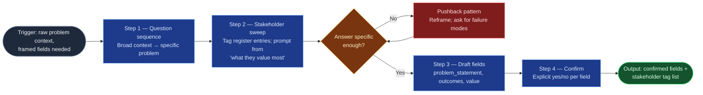

# Context Elicitation

The front half of problem framing for the `ai-refinement` pipeline: it turns a
user's raw, often vague description into confirmed, schema-ready problem and
value statements, grounded in the platform stakeholder register so the item is
framed by *whose needs define it*, not just by the first voice in the room. It
sits upstream of `scope-dependency-mapper` (which consumes its outputs) and
inside the TPSO persona established by the flowspace's Stage 01.

## Flow Diagram

## Triggering intent

- **Fires on:** Stage 02 of `ai-refinement` (a work-item type and schema are
  already selected); "frame this problem," "help me articulate this work item,"
  "I have an idea for an epic but it's fuzzy."
- **Does not fire on (near-misses):** "what's in and out of scope?" or "what
  does this depend on?" (`scope-dependency-mapper`); "walk me through the
  remaining fields" (`field-refinement-cadence`); open discovery interviews
  with no target schema; retro-fitting a problem statement onto an already
  committed Jira issue.

## Method

1. **Question sequence.** Ask, in order, one at a time: what problem is being
   solved; who is affected and how; what is the business/operational value;
   what has been tried before. Narrow from broad to specific — don't ask for a
   problem statement, build one.
2. **Stakeholder sweep.** Walk the platform stakeholder register and tag every
   entry whose needs or limits define this item (note its number and
   role-type). For each tagged entry, use its "what they value most" column to
   prompt for requirements the user hasn't volunteered. *Worked example:* a DC
   fabric-expansion item where the user names only Systems/Server — the sweep
   surfaces Facilities (13, Adjacent: power/cooling ceilings) and Cyber (6,
   Constraint-setter: segmentation telemetry) before those arrive as surprises.
3. **Pushback on vagueness.** When an answer is abstract, circular, or overly
   broad, apply a pushback pattern instead of accepting it: "it needs to work
   better" → "name the two most recent failures and their cost"; "everyone
   needs this" → "which register entries, specifically?" This is the persona's
   `challenge_incomplete_requirements` behavior — precise, analytical, direct.
4. **Draft the fields.** Synthesize into a problem statement (specific, not
   generic); measurable `business_outcomes` if the type is `solution_epic`; a
   `customer_business_value` statement that connects the problem to what the
   tagged stakeholders value. Quality bar: a reader who wasn't in the
   conversation can tell what's broken, for whom, and why fixing it matters.
5. **Confirm each field.** Present drafts and the stakeholder tag list; obtain
   an explicit yes/no per field before handing off. No batch confirmations.

## Inputs and grounding

Reads: the selected work-item schema (from Stage 01), the platform stakeholder
register (`reference/platform-stakeholder-register.md` in the flowspace), and
the user's conversational input. Grounding rules: stakeholder tags must resolve
to numbered register entries — never invent a stakeholder; if a relevant party
is missing from the register, say so and flag it rather than fabricating an
entry. Do not fabricate prior attempts, metrics, or outcomes the user didn't
state; ask.

## Data boundary

- Max data-class: internal
- Sanctioned engines: Rovo and Copilot, per the employer matrix. If PII or
  confidential data appears in the conversation, halt and invoke the flowspace's
  Stage 01 data-safety guardrail.

## What this skill is not

- **Not a scope mapper** — in/out-of-scope, dependencies, and risks belong to
  `scope-dependency-mapper`.
- **Not a field-cadence driver** — sequencing and refining the rest of the
  schema belongs to `field-refinement-cadence`.
- **Not a stakeholder-register editor** — it consumes the register read-only;
  register changes are the operator's.
- **Not a prioritizer** — it frames one item; whether the item is worth doing
  routes to Portfolio & Sourcing per the register's escalation rules.

## Review criteria

A single output of this skill is acceptable when:

1. The problem statement names a specific failure/gap and its affected parties —
   no generic "improve X" phrasing.
2. `business_outcomes` (when required) are measurable — each has a number, a
   date, or an observable state change.
3. `customer_business_value` traces to at least one tagged stakeholder's "what
   they value most."
4. Every stakeholder tag resolves to a register entry number and role-type.
5. Each field carries an explicit user confirmation.
6. At least one pushback was applied if any user answer was vague (check the
   transcript) — vague-in, vague-out is a failed run.

## Adapters

| Engine | Artifact | Generated from spec version |
|---|---|---|
| Rovo | adapters/rovo-agent.md | 1.0 |
| Copilot | adapters/copilot-prompt.md | 1.0 |

## Changelog

- **1.0** (2026-07-03) — Initial build from `sp-context-elicitation`.
