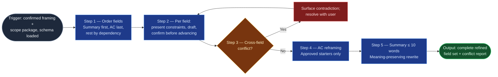

# Field Refinement Cadence

The disciplined middle of the `ai-refinement` pipeline: it takes the confirmed
framing and scope package from Stages 02–03 and walks the remaining schema
fields one at a time — each drafted, constrained, and individually confirmed —
so the ticket is built from accountable field-level decisions rather than
reviewed as an undifferentiated blob. It hands a complete field set to
`workitem-validation`, which gates; this skill drafts.

## Flow Diagram

## Triggering intent

- **Fires on:** Stage 04 of `ai-refinement` (framing and scope confirmed);
  "walk me through the remaining fields," "let's finish the ticket fields."
- **Does not fire on (near-misses):** "what is this item actually about?"
  (`context-elicitation`); "what's in scope / what does it depend on?"
  (`scope-dependency-mapper`); "is this Jira-ready?" (`workitem-validation`);
  bulk-editing fields across many existing issues.

## Method

1. **Order the fields.** Summary first — it anchors everything. Acceptance
   criteria last — they depend on scope, value, and dependencies. Remaining
   required fields in schema dependency order. Never ask the user to choose an
   order; the ordering is the skill's job.
2. **One field at a time.** For each field: present its name, constraints
   (e.g., summary ≤ 10 words), and any pre-filled content from Stages 02–03;
   draft or refine the value; obtain explicit confirmation before advancing.
   `confirm_each_step: true` is non-negotiable — batching confirmations to
   save turns defeats the accountability mechanism. Content confirmed upstream
   is placed, not rewritten; propose changes to it only as a flagged deviation.
3. **Cross-field conflict detection.** After each draft, check for
   contradictions: due date earlier than a blocking dependency's resolution;
   in-scope claims with no corresponding acceptance criterion; type-of-work /
   work-category inconsistency (feature only); a conflict axis triggered in
   Stage 03 with no decision-owner recorded. Surface conflicts immediately —
   don't defer them to validation.
4. **Acceptance-criteria reframing.** Every criterion begins "Must be able to"
   or "We will know this is done when." *Worked example:* "the dashboard
   should be faster" → "We will know this is done when the capacity dashboard
   loads in under 3 seconds for the 95th percentile request." Preserve the
   user's meaning; change the form.
5. **Summary enforcement.** Validate ≤ 10 words; if exceeded, propose a
   meaning-preserving rewrite and confirm it.

## Inputs and grounding

Reads: confirmed outputs of Stages 02–03, the work-item schema from Stage 01,
and the field definitions (summary limit, AC starters) in the flowspace's
`reference/ai-refinement-hybrid.md`. Grounding rules: never invent field
content the user hasn't supplied or confirmed upstream — draft from what
exists and ask for what's missing; never silently alter a confirmed upstream
value.

## Data boundary

- Max data-class: internal (field values may reference internal systems; no
  credentials, tokens, or PII in any field value).
- Sanctioned engines: Rovo and Copilot, per the employer matrix.

## What this skill is not

- **Not an elicitor** — missing problem context routes back to
  `context-elicitation`.
- **Not a scope mapper** — scope disputes reopen Stage 03 via
  `scope-dependency-mapper`.
- **Not the validation gate** — `workitem-validation` owns the final
  completeness/formatting verdict; this skill aims to arrive there clean, but
  it does not issue the pass/fail report.
- **Not a Jira writer** — nothing here touches the Jira API; that's
  `jira-commit`.

## Review criteria

A single output of this skill is acceptable when:

1. Every required field for the selected type has a value; no placeholder text.
2. Fields were presented in the stated order (summary first, AC last) — check
   the transcript.
3. Each field carries an individual explicit confirmation.
4. All acceptance criteria use an approved starter; the summary is ≤ 10 words.
5. All four conflict categories were checked, with any hits surfaced and
   resolved (or carried into the conflict report), not deferred silently.
6. No upstream-confirmed value was altered without a flagged, confirmed
   deviation.

## Adapters

| Engine | Artifact | Generated from spec version |
|---|---|---|
| Rovo | adapters/rovo-agent.md | 1.1 |
| Copilot | adapters/copilot-prompt.md | 1.1 |

## Changelog

- **1.1** (2026-07-03) — Flow Diagram brought to one-for-one with the Method
  prose: AC reframing and summary enforcement split into their own numbered
  nodes; conflict-detection diamond numbered (pre-gate spec-review finding; no
  behavior change). Adapters re-stamped — content unchanged by a diagram-only
  revision.
- **1.0** (2026-07-03) — Initial build from `sp-field-refinement-cadence`.
