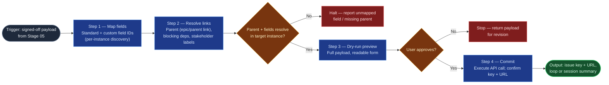

# Jira Commit

The commit boundary of the `ai-refinement` pipeline — the only skill in the
family that writes to an external system. It translates the signed-off payload
into a Jira create/update call with hierarchy, dependency links, and
stakeholder labels resolved, always behind a dry-run preview and explicit
approval, then closes the loop: next item or session summary. Everything
upstream drafts and gates; this skill acts.

## Flow Diagram

## Triggering intent

- **Fires on:** Stage 06 of `ai-refinement`, with a Stage 05 signed-off payload
  in hand; "commit this item to Jira."
- **Does not fire on (near-misses):** validating or formatting the payload
  (`workitem-validation`); creating issues from unrefined text ("just make a
  ticket that says…" — route through the pipeline); bulk imports, migrations,
  or edits to existing issues outside a refinement run.

## Method

1. **Field-to-API mapping.** Translate the payload: standard fields
   (`summary`, `description`, `duedate`, `issuetype`) directly; custom fields
   (problem_statement, business_outcomes, customer_business_value, in_scope,
   out_of_scope, type_of_work, work_category, acceptance_criteria) via
   per-instance custom-field-ID discovery. A field the target instance lacks
   is a halt with a named field, never a silent drop.
2. **Linkage resolution.** Validate the parent exists; set epic link (feature
   under solution epic) or parent link (story/task/spike under feature).
   Create blocks / is-blocked-by links for every Stage 03 blocking dependency.
   Apply Stage 02/03 stakeholder tags and coalition/conflict-axis annotations
   as Jira labels (or the instance's designated fields).
3. **Dry-run preview.** Present the complete payload — fields, links, labels —
   in readable form. Commit only on explicit approval; "looks fine, go" from
   an earlier stage does not carry forward.
4. **Commit and confirm.** Execute the create/update call; return the issue
   key and URL. On API error (field not found, parent not found, permission
   denied): report precisely, roll nothing forward, and never leave a partial
   commit unreported.
5. **Session loop.** "Refine another" → retain session context (guardrails,
   persona, schemas) and return to Stage 02. "Done" → produce the session
   summary listing every created key/URL.

## Inputs and grounding

Reads: the Stage 05 signed-off payload, Stage 03's classified dependency list,
Stage 02's stakeholder tags, and the hierarchy position from Stage 01.
Grounding rules: commit exactly the signed-off payload — any mutation after
sign-off invalidates the run; discover field IDs from the live instance rather
than assuming them; report the API's actual response, never a presumed success.

## Data boundary

- Max data-class: internal. Payloads travel only over the platform's
  authenticated, encrypted channels; issue keys/URLs are internal-shareable.
- The skill never stores, logs, or requests API credentials — authentication
  is the platform's (Rovo/Copilot integration) concern.
- Sanctioned engines: Rovo (native Atlassian actions) and Copilot (via the
  sanctioned Jira integration), per the employer matrix.

## What this skill is not

- **Not a validator** — it assumes a signed-off payload; unvalidated input is
  refused and routed to `workitem-validation`.
- **Not a drafting tool** — content questions reopen the upstream stages.
- **Not a bulk-import or migration tool** — one signed-off item per commit.
- **Not autonomous** — no commit without the dry-run preview and explicit
  approval, ever; this mirrors the flowspace's human-at-every-boundary method.

## Review criteria

A single output of this skill is acceptable when:

1. Every payload field maps to a resolved Jira field ID, or the run halted
   naming the unmapped field.
2. The parent link is correct for the hierarchy level, and the parent was
   validated to exist before commit.
3. Every Stage 03 blocking dependency appears as an issue link; stakeholder
   tags appear as labels.
4. The transcript shows the dry-run preview and the user's explicit approval
   *after* it.
5. The committed issue (fetched back by key) matches the signed-off payload
   field-for-field.
6. Any API error was reported verbatim with no partial state left silent.

## Adapters

| Engine | Artifact | Generated from spec version |
|---|---|---|
| Rovo | adapters/rovo-agent.md | 1.0 |
| Copilot | adapters/copilot-prompt.md | 1.0 |

## Changelog

- **1.0** (2026-07-03) — Initial build from `sp-jira-commit`.
