# Work Item Validation

The mechanical gate between refinement and commit in the `ai-refinement`
pipeline: it scans the complete field set from `field-refinement-cadence`
against the schema and formatting rules, fixes what is safely fixable (markup,
never meaning), halts on what isn't, and produces the pass/fail report the
user signs off before `jira-commit` may act. Its neighbors draft and commit;
this skill only judges.

## Flow Diagram

```mermaid
flowchart LR
    Start(["Trigger: complete refined<br/>field set from Stage 04"]):::start --> C["Step 1 — Completeness scan<br/>Walk schema required-field list"]:::process
    C --> K["Step 2 — Constraint checks<br/>Summary ≤ 10 words, AC starters,<br/>due date valid + future"]:::process
    K --> F["Step 3 — Formatting pass<br/>Strip bold, remove emoji,<br/>normalize whitespace"]:::process
    F --> D{"Issue class?"}:::decision
    D -->|"formatting only"| AC["Auto-correct<br/>fix markup; log in report"]:::process
    D -->|"missing field /<br/>constraint / conflict"| H["Halt — surface to user<br/>for resolution"]:::halt
    H --> R
    AC --> R["Step 4 — Validation report<br/>per-field pass/fail + corrections"]:::process
    R --> Output(["Output: clean payload +<br/>report + user sign-off"]):::output

    classDef start fill:#1e293b,stroke:#94a3b8,color:#f1f5f9
    classDef process fill:#1e3a8a,stroke:#60a5fa,color:#dbeafe
    classDef decision fill:#78350f,stroke:#fbbf24,color:#fef3c7
    classDef output fill:#14532d,stroke:#4ade80,color:#dcfce7
    classDef halt fill:#7f1d1d,stroke:#f87171,color:#fee2e2
```

## Triggering intent

- **Fires on:** Stage 05 of `ai-refinement` (a complete refined field set
  exists); "validate this work item," "is this Jira-ready?"
- **Does not fire on (near-misses):** drafting or improving field *content*
  (`field-refinement-cadence` — an incomplete field set goes back there, not
  through the gate); committing to Jira (`jira-commit`); validating flowspace
  or skill artifacts (the foundries' own checklists own those); linting
  arbitrary documents outside a refinement run.

## Method

1. **Completeness scan.** Walk the schema's required-field list for the
   selected type; every field must be non-empty and non-placeholder. A missing
   field is a halt, never a silent skip.
2. **Constraint checks.** Summary ≤ 10 words; every acceptance criterion
   begins with an approved starter; due date parses and is in the future;
   dependencies reference resolvable items (if Jira-linked).
3. **Formatting pass.** Apply `no_bold` and `no_emojis`: strip `**bold**`
   markers, remove emoji characters, normalize whitespace and list formatting.
   The pass changes markup only — *worked example:* `**Must** be able to
   fail over within 30s ✅` becomes `Must be able to fail over within 30s`;
   rewording "fail over within 30s" would be a content change and is out of
   bounds.
4. **Auto-correct vs. halt.** Auto-correct (fix silently, log in the report):
   formatting violations and minor whitespace. Halt (surface to the user, no
   fix attempted): missing required fields, constraint violations, unresolved
   cross-field conflicts carried from Stage 04. When in doubt, halt — a wrong
   auto-correct at the gate is worse than a question.
5. **Report and sign-off.** Produce the structured report: per-field pass/fail,
   auto-corrections applied, halt-level issues. Obtain the user's explicit
   sign-off on the clean payload before it moves to Stage 06.

## Inputs and grounding

Reads: Stage 04's refined field set and conflict report (if any), the
work-item schema from Stage 01, and the formatting rules in the flowspace's
`reference/ai-refinement-hybrid.md`. Grounding rules: the report claims only
what was actually checked — no "all constraints pass" without enumerating
them; unverifiable checks (e.g., Jira reachability for dependency references)
are reported as "not checked," never assumed.

## Data boundary

- Max data-class: internal (the payload and report reference field values).
- Sanctioned engines: Rovo and Copilot, per the employer matrix.

## What this skill is not

- **Not an editor** — it never changes field meaning; content problems halt
  and route back to `field-refinement-cadence`.
- **Not the committer** — it produces a signed-off payload; `jira-commit`
  performs the API call.
- **Not the foundry validator** — flowspace/skill promotion gates live in the
  foundries' validation checklists, not here.
- **Not a substitute for the human gate** — its pass report informs the user's
  sign-off; it does not replace it.

## Review criteria

A single output of this skill is acceptable when:

1. Every required field was scanned and the report shows a per-field result.
2. All constraint checks ran (summary length, AC starters, due date, dependency
   references) with explicit outcomes — including "not checked" where
   verification wasn't possible.
3. No bold or emoji characters remain in any field.
4. Every auto-correction is logged and touches markup only — diffing input
   vs. output payload shows no wording change.
5. Every halt-level issue was surfaced to the user, none silently fixed.
6. The user's sign-off on the final payload is explicit in the transcript.

## Adapters

| Engine | Artifact | Generated from spec version |
|---|---|---|
| Rovo | adapters/rovo-agent.md | 1.0 |
| Copilot | adapters/copilot-prompt.md | 1.0 |

## Changelog

- **1.0** (2026-07-03) — Initial build from `sp-workitem-validation`.
