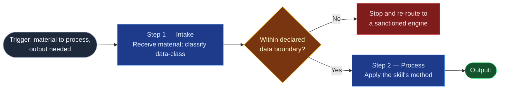

# Flow Diagram Guide — syntax and convention

Every skill the foundry emits carries a `## Flow Diagram` section in its `SKILL.md`
body: a Mermaid `flowchart LR` showing the skill's logic as a **linear left-to-right
progression** — trigger, then phases/steps in order, then terminal output. It is a
visual complement to the prose Method section, not a replacement; the prose stays
the source of truth for behavior, the diagram is the at-a-glance map.

Placement: right after the opening identity paragraph, before `## Triggering
intent`. It's the first thing a reader sees after "what is this skill" — before the
triggering rules and method prose.

**Skills stay flat — no subgraph bands.** Flowspaces get high-level stage bands
(see the sibling `flow-foundry/references/flow-diagram-guide.md`); a skill's Flow
Diagram is a single unbroken horizontal chain. A skill's steps are usually few
enough (2–4) that a band would add a box around almost the whole diagram — not
worth the visual overhead. If a skill ever grows enough sub-steps that flat reads
as cluttered, that's a signal the skill itself may be doing too much, not a signal
to add bands.

This requirement was dropped when this foundry was first ported from the homelab
skill-foundry ("Confluence rendering varies" — see `foundry-spec.md` changelog) and
is now reinstated. With GitLab as the sole source of truth
(`methodology/mirroring-protocol.md`) the old concern is gone: GitLab renders
Mermaid natively, and rendering is confirmed by viewing the rendered `.md` at
review time — see the rendering section in the sibling flow-foundry guide.

---

## Syntax cheatsheet

Four node shapes cover nearly every skill:

| Shape | Syntax | Use for |
|---|---|---|
| Stadium | `Start(["label"])` | Trigger (entry) and terminal Output (exit) |
| Rectangle | `Step["label"]` | An ordinary process step / phase |
| Diamond | `Gate{"label"}` | A genuine decision point — see discipline below |
| Subroutine | `Ref[/"label"/]` | A step that hands off to another skill/reference |

Edges: `-->` for the normal path. `-.->|"label"|` (dashed, labeled) is reserved for
an exception path or a loop-back — don't use it for the main flow.

Multi-line node labels use `<br/>` inside the quoted string, e.g.:
`P1["Step 1 — Intake<br/>Receive input; check data boundary"]`

---

## House dark palette — node-role colors

Every node gets a `classDef` by its **role**, not its phase — the same five roles
recur across every skill:

```
classDef start    fill:#1e293b,stroke:#94a3b8,color:#f1f5f9
classDef process  fill:#1e3a8a,stroke:#60a5fa,color:#dbeafe
classDef decision fill:#78350f,stroke:#fbbf24,color:#fef3c7
classDef output   fill:#14532d,stroke:#4ade80,color:#dcfce7
classDef halt     fill:#7f1d1d,stroke:#f87171,color:#fee2e2
```

| Role | Color | Meaning |
|---|---|---|
| `start` | slate | The trigger/entry node |
| `process` | blue | An ordinary step |
| `decision` | amber | A genuine branch point |
| `output` | green | The terminal artifact produced |
| `halt` | rose | An exception/drop/early-stop path (e.g. "say so before proceeding," "data boundary exceeded — stop and re-route") |

Each value is a dark fill, a saturated mid-tone stroke, and a light near-white text
tint — matching the flow-foundry's review-intensity palette formula, so a skill
diagram and a flowspace diagram read as one family even though the color axis
differs (node-role vs. review-intensity). **Reuse these exact hex values** — don't
invent new ones per skill.

---

## Decision-diamond discipline

**Default to a single unbroken chain** — `Start --> P1 --> P2 --> P3 --> Output`.
Most skills, described honestly, are linear: a sequence of steps each consuming
the last one's output. Add a `{"..."}` diamond only where the skill's own prose
already describes a genuine branch — an intake gate ("if the data boundary is
exceeded, stop and re-route"), a mode split, a validation gate. If you're inventing
a diamond to make the diagram look more sophisticated, don't — a flat chain that
matches the prose exactly is more useful than a branchy one that doesn't.

Test before shipping: **does every node and edge in the diagram correspond to a
sentence in the Method prose?** If a diamond exists in the diagram with no matching
branch in the prose, delete the diamond or add the missing prose — they must agree.

---

## Worked example — a skill with a data-boundary halt

A skill that intakes material, checks it against its declared data boundary, and
either halts or proceeds to produce output.



---

## Checklist before shipping a skill's Flow Diagram

- [ ] `flowchart LR`, flat chain — no subgraph bands
- [ ] Every diamond corresponds to a real branch named in the Method prose
- [ ] Start node names the trigger; terminal node names the artifact produced
- [ ] Node count is proportional to the skill's actual step count (don't pad, don't
      collapse two real steps into one node)
- [ ] All five `classDef` roles use the exact house hex values (start/process/
      decision/output/halt) — no invented colors, no unstyled nodes
- [ ] **Rendering confirmed on GitLab** by viewing the rendered `.md` file (not
      the diff) — GitLab renders Mermaid natively
