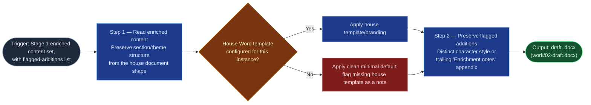

# Accomplishments Docx Stylizer

Stage 2 of `accomplishments-docx-finisher` — the last automated step before
the flow's own heavy human review. It is pure formatting: it applies house
branding to Stage 1's enriched content and produces a `.docx`, introducing no
new content and never erasing the traceability Stage 1 built into its
flagged additions.

## Flow Diagram

## Triggering intent

- **Fires on:** Stage 2 of `accomplishments-docx-finisher`, given Stage 1's
  enriched content set.
- **Does not fire on (near-misses):** enriching content (that's
  `repo-context-enricher`); the final human review/share (Stage 3 stays
  inline, human); any Word-document generation unrelated to this flow's
  specific content shape.

## Method

1. **Read the enriched content set,** preserving the section/theme structure
   from `accomplishments-digest`'s house document shape
   (`flow-foundry/review-flowspaces/accomplishments-digest/reference/accomplishments-document-shape.md`)
   — the Word version must read as the same document in a different format,
   never a re-authored one. Every section present in the input must appear
   in the output; dropping one to fit a template layout is a defect.
2. **Apply the house template if one exists** for the target instance:
   headings, theme structure, and typography consistent with the source
   shape. **If no house template has been sourced yet** — an
   instantiation-time asset this design does not assume exists — apply the
   concrete fallback defined in
   `flow-foundry/review-flowspaces/accomplishments-docx-finisher/reference/docx-minimal-default-style.md`
   (heading sizes, one neutral accent color, body type, margins) rather than
   inventing a look. Flag the missing house template as the explicit note
   that reference defines, above the document title — a stylizer that
   guesses at "what the company's branding probably looks like" has failed
   this step.
3. **Preserve Stage 1's flagged-addition markers** through to the styled
   output in a form Stage 3 can still identify — a distinct character style
   (e.g., a consistent highlight or footnote marker) or a trailing
   "Enrichment notes" appendix listing each addition and what it supports.
   Styling must never erase the traceability Stage 1 built; an addition that
   reads as indistinguishable original prose after stylizing is the known
   failure mode this step guards against, alongside silently dropping a
   section or introducing content absent from Stage 1's output.

## Inputs and grounding

Reads: Stage 1's enriched content set (`work/01-enriched-content.md`),
including its flagged-additions list, and the handoff's stated style/template
preference if any. Grounding rules: no content beyond what Stage 1 produced
enters the `.docx` — this skill formats, it does not draft, enrich, or
summarize; a missing house template is reported, never fabricated from
assumption.

## Data boundary

- Max data-class: internal (inherits Stage 1's classification; pure
  formatting, no new content sourced).
- Sanctioned engine: Copilot only, consistent with Stage 1 — no engine
  change mid-flow. No Rovo adapter is built for this skill.

## What this skill is not

- **Not an enrichment tool** — it formats what Stage 1 already produced; it
  never searches a repo or adds supporting evidence itself.
- **Not the final review** — Stage 3's human review determines whether the
  styled result is fit to share.
- **Not a branding-inventor** — a missing house template is a flagged gap,
  never an invitation to design new house branding unilaterally.
- **Not a general Word-generation tool** — it only formats content already
  shaped by this flow's specific structure.

## Review criteria

A single output of this skill is acceptable when:

1. Every theme/section present in Stage 1's enriched content set appears in
   the styled `.docx` — none silently dropped.
2. No content appears in the `.docx` beyond what Stage 1's output contained.
3. If no house template was configured, the output uses the clean minimal
   default and carries an explicit note flagging the missing template.
4. Every one of Stage 1's flagged additions remains identifiable as such in
   the styled output (distinct character style or an Enrichment notes
   appendix) — none blended into indistinguishable body text.
5. Heading hierarchy and structure mirror the house accomplishments-document
   shape's theme organization.

## Adapters

| Engine | Artifact | Generated from spec version |
|---|---|---|
| Copilot | adapters/copilot-prompt.md | 1.0 |

No Rovo adapter is built: Stage 2 stays Copilot-side to match Stage 1, and
`.docx` generation from repo-context-enriched content has no Confluence-
native point of use in this pairing — see
`../../decision-log/2026-07-14-accomplishments-digest-skill-batch.md`.

## Changelog

- **1.0** (2026-07-14) — Initial build from `sp-accomplishments-docx-stylizer`.
