# Class of Service Designer

STATIK step 6 (`statik-adoption`, Stage 06): the policies governing how work items
are selected, sequenced, and treated — derived from the shape of their cost of
delay, not from how loudly they were asked for.

It replaces two failures. The obvious one: installing the canonical four classes
as a template regardless of whether the service's demand contains them. The
subtler and more damaging one: deriving one class per work item type, which reads
as a valid design and is in fact the type set renamed.

The model it derives against is `classes-of-service-model.md`, carried with the
flowspace.

## Flow Diagram

```mermaid
flowchart LR
    Start(["Trigger: type set, demand +<br/>capability profiles, dissatisfaction;<br/>classes needed"]):::start
    D0{"1 — Capability basis<br/>current?"}:::decision
    P0["STOP — outstanding<br/>recomputation"]:::halt
    P1["2 — Identify cost-of-delay<br/>shapes from evidence,<br/>per type and group"]:::process
    P2["3–4 — Derive only supported<br/>classes; cross-check<br/>the intangible case"]:::process
    D1{"Independence rule:<br/>class spans types AND<br/>type spans classes?"}:::decision
    P3["COLLAPSE — redo, or<br/>state the exception"]:::halt
    P4["5–6 — Test against<br/>dissatisfaction; write the<br/>five policy elements"]:::process
    P5["7 — Constrain expedite:<br/>hard limit + invocation<br/>trigger + authorising role"]:::process
    P6["8 — Allocation only where<br/>demand mix supports it;<br/>conventions stated separately"]:::process
    Output(["Output: class set, per-class policies,<br/>allocation proposal, omitted-class<br/>rationale, unaddressed list"]):::output

    Start --> D0
    D0 -->|"no"| P0
    D0 -->|"yes"| P1 --> P2 --> D1
    D1 -->|"fails"| P3
    D1 -->|"passes"| P4 --> P5 --> P6 --> Output

    classDef start fill:#1e293b,stroke:#94a3b8,color:#f1f5f9
    classDef process fill:#1e3a8a,stroke:#60a5fa,color:#dbeafe
    classDef decision fill:#78350f,stroke:#fbbf24,color:#fef3c7
    classDef output fill:#14532d,stroke:#4ade80,color:#dcfce7
    classDef halt fill:#7f1d1d,stroke:#f87171,color:#fee2e2
```

## Triggering intent

**Fires on:**

- Stage 06 of `statik-adoption`.
- "What classes of service does this team need?"
- "How should we handle urgent work without wrecking everything else?"
- "Our maintenance work never gets done — how do we protect it?"
- "Set up expedite properly."
- "Everything comes in as P1."

**Does not fire on (near-misses):**

- **"What are our work item types?"** → `demand-profiler`. Type is *what the work
  is*; class is *how urgent it is*. Independent axes, and this skill refuses to
  collapse them.
- **"Which of these items should we close / prioritise?"** → `closure-scorer` and
  `disposition-packet-builder` in `portfolio-rationalization`. This designs the
  *policy* by which items are treated, not the ranking of a particular set.
- **"Set this ticket's priority"** → `ai-refinement`'s field work. A Jira priority
  value is not a class of service.
- **"Design the board and the limits"** → `kanban-system-designer`, which consumes
  this skill's classes and policies.

## Method

### 1 — Confirm the capability basis is current, or stop

If a commitment-point recomputation is outstanding, **stop**. Every class derives
from lead-time and expectation figures; deriving from a stale basis produces
policies that look evidence-backed and are not — which is worse than policies
openly derived from judgment, because nobody will think to question them.

### 2 — Identify cost-of-delay shapes from the evidence

Per type and per requesting group, against the four canonical shapes. Cite the
evidence for each:

| Shape | What it looks like in the record |
|---|---|
| **Expedite** — immediate, severe | Items that visibly jumped the queue; work started while other work was dropped; incident-linked demand |
| **Fixed date** — step change at a date | Due dates with genuine consequences (regulatory, contractual, an external event that will not move) |
| **Standard** — gradual rise | The bulk of demand in most services |
| **Intangible** — low now, severe later | Repeatedly deferred work; the maintenance and debt the internal dissatisfaction set complains about |

### 3 — Derive only the classes the evidence supports

A service with no genuine regulatory or contractual deadlines **does not need a
fixed-date class**, and creating one invites its use as a second expedite lane.
Record every canonical class deliberately omitted, with its reason — the omission
must be a decision in the record, not an absence someone later reads as an
oversight.

### 4 — Cross-check the intangible case specifically

Intangible work loses every informal prioritisation argument, because it always
competes against work with a visible waiting customer. In most services a large
share of *internal* dissatisfaction is intangible work that never gets capacity.

**Internal dissatisfaction about deferred maintenance with no proposed intangible
class is a contradiction to resolve before proceeding** — not a judgment call to
leave to the reviewer.

### 5 — Enforce the independence rule

**At least one class must carry more than one type, and at least one type must be
able to appear in more than one class.** If neither holds, the derivation collapsed
into a renaming: redo it, or state explicitly why this service is a genuine
exception.

The failure this prevents is specific and permanent. A one-class-per-type system
cannot expedite a change without relabelling it as an incident — so the first
genuinely urgent change corrupts the type data, and every subsequent demand
analysis is measuring a fiction. The board looks fine throughout.

**Worked example.** A team proposes: *incidents = expedite, changes = standard,
maintenance = intangible.* Three classes, three types, one-to-one — the
independence rule fails. Corrected: **expedite** carries incidents *and* the rare
change with a live customer impact; **standard** carries most changes *and*
non-urgent incidents; **intangible** carries maintenance *and* the tooling work
that arrives as a "change." Now a change can be expedited without becoming an
incident, and the type data survives contact with reality.

### 6 — Test every class against the dissatisfaction sets

Each class should address at least one recorded dissatisfaction. Each
flow-related dissatisfaction should be addressed by a class or flagged for the
design stage. Anything addressed by neither is reported as a **candidate loop-back
to the elicitation** — either it missed something, or the complaint is not about
flow and belongs on the out-of-scope list.

A class addressing no recorded dissatisfaction is flagged: it adds ceremony
nobody asked for and will be ignored within a quarter.

### 7 — Write an operational policy per class

Five elements. A class without them is a label, not a class.

| Element | The question it answers |
|---|---|
| **Selection rule** | How does an item of this class get picked up? |
| **Sequencing rule** | Where does it go relative to other classes? |
| **WIP treatment** | May it exceed limits? By how much? What is displaced? |
| **Board signal** | How is it visually distinguished — colour, lane, marker? |
| **Invocation** (expedite only) | Who may invoke it, on what grounds, with what record? |

### 8 — Constrain expedite explicitly

Propose a **hard concurrent limit** (conventionally one) **and** the invocation
policy — the authorising *role* and the grounds.

An expedite lane without both becomes the default lane within a quarter, at which
point the class system has been destroyed and nobody can say when it happened. The
constraint is the point of the class, not an administrative detail attached to it.

### 9 — Propose capacity allocation only where the measured demand mix supports it

Cite the mix. Where it does not support one, **propose no number and say so.**

Conventional figures (fixed date ~20%, intangible 10–20%) are stated **separately,
in a labelled context block, explicitly not as a recommendation for this service.**
The entire point of STATIK is deriving these from this service's own demand, and a
conventional number offered alongside a design is adopted as an answer far more
often than it is argued with.

Always framed as a **starting point tuned at the cadences**, never as a fixed
property of the system.

## Inputs and grounding

**Reads:** the work item type set and demand profile; per-type customer
expectations; the capability profile and fitness verdicts; the workflow model and
commitment point; both dissatisfaction sets; and the delivery team's account of
how urgent work is handled *today* — which is usually where the real,
undocumented expedite policy lives.

**Grounding rules:**

- Every class cites the evidence for its cost-of-delay shape.
- Every allocation figure cites the demand mix behind it, or is absent.
- Conventional figures never appear in the proposal table.
- The Jira priority field is corroboration at most, never a derivation basis — it
  is set by the requester, with no policy attached and no cap on the top value.

## Data boundary

- **Max data-class:** `internal`
- **Sanctioned engines:** Rovo, Copilot — per the employer matrix.
- **Expedite invocation policy names roles, never individuals.** The policy
  outlives the postholder, and naming individuals in a governance artifact is both
  a data-handling problem and a maintenance one.

## What this skill is not

- **Not `demand-profiler`.** Type is what the work is; class is how urgent it is.
  This skill consumes the type set and never amends it.
- **Not `closure-scorer` or `disposition-packet-builder`.** Those rank a specific
  set of items for triage. This designs standing policy.
- **Not a priority-field setter.** `ai-refinement` owns work item fields.
- **Not `kanban-system-designer`.** Classes and policies go there; board columns,
  WIP limits, cards, cadences, and metrics come from there.
- **Not a writer.** No Jira or Confluence writes.

## Review criteria

A human judges one output acceptable when:

1. The **independence rule** is enforced: a one-class-per-type derivation is
   caught and reported as a collapse, not shipped.
2. A service whose evidence contains no genuine fixed dates yields **no fixed-date
   class**, with the omission recorded and reasoned.
3. Internal dissatisfaction about deferred maintenance with no intangible class
   **raises the contradiction before proceeding**.
4. Every class carries all five policy elements.
5. Expedite always carries a **hard concurrent limit** and an invocation policy
   naming an authorising **role**, never an individual.
6. Capacity allocation is proposed only with the demand figures cited; an
   insufficient mix produces an **explicit no-proposal**.
7. Conventional figures appear **only** in a separately-labelled context block.
8. Every class cites the evidence for its shape, and a class addressing no
   recorded dissatisfaction is flagged.
9. A Jira priority field offered as the class basis is **declined** with the
   distinction stated.
10. A stale capability basis **stops the run**.

## Adapters

| Engine | Artifact | Generated from spec version |
|---|---|---|
| Rovo | adapters/rovo-agent.md | 1.0 |
| Copilot | adapters/copilot-prompt.md | 1.0 |

## Changelog

- **1.0** (2026-08-01) — Initial build from `sp-class-of-service-designer`.
