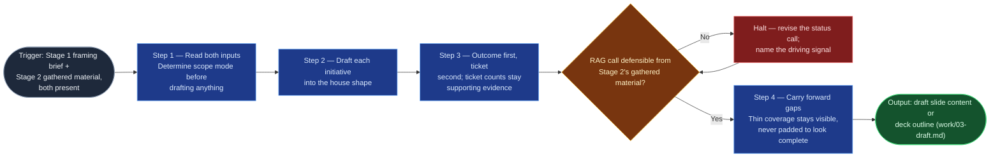

# Executive Slide Drafter

Stage 3 of `executive-slide-digest` — the synthesis point where a manager's
framing and a raw Jira/Confluence search become one exec-ready slide's
content (or a deck outline, for a portfolio rollup). It is pure synthesis: no
external query, no content beyond what its two inputs already state. It hands
off a draft, never approved content — Stage 4's human align/publish pass is
what makes the result fit to stylize.

## Flow Diagram

## Triggering intent

- **Fires on:** Stage 3 of `executive-slide-digest`, given Stage 1's framing
  brief (scope mode, initiatives, audience, period, any stated ask) and Stage
  2's gathered Jira/Confluence material, both present.
- **Does not fire on (near-misses):** gathering the source material itself
  (Stage 2 stays inline, native engine search — not this skill's job); the
  manager's align/approve pass (Stage 4 stays human, inline); stylizing
  approved content into a `.pptx` (that's `executive-slide-pptx-stylizer`);
  drafting an individual contributor's own accomplishments for a
  performance review (that's `accomplishments-drafter` — different
  audience, different content shape, different unit of analysis: initiative
  status vs. one person's work).

## Method

1. **Read both inputs before drafting anything.** Determine scope mode
   (single-initiative vs. portfolio-rollup) from Stage 1's framing brief
   first — it decides whether the output is one slide's content or a full
   deck outline, and drafting before settling this is the single most common
   way this stage's output ends up needing a full redo.
2. **For each initiative in scope, draft into the house shape**
   (`flow-foundry/review-flowspaces/executive-slide-digest/reference/
   executive-slide-shape.md`): Title, Status (RAG + one-line why), Headline
   (business-outcome framed), Key accomplishments (2-4 outcome-first
   bullets), Risks/Blockers (0-3; omit the section entirely if none — a
   visible empty section reads worse than no section), Upcoming milestones
   (1-3, dated), and an optional Ask.
3. **Outcome first, ticket second** — "Shipped X, which unblocks Y" beats
   "Closed 12 tickets in the Foo epic." Ticket counts are supporting
   evidence, never the headline. This is the same authoring discipline
   `accomplishments-document-shape.md` states for a performance-review
   audience; apply it here for an executive one.
4. **The RAG call must be defensible from Stage 2's gathered material** — a
   blocked dependency, a slipped due date, or an open critical bug drives
   Amber/Red, and the drafted status line names which signal drove the call
   explicitly, so Stage 4's human reviewer can check it rather than take it
   on faith. Worked example: if Stage 2's material shows a due date slipped
   two weeks with no updated date given, the status line reads "Amber — Q3
   milestone slipped two weeks, no revised date yet," not a bare "Amber."
5. **For portfolio-rollup scope, emit a deck outline**: a title/agenda
   slide, one section per initiative in the shape above, and an optional
   closing slide rolling up risks/asks across initiatives — omit the closing
   slide if no initiative in scope carries a risk or ask worth escalating.
6. **Gaps stay visible.** If Stage 2's material is thin for a given
   initiative (e.g., no recent activity found in the gather window), say so
   in that initiative's content rather than padding it to look complete — a
   fabricated accomplishment or an invented milestone date is a worse
   failure than a visibly thin slide.
7. **Known failure modes to guard against**: reverting to ticket-listing
   under time pressure; asserting a RAG status the gathered material doesn't
   support; inventing a milestone date or metric not present in Stage 2's
   material; silently dropping the Risks section instead of omitting it
   deliberately when it's genuinely empty; drafting portfolio-rollup scope
   as a single slide or vice versa.

## Inputs and grounding

Reads: the two Layer-4 working artifacts from Stages 1-2 of a single run —
`work/01-framing-brief.md` and `work/02-gathered-material.md`. Grounding
rules: every status call, accomplishment, risk, and milestone in the draft
must trace to a specific entry in Stage 2's gathered material, or to Stage
1's own stated framing directly — no content invented beyond what these two
inputs state; this skill performs no external query of its own.

## Data boundary

- Max data-class: internal (inherits the classification of its two inputs;
  does not independently query Jira or Confluence).
- Sanctioned engines: Rovo or Copilot, either is fine for `internal` content
  — this stage is pure synthesis, so no Atlassian-native-access constraint
  applies the way it does for Stage 2's native search.

## What this skill is not

- **Not a gatherer** — it consumes already-gathered material; it never
  queries Jira or Confluence itself.
- **Not the final review** — its output is a draft for the manager's Stage 4
  align/publish pass, never treated as approved or ready to stylize as-is.
- **Not a general drafting tool** — it only produces content shaped by this
  flow's specific two-input contract and house slide shape.
- **Not `accomplishments-drafter`** — that skill drafts one person's
  performance-review record from a framing brief and two gather digests;
  this skill drafts initiative status from a manager's framing and one
  gathered-material input. Different audience, different unit of analysis.

## Review criteria

A single output of this skill is acceptable when:

1. The draft's structure (one slide vs. a deck outline) matches Stage 1's
   stated scope mode.
2. Every RAG status call names the specific Stage 2 signal that drove it.
3. Every accomplishment bullet is outcome-framed, not ticket-framed.
4. The Risks/Blockers section is present only when Stage 2's material
   actually surfaced a risk or blocker — never shown empty.
5. Every thin-coverage flag from Stage 2 appears as an explicit note in the
   relevant initiative's content — none silently dropped.
6. No milestone date or metric appears that Stage 2's gathered material did
   not state.
7. For portfolio-rollup scope: a title/agenda slide, one section per
   initiative in run order, and a closing rollup slide only if at least one
   initiative carries a risk or ask.

## Adapters

| Engine | Artifact | Generated from spec version |
|---|---|---|
| Rovo | adapters/rovo-agent.md | 1.0 |
| Copilot | adapters/copilot-prompt.md | 1.0 |

## Changelog

- **1.0** (2026-08-06) — Initial build from `sp-executive-slide-drafter`.
