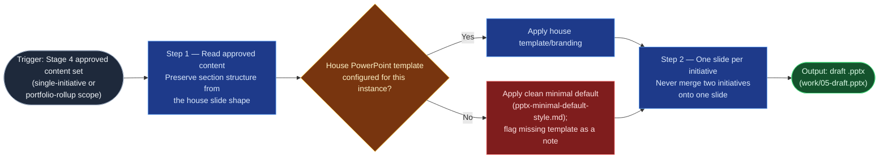

# Executive Slide Pptx Stylizer

Stage 5 of `executive-slide-digest` — the last automated step before the
flow's own heavy final-review gate. It is pure formatting: it applies house
branding (or the documented minimal default) to Stage 4's approved content
and produces a `.pptx`, introducing no content beyond what Stage 4 approved
and never dropping or merging a section to fit a layout.

## Flow Diagram

## Triggering intent

- **Fires on:** Stage 5 of `executive-slide-digest`, given Stage 4's approved
  content set (one initiative's slide content, or a portfolio-rollup deck
  outline).
- **Does not fire on (near-misses):** drafting or synthesizing content
  (that's `executive-slide-drafter`); the final human review/share (Stage 6
  stays inline, human); any PowerPoint generation unrelated to this flow's
  specific content shape (a general-purpose "make me a deck" request is a
  different, engine-native capability, not this skill).

## Method

1. **Read Stage 4's approved content set**, preserving the section structure
   from the house `executive-slide-shape.md` content shape — the deck must
   read as the same content in a different format, never re-authored. Every
   initiative/section present in the input must appear as its own slide (or
   slide group); dropping one to fit a layout is a defect.
2. **Apply the target instance's house PowerPoint template if one exists**:
   title slide, per-initiative slide layout, and typography consistent with
   the source shape (status color-coding for RAG, consistent bullet
   hierarchy). If no house template has been sourced yet, apply the concrete
   fallback defined in
   `flow-foundry/review-flowspaces/executive-slide-digest/reference/pptx-
   minimal-default-style.md` (accent color, RAG chip colors, fonts, margins)
   rather than inventing a look. Flag the missing house template as the
   explicit note that reference defines, on the title/agenda slide — a
   stylizer that guesses at "what the company's branding probably looks
   like" has failed this step.
3. **For single-initiative scope**: one content slide, plus a lightweight
   title slide naming the initiative and period. **For portfolio-rollup
   scope**: a title/agenda slide, one slide per initiative in the approved
   order, and the optional closing risks/asks rollup slide if Stage 4's
   approved content included one.
4. **Known failure modes to guard against**: silently dropping an
   initiative's slide, merging two initiatives onto one slide to save space,
   introducing bullet content not present in Stage 4's approved set, or
   guessing at house branding when no template has been sourced.

## Inputs and grounding

Reads: Stage 4's approved content set (`work/04-approved-content.md`); the
target instance's house PowerPoint template asset, if one has been sourced;
`reference/pptx-minimal-default-style.md` when it hasn't. Grounding rules:
no content beyond what Stage 4 produced enters the `.pptx` — this skill
formats, it does not draft, enrich, or summarize; a missing house template
is reported, never fabricated from assumption.

## Data boundary

- Max data-class: internal (inherits Stage 4's classification; pure
  formatting, no new content sourced).
- Sanctioned engine: Copilot only — file generation of this kind is not a
  Rovo-native action, matching the `accomplishments-docx-stylizer`
  precedent. No Rovo adapter.

## What this skill is not

- **Not a drafting tool** — it formats what Stage 4 already approved; it
  never queries Jira/Confluence or writes new slide content.
- **Not the final review** — Stage 6's human review determines whether the
  styled result is fit to share.
- **Not a branding-inventor** — a missing house template is a flagged gap,
  never an invitation to design new house branding unilaterally.
- **Not a general PowerPoint-generation tool** — it only formats content
  already shaped by this flow's specific structure.

## Review criteria

A single output of this skill is acceptable when:

1. Every initiative/section present in Stage 4's approved content set
   appears as its own slide (or slide group) in the `.pptx` — none silently
   dropped or merged.
2. No content appears in the `.pptx` beyond what Stage 4's approved content
   contained.
3. If no house template was configured, the output uses the clean minimal
   default and carries an explicit note flagging the missing template.
4. RAG status coloring on each slide matches the approved status call —
   Red/Amber/Green chips used only for the status line, never as a slide
   background.
5. For single-initiative scope: exactly one content slide plus a
   lightweight title slide. For portfolio-rollup scope: a title/agenda
   slide, one slide per initiative in approved order, and the closing
   rollup slide only if Stage 4's approved content included one.

## Adapters

| Engine | Artifact | Generated from spec version |
|---|---|---|
| Copilot | adapters/copilot-prompt.md | 1.0 |

No Rovo adapter is built: Stage 5 stays Copilot-side, matching the file-
generation precedent set by `accomplishments-docx-stylizer` — `.pptx`
generation from approved content has no Confluence-native point of use in
this flow either. See
`skill-foundry/decision-log/2026-08-06-executive-slide-digest-skill-batch.md`.

## Changelog

- **1.0** (2026-08-06) — Initial build from `sp-executive-slide-pptx-stylizer`.
